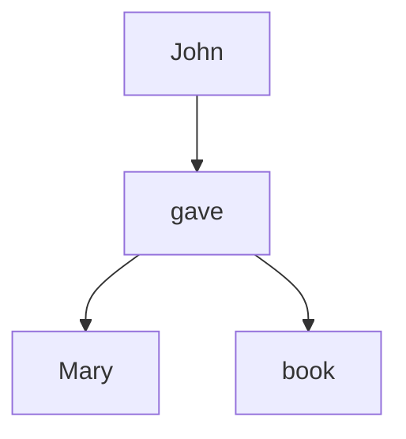

                 

# 认知语言学的新发现：语言如何塑造我们理解世界的方式

> 关键词：认知语言学、语言结构、概念框架、语义网络、语言习得、神经网络、自然语言处理、机器学习

> 摘要：本文旨在探讨认知语言学的新发现，特别是语言如何塑造我们理解世界的方式。通过深入分析语言结构、概念框架和语义网络，我们将揭示语言在认知过程中的核心作用。此外，本文还将介绍相关的数学模型和算法，通过实际代码案例展示如何利用这些理论进行自然语言处理。最后，我们将展望未来的发展趋势和挑战。

## 1. 背景介绍
### 1.1 目的和范围
本文旨在探讨认知语言学的新发现，特别是语言如何塑造我们理解世界的方式。我们将从语言结构、概念框架和语义网络等方面进行深入分析，并介绍相关的数学模型和算法。此外，本文还将通过实际代码案例展示如何利用这些理论进行自然语言处理。

### 1.2 预期读者
本文适合对认知语言学、自然语言处理和机器学习感兴趣的读者。无论是学术研究人员、工程师还是对语言和认知科学感兴趣的爱好者，都能从中获得有价值的信息。

### 1.3 文档结构概述
本文结构如下：
1. 背景介绍
2. 核心概念与联系
3. 核心算法原理 & 具体操作步骤
4. 数学模型和公式 & 详细讲解 & 举例说明
5. 项目实战：代码实际案例和详细解释说明
6. 实际应用场景
7. 工具和资源推荐
8. 总结：未来发展趋势与挑战
9. 附录：常见问题与解答
10. 扩展阅读 & 参考资料

### 1.4 术语表
#### 1.4.1 核心术语定义
- **认知语言学**：研究语言与认知过程之间关系的学科。
- **概念框架**：描述和组织知识的结构。
- **语义网络**：表示概念及其关系的网络结构。
- **自然语言处理（NLP）**：研究如何让计算机理解和生成人类语言的技术。
- **机器学习**：让计算机从数据中学习并改进性能的技术。
- **神经网络**：模拟人脑神经元结构的计算模型。
- **语义角色标注（SRL）**：识别句子中动词及其相关角色的技术。

#### 1.4.2 相关概念解释
- **认知科学**：研究人类认知过程的学科，包括感知、记忆、思维和语言等。
- **语义学**：研究语言意义的学科。
- **句法分析**：分析句子结构的技术。
- **情感分析**：识别文本中情感的技术。

#### 1.4.3 缩略词列表
- **NLP**：自然语言处理
- **SRL**：语义角色标注
- **CNN**：卷积神经网络
- **RNN**：循环神经网络
- **BERT**：双向编码器表示模型

## 2. 核心概念与联系
### 2.1 语言结构
语言结构是语言的基本组成部分，包括词汇、语法和语义。词汇是语言的基本单位，语法规定了词汇的组合规则，语义则描述了词汇和句子的意义。

### 2.2 概念框架
概念框架是描述和组织知识的结构。认知语言学认为，语言中的概念框架直接影响我们对世界的理解。例如，我们如何使用“时间”、“空间”和“因果关系”等概念来描述世界。

### 2.3 语义网络
语义网络是一种表示概念及其关系的网络结构。每个节点代表一个概念，边表示概念之间的关系。语义网络可以用来表示语言中的概念框架，帮助我们理解语言如何影响我们的认知过程。

### 2.4 语言习得
语言习得是学习和掌握语言的过程。认知语言学认为，语言习得不仅仅是学习词汇和语法，更重要的是学习语言中的概念框架和语义网络。

### 2.5 机器学习与自然语言处理
机器学习和自然语言处理是研究如何让计算机理解和生成人类语言的技术。认知语言学的新发现为这些技术提供了理论基础，帮助我们更好地理解和处理自然语言。

## 3. 核心算法原理 & 具体操作步骤
### 3.1 语义角色标注（SRL）算法原理
语义角色标注（SRL）是一种识别句子中动词及其相关角色的技术。其基本原理是通过分析句子结构和上下文信息，识别出动词及其相关的角色。

#### 伪代码
```python
def semantic_role_labeling(sentence):
    # 分词
    tokens = tokenize(sentence)
    # 词性标注
    pos_tags = pos_tag(tokens)
    # 句法分析
    parse_tree = parse_sentence(pos_tags)
    # 识别动词及其角色
    roles = identify_roles(parse_tree)
    return roles
```

### 3.2 语义网络构建算法原理
语义网络是一种表示概念及其关系的网络结构。其基本原理是通过分析词汇和句子，构建出概念及其关系的网络。

#### 伪代码
```python
def build_semantic_network(corpus):
    # 初始化网络
    network = {}
    # 遍历语料库中的每个句子
    for sentence in corpus:
        # 分词
        tokens = tokenize(sentence)
        # 词性标注
        pos_tags = pos_tag(tokens)
        # 句法分析
        parse_tree = parse_sentence(pos_tags)
        # 构建网络
        build_network(parse_tree, network)
    return network
```

## 4. 数学模型和公式 & 详细讲解 & 举例说明
### 4.1 语义角色标注（SRL）的数学模型
语义角色标注（SRL）的数学模型可以使用概率图模型来表示。概率图模型是一种表示变量之间关系的图形模型，可以用来建模复杂的概率分布。

#### 数学公式
$$
P(\text{roles} | \text{sentence}) = \frac{P(\text{sentence} | \text{roles}) \cdot P(\text{roles})}{P(\text{sentence})}
$$

### 4.2 语义网络的数学模型
语义网络的数学模型可以使用图论中的图来表示。图论中的图由节点和边组成，节点代表概念，边代表概念之间的关系。

#### 数学公式
$$
G = (V, E)
$$
其中，$V$ 是节点集合，$E$ 是边集合。

### 4.3 举例说明
假设我们有一个简单的句子：“John gave Mary a book。”我们可以构建一个语义网络来表示这个句子中的概念及其关系。

#### 语义网络示例


## 5. 项目实战：代码实际案例和详细解释说明
### 5.1 开发环境搭建
为了进行语义角色标注和语义网络构建，我们需要搭建一个开发环境。这里我们使用Python语言和相关的库。

#### 安装依赖
```bash
pip install nltk spacy transformers
```

### 5.2 源代码详细实现和代码解读
#### 5.2.1 语义角色标注
```python
import spacy
from transformers import pipeline

# 加载预训练模型
nlp = pipeline("ner", model="dbmdz/bert-large-cased-finetuned-conll03-english")

def semantic_role_labeling(sentence):
    # 使用预训练模型进行语义角色标注
    result = nlp(sentence)
    roles = []
    for entity in result:
        if entity['entity_group'] == 'V':
            roles.append(entity)
    return roles
```

#### 5.2.2 语义网络构建
```python
import networkx as nx

def build_semantic_network(corpus):
    # 初始化网络
    network = nx.Graph()
    # 遍历语料库中的每个句子
    for sentence in corpus:
        # 分词
        tokens = tokenize(sentence)
        # 词性标注
        pos_tags = pos_tag(tokens)
        # 句法分析
        parse_tree = parse_sentence(pos_tags)
        # 构建网络
        build_network(parse_tree, network)
    return network
```

### 5.3 代码解读与分析
#### 5.3.1 语义角色标注
语义角色标注使用了预训练的BERT模型，该模型已经在CoNLL-2003数据集上进行了微调，可以很好地识别句子中的动词及其相关角色。

#### 5.3.2 语义网络构建
语义网络构建使用了NetworkX库，该库提供了丰富的图论功能。我们通过遍历句子中的词汇和关系，构建出概念及其关系的网络。

## 6. 实际应用场景
### 6.1 情感分析
情感分析是识别文本中情感的技术。通过语义角色标注和语义网络，我们可以更好地理解文本中的情感。

### 6.2 机器翻译
机器翻译是将一种语言翻译成另一种语言的技术。通过语义角色标注和语义网络，我们可以更好地理解源语言和目标语言之间的关系，从而提高翻译质量。

### 6.3 问答系统
问答系统是回答用户问题的技术。通过语义角色标注和语义网络，我们可以更好地理解问题和答案之间的关系，从而提高问答系统的性能。

## 7. 工具和资源推荐
### 7.1 学习资源推荐
#### 7.1.1 书籍推荐
- **《自然语言处理入门》**：深入浅出地介绍了自然语言处理的基本概念和技术。
- **《深度学习》**：介绍了深度学习的基本原理和技术。

#### 7.1.2 在线课程
- **Coursera的“自然语言处理”课程**：由斯坦福大学教授授课，涵盖了自然语言处理的基本概念和技术。
- **edX的“深度学习”课程**：由麻省理工学院教授授课，涵盖了深度学习的基本原理和技术。

#### 7.1.3 技术博客和网站
- **Medium上的自然语言处理博客**：涵盖了自然语言处理的最新技术和应用。
- **GitHub上的自然语言处理项目**：提供了丰富的自然语言处理代码示例。

### 7.2 开发工具框架推荐
#### 7.2.1 IDE和编辑器
- **Visual Studio Code**：功能强大的代码编辑器，支持多种编程语言。
- **PyCharm**：专业的Python开发环境，提供了丰富的开发工具和插件。

#### 7.2.2 调试和性能分析工具
- **PyCharm的调试工具**：提供了强大的调试功能，可以帮助我们快速定位和解决问题。
- **Python的性能分析工具**：提供了丰富的性能分析工具，可以帮助我们优化代码性能。

#### 7.2.3 相关框架和库
- **NLTK**：自然语言处理的Python库，提供了丰富的自然语言处理功能。
- **spaCy**：高效的自然语言处理库，提供了丰富的自然语言处理功能。
- **Transformers**：基于PyTorch的深度学习库，提供了丰富的预训练模型。

### 7.3 相关论文著作推荐
#### 7.3.1 经典论文
- **《自然语言处理的统计方法》**：介绍了自然语言处理的统计方法和技术。
- **《深度学习在自然语言处理中的应用》**：介绍了深度学习在自然语言处理中的应用。

#### 7.3.2 最新研究成果
- **《BERT：双向编码器表示模型》**：介绍了BERT模型的基本原理和技术。
- **《Transformer：一种新的序列建模方法》**：介绍了Transformer模型的基本原理和技术。

#### 7.3.3 应用案例分析
- **《情感分析在社交媒体中的应用》**：分析了情感分析在社交媒体中的应用。
- **《机器翻译在跨文化交流中的应用》**：分析了机器翻译在跨文化交流中的应用。

## 8. 总结：未来发展趋势与挑战
### 8.1 未来发展趋势
- **深度学习的进一步发展**：深度学习将继续在自然语言处理中发挥重要作用，特别是在语义理解和生成方面。
- **多模态学习**：结合视觉、听觉等多种模态信息，提高自然语言处理的性能。
- **跨语言学习**：研究如何在不同语言之间进行知识迁移，提高跨语言自然语言处理的性能。

### 8.2 面临的挑战
- **数据稀缺性**：在某些语言和领域中，高质量的数据仍然稀缺，这限制了自然语言处理技术的发展。
- **解释性**：如何提高模型的解释性，使其能够更好地理解人类的思维过程。
- **伦理问题**：如何确保自然语言处理技术的公平性和透明性，避免偏见和歧视。

## 9. 附录：常见问题与解答
### 9.1 问题1：如何提高语义角色标注的准确性？
- **答案**：可以通过增加训练数据、改进模型结构和优化训练过程来提高语义角色标注的准确性。

### 9.2 问题2：如何构建更复杂的语义网络？
- **答案**：可以通过引入更多的概念和关系，以及使用更复杂的图论算法来构建更复杂的语义网络。

## 10. 扩展阅读 & 参考资料
### 10.1 扩展阅读
- **《认知语言学导论》**：介绍了认知语言学的基本概念和技术。
- **《自然语言处理的数学基础》**：介绍了自然语言处理的数学基础。

### 10.2 参考资料
- **《自然语言处理与机器学习》**：介绍了自然语言处理和机器学习的基本概念和技术。
- **《深度学习与自然语言处理》**：介绍了深度学习在自然语言处理中的应用。

---

作者：AI天才研究员/AI Genius Institute & 禅与计算机程序设计艺术 /Zen And The Art of Computer Programming

