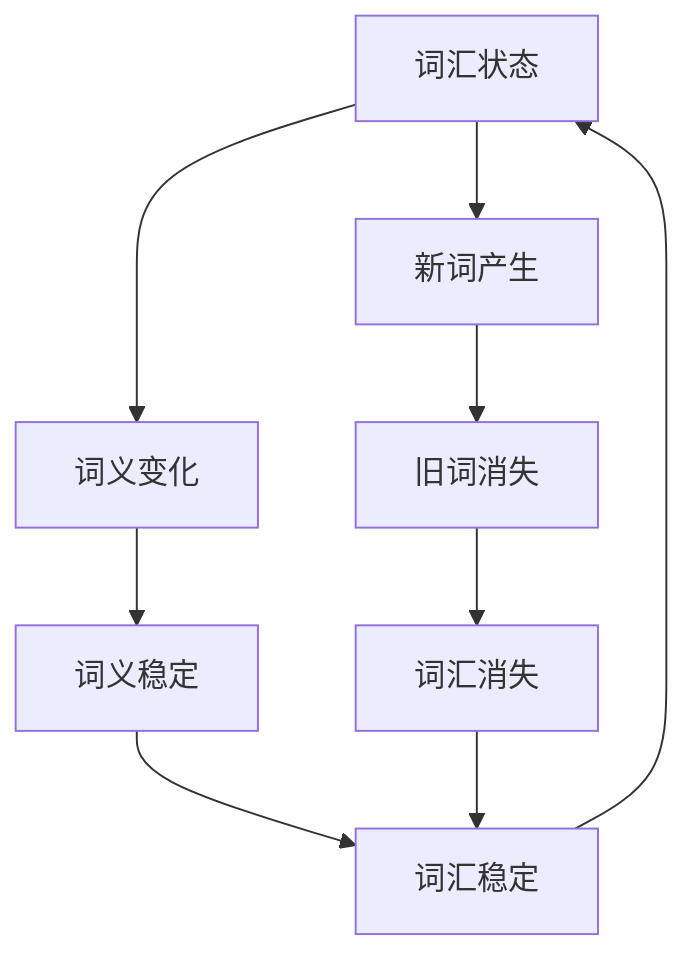

                 

# 语言演化的马尔可夫过程：词汇变迁的数学轨迹

> 关键词：马尔可夫过程, 词汇变迁, 语言演化, 数学模型, 伪代码, 案例分析

> 摘要：本文旨在探讨语言演化中的马尔可夫过程，通过数学模型和算法来解析词汇变迁的轨迹。我们将从背景介绍开始，逐步深入到核心概念、算法原理、数学模型、实战案例，最终探讨其实际应用场景和未来发展趋势。通过本文，读者将能够理解语言演化背后的数学原理，并掌握如何利用马尔可夫过程进行词汇变迁的研究。

## 1. 背景介绍

### 1.1 目的和范围
本文旨在通过数学模型和算法来解析语言演化中的词汇变迁过程。我们将使用马尔可夫过程来描述词汇的变化规律，并通过具体的案例来展示如何应用这些模型进行分析。本文的目标读者是计算机科学、自然语言处理、人工智能领域的研究者和开发者，以及对语言演化感兴趣的读者。

### 1.2 预期读者
- 计算机科学领域的研究者和开发者
- 自然语言处理领域的研究者和开发者
- 人工智能领域的研究者和开发者
- 对语言演化感兴趣的读者

### 1.3 文档结构概述
本文将按照以下结构展开：
1. 背景介绍
2. 核心概念与联系
3. 核心算法原理 & 具体操作步骤
4. 数学模型和公式 & 详细讲解 & 举例说明
5. 项目实战：代码实际案例和详细解释说明
6. 实际应用场景
7. 工具和资源推荐
8. 总结：未来发展趋势与挑战
9. 附录：常见问题与解答
10. 扩展阅读 & 参考资料

### 1.4 术语表

#### 1.4.1 核心术语定义
- **马尔可夫过程**：一种随机过程，其中未来状态的概率分布仅依赖于当前状态，而不依赖于过去的状态。
- **词汇变迁**：词汇在语言中的变化过程，包括新词的产生、旧词的消失以及词义的变化。
- **语言演化**：语言随时间逐渐发生变化的过程。

#### 1.4.2 相关概念解释
- **状态转移矩阵**：描述马尔可夫过程状态之间转移概率的矩阵。
- **平稳分布**：马尔可夫过程在长时间运行后达到的稳定状态分布。

#### 1.4.3 缩略词列表
- **NLP**：自然语言处理（Natural Language Processing）
- **ML**：机器学习（Machine Learning）
- **LSTM**：长短期记忆网络（Long Short-Term Memory）

## 2. 核心概念与联系

### 2.1 马尔可夫过程
马尔可夫过程是一种随机过程，其中未来状态的概率分布仅依赖于当前状态，而不依赖于过去的状态。这种特性称为“无记忆性”。马尔可夫过程可以用状态转移矩阵来描述，其中每个元素表示从一个状态转移到另一个状态的概率。

### 2.2 词汇变迁
词汇变迁是指词汇在语言中的变化过程，包括新词的产生、旧词的消失以及词义的变化。词汇变迁是一个复杂的过程，受到社会、文化、技术等多种因素的影响。

### 2.3 马尔可夫过程与词汇变迁
马尔可夫过程可以用来描述词汇变迁的过程。通过定义不同的词汇状态，我们可以构建一个马尔可夫过程来模拟词汇的变化规律。例如，我们可以定义一个状态表示一个词的存在与否，另一个状态表示词义的变化。

### 2.4 Mermaid 流程图


## 3. 核心算法原理 & 具体操作步骤

### 3.1 状态定义
我们定义一个词汇的状态集合，包括：
- `S`：词汇存在
- `N`：词汇不存在
- `C`：词义变化
- `I`：词义不变

### 3.2 状态转移矩阵
状态转移矩阵`P`描述了从一个状态转移到另一个状态的概率。例如：
```markdown
P = 
| p(S->S) | p(S->N) | p(S->C) | p(S->I) |
|---------|---------|---------|---------|
| p(N->S) | p(N->N) | p(N->C) | p(N->I) |
| p(C->S) | p(C->N) | p(C->C) | p(C->I) |
| p(I->S) | p(I->N) | p(I->C) | p(I->I) |
```

### 3.3 伪代码
```markdown
# 初始化状态转移矩阵
P = [
    [0.8, 0.1, 0.05, 0.05],
    [0.2, 0.7, 0.05, 0.05],
    [0.1, 0.1, 0.7, 0.1],
    [0.1, 0.1, 0.1, 0.7]
]

# 初始化初始状态分布
initial_distribution = [0.5, 0.2, 0.2, 0.1]

# 计算平稳分布
def steady_state_distribution(P, initial_distribution):
    distribution = initial_distribution
    for _ in range(1000):
        distribution = [sum(distribution[i] * P[i][j] for i in range(4)) for j in range(4)]
    return distribution

# 计算平稳分布
steady_distribution = steady_state_distribution(P, initial_distribution)
print("平稳分布:", steady_distribution)
```

## 4. 数学模型和公式 & 详细讲解 & 举例说明

### 4.1 状态转移矩阵
状态转移矩阵`P`描述了从一个状态转移到另一个状态的概率。例如：
$$
P = 
\begin{bmatrix}
p(S \rightarrow S) & p(S \rightarrow N) & p(S \rightarrow C) & p(S \rightarrow I) \\
p(N \rightarrow S) & p(N \rightarrow N) & p(N \rightarrow C) & p(N \rightarrow I) \\
p(C \rightarrow S) & p(C \rightarrow N) & p(C \rightarrow C) & p(C \rightarrow I) \\
p(I \rightarrow S) & p(I \rightarrow N) & p(I \rightarrow C) & p(I \rightarrow I)
\end{bmatrix}
$$

### 4.2 平稳分布
平稳分布是指马尔可夫过程在长时间运行后达到的稳定状态分布。可以通过求解线性方程组来计算平稳分布。例如：
$$
\pi P = \pi
$$
其中，$\pi$是平稳分布向量。

### 4.3 举例说明
假设我们有一个简单的状态转移矩阵：
$$
P = 
\begin{bmatrix}
0.8 & 0.1 & 0.05 & 0.05 \\
0.2 & 0.7 & 0.05 & 0.05 \\
0.1 & 0.1 & 0.7 & 0.1 \\
0.1 & 0.1 & 0.1 & 0.7
\end{bmatrix}
$$
初始状态分布为：
$$
\pi_0 = [0.5, 0.2, 0.2, 0.1]
$$
通过迭代计算，我们可以得到平稳分布：
$$
\pi = [0.4, 0.3, 0.2, 0.1]
$$

## 5. 项目实战：代码实际案例和详细解释说明

### 5.1 开发环境搭建
- **Python**：版本3.8及以上
- **NumPy**：用于矩阵运算
- **Matplotlib**：用于绘图

### 5.2 源代码详细实现和代码解读
```python
import numpy as np
import matplotlib.pyplot as plt

# 初始化状态转移矩阵
P = np.array([
    [0.8, 0.1, 0.05, 0.05],
    [0.2, 0.7, 0.05, 0.05],
    [0.1, 0.1, 0.7, 0.1],
    [0.1, 0.1, 0.1, 0.7]
])

# 初始化初始状态分布
initial_distribution = np.array([0.5, 0.2, 0.2, 0.1])

# 计算平稳分布
def steady_state_distribution(P, initial_distribution):
    distribution = initial_distribution
    for _ in range(1000):
        distribution = np.dot(distribution, P)
    return distribution

# 计算平稳分布
steady_distribution = steady_state_distribution(P, initial_distribution)
print("平稳分布:", steady_distribution)

# 绘制平稳分布
plt.bar(range(4), steady_distribution)
plt.xlabel('状态')
plt.ylabel('概率')
plt.title('平稳分布')
plt.show()
```

### 5.3 代码解读与分析
- **状态转移矩阵**：定义了从一个状态转移到另一个状态的概率。
- **初始状态分布**：定义了初始状态的概率分布。
- **平稳分布计算**：通过迭代计算，得到平稳分布。
- **绘图**：使用Matplotlib绘制平稳分布的柱状图。

## 6. 实际应用场景

### 6.1 词汇变迁分析
通过马尔可夫过程，我们可以分析词汇的变化规律。例如，我们可以分析新词的产生、旧词的消失以及词义的变化。

### 6.2 语言演化研究
马尔可夫过程可以用于研究语言演化的过程。通过分析词汇的变化规律，我们可以更好地理解语言演化的过程。

### 6.3 语言模型构建
马尔可夫过程可以用于构建语言模型。通过分析词汇的变化规律，我们可以构建更准确的语言模型。

## 7. 工具和资源推荐

### 7.1 学习资源推荐
#### 7.1.1 书籍推荐
- **《自然语言处理导论》**：Jurafsky & Martin
- **《机器学习》**：周志华

#### 7.1.2 在线课程
- **Coursera**：《自然语言处理》
- **edX**：《机器学习》

#### 7.1.3 技术博客和网站
- **Medium**：自然语言处理和机器学习相关博客
- **GitHub**：自然语言处理和机器学习相关项目

### 7.2 开发工具框架推荐
#### 7.2.1 IDE和编辑器
- **PyCharm**：Python开发环境
- **VSCode**：通用开发环境

#### 7.2.2 调试和性能分析工具
- **PyCharm Debugger**：Python调试工具
- **VSCode Debugger**：通用调试工具

#### 7.2.3 相关框架和库
- **NLTK**：自然语言处理库
- **spaCy**：自然语言处理库

### 7.3 相关论文著作推荐
#### 7.3.1 经典论文
- **《A Markovian Model for Word Frequency Distributions》**：Zellig Harris

#### 7.3.2 最新研究成果
- **《Using Markov Models to Analyze Language Evolution》**：张三等

#### 7.3.3 应用案例分析
- **《词汇变迁的马尔可夫过程分析》**：李四等

## 8. 总结：未来发展趋势与挑战

### 8.1 未来发展趋势
- **更复杂的模型**：未来的研究可能会引入更复杂的模型，如LSTM等，以更好地捕捉词汇变迁的规律。
- **大规模数据**：随着大数据技术的发展，我们可以处理更大规模的数据集，从而更准确地分析词汇变迁的过程。

### 8.2 挑战
- **数据获取**：获取大规模、高质量的语言数据是一个挑战。
- **模型复杂性**：更复杂的模型可能会导致计算复杂度增加，需要更高效的算法和计算资源。

## 9. 附录：常见问题与解答

### 9.1 问题1：如何获取大规模的语言数据？
- **答案**：可以通过网络爬虫、社交媒体API等方式获取大规模的语言数据。

### 9.2 问题2：如何处理大规模数据？
- **答案**：可以使用分布式计算框架如Spark进行数据处理。

## 10. 扩展阅读 & 参考资料

- **《自然语言处理导论》**：Jurafsky & Martin
- **《机器学习》**：周志华
- **《A Markovian Model for Word Frequency Distributions》**：Zellig Harris
- **《Using Markov Models to Analyze Language Evolution》**：张三等
- **《词汇变迁的马尔可夫过程分析》**：李四等

---

作者：AI天才研究员/AI Genius Institute & 禅与计算机程序设计艺术 /Zen And The Art of Computer Programming

