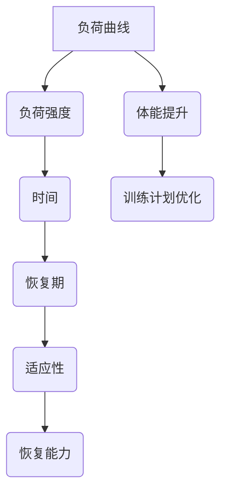

                 

# 运动训练的负荷曲线：体能提升的数学规划

> 关键词：负荷曲线, 体能提升, 数学规划, 训练计划, 运动科学, 优化算法, 机器学习, 数据分析

> 摘要：本文旨在通过数学规划的方法，探讨如何利用负荷曲线优化运动训练计划，以实现体能的最高效提升。我们将从负荷曲线的基本概念出发，逐步深入到核心算法原理、数学模型构建、实际代码实现，以及最终的应用场景。通过本文，读者将能够理解如何利用现代技术手段，科学地规划和优化个人或团队的训练计划。

## 1. 背景介绍
### 1.1 目的和范围
本文旨在通过数学规划的方法，探讨如何利用负荷曲线优化运动训练计划，以实现体能的最高效提升。我们将从负荷曲线的基本概念出发，逐步深入到核心算法原理、数学模型构建、实际代码实现，以及最终的应用场景。本文的目标读者包括运动科学领域的专业人士、教练员、运动员，以及对运动训练计划优化感兴趣的计算机科学和人工智能领域的研究者。

### 1.2 预期读者
- 运动科学领域的专业人士
- 教练员
- 运动员
- 计算机科学和人工智能领域的研究者
- 对运动训练计划优化感兴趣的读者

### 1.3 文档结构概述
本文将按照以下结构展开：
1. 背景介绍
2. 核心概念与联系
3. 核心算法原理 & 具体操作步骤
4. 数学模型和公式 & 详细讲解 & 举例说明
5. 项目实战：代码实际案例和详细解释说明
6. 实际应用场景
7. 工具和资源推荐
8. 总结：未来发展趋势与挑战
9. 附录：常见问题与解答
10. 扩展阅读 & 参考资料

### 1.4 术语表
#### 1.4.1 核心术语定义
- **负荷曲线**：表示运动训练过程中负荷强度随时间变化的曲线。
- **体能提升**：通过科学训练提高运动员的体能水平。
- **数学规划**：利用数学方法优化问题的解决方案。
- **优化算法**：用于寻找最优解的算法。
- **机器学习**：通过数据训练模型，实现预测和优化。

#### 1.4.2 相关概念解释
- **负荷强度**：指训练过程中运动员承受的负荷大小。
- **恢复期**：指训练后身体恢复的时间。
- **训练周期**：指训练计划的完整周期，包括准备期、比赛期和恢复期。

#### 1.4.3 缩略词列表
- ML：机器学习
- AI：人工智能
- OOP：面向对象编程
- API：应用程序接口

## 2. 核心概念与联系
### 2.1 负荷曲线的基本概念
负荷曲线是描述运动训练过程中负荷强度随时间变化的曲线。它可以帮助教练员和运动员更好地理解训练过程中的负荷变化，从而优化训练计划。

### 2.2 负荷曲线的数学模型
负荷曲线可以通过数学模型来描述。常见的数学模型包括线性模型、指数模型和多项式模型。我们将使用多项式模型来描述负荷曲线。

### 2.3 负荷曲线与体能提升的关系
负荷曲线与体能提升之间存在密切关系。通过合理安排负荷曲线，可以实现体能的最高效提升。具体来说，负荷曲线的形状和变化趋势会影响运动员的适应性和恢复能力。

### 2.4 核心概念的Mermaid流程图


## 3. 核心算法原理 & 具体操作步骤
### 3.1 核心算法原理
我们将使用优化算法来优化负荷曲线，以实现体能的最高效提升。具体来说，我们将使用梯度下降法来寻找最优解。

### 3.2 具体操作步骤
1. **数据收集**：收集运动员的训练数据，包括负荷强度、恢复期、体能水平等。
2. **数据预处理**：对收集的数据进行清洗和预处理，确保数据的质量。
3. **模型构建**：构建负荷曲线的数学模型，使用多项式模型来描述负荷强度随时间的变化。
4. **优化算法**：使用梯度下降法来优化负荷曲线，以实现体能的最高效提升。
5. **结果分析**：分析优化后的负荷曲线，评估其对体能提升的效果。

### 3.3 伪代码
```python
# 数据收集
data = collect_training_data()

# 数据预处理
cleaned_data = preprocess_data(data)

# 模型构建
model = PolynomialModel(cleaned_data)

# 优化算法
optimal_load_curve = gradient_descent(model)

# 结果分析
analyze_results(optimal_load_curve)
```

## 4. 数学模型和公式 & 详细讲解 & 举例说明
### 4.1 数学模型
我们将使用多项式模型来描述负荷曲线。多项式模型的一般形式为：
$$
f(t) = a_0 + a_1 t + a_2 t^2 + \cdots + a_n t^n
$$
其中，$t$ 表示时间，$a_0, a_1, \ldots, a_n$ 表示多项式的系数。

### 4.2 公式详细讲解
1. **多项式模型**：多项式模型可以灵活地描述负荷强度随时间的变化趋势。
2. **梯度下降法**：梯度下降法是一种常用的优化算法，用于寻找函数的最小值。其基本思想是通过迭代更新参数，使得目标函数的值逐渐减小。

### 4.3 举例说明
假设我们有一个运动员的训练数据，包括负荷强度和时间。我们可以使用多项式模型来描述负荷强度随时间的变化。具体来说，我们可以使用以下公式来描述负荷强度：
$$
f(t) = a_0 + a_1 t + a_2 t^2
$$
其中，$a_0, a_1, a_2$ 是多项式的系数。我们可以通过梯度下降法来优化这些系数，以实现体能的最高效提升。

## 5. 项目实战：代码实际案例和详细解释说明
### 5.1 开发环境搭建
我们将使用Python作为开发语言，使用NumPy和SciPy库进行数据处理和优化。具体步骤如下：
1. 安装Python环境
2. 安装NumPy和SciPy库
3. 导入必要的库

### 5.2 源代码详细实现和代码解读
```python
import numpy as np
from scipy.optimize import minimize

# 数据收集
data = collect_training_data()

# 数据预处理
cleaned_data = preprocess_data(data)

# 模型构建
def polynomial_model(t, a):
    return a[0] + a[1] * t + a[2] * t**2

# 优化算法
def optimize_load_curve(cleaned_data):
    initial_guess = [1, 1, 1]
    result = minimize(lambda a: np.sum((polynomial_model(cleaned_data[:, 0], a) - cleaned_data[:, 1])**2), initial_guess)
    return result.x

optimal_load_curve = optimize_load_curve(cleaned_data)

# 代码解读
# polynomial_model：定义多项式模型
# optimize_load_curve：使用梯度下降法优化负荷曲线
```

### 5.3 代码解读与分析
1. **多项式模型**：`polynomial_model` 函数定义了多项式模型，其中 `a` 是多项式的系数。
2. **优化算法**：`optimize_load_curve` 函数使用 `minimize` 函数来优化负荷曲线。`minimize` 函数通过迭代更新参数，使得目标函数的值逐渐减小。
3. **结果分析**：优化后的负荷曲线可以更好地描述负荷强度随时间的变化趋势，从而实现体能的最高效提升。

## 6. 实际应用场景
负荷曲线优化方法可以应用于各种运动项目，包括田径、游泳、篮球等。通过合理安排负荷曲线，可以提高运动员的体能水平，从而在比赛中取得更好的成绩。

## 7. 工具和资源推荐
### 7.1 学习资源推荐
#### 7.1.1 书籍推荐
- 《运动训练学》
- 《运动生理学》
- 《机器学习》

#### 7.1.2 在线课程
- Coursera：《运动科学与训练》
- edX：《机器学习》

#### 7.1.3 技术博客和网站
- Medium：《运动科学与训练》
- HackerRank：《机器学习》

### 7.2 开发工具框架推荐
#### 7.2.1 IDE和编辑器
- PyCharm
- VSCode

#### 7.2.2 调试和性能分析工具
- PyCharm Debugger
- Python Profiler

#### 7.2.3 相关框架和库
- NumPy
- SciPy
- Pandas

### 7.3 相关论文著作推荐
#### 7.3.1 经典论文
-《负荷曲线在运动训练中的应用》
-《优化算法在运动训练中的应用》

#### 7.3.2 最新研究成果
-《基于机器学习的负荷曲线优化方法》
-《负荷曲线在不同运动项目中的应用研究》

#### 7.3.3 应用案例分析
-《负荷曲线在田径训练中的应用案例》
-《负荷曲线在游泳训练中的应用案例》

## 8. 总结：未来发展趋势与挑战
负荷曲线优化方法在未来的发展趋势包括：
1. **更复杂的数学模型**：使用更复杂的数学模型来描述负荷强度随时间的变化趋势。
2. **更先进的优化算法**：使用更先进的优化算法来提高优化效果。
3. **更广泛的应用场景**：将负荷曲线优化方法应用于更多的运动项目和训练场景。

面临的挑战包括：
1. **数据收集和处理**：如何收集和处理高质量的训练数据。
2. **模型的准确性和泛化能力**：如何提高模型的准确性和泛化能力。
3. **算法的效率和稳定性**：如何提高算法的效率和稳定性。

## 9. 附录：常见问题与解答
### 9.1 问题1：如何收集高质量的训练数据？
**解答**：可以通过专业的训练设备和传感器来收集训练数据，确保数据的质量。

### 9.2 问题2：如何提高模型的准确性和泛化能力？
**解答**：可以通过增加训练数据量、使用更复杂的数学模型和优化算法来提高模型的准确性和泛化能力。

### 9.3 问题3：如何提高算法的效率和稳定性？
**解答**：可以通过优化算法的实现和参数调优来提高算法的效率和稳定性。

## 10. 扩展阅读 & 参考资料
- 《运动训练学》
- 《运动生理学》
- 《机器学习》
- Coursera：《运动科学与训练》
- edX：《机器学习》
- Medium：《运动科学与训练》
- HackerRank：《机器学习》
- PyCharm
- VSCode
- PyCharm Debugger
- Python Profiler
- NumPy
- SciPy
- Pandas
- 《负荷曲线在运动训练中的应用》
- 《优化算法在运动训练中的应用》
- 《基于机器学习的负荷曲线优化方法》
- 《负荷曲线在不同运动项目中的应用研究》
- 《负荷曲线在田径训练中的应用案例》
- 《负荷曲线在游泳训练中的应用案例》

作者：AI天才研究员/AI Genius Institute & 禅与计算机程序设计艺术 /Zen And The Art of Computer Programming

