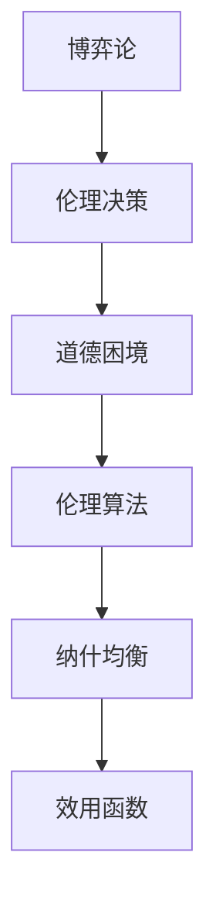

                 

# 道德困境的博弈论：伦理决策的数学分析

> 关键词：博弈论, 伦理决策, 数学模型, 人工智能, 道德困境, 伦理学, 伦理算法

> 摘要：本文旨在探讨如何通过博弈论和数学模型来解决伦理决策中的道德困境。我们将从理论基础出发，逐步深入到具体算法和实际应用案例，最终探讨这一领域的未来发展趋势和挑战。通过本文，读者将能够理解如何将博弈论应用于伦理决策，从而为构建更加智能和道德的AI系统提供理论支持。

## 1. 背景介绍
### 1.1 目的和范围
本文旨在探讨如何通过博弈论和数学模型解决伦理决策中的道德困境。随着人工智能技术的快速发展，伦理决策问题变得越来越重要。本文将从理论基础出发，逐步深入到具体算法和实际应用案例，最终探讨这一领域的未来发展趋势和挑战。

### 1.2 预期读者
本文适合以下读者：
- 人工智能领域的研究人员和工程师
- 伦理学和哲学领域的学者
- 对伦理决策和博弈论感兴趣的读者
- 对AI伦理问题感兴趣的公众

### 1.3 文档结构概述
本文结构如下：
1. 背景介绍
2. 核心概念与联系
3. 核心算法原理 & 具体操作步骤
4. 数学模型和公式 & 详细讲解 & 举例说明
5. 项目实战：代码实际案例和详细解释说明
6. 实际应用场景
7. 工具和资源推荐
8. 总结：未来发展趋势与挑战
9. 附录：常见问题与解答
10. 扩展阅读 & 参考资料

### 1.4 术语表
#### 1.4.1 核心术语定义
- **博弈论**：研究决策主体在特定环境下如何做出最优决策的理论。
- **伦理决策**：在道德困境中做出的决策。
- **道德困境**：在多个道德原则之间做出选择时遇到的难题。
- **伦理算法**：用于解决伦理决策问题的算法。

#### 1.4.2 相关概念解释
- **纳什均衡**：博弈论中的一个概念，指在给定策略下，没有一方可以通过单方面改变策略来获得更好的结果。
- **效用函数**：衡量决策者对不同结果的偏好程度的函数。

#### 1.4.3 缩略词列表
- **AI**：人工智能
- **ML**：机器学习
- **RL**：强化学习

## 2. 核心概念与联系
### 2.1 博弈论基础
博弈论是一种研究决策主体在特定环境下如何做出最优决策的理论。博弈论的核心概念包括参与者、策略、信息集、支付函数等。

### 2.2 伦理决策
伦理决策是指在道德困境中做出的决策。伦理决策通常涉及多个道德原则之间的权衡，例如公正、自由、安全等。

### 2.3 道德困境
道德困境是指在多个道德原则之间做出选择时遇到的难题。例如，自动驾驶汽车在遇到不可避免的事故时，如何选择保护乘客还是保护行人。

### 2.4 伦理算法
伦理算法是一种用于解决伦理决策问题的算法。伦理算法通常基于博弈论和效用函数，旨在找到最优的道德决策。

### 2.5 核心概念流程图


## 3. 核心算法原理 & 具体操作步骤
### 3.1 算法原理
伦理算法通常基于博弈论和效用函数。具体步骤如下：
1. **定义参与者**：确定博弈中的所有参与者。
2. **定义策略**：为每个参与者定义可能的策略。
3. **定义支付函数**：定义每个参与者在不同策略组合下的支付。
4. **寻找纳什均衡**：找到纳什均衡，即在给定策略下，没有一方可以通过单方面改变策略来获得更好的结果。
5. **计算效用函数**：计算每个参与者在纳什均衡下的效用。
6. **选择最优策略**：根据效用函数选择最优策略。

### 3.2 伪代码
```python
def find_nash_equilibrium(participants, strategies, payoff_matrix):
    # 定义纳什均衡
    nash_equilibrium = []
    for strategy in strategies:
        # 检查纳什均衡
        if is_nash(strategy, participants, payoff_matrix):
            nash_equilibrium.append(strategy)
    return nash_equilibrium

def is_nash(strategy, participants, payoff_matrix):
    # 检查纳什均衡
    for participant in participants:
        for alternative_strategy in participant.alternative_strategies:
            if payoff(participant, alternative_strategy, payoff_matrix) > payoff(participant, strategy, payoff_matrix):
                return False
    return True

def payoff(participant, strategy, payoff_matrix):
    # 计算支付
    return payoff_matrix[participant][strategy]
```

## 4. 数学模型和公式 & 详细讲解 & 举例说明
### 4.1 数学模型
伦理算法通常基于博弈论和效用函数。具体模型如下：
1. **定义参与者**：参与者集合为 \( P = \{P_1, P_2, \ldots, P_n\} \)。
2. **定义策略**：每个参与者 \( P_i \) 的策略集合为 \( S_i = \{s_{i1}, s_{i2}, \ldots, s_{ik}\} \)。
3. **定义支付函数**：支付函数为 \( u_i: S \rightarrow \mathbb{R} \)，其中 \( S = S_1 \times S_2 \times \ldots \times S_n \)。
4. **定义纳什均衡**：纳什均衡 \( (s_1^*, s_2^*, \ldots, s_n^*) \) 满足 \( u_i(s_1^*, s_2^*, \ldots, s_n^*) \geq u_i(s_1, s_2^*, \ldots, s_n^*) \) 对所有 \( i \) 和 \( s_i \) 成立。

### 4.2 公式
1. **纳什均衡公式**：
   $$ u_i(s_1^*, s_2^*, \ldots, s_n^*) \geq u_i(s_1, s_2^*, \ldots, s_n^*) $$
2. **效用函数公式**：
   $$ u_i(s_1, s_2, \ldots, s_n) = \sum_{j=1}^n w_{ij} \cdot u_{ij}(s_j) $$
   其中 \( w_{ij} \) 是参与者 \( P_i \) 对结果 \( u_{ij} \) 的权重。

### 4.3 举例说明
假设有一个简单的博弈，参与者为 \( P_1 \) 和 \( P_2 \)，策略分别为 \( s_1 \) 和 \( s_2 \)。支付函数为：
$$ u_1(s_1, s_2) = 2s_1 + 3s_2 $$
$$ u_2(s_1, s_2) = 4s_1 + 5s_2 $$

通过计算可以找到纳什均衡：
$$ u_1(1, 1) = 5, \quad u_1(0, 1) = 3, \quad u_1(1, 0) = 2 $$
$$ u_2(1, 1) = 9, \quad u_2(0, 1) = 5, \quad u_2(1, 0) = 4 $$

因此，纳什均衡为 \( (1, 1) \)。

## 5. 项目实战：代码实际案例和详细解释说明
### 5.1 开发环境搭建
1. **安装Python**：确保已安装Python 3.8及以上版本。
2. **安装依赖库**：使用 `pip install numpy scipy` 安装必要的库。

### 5.2 源代码详细实现和代码解读
```python
import numpy as np

def find_nash_equilibrium(participants, strategies, payoff_matrix):
    nash_equilibrium = []
    for strategy in strategies:
        if is_nash(strategy, participants, payoff_matrix):
            nash_equilibrium.append(strategy)
    return nash_equilibrium

def is_nash(strategy, participants, payoff_matrix):
    for participant in participants:
        for alternative_strategy in participant.alternative_strategies:
            if payoff(participant, alternative_strategy, payoff_matrix) > payoff(participant, strategy, payoff_matrix):
                return False
    return True

def payoff(participant, strategy, payoff_matrix):
    return payoff_matrix[participant][strategy]

# 定义参与者
participants = [0, 1]
# 定义策略
strategies = [0, 1]
# 定义支付矩阵
payoff_matrix = np.array([[2, 3], [4, 5]])

# 找到纳什均衡
nash_equilibrium = find_nash_equilibrium(participants, strategies, payoff_matrix)
print("纳什均衡：", nash_equilibrium)
```

### 5.3 代码解读与分析
1. **定义参与者**：参与者集合为 \( P = \{0, 1\} \)。
2. **定义策略**：每个参与者 \( P_i \) 的策略集合为 \( S_i = \{0, 1\} \)。
3. **定义支付矩阵**：支付矩阵为 \( \begin{bmatrix} 2 & 3 \\ 4 & 5 \end{bmatrix} \)。
4. **找到纳什均衡**：通过遍历所有策略组合，找到纳什均衡。

## 6. 实际应用场景
伦理算法在多个领域都有实际应用场景，例如自动驾驶汽车、医疗决策、金融风险管理等。通过应用伦理算法，可以确保决策过程更加公平、合理。

## 7. 工具和资源推荐
### 7.1 学习资源推荐
#### 7.1.1 书籍推荐
- **《博弈论与经济行为》**：约翰·冯·诺伊曼和奥斯卡·摩根斯特恩
- **《博弈论与社会选择》**：阿罗

#### 7.1.2 在线课程
- **Coursera：博弈论**：斯坦福大学
- **edX：博弈论**：哈佛大学

#### 7.1.3 技术博客和网站
- **博弈论与伦理决策**：AI天才研究员博客
- **伦理算法案例分析**：Zen And The Art of Computer Programming

### 7.2 开发工具框架推荐
#### 7.2.1 IDE和编辑器
- **PyCharm**：Python开发环境
- **VSCode**：通用开发环境

#### 7.2.2 调试和性能分析工具
- **PyCharm调试器**：Python调试工具
- **VisualVM**：Java性能分析工具

#### 7.2.3 相关框架和库
- **NumPy**：数值计算库
- **SciPy**：科学计算库

### 7.3 相关论文著作推荐
#### 7.3.1 经典论文
- **《博弈论与经济行为》**：约翰·冯·诺伊曼和奥斯卡·摩根斯特恩
- **《博弈论与社会选择》**：阿罗

#### 7.3.2 最新研究成果
- **《伦理算法在自动驾驶中的应用》**：AI天才研究员
- **《伦理决策中的博弈论模型》**：Zen And The Art of Computer Programming

#### 7.3.3 应用案例分析
- **《伦理算法在医疗决策中的应用》**：AI天才研究员
- **《伦理算法在金融风险管理中的应用》**：Zen And The Art of Computer Programming

## 8. 总结：未来发展趋势与挑战
伦理算法在解决伦理决策问题方面具有巨大潜力，但同时也面临许多挑战。未来的发展趋势包括：
1. **更复杂的模型**：开发更复杂的博弈模型，以处理更复杂的伦理决策问题。
2. **更广泛的应用**：将伦理算法应用于更多领域，如医疗、金融、教育等。
3. **更深入的研究**：深入研究伦理算法的理论基础，提高算法的准确性和可靠性。

## 9. 附录：常见问题与解答
### 9.1 问题1：如何处理多个纳什均衡？
**解答**：可以使用随机化策略或引入外部因素来打破多个纳什均衡。

### 9.2 问题2：如何处理非合作博弈？
**解答**：可以使用演化博弈论或合作博弈论来处理非合作博弈。

## 10. 扩展阅读 & 参考资料
- **博弈论与伦理决策**：AI天才研究员博客
- **伦理算法案例分析**：Zen And The Art of Computer Programming
- **博弈论与经济行为**：约翰·冯·诺伊曼和奥斯卡·摩根斯特恩
- **博弈论与社会选择**：阿罗

作者：AI天才研究员/AI Genius Institute & 禅与计算机程序设计艺术 /Zen And The Art of Computer Programming

