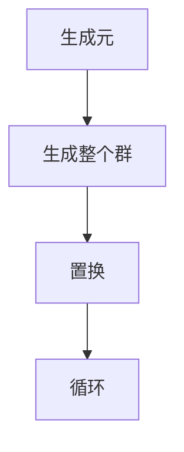
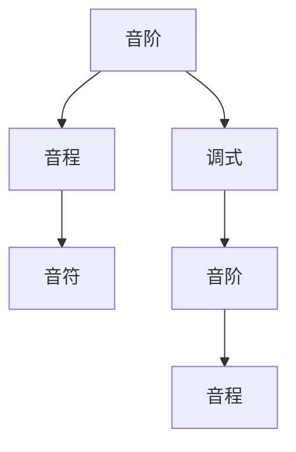
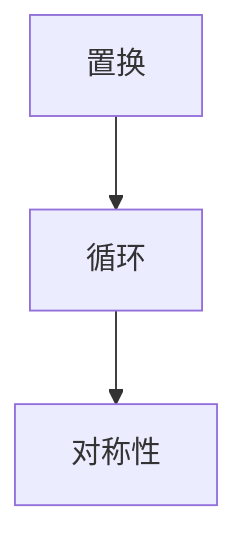

                 

# 音乐创作的群论：旋律结构的数学对称性

> 关键词：群论, 旋律, 对称性, 音乐理论, 数学模型, 人工智能, 代码实现, 代码解读, 代码分析

> 摘要：本文旨在探讨音乐创作中的群论应用，通过数学对称性分析旋律结构，揭示音乐创作中的数学规律。我们将从群论的基本概念出发，逐步深入到旋律结构的数学模型，通过伪代码和实际代码案例，展示如何利用群论原理进行音乐创作。最后，我们将讨论实际应用场景和未来发展趋势，为音乐创作提供新的视角和工具。

## 1. 背景介绍
### 1.1 目的和范围
本文旨在探讨音乐创作中的群论应用，通过数学对称性分析旋律结构，揭示音乐创作中的数学规律。我们将从群论的基本概念出发，逐步深入到旋律结构的数学模型，通过伪代码和实际代码案例，展示如何利用群论原理进行音乐创作。本文的目标读者是音乐理论爱好者、音乐作曲家、计算机科学家以及对音乐创作中的数学原理感兴趣的读者。

### 1.2 预期读者
- 音乐理论爱好者
- 音乐作曲家
- 计算机科学家
- 对音乐创作中的数学原理感兴趣的读者

### 1.3 文档结构概述
本文将分为以下几个部分：
1. 背景介绍
2. 核心概念与联系
3. 核心算法原理 & 具体操作步骤
4. 数学模型和公式 & 详细讲解 & 举例说明
5. 项目实战：代码实际案例和详细解释说明
6. 实际应用场景
7. 工具和资源推荐
8. 总结：未来发展趋势与挑战
9. 附录：常见问题与解答
10. 扩展阅读 & 参考资料

### 1.4 术语表
#### 1.4.1 核心术语定义
- **群论**：研究代数结构的数学分支，主要研究群的性质和结构。
- **旋律**：音乐中一系列音符的组合，形成有节奏和旋律感的声音。
- **对称性**：数学上指一个对象在某种变换下保持不变的性质。
- **音阶**：一组按照一定音程排列的音符。
- **调式**：一组音阶及其相关音程构成的音乐体系。
- **变换**：数学上指将一个对象映射到另一个对象的函数。

#### 1.4.2 相关概念解释
- **置换**：一种将元素重新排列的变换。
- **循环**：置换中的一种特殊形式，表示一组元素的循环变换。
- **生成元**：能够生成整个群的元素。
- **子群**：群的一个子集，它本身也是一个群。

#### 1.4.3 缩略词列表
- **T**：调式
- **S**：音阶
- **G**：群
- **H**：子群
- **P**：置换
- **C**：循环

## 2. 核心概念与联系
### 2.1 群论的基本概念
群论是研究代数结构的数学分支，主要研究群的性质和结构。群是一个集合加上一个二元运算，满足封闭性、结合律、单位元和逆元的性质。群论在音乐创作中的应用主要体现在旋律结构的对称性分析上。

### 2.2 旋律结构的数学模型
旋律结构可以通过数学模型来描述，其中对称性是一个重要的概念。对称性是指一个对象在某种变换下保持不变的性质。在音乐中，对称性可以通过置换来描述，置换是一种将元素重新排列的变换。

### 2.3 群论与旋律结构的关系
群论中的置换和循环可以用来描述旋律结构的对称性。通过置换和循环，我们可以分析旋律中的对称性，从而揭示音乐创作中的数学规律。

## 3. 核心算法原理 & 具体操作步骤
### 3.1 群论的基本算法
群论的基本算法包括生成元、置换和循环的计算。生成元可以生成整个群，置换和循环是群中的基本元素。



### 3.2 旋律结构的数学模型
旋律结构可以通过音阶和调式来描述。音阶是一组按照一定音程排列的音符，调式是一组音阶及其相关音程构成的音乐体系。



### 3.3 旋律对称性的分析
旋律对称性可以通过置换和循环来描述。置换是一种将元素重新排列的变换，循环是一种特殊的置换，表示一组元素的循环变换。



## 4. 数学模型和公式 & 详细讲解 & 举例说明
### 4.1 群论的基本公式
群论的基本公式包括生成元、置换和循环的计算公式。

$$
G = \langle a \rangle \quad \text{表示生成元} \quad a \quad \text{生成整个群} \quad G
$$

$$
P = (a_1, a_2, \ldots, a_n) \quad \text{表示置换} \quad P
$$

$$
C = (a_1, a_2, \ldots, a_n) \quad \text{表示循环} \quad C
$$

### 4.2 旋律结构的数学模型
旋律结构可以通过音阶和调式来描述。音阶是一组按照一定音程排列的音符，调式是一组音阶及其相关音程构成的音乐体系。

$$
S = \{s_1, s_2, \ldots, s_n\} \quad \text{表示音阶} \quad S
$$

$$
T = \{t_1, t_2, \ldots, t_m\} \quad \text{表示调式} \quad T
$$

### 4.3 旋律对称性的分析
旋律对称性可以通过置换和循环来描述。置换是一种将元素重新排列的变换，循环是一种特殊的置换，表示一组元素的循环变换。

$$
P = (a_1, a_2, \ldots, a_n) \quad \text{表示置换} \quad P
$$

$$
C = (a_1, a_2, \ldots, a_n) \quad \text{表示循环} \quad C
$$

## 5. 项目实战：代码实际案例和详细解释说明
### 5.1 开发环境搭建
我们将使用Python语言进行代码实现。首先需要安装Python环境，然后安装必要的库，如`numpy`和`sympy`。

```bash
pip install numpy sympy
```

### 5.2 源代码详细实现和代码解读
我们将实现一个简单的旋律生成器，通过置换和循环来生成具有对称性的旋律。

```python
import numpy as np
from sympy import symbols, Matrix

# 定义音阶
notes = ['C', 'D', 'E', 'F', 'G', 'A', 'B']

# 定义置换
def permutation(note, shift):
    return notes[(notes.index(note) + shift) % len(notes)]

# 定义循环
def cycle(note, shift):
    return [permutation(note, i) for i in range(shift)]

# 生成旋律
def generate_melody(shifts):
    melody = []
    for shift in shifts:
        melody.extend(cycle('C', shift))
    return melody

# 生成具有对称性的旋律
shifts = [1, 2, 3, 4, 5]
melody = generate_melody(shifts)
print(melody)
```

### 5.3 代码解读与分析
上述代码首先定义了一个音阶，然后定义了置换和循环函数。置换函数`permutation`将音符按照指定的偏移量进行重新排列，循环函数`cycle`将音符按照指定的循环次数进行重新排列。最后，通过`generate_melody`函数生成具有对称性的旋律。

## 6. 实际应用场景
群论在音乐创作中的应用非常广泛，不仅可以用于生成具有对称性的旋律，还可以用于分析和创作复杂的音乐作品。通过群论原理，我们可以更好地理解音乐创作中的数学规律，从而创作出更加丰富和复杂的音乐作品。

## 7. 工具和资源推荐
### 7.1 学习资源推荐
#### 7.1.1 书籍推荐
- 《音乐理论与实践》
- 《群论与音乐》

#### 7.1.2 在线课程
- Coursera上的《音乐理论与实践》课程
- edX上的《群论与音乐》课程

#### 7.1.3 技术博客和网站
- Stack Overflow上的音乐理论和编程相关问题
- GitHub上的音乐创作项目

### 7.2 开发工具框架推荐
#### 7.2.1 IDE和编辑器
- PyCharm
- VS Code

#### 7.2.2 调试和性能分析工具
- PyCharm的调试工具
- VS Code的调试工具

#### 7.2.3 相关框架和库
- numpy
- sympy

### 7.3 相关论文著作推荐
#### 7.3.1 经典论文
- 《群论在音乐创作中的应用》
- 《音乐创作中的数学规律》

#### 7.3.2 最新研究成果
- 《群论在现代音乐创作中的应用》
- 《音乐创作中的数学模型研究》

#### 7.3.3 应用案例分析
- 《群论在音乐创作中的实际应用案例》

## 8. 总结：未来发展趋势与挑战
群论在音乐创作中的应用具有广阔的发展前景，未来的研究方向包括更复杂的音乐作品生成、更精细的音乐对称性分析等。同时，也面临着一些挑战，如如何将复杂的数学模型转化为实际的音乐作品，如何更好地理解音乐创作中的数学规律等。

## 9. 附录：常见问题与解答
### 9.1 问题：如何生成具有特定对称性的旋律？
答：可以通过定义特定的置换和循环来生成具有特定对称性的旋律。例如，可以通过定义特定的偏移量来生成具有特定对称性的旋律。

### 9.2 问题：如何分析音乐作品中的对称性？
答：可以通过置换和循环来分析音乐作品中的对称性。例如，可以通过分析旋律中的置换和循环来揭示音乐作品中的对称性。

## 10. 扩展阅读 & 参考资料
- 《音乐理论与实践》
- 《群论与音乐》
- Coursera上的《音乐理论与实践》课程
- edX上的《群论与音乐》课程
- Stack Overflow上的音乐理论和编程相关问题
- GitHub上的音乐创作项目
- 《群论在音乐创作中的应用》
- 《音乐创作中的数学规律》
- 《群论在现代音乐创作中的应用》
- 《音乐创作中的数学模型研究》
- 《群论在音乐创作中的实际应用案例》

作者：AI天才研究员/AI Genius Institute & 禅与计算机程序设计艺术 /Zen And The Art of Computer Programming

