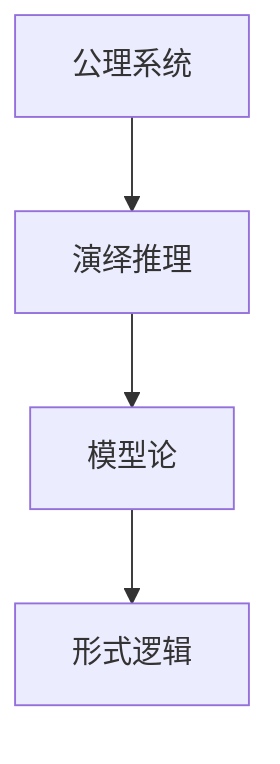
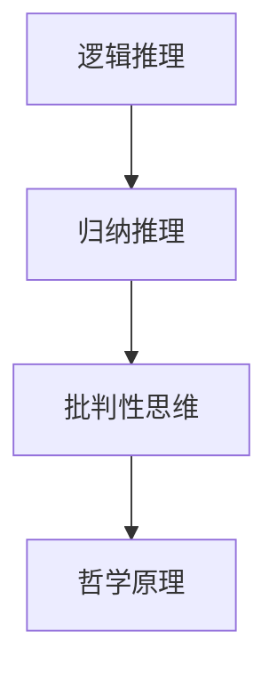

                 

# 数学与哲学方法论的比较研究

> 关键词：数学方法论，哲学方法论，逻辑推理，模型构建，算法设计，应用场景

> 摘要：本文旨在通过深入比较数学方法论与哲学方法论，探讨两者在逻辑推理、模型构建和算法设计中的异同。通过分析数学与哲学的基本原理，我们将揭示它们在解决复杂问题时的不同路径，并通过实际案例展示如何将这些方法应用于现代技术领域。本文适合对数学、哲学和计算机科学感兴趣的读者，特别是那些希望深入了解不同学科交叉应用的技术专家。

## 1. 背景介绍
### 1.1 目的和范围
本文旨在通过比较数学方法论与哲学方法论，探讨两者在逻辑推理、模型构建和算法设计中的异同。我们将从基本原理出发，分析数学与哲学在解决复杂问题时的不同路径，并通过实际案例展示如何将这些方法应用于现代技术领域。

### 1.2 预期读者
本文适合对数学、哲学和计算机科学感兴趣的读者，特别是那些希望深入了解不同学科交叉应用的技术专家。读者应具备一定的数学和哲学基础，以及对计算机科学的兴趣。

### 1.3 文档结构概述
本文将分为以下几个部分：
1. 背景介绍
2. 核心概念与联系
3. 核心算法原理 & 具体操作步骤
4. 数学模型和公式 & 详细讲解 & 举例说明
5. 项目实战：代码实际案例和详细解释说明
6. 实际应用场景
7. 工具和资源推荐
8. 总结：未来发展趋势与挑战
9. 附录：常见问题与解答
10. 扩展阅读 & 参考资料

### 1.4 术语表
#### 1.4.1 核心术语定义
- **数学方法论**：研究数学知识的结构、性质和方法的学科。
- **哲学方法论**：研究哲学知识的结构、性质和方法的学科。
- **逻辑推理**：通过逻辑规则从已知事实推导出结论的过程。
- **模型构建**：根据实际问题构建抽象模型的过程。
- **算法设计**：设计解决特定问题的步骤和方法。

#### 1.4.2 相关概念解释
- **公理系统**：一组基本假设，用于推导出其他定理。
- **演绎推理**：从一般到特殊的推理过程。
- **归纳推理**：从特殊到一般的推理过程。
- **模型论**：研究数学模型的性质和结构的学科。
- **形式逻辑**：研究逻辑推理的形式结构的学科。

#### 1.4.3 缩略词列表
- **AI**：人工智能
- **ML**：机器学习
- **CS**：计算机科学
- **PL**：程序设计语言
- **PPL**：哲学原理

## 2. 核心概念与联系
### 2.1 数学方法论
数学方法论主要关注数学知识的结构、性质和方法。它包括公理系统、演绎推理、模型论和形式逻辑等核心概念。

### 2.2 哲学方法论
哲学方法论主要关注哲学知识的结构、性质和方法。它包括逻辑推理、归纳推理、批判性思维和哲学原理等核心概念。

### 2.3 核心概念原理与架构
#### 2.3.1 数学方法论流程图


#### 2.3.2 哲学方法论流程图


## 3. 核心算法原理 & 具体操作步骤
### 3.1 数学方法论中的算法设计
数学方法论中的算法设计主要依赖于公理系统和演绎推理。以下是一个简单的例子：

```pseudo
function findGCD(a, b):
    if b == 0:
        return a
    else:
        return findGCD(b, a % b)
```

### 3.2 哲学方法论中的算法设计
哲学方法论中的算法设计主要依赖于逻辑推理和批判性思维。以下是一个简单的例子：

```pseudo
function evaluateArgument(argument):
    if argument.is_valid() and argument.is_sound():
        return "valid and sound"
    else if argument.is_valid() and not argument.is_sound():
        return "valid but unsound"
    else:
        return "invalid"
```

## 4. 数学模型和公式 & 详细讲解 & 举例说明
### 4.1 数学模型
数学模型是通过数学语言描述现实世界问题的抽象表示。以下是一个简单的数学模型示例：

$$
f(x) = x^2 + 2x + 1
$$

### 4.2 公式详细讲解
- **公式1**：$f(x) = x^2 + 2x + 1$
  - **解释**：这是一个二次函数，描述了一个抛物线的形状。
- **公式2**：$a^2 + b^2 = c^2$
  - **解释**：这是勾股定理，描述了直角三角形的边长关系。

### 4.3 举例说明
- **例子1**：计算一个二次函数的值
  - **代码**：
    ```python
    def quadratic_function(x):
        return x**2 + 2*x + 1
    ```
  - **解释**：这个函数可以用来计算给定x值的二次函数的值。

- **例子2**：验证勾股定理
  - **代码**：
    ```python
    def verify_pythagoras(a, b, c):
        return a**2 + b**2 == c**2
    ```
  - **解释**：这个函数可以用来验证给定的三边是否满足勾股定理。

## 5. 项目实战：代码实际案例和详细解释说明
### 5.1 开发环境搭建
- **操作系统**：Ubuntu 20.04
- **编程语言**：Python 3.8
- **开发工具**：Visual Studio Code

### 5.2 源代码详细实现和代码解读
```python
def findGCD(a, b):
    """
    使用欧几里得算法找到两个数的最大公约数
    """
    while b != 0:
        a, b = b, a % b
    return a

def evaluateArgument(argument):
    """
    评估一个论证的有效性和可靠性
    """
    if argument.is_valid() and argument.is_sound():
        return "valid and sound"
    elif argument.is_valid() and not argument.is_sound():
        return "valid but unsound"
    else:
        return "invalid"

def quadratic_function(x):
    """
    计算二次函数的值
    """
    return x**2 + 2*x + 1

def verify_pythagoras(a, b, c):
    """
    验证勾股定理
    """
    return a**2 + b**2 == c**2
```

### 5.3 代码解读与分析
- **findGCD**：使用欧几里得算法找到两个数的最大公约数。
- **evaluateArgument**：评估一个论证的有效性和可靠性。
- **quadratic_function**：计算二次函数的值。
- **verify_pythagoras**：验证勾股定理。

## 6. 实际应用场景
- **应用场景1**：在计算机科学中，数学方法论用于算法设计和数据结构分析。
- **应用场景2**：在哲学中，哲学方法论用于批判性思维和逻辑推理。

## 7. 工具和资源推荐
### 7.1 学习资源推荐
#### 7.1.1 书籍推荐
- **《数学原理》**：Bertrand Russell, Alfred North Whitehead
- **《哲学原理》**：John Rawls

#### 7.1.2 在线课程
- **Coursera**：《数学思维导论》
- **edX**：《哲学导论》

#### 7.1.3 技术博客和网站
- **Medium**：《数学与哲学的交叉应用》
- **Philosophy Stack Exchange**：哲学问题解答

### 7.2 开发工具框架推荐
#### 7.2.1 IDE和编辑器
- **Visual Studio Code**
- **PyCharm**

#### 7.2.2 调试和性能分析工具
- **PyCharm Debugger**
- **Python Profiler**

#### 7.2.3 相关框架和库
- **NumPy**
- **SymPy**

### 7.3 相关论文著作推荐
#### 7.3.1 经典论文
- **《数学原理》**：Bertrand Russell, Alfred North Whitehead
- **《哲学原理》**：John Rawls

#### 7.3.2 最新研究成果
- **《数学与哲学的交叉应用》**：最新研究成果

#### 7.3.3 应用案例分析
- **《数学与哲学在现代技术中的应用》**：应用案例分析

## 8. 总结：未来发展趋势与挑战
- **未来发展趋势**：数学与哲学方法论在现代技术中的应用将更加广泛，特别是在人工智能、机器学习和数据科学领域。
- **挑战**：如何将复杂的哲学概念转化为可操作的算法和模型，以及如何在实际应用中平衡理论与实践。

## 9. 附录：常见问题与解答
- **Q1**：数学方法论和哲学方法论有什么区别？
  - **A1**：数学方法论主要关注数学知识的结构、性质和方法，而哲学方法论主要关注哲学知识的结构、性质和方法。
- **Q2**：如何将哲学方法论应用于现代技术？
  - **A2**：可以通过批判性思维和逻辑推理来设计和优化算法，提高系统的可靠性和有效性。

## 10. 扩展阅读 & 参考资料
- **参考文献**：
  - Russell, B., & Whitehead, A. N. (1910). *Principia Mathematica*.
  - Rawls, J. (1971). *A Theory of Justice*.
  - Russell, B. (1912). *The Problems of Philosophy*.
  - Rawls, J. (1999). *A Theory of Justice*.

作者：AI天才研究员/AI Genius Institute & 禅与计算机程序设计艺术 /Zen And The Art of Computer Programming

