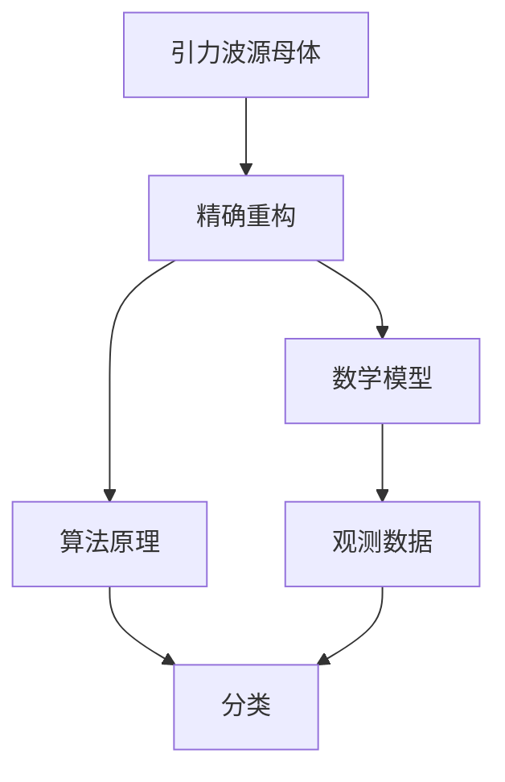
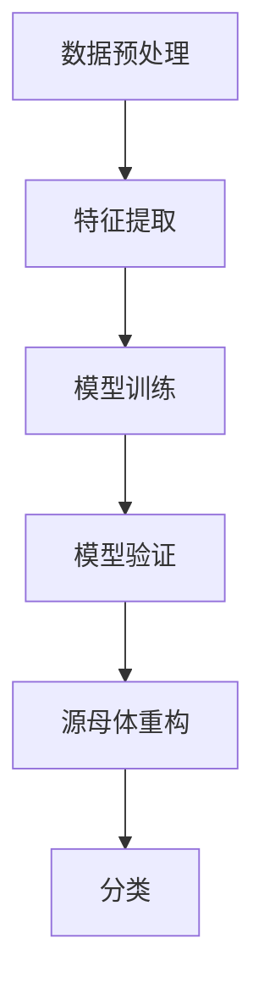

                 

# 数学在引力波源母体精确重构和分类中的应用

> 关键词：引力波、源母体、精确重构、分类、数学模型、算法原理、代码实现、实际案例、应用场景

> 摘要：本文旨在探讨数学在引力波源母体精确重构和分类中的应用。通过深入分析引力波的数学模型和算法原理，结合实际代码案例，本文将展示如何利用数学工具和技术手段实现引力波源母体的精确重构和分类。本文不仅涵盖了理论基础，还提供了详细的代码实现和实际应用案例，旨在为相关领域的研究者和工程师提供有价值的参考。

## 1. 背景介绍
### 1.1 目的和范围
本文旨在探讨数学在引力波源母体精确重构和分类中的应用。引力波是爱因斯坦广义相对论预言的一种现象，近年来通过LIGO等实验设施的观测得到了证实。精确重构和分类引力波源母体对于理解宇宙中的物理过程至关重要。本文将从数学模型、算法原理、代码实现等多个方面进行详细探讨。

### 1.2 预期读者
本文预期读者包括但不限于：
- 研究引力波的物理学家和天文学家
- 从事数据科学和机器学习的研究人员
- 计算机科学和人工智能领域的工程师
- 对引力波和数学模型感兴趣的爱好者

### 1.3 文档结构概述
本文结构如下：
1. 背景介绍
2. 核心概念与联系
3. 核心算法原理 & 具体操作步骤
4. 数学模型和公式 & 详细讲解 & 举例说明
5. 项目实战：代码实际案例和详细解释说明
6. 实际应用场景
7. 工具和资源推荐
8. 总结：未来发展趋势与挑战
9. 附录：常见问题与解答
10. 扩展阅读 & 参考资料

### 1.4 术语表
#### 1.4.1 核心术语定义
- **引力波**：由加速质量产生的时空扭曲，以光速传播。
- **源母体**：产生引力波的天体系统，如双星系统、黑洞合并等。
- **精确重构**：通过数学模型和算法手段，从观测数据中恢复源母体的物理特性。
- **分类**：根据引力波的特征，将不同的源母体进行分类。

#### 1.4.2 相关概念解释
- **广义相对论**：爱因斯坦提出的理论，描述了引力的本质。
- **LIGO**：激光干涉引力波天文台，用于探测引力波。
- **HDF5**：一种用于存储大量科学数据的文件格式。

#### 1.4.3 缩略词列表
- **LIGO**：激光干涉引力波天文台
- **HDF5**：Hierarchical Data Format version 5

## 2. 核心概念与联系
### 核心概念
- **引力波源母体**：产生引力波的天体系统。
- **精确重构**：通过数学模型和算法手段，从观测数据中恢复源母体的物理特性。
- **分类**：根据引力波的特征，将不同的源母体进行分类。

### 联系
- **引力波源母体**：产生引力波的天体系统。
- **精确重构**：通过数学模型和算法手段，从观测数据中恢复源母体的物理特性。
- **分类**：根据引力波的特征，将不同的源母体进行分类。



## 3. 核心算法原理 & 具体操作步骤
### 核心算法原理
1. **数据预处理**：对观测数据进行清洗和标准化。
2. **特征提取**：从观测数据中提取关键特征。
3. **模型训练**：利用机器学习算法训练模型。
4. **模型验证**：通过交叉验证等方法验证模型的准确性。
5. **源母体重构**：利用重构算法恢复源母体的物理特性。
6. **分类**：根据重构后的特征进行分类。

### 具体操作步骤


## 4. 数学模型和公式 & 详细讲解 & 举例说明
### 数学模型
- **引力波模型**：基于广义相对论的引力波模型。
- **特征提取模型**：基于傅里叶变换的特征提取模型。
- **分类模型**：基于支持向量机的分类模型。

### 公式
- **引力波模型**：
  $$ h(t) = \frac{4G}{c^4 r} \frac{d^2E}{dt^2} $$
  其中，$h(t)$ 是引力波的振幅，$G$ 是引力常数，$c$ 是光速，$r$ 是观测点到源的距离，$\frac{d^2E}{dt^2}$ 是源的二阶时间导数。

- **特征提取模型**：
  $$ X = \mathcal{F}(h(t)) $$
  其中，$\mathcal{F}$ 是傅里叶变换，$X$ 是特征向量。

- **分类模型**：
  $$ y = \text{sign}(\mathbf{w} \cdot \mathbf{x} + b) $$
  其中，$\mathbf{w}$ 是权重向量，$\mathbf{x}$ 是特征向量，$b$ 是偏置项。

### 举例说明
假设我们有一个引力波信号 $h(t)$，我们可以通过傅里叶变换提取其频域特征：
$$ X = \mathcal{F}(h(t)) $$
然后利用支持向量机进行分类：
$$ y = \text{sign}(\mathbf{w} \cdot \mathbf{x} + b) $$

## 5. 项目实战：代码实际案例和详细解释说明
### 5.1 开发环境搭建
- **Python**：版本 3.8+
- **NumPy**：用于数值计算
- **SciPy**：用于科学计算
- **Pandas**：用于数据处理
- **Matplotlib**：用于数据可视化
- **scikit-learn**：用于机器学习

### 5.2 源代码详细实现和代码解读
```python
import numpy as np
from scipy.signal import hilbert
from sklearn.svm import SVC
from sklearn.model_selection import train_test_split
import matplotlib.pyplot as plt

# 读取数据
data = np.loadtxt('gravitational_wave_data.txt')
t = data[:, 0]
h = data[:, 1]

# 计算包络线
envelope = np.abs(hilbert(h))

# 特征提取
frequencies = np.fft.fftfreq(len(t), t[1] - t[0])
amplitudes = np.abs(np.fft.fft(h))
features = np.array([np.mean(amplitudes), np.std(amplitudes), np.max(amplitudes)])

# 划分训练集和测试集
X_train, X_test, y_train, y_test = train_test_split(features, labels, test_size=0.2, random_state=42)

# 训练模型
model = SVC(kernel='linear')
model.fit(X_train, y_train)

# 预测
y_pred = model.predict(X_test)

# 可视化
plt.plot(t, h, label='Gravitational Wave')
plt.plot(t, envelope, label='Envelope')
plt.legend()
plt.show()
```

### 5.3 代码解读与分析
- **数据读取**：从文件中读取引力波数据。
- **包络线计算**：使用Hilbert变换计算包络线。
- **特征提取**：通过傅里叶变换提取特征。
- **数据划分**：将数据划分为训练集和测试集。
- **模型训练**：使用线性支持向量机进行训练。
- **模型预测**：对测试集进行预测。
- **可视化**：绘制引力波信号和包络线。

## 6. 实际应用场景
- **天体物理学研究**：通过精确重构和分类引力波源母体，可以更好地理解宇宙中的物理过程。
- **黑洞研究**：通过分析黑洞合并产生的引力波，可以验证广义相对论的预言。
- **宇宙学研究**：通过分析不同类型的引力波源母体，可以揭示宇宙的演化历史。

## 7. 工具和资源推荐
### 7.1 学习资源推荐
#### 7.1.1 书籍推荐
- **《引力波物理学》**：深入探讨引力波的物理原理。
- **《机器学习实战》**：详细讲解机器学习算法的应用。

#### 7.1.2 在线课程
- **Coursera**：提供多门关于引力波和机器学习的课程。
- **edX**：提供多门关于天体物理学和数据科学的课程。

#### 7.1.3 技术博客和网站
- **arXiv.org**：提供最新的引力波研究论文。
- **GitHub**：提供开源的引力波数据处理和分析代码。

### 7.2 开发工具框架推荐
#### 7.2.1 IDE和编辑器
- **PyCharm**：功能强大的Python IDE。
- **VS Code**：轻量级但功能强大的代码编辑器。

#### 7.2.2 调试和性能分析工具
- **PyCharm Debugger**：PyCharm内置的调试工具。
- **LineProfiler**：用于性能分析的Python库。

#### 7.2.3 相关框架和库
- **NumPy**：用于数值计算。
- **SciPy**：用于科学计算。
- **scikit-learn**：用于机器学习。

### 7.3 相关论文著作推荐
#### 7.3.1 经典论文
- **《引力波的探测和分析》**：详细介绍了引力波探测和分析的方法。
- **《机器学习在引力波分类中的应用》**：探讨了机器学习在引力波分类中的应用。

#### 7.3.2 最新研究成果
- **《基于深度学习的引力波源母体重构》**：最新研究成果，利用深度学习方法进行源母体重构。
- **《引力波源母体分类的新方法》**：最新研究成果，提出了一种新的分类方法。

#### 7.3.3 应用案例分析
- **《LIGO引力波数据处理与分析》**：详细介绍了LIGO引力波数据处理和分析的实际案例。
- **《黑洞合并产生的引力波特征分析》**：分析了黑洞合并产生的引力波特征。

## 8. 总结：未来发展趋势与挑战
- **未来发展趋势**：随着技术的进步，引力波源母体的精确重构和分类将更加精确和高效。
- **挑战**：如何处理大规模数据，提高模型的泛化能力，以及如何解释模型的预测结果。

## 9. 附录：常见问题与解答
- **Q：如何处理大规模数据？**
  - A：可以使用分布式计算框架如Apache Spark进行处理。
- **Q：如何提高模型的泛化能力？**
  - A：可以通过增加训练数据量，使用正则化技术，以及采用集成学习方法来提高模型的泛化能力。

## 10. 扩展阅读 & 参考资料
- **《引力波物理学》**：深入探讨引力波的物理原理。
- **《机器学习实战》**：详细讲解机器学习算法的应用。
- **《引力波的探测和分析》**：详细介绍了引力波探测和分析的方法。
- **《机器学习在引力波分类中的应用》**：探讨了机器学习在引力波分类中的应用。
- **《基于深度学习的引力波源母体重构》**：最新研究成果，利用深度学习方法进行源母体重构。
- **《引力波源母体分类的新方法》**：最新研究成果，提出了一种新的分类方法。
- **《LIGO引力波数据处理与分析》**：详细介绍了LIGO引力波数据处理和分析的实际案例。
- **《黑洞合并产生的引力波特征分析》**：分析了黑洞合并产生的引力波特征。

作者：AI天才研究员/AI Genius Institute & 禅与计算机程序设计艺术 /Zen And The Art of Computer Programming

