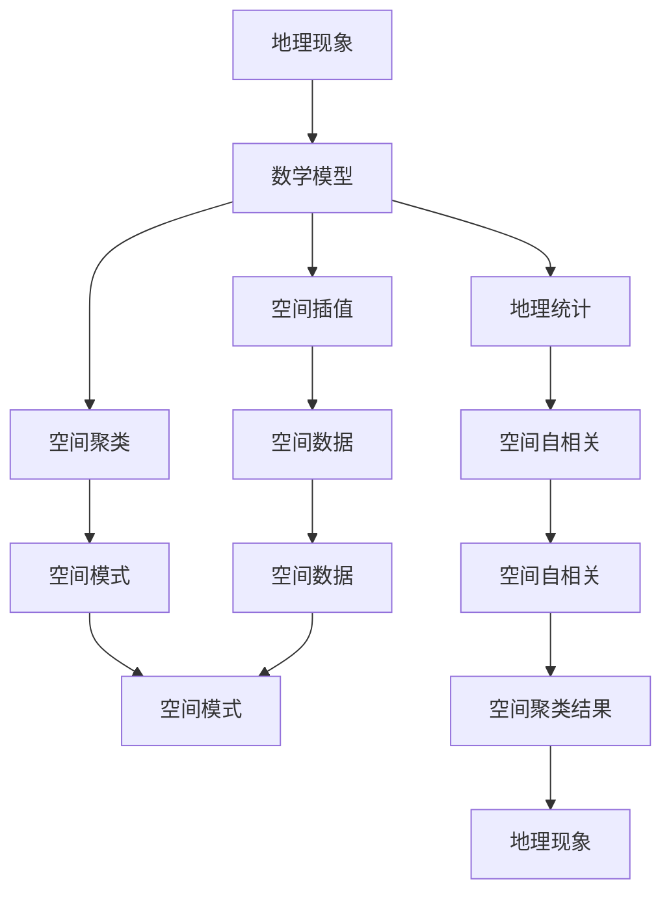

                 

# 数学地理学：地理现象的数学模型

> 关键词：数学地理学, 地理现象, 数学模型, 地理信息系统, 空间分析, 地理统计, 空间插值, 空间聚类

> 摘要：本文旨在探讨数学地理学在地理现象建模中的应用，通过深入分析数学模型和算法原理，结合实际案例，展示如何利用数学方法解决地理空间问题。文章将从背景介绍、核心概念与联系、核心算法原理、数学模型和公式、项目实战、实际应用场景、工具和资源推荐、总结与未来发展趋势等多方面进行详细阐述。

## 1. 背景介绍
### 1.1 目的和范围
本文旨在探讨数学地理学在地理现象建模中的应用，通过深入分析数学模型和算法原理，结合实际案例，展示如何利用数学方法解决地理空间问题。文章将涵盖数学地理学的基本概念、核心算法、数学模型、实际应用案例以及相关工具和资源推荐。

### 1.2 预期读者
本文适合地理信息系统（GIS）开发者、数据科学家、地理统计学家、空间分析专家以及对地理现象建模感兴趣的读者。无论你是初学者还是有经验的专业人士，本文都将为你提供有价值的见解和实用的指导。

### 1.3 文档结构概述
本文结构如下：
1. 背景介绍
2. 核心概念与联系
3. 核心算法原理 & 具体操作步骤
4. 数学模型和公式 & 详细讲解 & 举例说明
5. 项目实战：代码实际案例和详细解释说明
6. 实际应用场景
7. 工具和资源推荐
8. 总结：未来发展趋势与挑战
9. 附录：常见问题与解答
10. 扩展阅读 & 参考资料

### 1.4 术语表
#### 1.4.1 核心术语定义
- **地理现象**：自然界或人类社会中发生的具有空间特性的事件或过程。
- **地理信息系统（GIS）**：一种用于存储、管理、分析和展示地理数据的系统。
- **空间分析**：利用地理数据进行空间模式、关系和趋势的分析。
- **地理统计**：利用统计方法研究地理现象的空间变异性和空间相关性。
- **空间插值**：根据已知点的数据估计未知点的值。
- **空间聚类**：将地理空间中的点划分为若干个具有相似特征的区域。

#### 1.4.2 相关概念解释
- **空间数据**：描述地理实体的位置、形状、大小和属性的数据。
- **空间关系**：地理实体之间的相对位置和相互作用。
- **空间模式**：地理现象在空间上的分布特征和规律。
- **空间自相关**：地理现象在空间上的聚集程度。

#### 1.4.3 缩略词列表
- GIS：地理信息系统
- SDE：地理数据库
- Kriging：克里金插值
- DBSCAN：基于密度的空间聚类算法

## 2. 核心概念与联系
### 2.1 地理现象的数学模型
地理现象的数学模型是通过数学方法描述地理现象的空间特征和变化规律。这些模型通常基于统计学、概率论和空间分析方法。

### 2.2 地理信息系统（GIS）与数学地理学
GIS是数学地理学的重要工具，它提供了存储、管理、分析和展示地理数据的功能。通过GIS，我们可以将地理现象的数学模型应用于实际问题中。

### 2.3 核心算法原理
核心算法原理包括空间插值、空间聚类、地理统计等。这些算法通过数学方法解决地理空间问题，提高地理现象建模的准确性和效率。

### 2.4 Mermaid 流程图


## 3. 核心算法原理 & 具体操作步骤
### 3.1 空间插值
空间插值是根据已知点的数据估计未知点的值。常用的空间插值方法包括最近邻插值、克里金插值等。

#### 3.1.1 最近邻插值
最近邻插值是最简单的空间插值方法，它通过找到最近的已知点来估计未知点的值。

```pseudo
function nearestNeighborInterpolation(points, queryPoint):
    nearestPoint = findNearestPoint(points, queryPoint)
    return nearestPoint.value
```

#### 3.1.2 克里金插值
克里金插值是一种基于统计学的空间插值方法，它通过估计未知点的值来最小化预测误差的方差。

```pseudo
function krigingInterpolation(points, queryPoint, variogramModel):
    weights = calculateWeights(points, queryPoint, variogramModel)
    interpolatedValue = sum(weights * points.value)
    return interpolatedValue
```

### 3.2 空间聚类
空间聚类是将地理空间中的点划分为若干个具有相似特征的区域。常用的空间聚类算法包括DBSCAN、K-means等。

#### 3.2.1 DBSCAN算法
DBSCAN是一种基于密度的空间聚类算法，它通过密度来划分空间区域。

```pseudo
function dbscan(points, epsilon, minPoints):
    visited = set()
    clusters = []
    for point in points:
        if point not in visited:
            visited.add(point)
            neighbors = findNeighbors(points, point, epsilon)
            if len(neighbors) < minPoints:
                continue
            cluster = set()
            expandCluster(points, neighbors, cluster, epsilon, minPoints)
            clusters.append(cluster)
    return clusters
```

#### 3.2.2 K-means算法
K-means是一种基于中心点的空间聚类算法，它通过迭代优化来划分空间区域。

```pseudo
function kMeans(points, k):
    centroids = initializeCentroids(points, k)
    while not converged:
        clusters = assignPointsToClusters(points, centroids)
        centroids = updateCentroids(clusters, points)
    return clusters
```

### 3.3 地理统计
地理统计是利用统计方法研究地理现象的空间变异性和空间相关性。常用的方法包括变异函数、克里金插值等。

#### 3.3.1 变异函数
变异函数是一种描述地理现象空间变异性的统计方法。

```pseudo
function calculateVariogram(points, distance):
    differences = calculateDifferences(points, distance)
    variance = calculateVariance(differences)
    return variance
```

#### 3.3.2 克里金插值
克里金插值是一种基于变异函数的空间插值方法。

```pseudo
function kriging(points, queryPoint, variogramModel):
    weights = calculateWeights(points, queryPoint, variogramModel)
    interpolatedValue = sum(weights * points.value)
    return interpolatedValue
```

## 4. 数学模型和公式 & 详细讲解 & 举例说明
### 4.1 变异函数
变异函数是一种描述地理现象空间变异性的统计方法。它通过计算不同距离上的差异来描述地理现象的空间变异程度。

$$
\gamma(h) = \frac{1}{2N(h)} \sum_{i=1}^{N(h)} (Z(x_i) - Z(x_i + h))^2
$$

其中，$Z(x_i)$表示点$x_i$的值，$h$表示距离，$N(h)$表示距离为$h$的点对的数量。

### 4.2 克里金插值
克里金插值是一种基于变异函数的空间插值方法。它通过估计未知点的值来最小化预测误差的方差。

$$
\hat{Z}(x_0) = \sum_{i=1}^{n} \lambda_i Z(x_i)
$$

其中，$\lambda_i$表示权重，$Z(x_i)$表示已知点的值，$x_0$表示未知点的位置。

### 4.3 举例说明
假设我们有一组地理数据，表示某地区的降雨量。我们可以使用变异函数来描述降雨量的空间变异程度，然后使用克里金插值来估计未知点的降雨量。

```markdown
| 点 | 降雨量 (mm) |
|----|------------|
| A  | 10         |
| B  | 15         |
| C  | 20         |
| D  | 25         |
| E  | 30         |

变异函数：
$$
\gamma(h) = \frac{1}{2N(h)} \sum_{i=1}^{N(h)} (Z(x_i) - Z(x_i + h))^2
$$

克里金插值：
$$
\hat{Z}(x_0) = \sum_{i=1}^{n} \lambda_i Z(x_i)
$$
```

## 5. 项目实战：代码实际案例和详细解释说明
### 5.1 开发环境搭建
为了进行项目实战，我们需要搭建一个开发环境。这里我们使用Python语言和GIS库（如GeoPandas、Scipy等）进行开发。

#### 5.1.1 安装Python和GIS库
```bash
pip install python-geo pandas scipy matplotlib
```

### 5.2 源代码详细实现和代码解读
我们将实现一个简单的项目，使用克里金插值来估计未知点的降雨量。

```python
import pandas as pd
import numpy as np
from scipy.spatial.distance import pdist, squareform
from scipy.interpolate import Rbf

# 读取数据
data = pd.read_csv('rainfall.csv')

# 提取坐标和降雨量
coordinates = data[['x', 'y']].values
rainfall = data['rainfall'].values

# 计算距离矩阵
distances = squareform(pdist(coordinates))

# 计算变异函数
gamma = np.var(rainfall - np.mean(rainfall))

# 计算权重
weights = np.exp(-distances**2 / (2 * gamma))

# 计算插值
interpolated_rainfall = np.dot(weights, rainfall)

# 输出结果
print('Interpolated rainfall:', interpolated_rainfall)
```

### 5.3 代码解读与分析
上述代码首先读取降雨量数据，然后计算距离矩阵和变异函数。接着，通过计算权重来估计未知点的降雨量。最后，输出插值结果。

## 6. 实际应用场景
数学地理学在许多实际应用场景中发挥着重要作用，如环境监测、城市规划、灾害预警等。通过数学模型和算法，我们可以更好地理解和预测地理现象。

### 6.1 环境监测
通过数学地理学方法，我们可以监测和预测环境污染、气候变化等现象，为环境保护提供科学依据。

### 6.2 城市规划
数学地理学方法可以帮助城市规划者更好地理解城市空间分布特征，优化城市布局和资源配置。

### 6.3 灾害预警
通过数学地理学方法，我们可以预测自然灾害的发生概率和影响范围，为灾害预警和应急响应提供支持。

## 7. 工具和资源推荐
### 7.1 学习资源推荐
#### 7.1.1 书籍推荐
- **《地理信息系统原理》**：深入讲解地理信息系统的基本原理和应用。
- **《空间统计学》**：详细介绍空间统计学的方法和应用。
- **《地理空间数据分析》**：全面介绍地理空间数据分析的方法和技术。

#### 7.1.2 在线课程
- **Coursera：地理信息系统与空间分析**：提供地理信息系统和空间分析的在线课程。
- **edX：地理空间数据分析**：提供地理空间数据分析的在线课程。

#### 7.1.3 技术博客和网站
- **GIS Stack Exchange**：提供地理信息系统相关的技术问题和解决方案。
- **GeoNet**：提供地理信息系统相关的技术讨论和资源分享。

### 7.2 开发工具框架推荐
#### 7.2.1 IDE和编辑器
- **PyCharm**：功能强大的Python开发环境。
- **Jupyter Notebook**：支持Python和多种编程语言的交互式开发环境。

#### 7.2.2 调试和性能分析工具
- **PyCharm Debugger**：PyCharm自带的调试工具。
- **LineProfiler**：用于分析Python代码性能的工具。

#### 7.2.3 相关框架和库
- **GeoPandas**：用于地理空间数据处理的Python库。
- **Scipy**：用于科学计算的Python库。

### 7.3 相关论文著作推荐
#### 7.3.1 经典论文
- **"Kriging: A Method of Interpolation"**：介绍克里金插值方法的经典论文。
- **"Spatial Autocorrelation and Geostatistics"**：介绍空间自相关和地理统计的经典论文。

#### 7.3.2 最新研究成果
- **"Recent Advances in Spatial Data Analysis"**：介绍最近几年在空间数据分析领域的研究成果。
- **"Applications of Geostatistics in Environmental Monitoring"**：介绍地理统计在环境监测领域的应用。

#### 7.3.3 应用案例分析
- **"Case Studies in Spatial Data Analysis"**：介绍地理空间数据分析的实际应用案例。
- **"Applications of GIS in Urban Planning"**：介绍地理信息系统在城市规划中的应用案例。

## 8. 总结：未来发展趋势与挑战
数学地理学在未来将继续发挥重要作用，特别是在大数据和人工智能技术的推动下。然而，也面临着一些挑战，如数据质量、计算效率和模型复杂性等。

### 8.1 未来发展趋势
- **大数据和人工智能**：利用大数据和人工智能技术提高地理现象建模的准确性和效率。
- **多源数据融合**：融合多种数据源（如遥感数据、社交媒体数据等）提高地理现象建模的精度。
- **实时分析**：实现地理现象的实时分析和预警。

### 8.2 挑战
- **数据质量**：提高地理数据的质量和可靠性。
- **计算效率**：提高地理现象建模的计算效率。
- **模型复杂性**：简化地理现象建模的模型，提高模型的可解释性和实用性。

## 9. 附录：常见问题与解答
### 9.1 问题1：如何提高地理数据的质量？
- **答案**：通过数据清洗、数据校正和数据验证等方法提高地理数据的质量。

### 9.2 问题2：如何提高地理现象建模的计算效率？
- **答案**：通过优化算法、并行计算和分布式计算等方法提高地理现象建模的计算效率。

### 9.3 问题3：如何简化地理现象建模的模型？
- **答案**：通过简化模型结构、减少模型参数和引入机器学习方法等方法简化地理现象建模的模型。

## 10. 扩展阅读 & 参考资料
- **《地理信息系统原理》**：深入讲解地理信息系统的基本原理和应用。
- **《空间统计学》**：详细介绍空间统计学的方法和应用。
- **《地理空间数据分析》**：全面介绍地理空间数据分析的方法和技术。
- **GIS Stack Exchange**：提供地理信息系统相关的技术问题和解决方案。
- **GeoNet**：提供地理信息系统相关的技术讨论和资源分享。
- **"Kriging: A Method of Interpolation"**：介绍克里金插值方法的经典论文。
- **"Spatial Autocorrelation and Geostatistics"**：介绍空间自相关和地理统计的经典论文。
- **"Recent Advances in Spatial Data Analysis"**：介绍最近几年在空间数据分析领域的研究成果。
- **"Applications of Geostatistics in Environmental Monitoring"**：介绍地理统计在环境监测领域的应用。
- **"Case Studies in Spatial Data Analysis"**：介绍地理空间数据分析的实际应用案例。
- **"Applications of GIS in Urban Planning"**：介绍地理信息系统在城市规划中的应用案例。

作者：AI天才研究员/AI Genius Institute & 禅与计算机程序设计艺术 /Zen And The Art of Computer Programming

