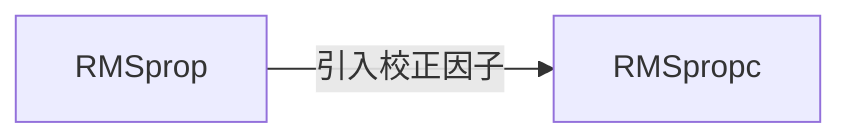

# 优化算法：RMSpropc 原理与代码实例讲解

## 1. 背景介绍

### 1.1 优化算法概述

在机器学习和深度学习中,优化算法扮演着至关重要的角色。优化算法的目标是通过最小化或最大化一个目标函数(如损失函数),来寻找模型的最优参数。常见的优化算法包括梯度下降法(Gradient Descent)、随机梯度下降法(Stochastic Gradient Descent, SGD)、Adam、Adagrad、RMSprop等。

### 1.2 RMSprop算法的由来

RMSprop(Root Mean Square Propagation)是由Geoffrey Hinton在他的Coursera课程中提出的一种自适应学习率的优化算法。它是对Adagrad算法的改进,旨在解决Adagrad算法中学习率急剧下降的问题。

### 1.3 RMSpropc算法的提出

RMSpropc是在RMSprop算法的基础上提出的一种改进算法。它通过引入一个校正因子来修正RMSprop算法中的偏差,从而提高了算法的收敛速度和稳定性。

## 2. 核心概念与联系

### 2.1 梯度(Gradient)

在优化算法中,梯度是指目标函数对于模型参数的偏导数。它表示了目标函数在参数空间中的变化方向,指向函数值增加最快的方向。

### 2.2 学习率(Learning Rate)

学习率是优化算法中的一个超参数,用于控制每次参数更新的步长。合适的学习率可以加快模型的收敛速度,而过大或过小的学习率都会影响模型的性能。

### 2.3 自适应学习率(Adaptive Learning Rate)

自适应学习率是一类优化算法的特点,它可以根据每个参数的历史梯度信息,自动调整每个参数的学习率。这样可以加速模型的收敛,并减少手动调参的需求。

### 2.4 动量(Momentum)

动量是一种加速梯度下降的技术,它借鉴了物理中的惯性概念。通过引入动量项,优化算法可以在一定程度上保持之前的更新方向,减少震荡,加快收敛。

### 2.5 RMSprop与RMSpropc的关系

下图展示了RMSprop与RMSpropc算法之间的关系:



RMSpropc算法是在RMSprop算法的基础上,通过引入一个校正因子来修正偏差,提高算法的收敛速度和稳定性。

## 3. 核心算法原理具体操作步骤

### 3.1 RMSprop算法

RMSprop算法的更新规则如下:

$$
\begin{aligned}
v_t &= \beta v_{t-1} + (1-\beta) g_t^2 \\
\theta_t &= \theta_{t-1} - \frac{\eta}{\sqrt{v_t+\epsilon}} g_t
\end{aligned}
$$

其中,$v_t$是梯度平方的指数加权移动平均值,$g_t$是当前时刻的梯度,$\beta$是衰减率(通常取0.9),$\eta$是学习率,$\epsilon$是一个小常数(如1e-8),用于数值稳定。

RMSprop算法的具体操作步骤如下:

1. 初始化参数$\theta_0$和梯度平方的移动平均值$v_0$
2. 对于每个时刻$t=1,2,...$,重复以下步骤:
   - 计算当前时刻的梯度$g_t$
   - 更新梯度平方的移动平均值:$v_t = \beta v_{t-1} + (1-\beta) g_t^2$
   - 更新参数:$\theta_t = \theta_{t-1} - \frac{\eta}{\sqrt{v_t+\epsilon}} g_t$
3. 重复步骤2,直到满足停止条件(如达到最大迭代次数或目标函数值变化小于阈值)

### 3.2 RMSpropc算法

RMSpropc算法在RMSprop算法的基础上引入了一个校正因子,用于修正偏差。其更新规则如下:

$$
\begin{aligned}
v_t &= \beta v_{t-1} + (1-\beta) g_t^2 \\
\hat{v}_t &= \frac{v_t}{1-\beta^t} \\
\theta_t &= \theta_{t-1} - \frac{\eta}{\sqrt{\hat{v}_t+\epsilon}} g_t
\end{aligned}
$$

其中,$\hat{v}_t$是校正后的梯度平方移动平均值,$\beta^t$是衰减率的$t$次幂。

RMSpropc算法的具体操作步骤如下:

1. 初始化参数$\theta_0$、梯度平方的移动平均值$v_0$和校正因子$\hat{v}_0$
2. 对于每个时刻$t=1,2,...$,重复以下步骤:
   - 计算当前时刻的梯度$g_t$
   - 更新梯度平方的移动平均值:$v_t = \beta v_{t-1} + (1-\beta) g_t^2$
   - 计算校正因子:$\hat{v}_t = \frac{v_t}{1-\beta^t}$
   - 更新参数:$\theta_t = \theta_{t-1} - \frac{\eta}{\sqrt{\hat{v}_t+\epsilon}} g_t$
3. 重复步骤2,直到满足停止条件

## 4. 数学模型和公式详细讲解举例说明

### 4.1 指数加权移动平均(Exponential Moving Average, EMA)

指数加权移动平均是一种常用的时间序列平滑方法,它对近期的数据赋予更高的权重。在RMSprop和RMSpropc算法中,梯度平方的移动平均值$v_t$就是通过EMA计算得到的:

$$v_t = \beta v_{t-1} + (1-\beta) g_t^2$$

其中,$\beta$是衰减率,控制了历史信息的保留程度。$\beta$越大,历史信息的影响越大;$\beta$越小,当前梯度的影响越大。

举例说明:假设$\beta=0.9$,当前时刻的梯度平方为$g_t^2=1$,上一时刻的移动平均值为$v_{t-1}=0.5$,则当前时刻的移动平均值为:

$$v_t = 0.9 \times 0.5 + 0.1 \times 1 = 0.55$$

可以看到,新的移动平均值更接近当前梯度平方,但也受到了历史信息的影响。

### 4.2 偏差校正(Bias Correction)

在RMSprop算法中,由于使用了指数加权移动平均,导致算法在初始阶段可能出现偏差。RMSpropc算法通过引入校正因子$\hat{v}_t$来修正这个偏差:

$$\hat{v}_t = \frac{v_t}{1-\beta^t}$$

其中,$\beta^t$是衰减率的$t$次幂。当$t$较小时,$\beta^t$接近0,校正因子接近1;当$t$较大时,$\beta^t$接近1,校正因子接近$v_t$。

举例说明:假设$\beta=0.9$,当前时刻$t=10$,梯度平方的移动平均值$v_{10}=0.5$,则校正后的移动平均值为:

$$\hat{v}_{10} = \frac{0.5}{1-0.9^{10}} \approx 0.5695$$

可以看到,校正后的移动平均值略高于原始值,这是因为校正因子抵消了初始阶段的偏差。

## 5. 项目实践：代码实例和详细解释说明

下面是使用Python实现RMSpropc算法的示例代码:

```python
import numpy as np

def rmspropc(params, grads, square_avg, lr, beta, epsilon):
    """RMSpropc算法更新参数
    
    Args:
        params: 模型参数,numpy数组
        grads: 梯度,numpy数组
        square_avg: 梯度平方的移动平均值,numpy数组
        lr: 学习率,标量
        beta: 衰减率,标量
        epsilon: 数值稳定常数,标量
    
    Returns:
        updated_params: 更新后的模型参数,numpy数组
        updated_square_avg: 更新后的梯度平方移动平均值,numpy数组
    """
    t = 0
    updated_params = np.zeros_like(params)
    updated_square_avg = np.zeros_like(square_avg)
    
    for param, grad, sq_avg in zip(params, grads, square_avg):
        t += 1
        sq_avg = beta * sq_avg + (1 - beta) * grad**2
        corrected_sq_avg = sq_avg / (1 - beta**t)
        param -= lr * grad / (np.sqrt(corrected_sq_avg) + epsilon)
        
        updated_params[...] = param
        updated_square_avg[...] = sq_avg
    
    return updated_params, updated_square_avg
```

代码解释:

1. 函数`rmspropc`接受6个参数:模型参数`params`、梯度`grads`、梯度平方的移动平均值`square_avg`、学习率`lr`、衰减率`beta`和数值稳定常数`epsilon`。
2. 初始化更新后的模型参数`updated_params`和梯度平方移动平均值`updated_square_avg`为与原始值形状相同的零数组。
3. 使用`zip`函数同时遍历`params`、`grads`和`square_avg`中的每个元素。
4. 对于每个参数,更新梯度平方的移动平均值:$v_t = \beta v_{t-1} + (1-\beta) g_t^2$。
5. 计算校正后的梯度平方移动平均值:$\hat{v}_t = \frac{v_t}{1-\beta^t}$。
6. 更新参数:$\theta_t = \theta_{t-1} - \frac{\eta}{\sqrt{\hat{v}_t+\epsilon}} g_t$。
7. 将更新后的参数和梯度平方移动平均值存储在`updated_params`和`updated_square_avg`中。
8. 返回更新后的模型参数和梯度平方移动平均值。

使用示例:

```python
# 初始化参数
params = np.array([1.0, 2.0, 3.0])
grads = np.array([0.1, 0.2, 0.3])
square_avg = np.zeros_like(params)

# 设置超参数
lr = 0.01
beta = 0.9
epsilon = 1e-8

# 更新参数
updated_params, updated_square_avg = rmspropc(params, grads, square_avg, lr, beta, epsilon)
```

## 6. 实际应用场景

RMSpropc算法可以应用于各种机器学习和深度学习任务,特别是在处理非平稳目标函数时表现出色。以下是一些具体的应用场景:

### 6.1 图像分类

在图像分类任务中,RMSpropc算法可以用于训练卷积神经网络(Convolutional Neural Network, CNN)。与传统的SGD算法相比,RMSpropc算法可以更快地收敛,并且对学习率的选择不太敏感。

### 6.2 自然语言处理

在自然语言处理任务中,如情感分析、命名实体识别等,RMSpropc算法可以用于训练循环神经网络(Recurrent Neural Network, RNN)和transformer模型。RMSpropc算法可以帮助模型更好地处理长序列和稀疏梯度。

### 6.3 推荐系统

在推荐系统中,RMSpropc算法可以用于训练矩阵分解模型和深度学习模型。RMSpropc算法可以加速模型的收敛,并提高推荐的准确性。

### 6.4 强化学习

在强化学习中,RMSpropc算法可以用于训练深度Q网络(Deep Q-Network, DQN)和策略梯度(Policy Gradient)算法。RMSpropc算法可以帮助智能体更快地学习最优策略,并适应不同的环境。

## 7. 工具和资源推荐

以下是一些实现和应用RMSpropc算法的常用工具和资源:

1. TensorFlow: Google开发的开源机器学习框架,支持RMSpropc优化器。
2. PyTorch: Facebook开发的开源机器学习框架,支持RMSpropc优化器。
3. Keras: 基于TensorFlow和Theano的高级神经网络库,支持RMSpropc优化器。
4. Scikit-learn: Python机器学习库,提供了各种优化算法的实现,包括RMSpropc。
5. Coursera课程"Neural Networks for Machine Learning": Geoffrey Hinton讲解RMSprop算法的原理和应用。
6.论文"Lecture 6.5 - rmsprop: Divide the gradient by a running average of its recent magnitude": RMSprop算法的