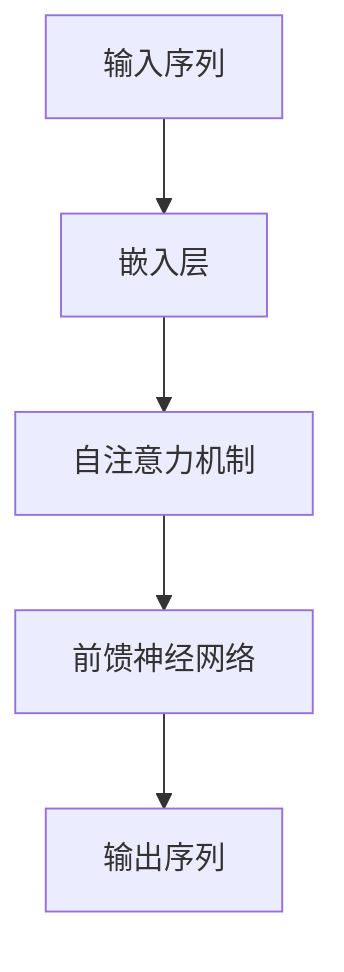

# 语言模型 原理与代码实例讲解

## 1.背景介绍

语言模型（Language Model, LM）是自然语言处理（NLP）领域的核心技术之一。它们通过统计和机器学习方法，能够理解和生成自然语言文本。语言模型的应用范围广泛，包括机器翻译、文本生成、语音识别、情感分析等。近年来，随着深度学习技术的发展，语言模型取得了显著的进步，尤其是基于Transformer架构的模型，如BERT、GPT等，已经在多个NLP任务中达到了前所未有的性能。

## 2.核心概念与联系

### 2.1 语言模型的定义

语言模型是通过学习大量文本数据，来预测一个句子中下一个词的概率分布。简单来说，给定一个词序列 $w_1, w_2, ..., w_{n-1}$，语言模型的目标是计算下一个词 $w_n$ 的概率 $P(w_n | w_1, w_2, ..., w_{n-1})$。

### 2.2 语言模型的分类

语言模型可以分为以下几类：

- **统计语言模型**：如n-gram模型，通过统计词与词之间的共现频率来估计概率。
- **神经网络语言模型**：如RNN、LSTM，通过神经网络来捕捉词与词之间的关系。
- **预训练语言模型**：如BERT、GPT，通过在大规模语料上进行预训练，再在特定任务上进行微调。

### 2.3 语言模型的评估指标

常用的评估指标包括困惑度（Perplexity）、准确率（Accuracy）和BLEU分数等。困惑度是衡量语言模型预测能力的指标，数值越低表示模型越好。

## 3.核心算法原理具体操作步骤

### 3.1 统计语言模型

#### 3.1.1 n-gram模型

n-gram模型是最简单的统计语言模型之一。它假设一个词的出现只依赖于前面n-1个词。n-gram模型的概率计算公式为：

$$
P(w_n | w_1, w_2, ..., w_{n-1}) \approx P(w_n | w_{n-(n-1)}, ..., w_{n-1})
$$

#### 3.1.2 平滑技术

为了处理n-gram模型中的数据稀疏问题，常用的平滑技术包括加法平滑、Kneser-Ney平滑等。

### 3.2 神经网络语言模型

#### 3.2.1 RNN和LSTM

RNN（Recurrent Neural Network）通过循环结构来处理序列数据，但存在梯度消失问题。LSTM（Long Short-Term Memory）通过引入门机制解决了这一问题。

#### 3.2.2 Transformer

Transformer通过自注意力机制（Self-Attention）来捕捉序列中任意两个位置之间的依赖关系，极大地提高了并行计算效率。



### 3.3 预训练语言模型

#### 3.3.1 BERT

BERT（Bidirectional Encoder Representations from Transformers）通过双向Transformer编码器来捕捉上下文信息。

#### 3.3.2 GPT

GPT（Generative Pre-trained Transformer）通过单向Transformer解码器来生成文本。

## 4.数学模型和公式详细讲解举例说明

### 4.1 n-gram模型

n-gram模型的概率计算公式为：

$$
P(w_n | w_1, w_2, ..., w_{n-1}) \approx P(w_n | w_{n-(n-1)}, ..., w_{n-1})
$$

例如，对于一个3-gram模型，给定词序列 "I love machine learning"，我们可以计算下一个词的概率：

$$
P(learning | I, love, machine) \approx P(learning | machine)
$$

### 4.2 RNN和LSTM

RNN的隐藏状态更新公式为：

$$
h_t = \sigma(W_h h_{t-1} + W_x x_t + b)
$$

LSTM的更新公式为：

$$
f_t = \sigma(W_f [h_{t-1}, x_t] + b_f)
$$

$$
i_t = \sigma(W_i [h_{t-1}, x_t] + b_i)
$$

$$
o_t = \sigma(W_o [h_{t-1}, x_t] + b_o)
$$

$$
\tilde{C}_t = \tanh(W_C [h_{t-1}, x_t] + b_C)
$$

$$
C_t = f_t * C_{t-1} + i_t * \tilde{C}_t
$$

$$
h_t = o_t * \tanh(C_t)
$$

### 4.3 Transformer

Transformer的自注意力机制计算公式为：

$$
\text{Attention}(Q, K, V) = \text{softmax}\left(\frac{QK^T}{\sqrt{d_k}}\right)V
$$

其中，$Q$、$K$、$V$分别表示查询矩阵、键矩阵和值矩阵，$d_k$表示键的维度。

## 5.项目实践：代码实例和详细解释说明

### 5.1 统计语言模型

以下是一个简单的n-gram模型的Python实现：

```python
import nltk
from nltk.util import ngrams
from collections import Counter, defaultdict

class NgramModel:
    def __init__(self, n):
        self.n = n
        self.ngrams = Counter()
        self.context_counts = defaultdict(Counter)

    def train(self, corpus):
        for sentence in corpus:
            tokens = nltk.word_tokenize(sentence)
            n_grams = list(ngrams(tokens, self.n, pad_left=True, pad_right=True))
            for n_gram in n_grams:
                self.ngrams[n_gram] += 1
                context = n_gram[:-1]
                word = n_gram[-1]
                self.context_counts[context][word] += 1

    def predict(self, context):
        context = tuple(context)
        if context in self.context_counts:
            return self.context_counts[context].most_common(1)[0][0]
        else:
            return None

# 示例使用
corpus = ["I love machine learning", "I love deep learning"]
model = NgramModel(3)
model.train(corpus)
print(model.predict(["I", "love"]))
```

### 5.2 神经网络语言模型

以下是一个简单的LSTM语言模型的PyTorch实现：

```python
import torch
import torch.nn as nn
import torch.optim as optim

class LSTMLanguageModel(nn.Module):
    def __init__(self, vocab_size, embedding_dim, hidden_dim):
        super(LSTMLanguageModel, self).__init__()
        self.embedding = nn.Embedding(vocab_size, embedding_dim)
        self.lstm = nn.LSTM(embedding_dim, hidden_dim, batch_first=True)
        self.fc = nn.Linear(hidden_dim, vocab_size)

    def forward(self, x):
        x = self.embedding(x)
        x, _ = self.lstm(x)
        x = self.fc(x)
        return x

# 示例使用
vocab_size = 10000
embedding_dim = 128
hidden_dim = 256
model = LSTMLanguageModel(vocab_size, embedding_dim, hidden_dim)
criterion = nn.CrossEntropyLoss()
optimizer = optim.Adam(model.parameters(), lr=0.001)

# 假设输入数据和标签
inputs = torch.randint(0, vocab_size, (32, 10))
labels = torch.randint(0, vocab_size, (32, 10))

# 训练步骤
outputs = model(inputs)
loss = criterion(outputs.view(-1, vocab_size), labels.view(-1))
loss.backward()
optimizer.step()
```

### 5.3 预训练语言模型

以下是使用Hugging Face的Transformers库加载和使用GPT-2模型的示例：

```python
from transformers import GPT2Tokenizer, GPT2LMHeadModel

tokenizer = GPT2Tokenizer.from_pretrained("gpt2")
model = GPT2LMHeadModel.from_pretrained("gpt2")

input_text = "The future of AI is"
input_ids = tokenizer.encode(input_text, return_tensors="pt")

output = model.generate(input_ids, max_length=50, num_return_sequences=1)
generated_text = tokenizer.decode(output[0], skip_special_tokens=True)
print(generated_text)
```

## 6.实际应用场景

### 6.1 机器翻译

语言模型在机器翻译中起到了至关重要的作用。通过学习大量的双语平行语料，语言模型能够生成高质量的翻译结果。

### 6.2 文本生成

语言模型可以用于生成自然流畅的文本，如新闻报道、小说创作等。GPT-3等大型语言模型在这方面表现尤为出色。

### 6.3 语音识别

在语音识别系统中，语言模型用于提高识别结果的准确性。通过结合声学模型和语言模型，系统能够更好地理解和生成语音内容。

### 6.4 情感分析

语言模型可以用于情感分析，通过分析文本中的情感倾向，帮助企业了解用户的情感反馈，从而改进产品和服务。

## 7.工具和资源推荐

### 7.1 编程语言和库

- **Python**：广泛用于NLP任务的编程语言。
- **PyTorch**：深度学习框架，适用于构建和训练神经网络语言模型。
- **TensorFlow**：另一个流行的深度学习框架。
- **Hugging Face Transformers**：提供预训练语言模型的库，支持BERT、GPT等模型。

### 7.2 数据集

- **WikiText**：大规模的维基百科文本数据集。
- **OpenSubtitles**：包含大量电影字幕的平行语料库。
- **Common Crawl**：包含大量网页文本的开放数据集。

### 7.3 在线资源

- **arXiv**：提供最新的NLP研究论文。
- **Kaggle**：提供NLP竞赛和数据集。
- **GitHub**：开源项目和代码库。

## 8.总结：未来发展趋势与挑战

### 8.1 未来发展趋势

- **更大规模的预训练模型**：随着计算资源的增加，未来的语言模型将会更加庞大，能够捕捉更多的语言特征。
- **多模态学习**：结合文本、图像、音频等多种模态的数据，提升模型的理解和生成能力。
- **自监督学习**：通过自监督学习方法，减少对标注数据的依赖，提高模型的泛化能力。

### 8.2 挑战

- **计算资源需求**：训练大型语言模型需要大量的计算资源和时间。
- **数据隐私和伦理问题**：如何在保护用户隐私的前提下，使用和共享数据是一个重要的挑战。
- **模型解释性**：当前的语言模型大多是黑箱模型，如何提高模型的可解释性是一个亟待解决的问题。

## 9.附录：常见问题与解答

### 9.1 什么是语言模型？

语言模型是通过学习大量文本数据，来预测一个句子中下一个词的概率分布的模型。

### 9.2 语言模型有哪些类型？

语言模型主要包括统计语言模型、神经网络语言模型和预训练语言模型。

### 9.3 如何评估语言模型的性能？

常用的评估指标包括困惑度、准确率和BLEU分数等。

### 9.4 语言模型的实际应用有哪些？

语言模型广泛应用于机器翻译、文本生成、语音识别和情感分析等领域。

### 9.5 未来语言模型的发展趋势是什么？

未来语言模型将会更加庞大，结合多模态数据，并通过自监督学习方法提高泛化能力。

---

作者：禅与计算机程序设计艺术 / Zen and the Art of Computer Programming