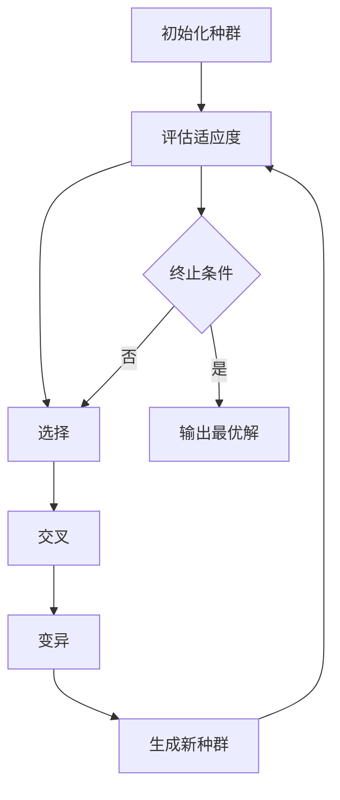

# 遗传算法(Genetic Algorithms) - 原理与代码实例讲解

## 1.背景介绍

遗传算法（Genetic Algorithms，简称GA）是一种基于自然选择和遗传机制的优化算法。它最早由John Holland在20世纪70年代提出，旨在模拟生物进化过程以解决复杂的优化问题。遗传算法在许多领域得到了广泛应用，包括机器学习、人工智能、工程设计和经济学等。

### 1.1 遗传算法的起源

遗传算法的灵感来源于达尔文的自然选择理论。生物体通过遗传和变异不断进化，适应环境，从而提高生存和繁殖的机会。John Holland将这一生物学原理引入计算机科学，提出了一种模拟生物进化过程的算法。

### 1.2 遗传算法的基本思想

遗传算法通过模拟生物进化过程中的选择、交叉和变异等操作，逐步优化问题的解。其基本思想是通过选择适应度高的个体进行繁殖，产生下一代个体，从而逐步逼近最优解。

## 2.核心概念与联系

在深入了解遗传算法的具体操作步骤之前，我们需要掌握一些核心概念。这些概念是理解和实现遗传算法的基础。

### 2.1 个体与种群

- **个体（Individual）**：在遗传算法中，个体表示问题的一个可能解。每个个体由一组基因（通常用二进制编码）组成。
- **种群（Population）**：种群是由多个个体组成的集合。遗传算法通过对种群进行操作来寻找最优解。

### 2.2 适应度函数

- **适应度函数（Fitness Function）**：适应度函数用于评估个体的优劣。适应度值越高，表示个体越适应环境，即解的质量越高。

### 2.3 选择、交叉与变异

- **选择（Selection）**：选择操作根据个体的适应度值选择出优秀的个体进行繁殖。
- **交叉（Crossover）**：交叉操作通过交换两个个体的部分基因，产生新的个体。
- **变异（Mutation）**：变异操作通过随机改变个体的某些基因，增加种群的多样性。

### 2.4 进化过程

遗传算法的进化过程可以用以下Mermaid流程图表示：



## 3.核心算法原理具体操作步骤

遗传算法的核心操作步骤包括初始化种群、评估适应度、选择、交叉、变异和生成新种群。下面我们详细讲解每一步的具体操作。

### 3.1 初始化种群

初始化种群是遗传算法的第一步。通常，我们随机生成一组个体作为初始种群。每个个体表示问题的一个可能解。

### 3.2 评估适应度

评估适应度是通过适应度函数计算每个个体的适应度值。适应度值越高，表示个体越适应环境。

### 3.3 选择

选择操作根据个体的适应度值选择出优秀的个体进行繁殖。常用的选择方法有轮盘赌选择、锦标赛选择和排名选择等。

### 3.4 交叉

交叉操作通过交换两个个体的部分基因，产生新的个体。常用的交叉方法有单点交叉、多点交叉和均匀交叉等。

### 3.5 变异

变异操作通过随机改变个体的某些基因，增加种群的多样性。变异率通常较低，以避免破坏优秀个体的基因结构。

### 3.6 生成新种群

通过选择、交叉和变异操作，生成新一代种群。新种群将替代旧种群，进入下一轮进化。

## 4.数学模型和公式详细讲解举例说明

遗传算法的数学模型和公式是理解其工作原理的关键。下面我们通过具体例子详细讲解遗传算法的数学模型和公式。

### 4.1 适应度函数

适应度函数用于评估个体的优劣。假设我们要优化一个函数 $f(x)$，则适应度函数可以定义为：

$$
F(x) = \frac{1}{1 + f(x)}
$$

其中，$f(x)$ 是我们要优化的目标函数，$F(x)$ 是适应度函数。

### 4.2 选择操作

选择操作根据个体的适应度值选择出优秀的个体进行繁殖。常用的选择方法有轮盘赌选择。轮盘赌选择的概率计算公式为：

$$
P_i = \frac{F(x_i)}{\sum_{j=1}^{N} F(x_j)}
$$

其中，$P_i$ 是个体 $i$ 被选择的概率，$F(x_i)$ 是个体 $i$ 的适应度值，$N$ 是种群的大小。

### 4.3 交叉操作

交叉操作通过交换两个个体的部分基因，产生新的个体。假设我们有两个个体 $A$ 和 $B$，其基因表示为：

$$
A = [a_1, a_2, \ldots, a_n]
$$

$$
B = [b_1, b_2, \ldots, b_n]
$$

单点交叉操作可以在某个位置 $k$ 进行基因交换，产生新的个体 $C$ 和 $D$：

$$
C = [a_1, a_2, \ldots, a_k, b_{k+1}, \ldots, b_n]
$$

$$
D = [b_1, b_2, \ldots, b_k, a_{k+1}, \ldots, a_n]
$$

### 4.4 变异操作

变异操作通过随机改变个体的某些基因，增加种群的多样性。假设我们有一个个体 $A$，其基因表示为：

$$
A = [a_1, a_2, \ldots, a_n]
$$

变异操作可以随机选择某个基因位置 $k$，将其值改变为 $a_k'$：

$$
A' = [a_1, a_2, \ldots, a_k', \ldots, a_n]
$$

## 5.项目实践：代码实例和详细解释说明

为了更好地理解遗传算法的工作原理，我们通过一个具体的代码实例来演示其实现过程。我们将使用Python编程语言来实现一个简单的遗传算法。

### 5.1 问题描述

假设我们要优化一个简单的函数 $f(x) = x^2$，目标是找到使 $f(x)$ 最小的 $x$ 值。

### 5.2 代码实现

以下是实现遗传算法的Python代码：

```python
import random

# 定义适应度函数
def fitness(x):
    return 1 / (1 + x**2)

# 初始化种群
def initialize_population(size, gene_length):
    population = []
    for _ in range(size):
        individual = [random.randint(0, 1) for _ in range(gene_length)]
        population.append(individual)
    return population

# 评估适应度
def evaluate_population(population):
    fitness_values = []
    for individual in population:
        x = int("".join(map(str, individual)), 2)
        fitness_values.append(fitness(x))
    return fitness_values

# 选择操作
def selection(population, fitness_values):
    selected = random.choices(population, weights=fitness_values, k=len(population))
    return selected

# 交叉操作
def crossover(parent1, parent2):
    point = random.randint(1, len(parent1) - 1)
    child1 = parent1[:point] + parent2[point:]
    child2 = parent2[:point] + parent1[point:]
    return child1, child2

# 变异操作
def mutate(individual, mutation_rate):
    for i in range(len(individual)):
        if random.random() < mutation_rate:
            individual[i] = 1 - individual[i]

# 遗传算法主函数
def genetic_algorithm(pop_size, gene_length, generations, mutation_rate):
    population = initialize_population(pop_size, gene_length)
    for _ in range(generations):
        fitness_values = evaluate_population(population)
        population = selection(population, fitness_values)
        next_generation = []
        for i in range(0, len(population), 2):
            parent1, parent2 = population[i], population[i+1]
            child1, child2 = crossover(parent1, parent2)
            mutate(child1, mutation_rate)
            mutate(child2, mutation_rate)
            next_generation.extend([child1, child2])
        population = next_generation
    best_individual = max(population, key=lambda ind: fitness(int("".join(map(str, ind)), 2)))
    best_x = int("".join(map(str, best_individual)), 2)
    return best_x

# 参数设置
pop_size = 20
gene_length = 10
generations = 100
mutation_rate = 0.01

# 运行遗传算法
best_solution = genetic_algorithm(pop_size, gene_length, generations, mutation_rate)
print(f"最优解: {best_solution}, 适应度: {fitness(best_solution)}")
```

### 5.3 代码解释

1. **适应度函数**：定义了适应度函数 `fitness(x)`，用于评估个体的优劣。
2. **初始化种群**：函数 `initialize_population(size, gene_length)` 随机生成初始种群。
3. **评估适应度**：函数 `evaluate_population(population)` 计算种群中每个个体的适应度值。
4. **选择操作**：函数 `selection(population, fitness_values)` 根据适应度值选择出优秀的个体进行繁殖。
5. **交叉操作**：函数 `crossover(parent1, parent2)` 通过单点交叉产生新的个体。
6. **变异操作**：函数 `mutate(individual, mutation_rate)` 随机改变个体的某些基因。
7. **遗传算法主函数**：函数 `genetic_algorithm(pop_size, gene_length, generations, mutation_rate)` 实现了遗传算法的主要流程。

## 6.实际应用场景

遗传算法在许多实际应用场景中得到了广泛应用。以下是一些典型的应用场景。

### 6.1 机器学习与优化

遗传算法可以用于优化机器学习模型的参数。例如，在神经网络训练中，遗传算法可以用于优化网络结构和权重参数，从而提高模型的性能。

### 6.2 工程设计

在工程设计中，遗传算法可以用于优化设计参数。例如，在飞机设计中，遗传算法可以用于优化机翼的形状和结构，从而提高飞机的性能和效率。

### 6.3 经济学与金融

在经济学和金融领域，遗传算法可以用于优化投资组合和交易策略。例如，遗传算法可以用于优化股票投资组合，以最大化收益和最小化风险。

### 6.4 物流与调度

在物流和调度问题中，遗传算法可以用于优化运输路线和调度计划。例如，遗传算法可以用于优化车辆路径，以最小化运输成本和时间。

## 7.工具和资源推荐

为了更好地学习和应用遗传算法，以下是一些推荐的工具和资源。

### 7.1 编程语言与库

- **Python**：Python是一种广泛使用的编程语言，适合实现遗传算法。常用的库包括 `DEAP` 和 `PyGAD`。
- **MATLAB**：MATLAB是一种强大的科学计算工具，适合进行遗传算法的研究和应用。

### 7.2 在线课程与教程

- **Coursera**：Coursera上有许多关于遗传算法的在线课程，例如《Genetic Algorithms and Evolutionary Computation》。
- **edX**：edX上也有许多关于遗传算法的在线课程，例如《Introduction to Genetic Algorithms》。

### 7.3 书籍推荐

- **《Genetic Algorithms in Search, Optimization, and Machine Learning》**：这本书由David E. Goldberg编写，是遗传算法领域的经典著作。
- **《Artificial Intelligence: A Modern Approach》**：这本书由Stuart Russell和Peter Norvig编写，涵盖了遗传算法在人工智能中的应用。

## 8.总结：未来发展趋势与挑战

遗传算法作为一种强大的优化工具，在许多领域得到了广泛应用。然而，随着问题规模和复杂性的增加，遗传算法也面临一些挑战和发展趋势。

### 8.1 计算复杂性

随着问题规模的增加，遗传算法的计算复杂性也随之增加。如何提高算法的效率，减少计算时间，是一个重要的研究方向。

### 8.2 多目标优化

在实际应用中，许多问题需要同时优化多个目标。多目标优化遗传算法（MOGA）是一个重要的发展方向，旨在同时优化多个目标函数。

### 8.3 混合算法

将遗传算法与其他优化算法相结合，形成混合算法，可以提高优化效果。例如，将遗传算法与粒子群优化（PSO）相结合，可以利用两者的优势，提高优化效果。

### 8.4 应用领域扩展

随着技术的发展，遗传算法的应用领域也在不断扩展。例如，在生物信息学、智能交通和智能制造等领域，遗传算法有着广阔的应用前景。

## 9.附录：常见问题与解答

### 9.1 遗传算法的收敛性如何保证？

遗传算法的收敛性可以通过适当的选择、交叉和变异操作来保证。此外，适应度函数的设计也对算法的收敛性有重要影响。

### 9.2 如何选择适应度函数？

适应度函数的选择应根据具体问题来确定。通常，适应度函数应能够准确评估个体的优劣，并具有一定的区分度。

### 9.3 如何设置交叉率和变异率？

交叉率和变异率的设置应根据具体问题和实验结果来确定。通常，交叉率较高（如0.8），变异率较低（如0.01）。

### 9.4 遗传算法的参数如何调优？

遗传算法的参数调优可以通过实验和经验来进行。常用的方法包括网格搜索和随机搜索等。

### 9.5 遗传算法的适用范围有哪些？

遗传算法适用于各种优化问题，特别是那些具有复杂搜索空间和多目标优化的难题。其应用范围包括机器学习、工程设计、经济学、物流等领域。

---

作者：禅与计算机程序设计艺术 / Zen and the Art of Computer Programming