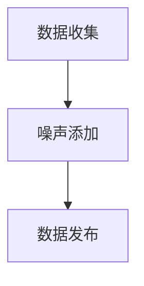
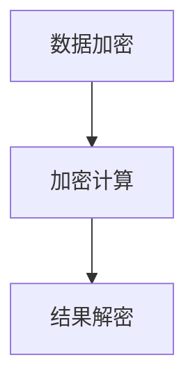
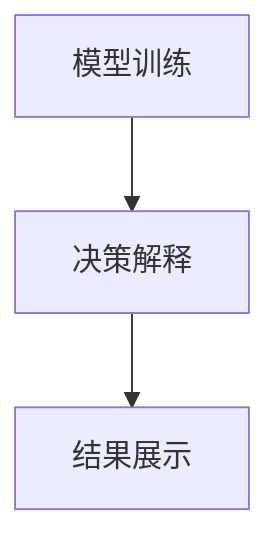
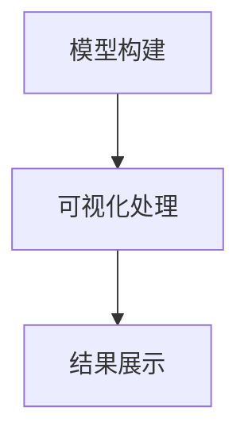

# AI相关法律法规原理与代码实战案例讲解

## 1.背景介绍

随着人工智能（AI）技术的迅猛发展，AI在各个领域的应用越来越广泛。然而，AI技术的快速发展也带来了许多法律和伦理问题。如何在技术创新和法律法规之间找到平衡，成为了当前亟待解决的重要课题。本文将深入探讨AI相关的法律法规原理，并通过具体的代码实战案例，帮助读者更好地理解和应用这些法律法规。

## 2.核心概念与联系

### 2.1 人工智能的定义与分类

人工智能是指通过计算机系统模拟人类智能的技术。根据功能和应用领域，AI可以分为以下几类：

- **弱人工智能（Narrow AI）**：专注于特定任务的AI，如语音识别、图像识别等。
- **强人工智能（General AI）**：具备人类智能水平的AI，能够执行任何人类可以完成的任务。
- **超人工智能（Super AI）**：超越人类智能的AI，具备自我意识和自主学习能力。

### 2.2 法律法规的基本概念

法律法规是指国家或地区制定的具有法律效力的规范性文件，用于规范社会行为和维护社会秩序。AI相关的法律法规主要包括以下几个方面：

- **数据隐私保护**：如《通用数据保护条例（GDPR）》。
- **算法透明性**：要求AI算法的决策过程透明可解释。
- **伦理与道德**：如AI的公平性、非歧视性等。
- **安全与责任**：如AI系统的安全性、责任归属等。

### 2.3 AI与法律法规的联系

AI技术的发展和应用离不开法律法规的规范。法律法规为AI技术的研发和应用提供了基本的行为准则，确保AI技术在合法、合规的前提下发展。同时，AI技术的发展也推动了法律法规的不断完善。

## 3.核心算法原理具体操作步骤

### 3.1 数据隐私保护算法

数据隐私保护是AI技术应用中的重要问题。常见的数据隐私保护算法包括差分隐私（Differential Privacy）和同态加密（Homomorphic Encryption）。

#### 3.1.1 差分隐私

差分隐私是一种保护数据隐私的技术，通过在数据中添加噪声，使得攻击者无法通过查询结果推断出单个数据的具体信息。其基本原理如下：

1. **数据收集**：收集用户数据。
2. **噪声添加**：在数据中添加噪声，使得查询结果具有不确定性。
3. **数据发布**：发布添加噪声后的数据。

Mermaid流程图如下：



#### 3.1.2 同态加密

同态加密是一种加密技术，允许在加密数据上进行计算，而无需解密数据。其基本原理如下：

1. **数据加密**：对原始数据进行加密。
2. **加密计算**：在加密数据上进行计算。
3. **结果解密**：对计算结果进行解密，得到最终结果。

Mermaid流程图如下：



### 3.2 算法透明性

算法透明性是指AI算法的决策过程应当透明可解释。常见的算法透明性技术包括可解释AI（Explainable AI, XAI）和模型可视化。

#### 3.2.1 可解释AI

可解释AI是指通过技术手段，使得AI算法的决策过程透明可解释。其基本原理如下：

1. **模型训练**：训练AI模型。
2. **决策解释**：通过技术手段解释模型的决策过程。
3. **结果展示**：展示解释结果。

Mermaid流程图如下：



#### 3.2.2 模型可视化

模型可视化是指通过可视化技术展示AI模型的结构和决策过程。其基本原理如下：

1. **模型构建**：构建AI模型。
2. **可视化处理**：对模型进行可视化处理。
3. **结果展示**：展示可视化结果。

Mermaid流程图如下：



## 4.数学模型和公式详细讲解举例说明

### 4.1 差分隐私的数学模型

差分隐私的数学模型可以通过以下公式表示：

$$
\epsilon = \log \left( \frac{P(M(D) \in S)}{P(M(D') \in S)} \right)
$$

其中，$M$ 是一个随机化算法，$D$ 和 $D'$ 是两个相邻的数据集，$S$ 是一个可能的输出集合，$\epsilon$ 是隐私预算。

### 4.2 同态加密的数学模型

同态加密的数学模型可以通过以下公式表示：

$$
E(m_1) \cdot E(m_2) = E(m_1 + m_2)
$$

其中，$E$ 是加密函数，$m_1$ 和 $m_2$ 是两个明文数据。

### 4.3 可解释AI的数学模型

可解释AI的数学模型可以通过以下公式表示：

$$
f(x) = \sum_{i=1}^{n} w_i \cdot x_i
$$

其中，$f$ 是AI模型的决策函数，$x$ 是输入数据，$w$ 是模型的权重。

## 5.项目实践：代码实例和详细解释说明

### 5.1 差分隐私的代码实例

以下是一个使用Python实现差分隐私的代码实例：

```python
import numpy as np

def add_noise(data, epsilon):
    noise = np.random.laplace(0, 1/epsilon, size=data.shape)
    return data + noise

data = np.array([1, 2, 3, 4, 5])
epsilon = 0.1
noisy_data = add_noise(data, epsilon)
print(noisy_data)
```

### 5.2 同态加密的代码实例

以下是一个使用Python实现同态加密的代码实例：

```python
from phe import paillier

public_key, private_key = paillier.generate_paillier_keypair()

data1 = 5
data2 = 10

encrypted_data1 = public_key.encrypt(data1)
encrypted_data2 = public_key.encrypt(data2)

encrypted_result = encrypted_data1 + encrypted_data2
result = private_key.decrypt(encrypted_result)
print(result)
```

### 5.3 可解释AI的代码实例

以下是一个使用Python实现可解释AI的代码实例：

```python
import shap
import xgboost

# 训练模型
X, y = shap.datasets.boston()
model = xgboost.XGBRegressor().fit(X, y)

# 解释模型
explainer = shap.Explainer(model)
shap_values = explainer(X)

# 可视化解释结果
shap.summary_plot(shap_values, X)
```

## 6.实际应用场景

### 6.1 数据隐私保护的应用场景

数据隐私保护在医疗、金融等领域具有重要应用。例如，在医疗领域，差分隐私可以用于保护患者数据隐私，确保数据在共享和分析过程中不泄露个人隐私。

### 6.2 算法透明性的应用场景

算法透明性在金融、司法等领域具有重要应用。例如，在金融领域，可解释AI可以用于解释信用评分模型的决策过程，确保模型的公平性和透明性。

### 6.3 同态加密的应用场景

同态加密在云计算、数据共享等领域具有重要应用。例如，在云计算领域，同态加密可以用于保护用户数据隐私，确保数据在云端计算过程中不被泄露。

## 7.工具和资源推荐

### 7.1 数据隐私保护工具

- **PySyft**：一个用于隐私保护机器学习的开源库，支持差分隐私和同态加密。
- **TensorFlow Privacy**：一个用于实现差分隐私的TensorFlow扩展库。

### 7.2 算法透明性工具

- **SHAP**：一个用于解释机器学习模型的开源库，支持多种模型的解释。
- **LIME**：一个用于解释机器学习模型的开源库，支持局部解释。

### 7.3 同态加密工具

- **PyCryptodome**：一个用于实现加密算法的Python库，支持多种加密算法。
- **Microsoft SEAL**：一个用于实现同态加密的开源库，支持多种同态加密算法。

## 8.总结：未来发展趋势与挑战

### 8.1 未来发展趋势

随着AI技术的不断发展，AI相关的法律法规也将不断完善。未来，AI技术将在更多领域得到应用，法律法规将更加注重数据隐私保护、算法透明性和伦理道德问题。同时，AI技术的发展也将推动法律法规的不断创新和进步。

### 8.2 挑战

AI技术的发展面临许多挑战，包括技术挑战和法律挑战。技术挑战主要包括数据隐私保护、算法透明性和安全性等问题。法律挑战主要包括法律法规的制定和实施、跨国法律协调等问题。解决这些挑战需要技术和法律的共同努力。

## 9.附录：常见问题与解答

### 9.1 什么是差分隐私？

差分隐私是一种保护数据隐私的技术，通过在数据中添加噪声，使得攻击者无法通过查询结果推断出单个数据的具体信息。

### 9.2 什么是同态加密？

同态加密是一种加密技术，允许在加密数据上进行计算，而无需解密数据。

### 9.3 什么是可解释AI？

可解释AI是指通过技术手段，使得AI算法的决策过程透明可解释。

### 9.4 AI相关的法律法规有哪些？

AI相关的法律法规主要包括数据隐私保护、算法透明性、伦理与道德、安全与责任等方面的法律法规。

### 9.5 如何在实际项目中应用AI相关的法律法规？

在实际项目中应用AI相关的法律法规，需要结合具体的应用场景，选择合适的技术和工具，确保AI技术在合法、合规的前提下应用。

---

作者：禅与计算机程序设计艺术 / Zen and the Art of Computer Programming