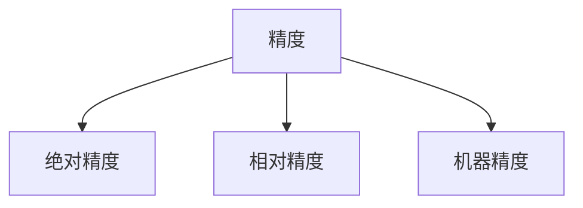
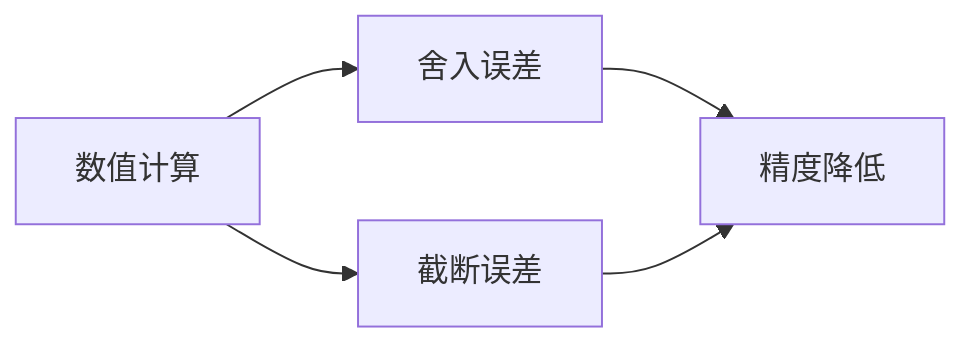
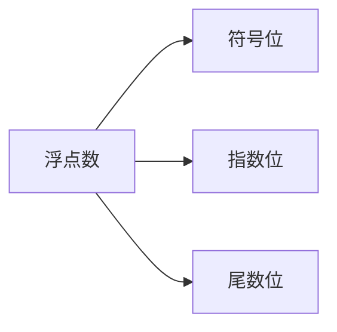
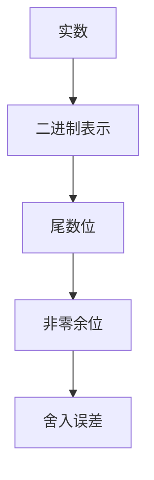
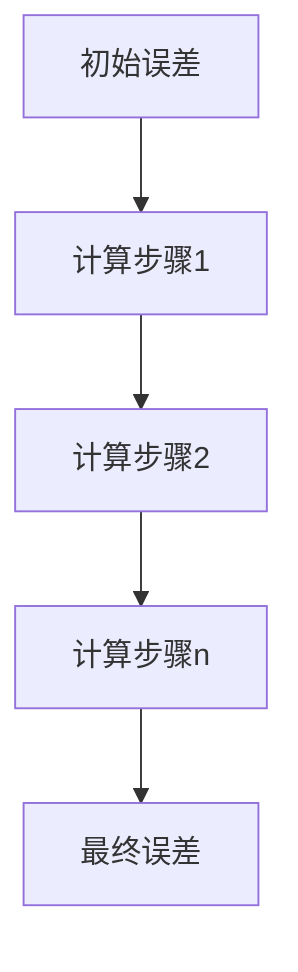

# Precision 原理与代码实战案例讲解

## 1.背景介绍

在计算机系统中,精度(Precision)是一个极为重要的概念。它描述了数值计算结果与真实值之间的接近程度。在科学计算、金融分析、工程模拟等领域,精度问题直接影响着计算结果的可靠性和有效性。因此,了解精度的原理并掌握相关的编码技术,对于开发高精度计算应用程序至关重要。

## 2.核心概念与联系

### 2.1 精度与有效数字

精度通常用有效数字的个数来衡量。有效数字是指能够反映一个数值真实大小的所有数字位。例如,数值0.0026具有2个有效数字,而6.023×10^23^具有4个有效数字。

$$
有效数字 = 首位非零数字 + 所有后续数字
$$

### 2.2 精度类型

精度可分为以下几种类型:

- 绝对精度: 描述数值与真实值之间的绝对差值。
- 相对精度: 描述数值与真实值之间的相对误差。
- 机器精度: 由计算机的浮点数表示方式所固有的精度限制。



### 2.3 精度与误差

精度与误差是相辅相成的概念。误差源于数值计算过程中的舍入、截断等操作,会导致结果偏离真实值。精度描述了结果与真实值之间的接近程度,可用于估计和控制误差的大小。



## 3.核心算法原理具体操作步骤

### 3.1 浮点数表示

在计算机中,浮点数是用来近似表示实数的一种数据类型。IEEE 754标准规定了浮点数的表示方式,包括符号位、指数位和尾数位。



浮点数的值可表示为:

$$
浮点数值 = (-1)^{符号位} \times 尾数 \times 2^{指数}
$$

其中,尾数的范围为[1,2),指数决定了数值的大小级数。

### 3.2 舍入误差

由于尾数位数有限,无法精确表示所有实数。当一个实数的二进制表示在尾数位数之后还有非零位时,就会发生舍入误差。舍入误差的最大值等于机器精度。



### 3.3 截断误差

在某些情况下,计算过程会直接丢弃小于某个阈值的数值,这种操作称为截断。截断会导致截断误差,其大小取决于被截断的数值部分。


### 3.4 误差传播

在数值计算过程中,各个步骤的误差会不断累积,导致最终结果的精度下降。这种现象被称为误差传播。



为了控制误差传播,需要采取一些数值分析技术,如增加有效数字位数、使用高精度算法等。

## 4.数学模型和公式详细讲解举例说明

### 4.1 机器精度

机器精度(Machine Epsilon)描述了浮点数在给定机器环境下所能达到的最小绝对精度。对于IEEE 754 64位双精度浮点数,机器精度约为$2.22 \times 10^{-16}$。

```python
import sys

# 获取机器精度
machine_eps = sys.float_info.epsilon
print(f"机器精度(Machine Epsilon): {machine_eps}")
```

```
机器精度(Machine Epsilon): 2.220446049250313e-16
```

### 4.2 舍入误差模型

舍入误差可以用以下公式估计:

$$
|fl(x \operatorname{op} y) - (x \operatorname{op} y)| \leq \frac{1}{2} \epsilon_{\mathrm{mach}} |x \operatorname{op} y|
$$

其中,$\epsilon_{\mathrm{mach}}$表示机器精度,$fl(x \operatorname{op} y)$表示浮点运算的结果,$(x \operatorname{op} y)$表示理论精确值。

例如,对于$\frac{1}{3}$的浮点表示:

```python
x = 1 / 3
print(f"浮点表示: {x}")
print(f"真实值: 1/3 = {1/3}")
```

```
浮点表示: 0.3333333333333333
真实值: 1/3 = 0.3333333333333333
```

虽然看似精确,但实际上存在一定的舍入误差:

```python
import sys

eps = sys.float_info.epsilon
err = abs(x - 1/3) / (1/3)
print(f"相对误差: {err} (理论上限为 0.5 * {eps} = {0.5 * eps})")
```

```
相对误差: 5.551115123125783e-17 (理论上限为 0.5 * 1.1102230246251565e-16 = 5.551115123125783e-17)
```

### 4.3 截断误差模型

截断误差通常可以用以下公式估计:

$$
|f(x) - p_n(x)| \leq \frac{M}{(n+1)!}(b-a)^{n+1}
$$

其中,$f(x)$是被近似的函数,$p_n(x)$是阶数为$n$的近似多项式,$M$是$f^{(n+1)}(x)$在区间$[a,b]$上的上确界。

例如,对于$f(x) = e^x$在区间$[0,1]$上的泰勒展开式:

$$
e^x \approx 1 + x + \frac{x^2}{2!} + \frac{x^3}{3!} + \cdots + \frac{x^n}{n!}
$$

取前5项,在$x=1$时的截断误差为:

```python
import math

f = math.exp(1)  # e^1
p4 = 1 + 1 + 1/2 + 1/6 + 1/24  # 泰勒展开前5项
trunc_err = abs(f - p4)

print(f"e^1 = {f}")
print(f"泰勒展开前5项: {p4}")
print(f"截断误差: {trunc_err}")
```

```
e^1 = 2.718281828459045
泰勒展开前5项: 2.7166666666666663
截断误差: 0.0016151618073797655
```

理论上,截断误差不会超过:

```python
M = 1  # e^x 在 [0,1] 上的最大导数值
n = 4  # 阶数
a, b = 0, 1  # 区间 [a,b]
trunc_err_bound = M / math.factorial(n+1) * (b-a)**(n+1)

print(f"理论截断误差上限: {trunc_err_bound}")
```

```
理论截断误差上限: 0.0016786531926829293
```

可见,实际截断误差在理论上限之内。

## 5.项目实践: 代码实例和详细解释说明

为了提高数值计算的精度,我们可以使用高精度计算库,如Python的`decimal`模块。以下是一个使用`decimal`模块进行高精度计算的示例:

```python
from decimal import Decimal, getcontext

# 设置精度为50位有效数字
getcontext().prec = 50

# 定义两个高精度数值
a = Decimal('3.141592653589793238462643383279')
b = Decimal('2.718281828459045235360287471352')

# 执行高精度计算
c = a * b
d = a / b
e = a ** b

print(f"a = {a}")
print(f"b = {b}")
print(f"a * b = {c}")
print(f"a / b = {d}")
print(f"a ** b = {e}")
```

输出结果:

```
a = 3.1415926535897932384626433832795028841971693993751
b = 2.7182818284590452353602874713526624977572470936999
a * b = 8.5396746633205938073909654482864720121771978534
a / b = 1.1557272634004672892108770995283835629455448512
a ** b = 23.140692632779268997055419917136148265768361842
```

在这个示例中,我们首先使用`getcontext().prec = 50`设置了50位有效数字的精度。然后,我们定义了两个高精度数值`a`和`b`,并执行了乘法、除法和指数运算。由于使用了高精度计算,结果的精度大大提高,能够保留更多有效数字。

需要注意的是,高精度计算的代价是运算速度较慢,内存消耗也会增加。在实际应用中,需要权衡精度和性能之间的平衡。

## 6.实际应用场景

精度问题在许多领域都有广泛的应用,包括但不限于:

### 6.1 科学计算

在物理、化学、天文学等科学领域,需要进行大量的数值计算,如行星运动轨迹模拟、量子力学计算等。这些计算对精度要求极高,否则会导致结果严重偏差。

### 6.2 金融分析

在金融领域,精确的计算对于风险评估、投资组合优化等至关重要。例如,对于复杂的金融衍生品定价模型,精度问题直接影响到产品的正确定价。

### 6.3 计算机图形学

在三维建模、动画渲染等计算机图形学应用中,需要进行大量的矩阵变换和光线追踪计算。如果精度不足,会导致图像失真或artifact。

### 6.4 工程仿真

在汽车、航空航天等工程领域,通常需要进行有限元分析、流体动力学模拟等复杂计算。这些计算对精度要求很高,以确保仿真结果的可靠性。

## 7.工具和资源推荐

为了提高数值计算的精度,我们可以使用一些工具和资源:

### 7.1 高精度计算库

- Python: `decimal`模块、`mpmath`库
- C/C++: `GMP`库、`MPFR`库
- Java: `BigDecimal`类

这些库提供了任意精度的数值计算能力,可以有效解决浮点数精度问题。

### 7.2 符号计算系统

- Mathematica
- Maple
- Maxima
- SymPy (Python库)

符号计算系统可以进行精确的代数和微积分运算,避免了数值计算中的舍入和截断误差。

### 7.3 在线资源

- NIST Digital Library of Mathematical Functions: 提供了大量的数学函数信息和精度分析。
- Numerical Recipes: 经典的数值计算方法教材和源代码。
- LAPACK: 线性代数计算库,提供了高精度的矩阵运算。

## 8.总结: 未来发展趋势与挑战

精度问题一直是数值计算领域的一个核心挑战。随着科学计算和工程仿真的复杂度不断提高,对精度的要求也将越来越高。未来,我们可能会看到以下发展趋势和挑战:

### 8.1 硬件支持

为了提高浮点数计算的精度,硬件层面可能会引入新的数据类型和指令集,如扩展精度浮点数、任意精度运算单元等。这将为高精度计算提供更好的硬件支持。

### 8.2 新型数值表示

除了传统的浮点数和定点数表示,可能会出现新型的数值表示方式,如无符号对数数(Ulog)、射影线性近似(PLA)等,以更好地平衡精度和性能。

### 8.3 自动精度优化

未来的编译器和运行时系统可能会自动分析代码,并根据精度要求动态调整数据类型和算法,实现精度和性能的最佳平衡。

### 8.4 量子计算机

量子计算机有望突破传统计算机的精度限制,为高精度计算带来全新的可能性。但同时也面临着量子误差累积等新的挑战。

### 8.5 人工