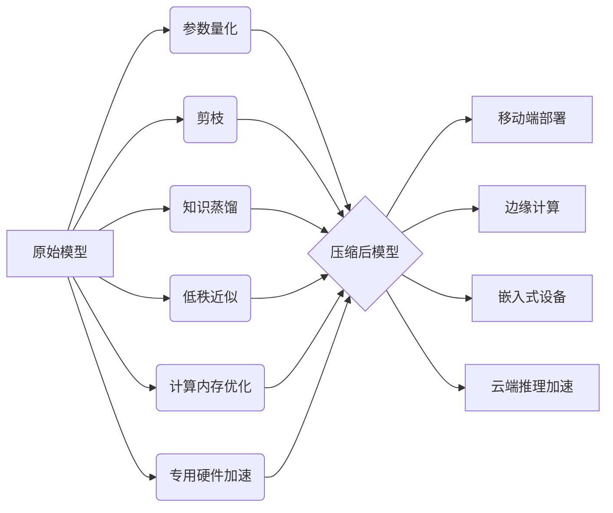

# 模型压缩与加速原理与代码实战案例讲解

## 1. 背景介绍
### 1.1 深度学习模型的发展趋势
### 1.2 模型压缩与加速的必要性
### 1.3 模型压缩与加速技术概览

## 2. 核心概念与联系
### 2.1 模型压缩
#### 2.1.1 参数量化
#### 2.1.2 剪枝
#### 2.1.3 知识蒸馏
### 2.2 模型加速
#### 2.2.1 低秩近似
#### 2.2.2 计算内存优化
#### 2.2.3 专用硬件加速
### 2.3 压缩与加速技术之间的关系

## 3. 核心算法原理具体操作步骤
### 3.1 参数量化算法
#### 3.1.1 均匀量化
#### 3.1.2 对数量化
#### 3.1.3 聚类量化
### 3.2 剪枝算法
#### 3.2.1 非结构化剪枝
#### 3.2.2 结构化剪枝
#### 3.2.3 动态剪枝
### 3.3 知识蒸馏算法
#### 3.3.1 软标签蒸馏
#### 3.3.2 特征图蒸馏
#### 3.3.3 关系蒸馏
### 3.4 低秩近似算法
#### 3.4.1 奇异值分解
#### 3.4.2 CP分解
#### 3.4.3 Tucker分解

## 4. 数学模型和公式详细讲解举例说明
### 4.1 参数量化数学模型
### 4.2 剪枝数学模型
### 4.3 知识蒸馏数学模型
### 4.4 低秩近似数学模型

## 5. 项目实践：代码实例和详细解释说明
### 5.1 参数量化代码实例
### 5.2 剪枝代码实例  
### 5.3 知识蒸馏代码实例
### 5.4 低秩近似代码实例

## 6. 实际应用场景
### 6.1 移动端部署
### 6.2 边缘计算
### 6.3 嵌入式设备
### 6.4 云端推理加速

## 7. 工具和资源推荐
### 7.1 模型压缩工具
### 7.2 模型加速工具
### 7.3 相关开源框架
### 7.4 学习资源

## 8. 总结：未来发展趋势与挑战
### 8.1 自动化压缩与加速
### 8.2 联邦学习中的压缩与加速
### 8.3 新硬件与压缩加速技术协同
### 8.4 压缩加速技术标准化

## 9. 附录：常见问题与解答
### 9.1 如何权衡压缩比和精度的平衡？
### 9.2 压缩后模型的部署流程是怎样的？
### 9.3 如何评估压缩加速后模型的性能？
### 9.4 未来还有哪些值得关注的研究方向？



深度学习技术的快速发展使得模型参数量和计算复杂度不断增加，给模型的实际部署带来了巨大挑战。模型压缩与加速技术应运而生，通过参数量化、剪枝、知识蒸馏等方法减小模型体积，降低计算量和内存占用，同时尽可能保持模型的精度。

参数量化将模型权重从浮点数映射到较低比特的定点数，常见的量化方法包括均匀量化、对数量化和聚类量化。以均匀量化为例，假设原始权重 $w$ 的范围为 $[w_{min}, w_{max}]$，量化后的权重 $q$ 可表示为：

$$
q=round(\frac{w-w_{min}}{s})
$$

其中，$s=\frac{w_{max}-w_{min}}{2^b-1}$ 为量化步长，$b$ 为量化位宽。量化后的权重可以用更少的比特表示，减小了模型体积。

剪枝通过移除冗余和不重要的参数来压缩模型。常见的剪枝方法有非结构化剪枝、结构化剪枝和动态剪枝。非结构化剪枝独立地对每个参数进行筛选，保留绝对值大的权重。假设 $\mathbf{w}$ 为待剪枝层的权重向量，$\lambda$ 为剪枝阈值，剪枝后的权重 $\mathbf{w}_{pruned}$ 为：

$$
w_{pruned}^{(i)}=\begin{cases}
w^{(i)}, & \text{if }|w^{(i)}|>\lambda \\
0, & \text{otherwise}
\end{cases}
$$

知识蒸馏利用大模型(教师模型)的知识来指导小模型(学生模型)的训练。学生模型不仅要拟合真实标签，还要拟合教师模型的软标签。软标签包含了类别之间的相似性信息，有助于提高学生模型的性能。学生模型的损失函数可以表示为：

$$
\mathcal{L}=(1-\alpha)\mathcal{L}_{CE}(y_{true},p_{s})+\alpha \mathcal{L}_{KL}(p_{t}^{\tau},p_{s}^{\tau})
$$

其中，$\mathcal{L}_{CE}$ 为学生模型与真实标签的交叉熵损失，$\mathcal{L}_{KL}$ 为学生模型与教师模型软标签的KL散度损失，$\alpha$ 为平衡因子，$\tau$ 为温度系数。

低秩近似利用矩阵或张量分解，将大的参数矩阵分解为多个小矩阵的乘积，减小模型体积和计算量。以奇异值分解(SVD)为例，对于权重矩阵 $\mathbf{W} \in \mathbb{R}^{m \times n}$，SVD分解为：

$$
\mathbf{W}=\mathbf{U}\mathbf{\Sigma}\mathbf{V}^T
$$

其中，$\mathbf{U} \in \mathbb{R}^{m \times m}$ 和 $\mathbf{V} \in \mathbb{R}^{n \times n}$ 为正交矩阵，$\mathbf{\Sigma} \in \mathbb{R}^{m \times n}$ 为对角矩阵。取前 $r$ 个最大奇异值，得到近似矩阵：

$$
\mathbf{W} \approx \mathbf{U}_r\mathbf{\Sigma}_r\mathbf{V}_r^T
$$

下面是一个PyTorch实现参数量化的代码示例：

```python
import torch
import torch.nn as nn

class QLinear(nn.Linear):
    def __init__(self, in_features, out_features, bias=True, bits=8):
        super().__init__(in_features, out_features, bias)
        self.bits = bits
        self.scale = None
        self.zero_point = None
        
    def forward(self, x):
        if self.scale is None:
            self.scale = 2 ** (self.bits - 1) / torch.max(torch.abs(self.weight))
            self.zero_point = torch.round(torch.max(torch.abs(self.weight)) * (2 ** (self.bits - 1) - 1))
        
        qweight = torch.round(self.weight * self.scale + self.zero_point)
        qweight = torch.clamp(qweight, 0, 2 ** self.bits - 1)
        qweight = (qweight - self.zero_point) / self.scale
        
        return nn.functional.linear(x, qweight, self.bias)
```

在上述代码中，我们定义了一个量化的线性层`QLinear`，它继承自`nn.Linear`。在前向传播时，我们首先计算量化参数`scale`和`zero_point`，然后对权重进行量化、截断和反量化，最后调用`nn.functional.linear`进行线性变换。

模型压缩与加速技术在移动端部署、边缘计算、嵌入式设备等资源受限的场景下具有广泛的应用。未来的研究方向包括自动化压缩与加速、联邦学习中的压缩与加速、新硬件与压缩加速技术的协同等。

在实践中，我们需要权衡压缩比和精度的平衡，选择合适的压缩方法和超参数。压缩后的模型部署流程通常包括模型转换、量化参数校准、推理引擎集成等步骤。评估压缩加速后模型的性能需要考虑模型尺寸、推理速度、能耗等多个指标。

总之，模型压缩与加速技术是深度学习模型实际应用中不可或缺的一部分，它们可以显著降低模型存储和计算开销，促进深度学习在各个领域的落地。未来还有许多值得探索的研究方向，如何设计更有效的压缩算法，如何将压缩技术与新硬件结合，如何实现自动化的模型压缩等，都是亟待解决的问题。

作者：禅与计算机程序设计艺术 / Zen and the Art of Computer Programming