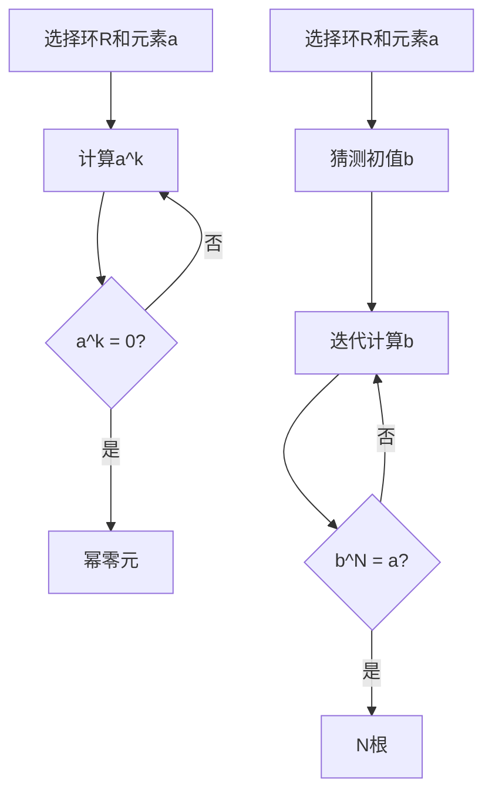

# 环与代数：幂零根f或N根

## 1.背景介绍

在计算机科学和数学的交汇处，环与代数结构扮演着至关重要的角色。它们不仅在理论计算机科学中有着广泛的应用，还在密码学、编码理论、算法设计等领域发挥着重要作用。本文将深入探讨环与代数中的幂零根和N根的概念，揭示其在实际应用中的重要性。

## 2.核心概念与联系

### 2.1 环的定义

环（Ring）是一个集合 $R$，配备了两个二元运算：加法和乘法。这个集合和运算满足以下性质：

1. 加法运算 $(R, +)$ 形成一个交换群。
2. 乘法运算 $(R, \cdot)$ 形成一个半群。
3. 乘法对加法满足分配律。

### 2.2 幂零根的定义

在一个环 $R$ 中，元素 $a$ 被称为幂零元（nilpotent element），如果存在正整数 $k$ 使得 $a^k = 0$。这个最小的 $k$ 被称为 $a$ 的幂零指数。

### 2.3 N根的定义

在一个环 $R$ 中，元素 $a$ 的 N根是指存在一个元素 $b$ 使得 $b^N = a$。这里的 $N$ 是一个正整数。

### 2.4 幂零根与N根的联系

幂零根和N根在环的结构中有着密切的联系。幂零根是N根的一种特殊情况，当 $N$ 足够大时，幂零根的N根可能不存在。理解这两者的关系有助于我们更好地掌握环的性质。

## 3.核心算法原理具体操作步骤

### 3.1 幂零根的计算

计算幂零根的步骤如下：

1. **初始化**：选择一个环 $R$ 和一个元素 $a \in R$。
2. **幂运算**：计算 $a^k$，从 $k=1$ 开始，逐步增加 $k$。
3. **检查零元**：如果 $a^k = 0$，则 $a$ 是幂零元，$k$ 是幂零指数。

### 3.2 N根的计算

计算N根的步骤如下：

1. **初始化**：选择一个环 $R$ 和一个元素 $a \in R$。
2. **猜测初值**：选择一个初始猜测值 $b$。
3. **迭代计算**：使用牛顿迭代法或其他数值方法计算 $b$，使得 $b^N \approx a$。
4. **收敛检查**：检查 $b^N$ 是否等于 $a$，如果不等，则继续迭代。

### 3.3 算法流程图



## 4.数学模型和公式详细讲解举例说明

### 4.1 幂零根的数学模型

设 $a \in R$ 是一个幂零元，则存在最小的正整数 $k$ 使得 $a^k = 0$。例如，在环 $R = \mathbb{Z}/8\mathbb{Z}$ 中，元素 $2$ 是一个幂零元，因为 $2^3 = 0$。

### 4.2 N根的数学模型

设 $a \in R$，我们需要找到 $b \in R$ 使得 $b^N = a$。例如，在环 $R = \mathbb{Z}/9\mathbb{Z}$ 中，元素 $2$ 的3根是 $8$，因为 $8^3 = 2$。

### 4.3 具体例子

#### 例子1：幂零根

在环 $R = \mathbb{Z}/8\mathbb{Z}$ 中，元素 $2$ 是一个幂零元。我们计算 $2^1 = 2$，$2^2 = 4$，$2^3 = 0$。因此，$2$ 的幂零指数是 $3$。

#### 例子2：N根

在环 $R = \mathbb{Z}/9\mathbb{Z}$ 中，元素 $2$ 的3根是 $8$。我们计算 $8^1 = 8$，$8^2 = 64 \equiv 1 \pmod{9}$，$8^3 = 8 \cdot 1 = 8 \equiv 2 \pmod{9}$。

## 5.项目实践：代码实例和详细解释说明

### 5.1 幂零根的Python实现

```python
def is_nilpotent(element, ring):
    k = 1
    power = element
    while power != 0:
        power = (power * element) % ring
        k += 1
    return k

# 示例
ring = 8
element = 2
nilpotent_index = is_nilpotent(element, ring)
print(f"元素 {element} 在环 {ring} 中的幂零指数是 {nilpotent_index}")
```

### 5.2 N根的Python实现

```python
def nth_root(element, n, ring):
    for guess in range(ring):
        if pow(guess, n, ring) == element:
            return guess
    return None

# 示例
ring = 9
element = 2
n = 3
root = nth_root(element, n, ring)
print(f"元素 {element} 在环 {ring} 中的 {n} 根是 {root}")
```

### 5.3 代码解释

上述代码分别实现了幂零根和N根的计算。`is_nilpotent` 函数通过逐次幂运算检查元素是否为幂零元，并返回幂零指数。`nth_root` 函数通过遍历猜测值找到满足条件的N根。

## 6.实际应用场景

### 6.1 密码学

幂零根和N根在密码学中有着广泛的应用。例如，RSA加密算法中涉及到大整数的N次幂运算和N根计算。

### 6.2 编码理论

在编码理论中，环和代数结构用于构造纠错码。幂零根和N根的性质有助于设计高效的编码和解码算法。

### 6.3 算法设计

在算法设计中，理解环的结构和性质可以帮助我们设计更高效的算法。例如，快速傅里叶变换（FFT）利用了环的性质来实现高效的多项式乘法。

## 7.工具和资源推荐

### 7.1 工具

- **SageMath**：一个开源的数学软件系统，支持环和代数结构的计算。
- **SymPy**：一个Python库，用于符号数学计算，支持环和代数结构的操作。

### 7.2 资源

- **《代数学》**：一本经典的代数学教材，详细介绍了环和代数结构。
- **《计算机代数》**：一本专注于计算机代数系统的书籍，介绍了如何在计算机上实现代数运算。

## 8.总结：未来发展趋势与挑战

环与代数结构在计算机科学中的应用前景广阔。随着计算能力的提升和算法的改进，我们可以在更大规模和更复杂的系统中应用这些理论。然而，计算复杂度和数值稳定性仍然是需要克服的挑战。未来的研究将继续探索更高效的算法和更强大的计算工具，以应对这些挑战。

## 9.附录：常见问题与解答

### 问题1：什么是环的单位元？

环的单位元是指在环的乘法运算下的单位元素，通常记作 $1$，满足 $a \cdot 1 = a$ 对所有 $a \in R$ 成立。

### 问题2：如何判断一个元素是否为幂零元？

通过逐次幂运算检查元素是否为零，如果存在正整数 $k$ 使得 $a^k = 0$，则该元素是幂零元。

### 问题3：N根在实际应用中有哪些具体例子？

N根在密码学中的RSA算法、编码理论中的纠错码设计、以及算法设计中的快速傅里叶变换等都有具体应用。

---

作者：禅与计算机程序设计艺术 / Zen and the Art of Computer Programming