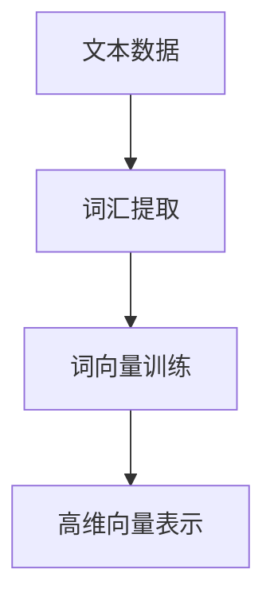
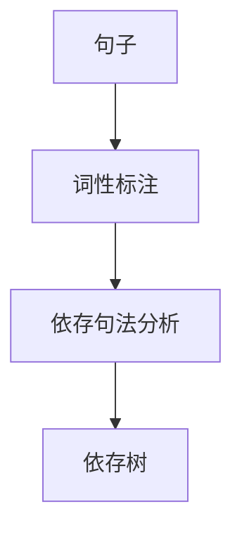
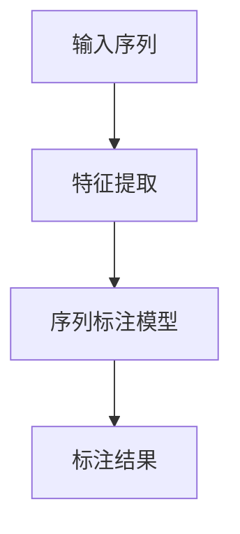
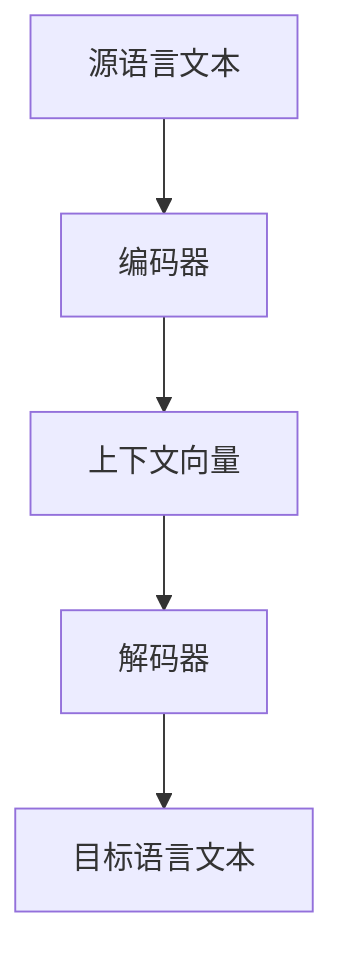

# 自然语言处理(Natural Language Processing)原理与代码实战案例讲解

## 1.背景介绍

自然语言处理（Natural Language Processing，简称NLP）是人工智能和计算语言学的一个重要分支，旨在实现计算机对人类语言的理解、生成和处理。随着大数据和深度学习技术的发展，NLP在过去十年中取得了显著的进步，广泛应用于搜索引擎、智能助手、翻译系统、情感分析等领域。

NLP的核心目标是使计算机能够理解和生成自然语言，从而实现人机交互的智能化。本文将深入探讨NLP的核心概念、算法原理、数学模型，并通过实际代码实例展示其应用。

## 2.核心概念与联系

### 2.1 词汇与语法

词汇是语言的基本单位，语法则是词汇组合成句子的规则。NLP的基础任务之一是词汇和语法的解析，包括词性标注、句法分析等。

### 2.2 语义与语用

语义是语言的意义，语用则是语言在特定上下文中的使用。NLP需要理解词汇和句子的语义，并根据上下文进行适当的解释和生成。

### 2.3 统计与机器学习

现代NLP大量依赖统计方法和机器学习技术，通过大规模数据训练模型，实现对语言的理解和生成。常用的技术包括词向量、神经网络、深度学习等。

### 2.4 语言模型

语言模型是NLP的核心组件之一，用于预测句子中词汇的概率分布。常见的语言模型包括n-gram模型、循环神经网络（RNN）、长短期记忆网络（LSTM）和Transformer等。

## 3.核心算法原理具体操作步骤

### 3.1 词向量表示

词向量是将词汇映射到高维向量空间的表示方法，常用的算法包括Word2Vec、GloVe和FastText。词向量能够捕捉词汇之间的语义关系。



### 3.2 句法分析

句法分析是解析句子结构的过程，常用的算法包括依存句法分析和成分句法分析。依存句法分析通过构建依存树表示句子的语法结构。



### 3.3 序列标注

序列标注是对序列中的每个元素进行标注的任务，常用于命名实体识别（NER）、词性标注等。常用的模型包括条件随机场（CRF）和双向LSTM-CRF。



### 3.4 机器翻译

机器翻译是将一种语言的文本翻译成另一种语言的任务，常用的模型包括基于统计的机器翻译（SMT）和神经机器翻译（NMT）。NMT通常采用编码器-解码器结构。



## 4.数学模型和公式详细讲解举例说明

### 4.1 词向量模型

词向量模型通过优化目标函数，将词汇映射到高维向量空间。以Word2Vec中的Skip-gram模型为例，其目标是最大化上下文词汇的条件概率：

$$
\max \prod_{t=1}^{T} \prod_{-c \leq j \leq c, j \neq 0} P(w_{t+j} | w_t)
$$

其中，$w_t$ 是中心词，$w_{t+j}$ 是上下文词，$c$ 是上下文窗口大小。

### 4.2 条件随机场（CRF）

CRF是一种用于序列标注的概率图模型，其目标是最大化标注序列的条件概率：

$$
P(y|x) = \frac{1}{Z(x)} \exp \left( \sum_{t=1}^{T} \sum_{k} \lambda_k f_k(y_{t-1}, y_t, x, t) \right)
$$

其中，$x$ 是输入序列，$y$ 是标注序列，$f_k$ 是特征函数，$\lambda_k$ 是特征权重，$Z(x)$ 是归一化因子。

### 4.3 编码器-解码器模型

编码器-解码器模型用于机器翻译等序列到序列的任务。编码器将源语言序列编码为上下文向量，解码器根据上下文向量生成目标语言序列。其目标是最大化目标序列的条件概率：

$$
P(y|x) = \prod_{t=1}^{T} P(y_t | y_{<t}, x)
$$

其中，$x$ 是源语言序列，$y$ 是目标语言序列。

## 5.项目实践：代码实例和详细解释说明

### 5.1 词向量训练

以下是使用Gensim库训练Word2Vec词向量的示例代码：

```python
from gensim.models import Word2Vec

# 训练数据
sentences = [["I", "love", "natural", "language", "processing"],
             ["NLP", "is", "fun", "and", "challenging"]]

# 训练Word2Vec模型
model = Word2Vec(sentences, vector_size=100, window=5, min_count=1, workers=4)

# 获取词向量
vector = model.wv['natural']
print(vector)
```

### 5.2 依存句法分析

以下是使用spaCy库进行依存句法分析的示例代码：

```python
import spacy

# 加载预训练模型
nlp = spacy.load("en_core_web_sm")

# 解析句子
doc = nlp("I love natural language processing")

# 打印依存关系
for token in doc:
    print(f"{token.text} -> {token.dep_} -> {token.head.text}")
```

### 5.3 命名实体识别

以下是使用Hugging Face的Transformers库进行命名实体识别的示例代码：

```python
from transformers import pipeline

# 加载预训练模型
nlp = pipeline("ner")

# 识别命名实体
text = "Hugging Face Inc. is a company based in New York City."
entities = nlp(text)
print(entities)
```

### 5.4 神经机器翻译

以下是使用TensorFlow实现简单的编码器-解码器模型进行机器翻译的示例代码：

```python
import tensorflow as tf
from tensorflow.keras.layers import Embedding, LSTM, Dense
from tensorflow.keras.models import Model

# 编码器
class Encoder(Model):
    def __init__(self, vocab_size, embedding_dim, enc_units, batch_sz):
        super(Encoder, self).__init__()
        self.batch_sz = batch_sz
        self.enc_units = enc_units
        self.embedding = Embedding(vocab_size, embedding_dim)
        self.lstm = LSTM(self.enc_units, return_sequences=True, return_state=True)

    def call(self, x, hidden):
        x = self.embedding(x)
        output, state = self.lstm(x, initial_state=hidden)
        return output, state

# 解码器
class Decoder(Model):
    def __init__(self, vocab_size, embedding_dim, dec_units, batch_sz):
        super(Decoder, self).__init__()
        self.batch_sz = batch_sz
        self.dec_units = dec_units
        self.embedding = Embedding(vocab_size, embedding_dim)
        self.lstm = LSTM(self.dec_units, return_sequences=True, return_state=True)
        self.fc = Dense(vocab_size)

    def call(self, x, hidden, enc_output):
        x = self.embedding(x)
        output, state = self.lstm(x, initial_state=hidden)
        x = self.fc(output)
        return x, state

# 示例数据
vocab_size = 10000
embedding_dim = 256
units = 1024
batch_size = 64

encoder = Encoder(vocab_size, embedding_dim, units, batch_size)
decoder = Decoder(vocab_size, embedding_dim, units, batch_size)

# 编码器输入
sample_input = tf.random.uniform((batch_size, 16))
sample_hidden = [tf.zeros((batch_size, units))]

# 编码器输出
enc_output, enc_hidden = encoder(sample_input, sample_hidden)

# 解码器输入
sample_decoder_input = tf.random.uniform((batch_size, 16))

# 解码器输出
dec_output, _ = decoder(sample_decoder_input, enc_hidden, enc_output)
print(dec_output.shape)
```

## 6.实际应用场景

### 6.1 搜索引擎

NLP在搜索引擎中广泛应用，包括查询理解、文档检索、排序等。通过NLP技术，搜索引擎能够更准确地理解用户意图，提供更相关的搜索结果。

### 6.2 智能助手

智能助手如Siri、Alexa等依赖NLP技术进行语音识别、自然语言理解和生成。NLP使得智能助手能够与用户进行自然对话，提供信息查询、任务执行等服务。

### 6.3 机器翻译

机器翻译系统如Google Translate使用NLP技术将一种语言的文本翻译成另一种语言。通过NLP模型，机器翻译系统能够处理多种语言，提供高质量的翻译服务。

### 6.4 情感分析

情感分析是通过NLP技术分析文本中的情感倾向，广泛应用于社交媒体监控、市场调研等领域。通过情感分析，企业能够了解用户情感，优化产品和服务。

## 7.工具和资源推荐

### 7.1 编程语言和库

- **Python**：NLP领域最常用的编程语言，拥有丰富的库和工具。
- **NLTK**：自然语言处理工具包，提供多种NLP任务的实现。
- **spaCy**：高效的NLP库，支持多种语言的处理。
- **Gensim**：用于训练词向量和主题模型的库。
- **Transformers**：Hugging Face提供的预训练模型库，支持多种NLP任务。

### 7.2 数据集

- **Penn Treebank**：包含大量标注的英语文本数据，广泛用于NLP研究。
- **CoNLL-2003**：命名实体识别任务的标准数据集。
- **SQuAD**：问答系统的数据集，包含大量问答对。

### 7.3 在线资源

- **Coursera**：提供多种NLP相关的在线课程。
- **Kaggle**：数据科学竞赛平台，提供丰富的NLP数据集和竞赛。
- **arXiv**：预印本服务器，包含大量NLP领域的最新研究论文。

## 8.总结：未来发展趋势与挑战

### 8.1 发展趋势

- **预训练模型**：预训练模型如BERT、GPT等在NLP任务中表现出色，未来将继续发展，提升NLP系统的性能。
- **多语言处理**：随着全球化的发展，多语言处理将成为NLP的重要方向，研究多语言模型和跨语言迁移学习。
- **人机交互**：NLP在智能助手、聊天机器人等人机交互领域的应用将不断扩大，提升用户体验。

### 8.2 挑战

- **数据隐私**：NLP系统需要处理大量用户数据，如何保护数据隐私是一个重要挑战。
- **模型解释性**：深度学习模型的黑箱特性使得其解释性较差，如何提升模型的可解释性是一个研究热点。
- **资源消耗**：训练大型NLP模型需要大量计算资源和时间，如何优化模型训练过程，降低资源消耗是一个重要问题。

## 9.附录：常见问题与解答

### 9.1 什么是词向量？

词向量是将词汇映射到高维向量空间的表示方法，能够捕捉词汇之间的语义关系。常用的词向量模型包括Word2Vec、GloVe和FastText。

### 9.2 如何进行句法分析？

句法分析是解析句子结构的过程，常用的算法包括依存句法分析和成分句法分析。可以使用spaCy等NLP库进行句法分析。

### 9.3 什么是命名实体识别？

命名实体识别是识别文本中命名实体（如人名、地名、组织名等）的任务，常用的模型包括条件随机场（CRF）和双向LSTM-CRF。

### 9.4 如何实现机器翻译？

机器翻译是将一种语言的文本翻译成另一种语言的任务，常用的模型包括基于统计的机器翻译（SMT）和神经机器翻译（NMT）。可以使用TensorFlow等深度学习框架实现机器翻译模型。

### 9.5 NLP的未来发展趋势是什么？

NLP的未来发展趋势包括预训练模型、多语言处理和人机交互等方向。预训练模型如BERT、GPT等在NLP任务中表现出色，多语言处理和人机交互将成为NLP的重要应用领域。

---

作者：禅与计算机程序设计艺术 / Zen and the Art of Computer Programming