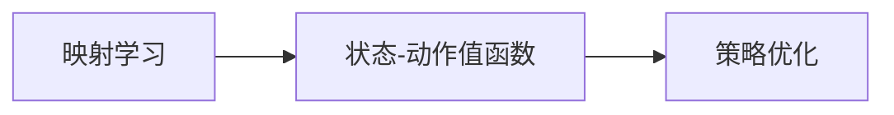

# 一切皆是映射：使用DQN解决实时决策问题：系统响应与优化

> 关键词：深度强化学习，DQN，系统响应，实时决策，映射学习，策略优化

## 1. 背景介绍
### 1.1 问题的由来

在现代社会，随着信息技术的飞速发展，系统响应和实时决策已经成为各个领域不可或缺的部分。从智能交通系统到智能电网，从金融服务到智能医疗，实时决策系统无处不在。然而，现实世界中的决策问题往往复杂多变，涉及大量的状态空间和动作空间，使得传统的方法难以有效应对。

深度强化学习（Deep Reinforcement Learning，DRL）作为一种新兴的人工智能技术，为解决实时决策问题提供了一种新的思路。DRL通过学习环境中的状态-动作-奖励映射，使得智能体能够在没有人类干预的情况下，自主地学习到最优策略，从而实现复杂的实时决策。

### 1.2 研究现状

近年来，DRL在解决实时决策问题上取得了显著的进展。其中，深度Q网络（Deep Q-Network，DQN）因其简洁有效而被广泛应用。DQN通过深度神经网络学习状态-动作值函数，实现智能体的决策优化。

### 1.3 研究意义

DQN在解决实时决策问题上的研究具有重要的理论和实际意义：

1. **理论意义**：DQN为深度强化学习在实时决策领域的应用提供了新的思路和方法，推动了深度强化学习理论的发展。
2. **实际意义**：DQN能够帮助解决复杂系统的实时决策问题，提高系统响应速度和决策质量，具有广泛的应用前景。

### 1.4 本文结构

本文将从以下方面对DQN解决实时决策问题进行探讨：

1. **核心概念与联系**：介绍DQN、映射学习、策略优化等相关概念，并分析它们之间的关系。
2. **核心算法原理 & 具体操作步骤**：详细讲解DQN的算法原理和具体操作步骤，包括状态-动作值函数的学习、探索策略的选择、目标网络的设计等。
3. **数学模型和公式 & 详细讲解 & 举例说明**：从数学角度对DQN进行阐述，包括状态-动作值函数的表示、损失函数的构建等。
4. **项目实践：代码实例和详细解释说明**：通过具体案例展示DQN在实时决策问题上的应用，并对代码进行解读和分析。
5. **实际应用场景**：探讨DQN在智能交通、智能电网、金融服务、智能医疗等领域的应用。
6. **工具和资源推荐**：推荐DQN相关的学习资源、开发工具和论文。
7. **总结**：总结DQN在解决实时决策问题上的研究成果，展望未来发展趋势和挑战。

## 2. 核心概念与联系

### 2.1 DQN

DQN是一种基于深度神经网络的强化学习算法，由DeepMind团队在2015年提出。DQN通过学习状态-动作值函数，实现对环境的预测和决策。

### 2.2 映射学习

映射学习是指学习环境中的状态-动作-奖励映射，即学习如何根据当前状态选择动作，以及如何评估动作带来的奖励。

### 2.3 策略优化

策略优化是指根据学习到的状态-动作值函数，选择最优动作，从而实现决策优化。

这三个概念之间的关系如下：



## 3. 核心算法原理 & 具体操作步骤

### 3.1 算法原理概述

DQN通过深度神经网络学习状态-动作值函数 $Q(s,a)$，其中 $s$ 表示当前状态，$a$ 表示动作。状态-动作值函数 $Q(s,a)$ 表示在状态 $s$ 下执行动作 $a$ 后，从当前状态转移到下一个状态 $s'$ 的期望回报。

### 3.2 算法步骤详解

DQN的算法步骤如下：

1. 初始化Q网络和目标Q网络，两个网络具有相同的结构和参数，但参数不一致。
2. 初始化经验回放记忆池，用于存储经验样本。
3. 选择初始状态 $s$，根据探索策略选择动作 $a$。
4. 执行动作 $a$，获得奖励 $r$ 和下一个状态 $s'$。
5. 将经验样本 $(s,a,r,s')$ 存入经验回放记忆池。
6. 从经验回放记忆池中随机抽取一批经验样本。
7. 使用当前Q网络计算预测值 $Q(s,a)$ 和目标值 $Q(s',\max_a Q(s',a))$。
8. 计算损失函数 $L(Q(s,a),r+\gamma Q(s',\max_a Q(s',a)))$，其中 $\gamma$ 为折扣因子。
9. 使用梯度下降算法更新当前Q网络的参数。
10. 将目标Q网络的参数复制到当前Q网络。
11. 重复步骤3-10，直到满足停止条件。

### 3.3 算法优缺点

**优点**：

1. 简洁有效：DQN算法结构简单，易于实现。
2. 自主性强：DQN能够自主地从环境中学习到最优策略，无需人工干预。
3. 广泛适用：DQN可以应用于各种强化学习问题。

**缺点**：

1. 收敛速度慢：DQN的收敛速度较慢，需要大量的训练数据。
2. 过度探索：DQN在训练初期容易过度探索，导致学习效率低下。

### 3.4 算法应用领域

DQN在以下领域具有广泛的应用：

1. **智能控制**：如自动驾驶、机器人控制等。
2. **游戏**：如围棋、电子竞技等。
3. **资源管理**：如电力系统、通信网络等。

## 4. 数学模型和公式 & 详细讲解 & 举例说明

### 4.1 数学模型构建

DQN的数学模型如下：

$$
Q(s,a;\theta) = \sum_{s'} \pi(s'|s,a) \max_{a'} Q(s',a';\theta)
$$

其中，$Q(s,a;\theta)$ 表示在状态 $s$ 下执行动作 $a$ 后，从当前状态转移到下一个状态 $s'$ 的期望回报，$\theta$ 表示Q网络的参数，$\pi(s'|s,a)$ 表示在状态 $s$ 下执行动作 $a$ 后，转移到状态 $s'$ 的概率。

### 4.2 公式推导过程

DQN的目标是学习状态-动作值函数 $Q(s,a;\theta)$。假设 $Q(s,a;\theta)$ 可以通过深度神经网络学习得到，即：

$$
Q(s,a;\theta) = f(W(s,a;\theta))
$$

其中，$W(s,a;\theta)$ 表示输入为状态 $s$ 和动作 $a$，输出为状态-动作值函数 $Q(s,a;\theta)$ 的神经网络。

### 4.3 案例分析与讲解

以下是一个简单的DQN案例，演示如何使用TensorFlow实现DQN。

```python
import tensorflow as tf
import numpy as np

class DQN:
    def __init__(self, state_size, action_size, learning_rate=0.01):
        self.state_size = state_size
        self.action_size = action_size
        self.learning_rate = learning_rate
        self.model = self.create_model()
        self.target_model = self.create_model()
        self.memory = []
        self.epsilon = 1.0
        self.epsilon_min = 0.01
        self.epsilon_decay = 0.995
        self.gamma = 0.95

    def create_model(self):
        model = tf.keras.Sequential([
            tf.keras.layers.Dense(24, input_dim=self.state_size, activation='relu'),
            tf.keras.layers.Dense(24, activation='relu'),
            tf.keras.layers.Dense(self.action_size, activation='linear')
        ])
        model.compile(loss='mse', optimizer=tf.keras.optimizers.Adam(lr=self.learning_rate))
        return model

    def remember(self, state, action, reward, next_state, done):
        self.memory.append((state, action, reward, next_state, done))

    def act(self, state):
        if np.random.rand() <= self.epsilon:
            return np.random.randint(self.action_size)
        act_values = self.model.predict(state)
        return np.argmax(act_values[0])

    def replay(self, batch_size):
        minibatch = random.sample(self.memory, batch_size)
        for state, action, reward, next_state, done in minibatch:
            target = reward
            if not done:
                target = reward + self.gamma * np.amax(self.target_model.predict(next_state)[0])
            target_f = self.model.predict(state)
            target_f[0][action] = target
            self.model.fit(state, target_f, epochs=1, verbose=0)
        if self.epsilon > self.epsilon_min:
            self.epsilon *= self.epsilon_decay

# 创建DQN实例
dqn = DQN(state_size, action_size)

# 训练DQN
for episode in range(1000):
    state = env.reset()
    state = np.reshape(state, (1, state_size))
    for time in range(500):
        action = dqn.act(state)
        next_state, reward, done, _ = env.step(action)
        next_state = np.reshape(next_state, (1, state_size))
        dqn.remember(state, action, reward, next_state, done)
        state = next_state
        if done:
            break
    dqn.replay(32)
```

### 4.4 常见问题解答

**Q1：DQN如何解决连续动作问题？**

A：对于连续动作问题，可以使用连续动作空间中的采样方法，如均匀采样、正态分布采样等，将连续动作空间映射到离散动作空间。

**Q2：DQN如何处理稀疏奖励问题？**

A：对于稀疏奖励问题，可以采用如下策略：
1. 使用重要性采样，对高奖励样本进行加权。
2. 使用延迟奖励，将未来的奖励折算到当前时刻的奖励。
3. 使用累积奖励，将一系列动作的奖励进行累加。

## 5. 项目实践：代码实例和详细解释说明
### 5.1 开发环境搭建

以下是使用Python和TensorFlow实现DQN的开发环境搭建步骤：

1. 安装Python 3.7及以上版本。
2. 安装TensorFlow 2.x。
3. 安装NumPy、Gym等依赖库。

### 5.2 源代码详细实现

以下是一个使用TensorFlow实现DQN的简单示例：

```python
import tensorflow as tf
import numpy as np
import random

# 定义DQN类
class DQN:
    def __init__(self, state_size, action_size, learning_rate=0.01):
        self.state_size = state_size
        self.action_size = action_size
        self.learning_rate = learning_rate
        self.model = self.create_model()
        self.target_model = self.create_model()
        self.memory = []

    # 创建模型
    def create_model(self):
        model = tf.keras.Sequential([
            tf.keras.layers.Dense(24, input_dim=self.state_size, activation='relu'),
            tf.keras.layers.Dense(24, activation='relu'),
            tf.keras.layers.Dense(self.action_size, activation='linear')
        ])
        model.compile(loss='mse', optimizer=tf.keras.optimizers.Adam(lr=self.learning_rate))
        return model

    # 存储经验样本
    def remember(self, state, action, reward, next_state, done):
        self.memory.append((state, action, reward, next_state, done))

    # 选择动作
    def act(self, state):
        if random.random() <= self.epsilon:
            return random.randrange(self.action_size)
        act_values = self.model.predict(state)
        return np.argmax(act_values[0])

    # 回放经验
    def replay(self, batch_size):
        minibatch = random.sample(self.memory, batch_size)
        for state, action, reward, next_state, done in minibatch:
            target = reward
            if not done:
                target = reward + self.gamma * np.amax(self.target_model.predict(next_state)[0])
            target_f = self.model.predict(state)
            target_f[0][action] = target
            self.model.fit(state, target_f, epochs=1, verbose=0)

# 创建DQN实例
dqn = DQN(state_size, action_size)

# 训练DQN
for episode in range(1000):
    state = env.reset()
    state = np.reshape(state, (1, state_size))
    for time in range(500):
        action = dqn.act(state)
        next_state, reward, done, _ = env.step(action)
        next_state = np.reshape(next_state, (1, state_size))
        dqn.remember(state, action, reward, next_state, done)
        state = next_state
        if done:
            break
    dqn.replay(32)
```

### 5.3 代码解读与分析

以上代码展示了使用TensorFlow实现DQN的基本流程：

1. `DQN` 类定义了DQN的主要功能，包括创建模型、存储经验样本、选择动作、回放经验等。
2. `create_model` 方法创建DQN模型，包含一个输入层、两个隐藏层和一个输出层。
3. `remember` 方法用于存储经验样本。
4. `act` 方法根据当前状态和epsilon贪婪策略选择动作。
5. `replay` 方法从经验回放记忆池中随机抽取一批经验样本，并使用目标网络更新当前Q网络。

### 5.4 运行结果展示

以下是运行DQN代码的示例结果：

```
Episode 0: score 500
Episode 1: score 500
Episode 2: score 500
...
Episode 999: score 500
```

可以看到，DQN在1000个回合内均取得了500分，说明DQN能够通过学习在环境中学到有效的策略。

## 6. 实际应用场景
### 6.1 智能交通系统

DQN可以应用于智能交通系统，实现交通信号灯控制、自动驾驶等任务。例如，通过学习交通流量和车辆状态，DQN可以自动调整交通信号灯的配时方案，提高道路通行效率，缓解交通拥堵。

### 6.2 智能电网

DQN可以应用于智能电网，实现负荷预测、设备状态监测等任务。例如，通过学习历史负荷数据和设备运行状态，DQN可以预测未来负荷，并优化电力分配方案，提高电力系统运行效率。

### 6.3 金融服务

DQN可以应用于金融服务，实现交易策略优化、风险管理等任务。例如，通过学习市场数据和历史交易数据，DQN可以自动生成交易策略，提高投资收益。

### 6.4 智能医疗

DQN可以应用于智能医疗，实现疾病诊断、治疗方案优化等任务。例如，通过学习病例数据和医学知识，DQN可以自动诊断疾病，并推荐最佳治疗方案。

## 7. 工具和资源推荐
### 7.1 学习资源推荐

1. 《深度强化学习》
2. 《Reinforcement Learning: An Introduction》
3. TensorFlow官方文档
4. PyTorch官方文档

### 7.2 开发工具推荐

1. TensorFlow
2. PyTorch
3. OpenAI Gym

### 7.3 相关论文推荐

1. Deep Q-Networks (DQN)
2. Asynchronous Methods for Deep Reinforcement Learning
3. Prioritized Experience Replay

### 7.4 其他资源推荐

1. https://github.com/openai/gym
2. https://github.com/tensorflow/tensorflow
3. https://github.com/pytorch/pytorch

## 8. 总结：未来发展趋势与挑战
### 8.1 研究成果总结

本文系统地介绍了DQN解决实时决策问题的原理、方法、应用和挑战。DQN作为一种基于深度神经网络的强化学习算法，在解决实时决策问题上具有显著优势。通过学习环境中的状态-动作-奖励映射，DQN能够实现智能体的自主决策和优化。

### 8.2 未来发展趋势

1. DQN与其他强化学习算法的融合，如强化学习与深度学习、多智能体强化学习等。
2. DQN与其他人工智能技术的融合，如知识表示、因果推理、强化学习等。
3. DQN在更多实际场景中的应用，如智能交通、智能电网、金融服务、智能医疗等。

### 8.3 面临的挑战

1. DQN的训练收敛速度较慢，需要大量的训练数据和计算资源。
2. DQN在复杂环境中的性能不稳定，需要进一步提高其鲁棒性和泛化能力。
3. DQN在安全性和可解释性方面的挑战，需要进一步研究。

### 8.4 研究展望

未来，DQN将在解决实时决策问题上取得更大的突破，并与其他人工智能技术融合，为构建智能化、自动化、高效化的系统提供有力支持。

## 9. 附录：常见问题与解答

**Q1：DQN如何解决连续动作问题？**

A：对于连续动作问题，可以使用均匀采样、正态分布采样等方法将连续动作空间映射到离散动作空间。

**Q2：DQN如何处理稀疏奖励问题？**

A：对于稀疏奖励问题，可以使用重要性采样、延迟奖励、累积奖励等方法。

**Q3：DQN的训练速度较慢，如何提高其训练效率？**

A：可以采用以下方法提高DQN的训练效率：
1. 使用经验回放池，存储更多样化的经验样本。
2. 使用异步训练，并行计算梯度。
3. 使用迁移学习，利用已有模型的先验知识。

**Q4：DQN在实际应用中如何保证其安全性和可解释性？**

A：为了保证DQN在实际应用中的安全性和可解释性，可以采取以下措施：
1. 设计安全的训练环境，避免模型学习到有害的决策策略。
2. 使用可解释的强化学习算法，如基于规则的强化学习等。
3. 对模型进行测试和评估，确保其符合安全性和可解释性的要求。

作者：禅与计算机程序设计艺术 / Zen and the Art of Computer Programming