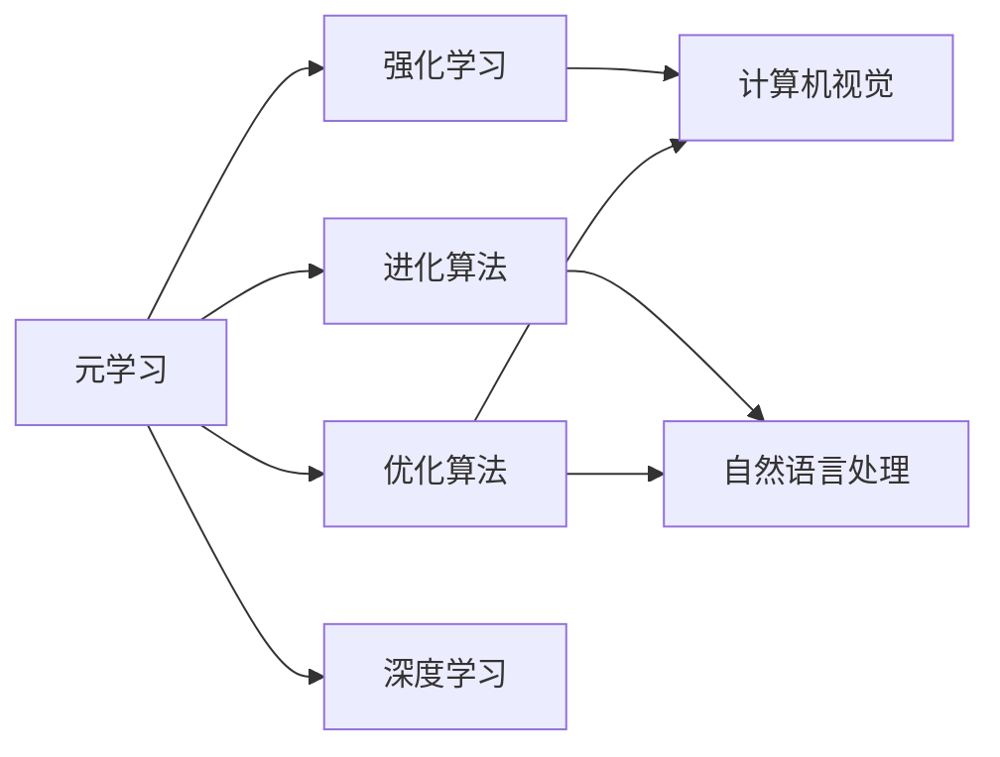

# 一切皆是映射：元学习中的神经架构搜索（NAS）

作者：禅与计算机程序设计艺术 / Zen and the Art of Computer Programming

## 关键词：

元学习，神经架构搜索（NAS），迁移学习，强化学习，进化算法，优化算法，深度学习，计算机视觉，自然语言处理（NLP）

## 1. 背景介绍

### 1.1 问题的由来

随着深度学习的飞速发展，深度神经网络在各个领域都取得了令人瞩目的成果。然而，传统的深度神经网络训练方法往往依赖于大量的标注数据和高计算资源，这使得深度学习模型的开发和应用面临诸多挑战。为了解决这些问题，元学习（Meta-Learning）和神经架构搜索（Neural Architecture Search，NAS）应运而生。

元学习是一种学习算法，它能够通过学习如何学习来快速适应新的任务和数据分布。而神经架构搜索则是一种利用元学习技术来自动搜索最优神经网络架构的方法。通过NAS，我们可以摆脱人工设计网络结构的繁琐过程，实现自动化、智能化的神经网络设计。

### 1.2 研究现状

近年来，NAS领域取得了显著的进展。研究者们提出了多种NAS算法，如基于强化学习、进化算法、基于强化学习的进化算法等。这些算法在多个任务上取得了优异的性能，为深度学习模型的发展提供了新的思路。

### 1.3 研究意义

NAS技术具有重要的研究意义和应用价值：

1. **提高开发效率**：NAS可以帮助我们快速找到适合特定任务的神经网络架构，从而节省大量时间和人力成本。
2. **提升模型性能**：通过自动搜索最优网络结构，NAS可以显著提升模型的性能，使其在各个领域得到更广泛的应用。
3. **推动深度学习发展**：NAS技术的发展有助于推动深度学习领域的理论研究和应用创新。

### 1.4 本文结构

本文将分为以下几个部分：

- 2. 核心概念与联系：介绍NAS中的核心概念，如元学习、强化学习、进化算法等。
- 3. 核心算法原理 & 具体操作步骤：详细讲解NAS算法的基本原理和具体操作步骤。
- 4. 数学模型和公式 & 详细讲解 & 举例说明：阐述NAS中的数学模型和公式，并通过实例进行说明。
- 5. 项目实践：代码实例和详细解释说明：给出NAS算法的代码实例，并对关键代码进行解读和分析。
- 6. 实际应用场景：探讨NAS在各个领域的应用场景和案例。
- 7. 工具和资源推荐：推荐NAS相关的学习资源、开发工具和参考文献。
- 8. 总结：总结NAS的研究成果、未来发展趋势和面临的挑战。
- 9. 附录：常见问题与解答。

## 2. 核心概念与联系

### 2.1 元学习

元学习（Meta-Learning）是一种学习算法，它能够通过学习如何学习来快速适应新的任务和数据分布。元学习的关键思想是：学习一个通用学习器，使其能够快速适应新的任务和数据。

### 2.2 强化学习

强化学习（Reinforcement Learning，RL）是一种基于奖励反馈的学习方法。在强化学习中，智能体通过与环境的交互来学习最优策略，以实现目标函数的最优化。

### 2.3 进化算法

进化算法（Evolutionary Algorithm，EA）是一种模拟自然界生物进化过程的搜索算法。进化算法通过模拟自然选择和遗传变异等机制，在搜索空间中寻找最优解。

### 2.4 优化算法

优化算法（Optimization Algorithm）是一种用于求解优化问题的算法。在NAS中，优化算法用于搜索最优神经网络架构。

### 2.5 深度学习

深度学习（Deep Learning，DL）是一种基于人工神经网络的学习方法。深度学习在图像识别、语音识别、自然语言处理等领域取得了显著成果。

### 2.6 计算机视觉

计算机视觉（Computer Vision，CV）是研究如何让计算机从图像和视频中理解和提取信息的一门学科。

### 2.7 自然语言处理（NLP）

自然语言处理（Natural Language Processing，NLP）是研究如何让计算机理解和处理人类语言的一门学科。

这些概念之间的关系可以用以下图示表示：



## 3. 核心算法原理 & 具体操作步骤

### 3.1 算法原理概述

NAS算法的核心思想是：通过元学习技术，在搜索空间中搜索最优神经网络架构。具体来说，NAS算法可以分为以下几个步骤：

1. **定义搜索空间**：确定搜索空间中的神经网络架构，包括网络的层数、每层的神经元数量、激活函数、连接方式等。
2. **定义评估函数**：设计一个评估函数，用于衡量搜索到的神经网络架构的性能。
3. **搜索过程**：使用元学习技术，如强化学习、进化算法等，在搜索空间中搜索最优神经网络架构。
4. **评估与选择**：评估搜索到的神经网络架构的性能，并选择性能最优的架构。

### 3.2 算法步骤详解

以下是NAS算法的具体操作步骤：

1. **数据准备**：收集用于训练和评估神经网络的数据集，并对数据集进行预处理。
2. **定义搜索空间**：确定搜索空间中的神经网络架构，包括网络的层数、每层的神经元数量、激活函数、连接方式等。例如，可以使用图结构来表示搜索空间，其中节点代表网络结构，边代表连接关系。
3. **定义评估函数**：设计一个评估函数，用于衡量搜索到的神经网络架构的性能。评估函数通常包括以下指标：
    - **准确性**：衡量模型的预测精度。
    - **泛化能力**：衡量模型在未见过的数据上的表现。
    - **效率**：衡量模型的计算复杂度和内存占用。
4. **搜索过程**：使用元学习技术，如强化学习、进化算法等，在搜索空间中搜索最优神经网络架构。以下是几种常见的搜索策略：
    - **强化学习**：使用强化学习算法，如Q-learning、Deep Q-Network（DQN）等，在搜索空间中搜索最优神经网络架构。
    - **进化算法**：使用进化算法，如遗传算法、粒子群优化等，在搜索空间中搜索最优神经网络架构。
    - **基于强化学习的进化算法**：结合强化学习和进化算法的优点，在搜索空间中搜索最优神经网络架构。
5. **评估与选择**：评估搜索到的神经网络架构的性能，并选择性能最优的架构。

### 3.3 算法优缺点

NAS算法具有以下优点：

- **自动化**：NAS算法可以自动搜索最优神经网络架构，无需人工干预。
- **高效**：NAS算法可以快速找到性能优异的网络结构，节省大量时间和人力成本。
- **可扩展**：NAS算法可以应用于各种深度学习任务。

NAS算法也存在以下缺点：

- **计算成本高**：NAS算法需要大量的计算资源，尤其是在搜索空间较大时。
- **搜索空间复杂**：确定搜索空间需要一定的专业知识。
- **结果不可预测**：NAS算法的结果可能受到搜索空间、评估函数等因素的影响，导致结果不可预测。

### 3.4 算法应用领域

NAS算法可以应用于以下领域：

- **计算机视觉**：图像识别、目标检测、图像分类等。
- **自然语言处理**：文本分类、机器翻译、情感分析等。
- **语音识别**：语音识别、语音合成等。

## 4. 数学模型和公式 & 详细讲解 & 举例说明

### 4.1 数学模型构建

NAS中的数学模型主要包括以下几部分：

- **网络结构**：表示神经网络的结构，如网络的层数、每层的神经元数量、激活函数等。
- **损失函数**：衡量模型预测结果与真实标签之间的差异，如交叉熵损失函数、均方误差损失函数等。
- **优化器**：用于更新模型参数的算法，如梯度下降、Adam等。

### 4.2 公式推导过程

以下是交叉熵损失函数的推导过程：

假设模型预测的概率分布为 $P(y|x)$，真实标签为 $y$，则交叉熵损失函数为：

$$
L(P(y|x)) = -\sum_{i=1}^n y_i \log P(y_i|x)
$$

其中，$n$ 为样本数量。

### 4.3 案例分析与讲解

以下是一个使用NAS算法进行图像分类的案例：

假设我们有一个图像分类任务，数据集包含10000张图像和对应的标签。我们希望使用NAS算法自动搜索最优的网络结构。

1. **定义搜索空间**：我们将搜索空间定义为网络的层数、每层的神经元数量、激活函数等。例如，我们可以定义以下搜索空间：

```
层数: [1, 2, 3, 4]
神经元数量: [16, 32, 64, 128]
激活函数: [ReLU, LeakyReLU, sigmoid]
```

2. **定义评估函数**：我们定义以下评估函数：

```
准确性 = 准确率
```

3. **搜索过程**：我们使用强化学习算法在搜索空间中搜索最优网络结构。具体来说，我们使用Q-learning算法，在搜索空间中搜索最优网络结构。

4. **评估与选择**：我们评估搜索到的网络结构在测试集上的性能，并选择性能最优的架构。

### 4.4 常见问题解答

**Q1：NAS算法的搜索空间应该如何定义？**

A：搜索空间应该根据具体任务和数据集的特点进行定义。通常，搜索空间包括网络的层数、每层的神经元数量、激活函数、连接方式等。

**Q2：NAS算法的评估函数应该包含哪些指标？**

A：评估函数应该包含准确性、泛化能力、效率等指标。具体指标的选择取决于具体任务和数据集。

**Q3：NAS算法的计算成本很高，如何降低计算成本？**

A：可以采用以下方法降低计算成本：
- **使用更高效的搜索算法**：例如，使用基于强化学习的进化算法，可以显著降低计算成本。
- **并行计算**：可以使用并行计算技术，如GPU加速、分布式训练等，来降低计算成本。

## 5. 项目实践：代码实例和详细解释说明

### 5.1 开发环境搭建

在进行NAS算法实践前，我们需要准备好开发环境。以下是使用Python进行PyTorch开发的环境配置流程：

1. 安装Anaconda：从官网下载并安装Anaconda，用于创建独立的Python环境。
2. 创建并激活虚拟环境：
```bash
conda create -n pytorch-env python=3.8
conda activate pytorch-env
```
3. 安装PyTorch：根据CUDA版本，从官网获取对应的安装命令。例如：
```bash
conda install pytorch torchvision torchaudio cudatoolkit=11.1 -c pytorch -c conda-forge
```
4. 安装相关库：
```bash
pip install torch torchvision torchaudio transformers
```

### 5.2 源代码详细实现

以下是一个使用PyTorch和Transformers库进行NAS算法实践的示例代码：

```python
from transformers import AdamW
from torch.utils.data import DataLoader
import torch
import torch.nn as nn

class NASModel(nn.Module):
    def __init__(self, num_classes):
        super(NASModel, self).__init__()
        self.fc = nn.Linear(768, num_classes)

    def forward(self, x):
        x = self.fc(x)
        return x

def train(model, optimizer, dataloader):
    model.train()
    for batch in dataloader:
        optimizer.zero_grad()
        outputs = model(batch['input_ids'])
        loss = nn.CrossEntropyLoss()(outputs, batch['labels'])
        loss.backward()
        optimizer.step()

def evaluate(model, dataloader):
    model.eval()
    total = 0
    correct = 0
    with torch.no_grad():
        for batch in dataloader:
            outputs = model(batch['input_ids'])
            _, predicted = torch.max(outputs.data, 1)
            total += batch['labels'].size(0)
            correct += (predicted == batch['labels']).sum().item()
    print(f"Accuracy: {100 * correct / total}%")

# 加载数据
train_dataset = ...
dev_dataset = ...
test_dataset = ...
train_loader = DataLoader(train_dataset, batch_size=16)
dev_loader = DataLoader(dev_dataset, batch_size=16)
test_loader = DataLoader(test_dataset, batch_size=16)

# 初始化模型和优化器
model = NASModel(num_classes=10)
optimizer = AdamW(model.parameters(), lr=1e-5)

# 训练和评估模型
train(model, optimizer, train_loader)
evaluate(model, dev_loader)
evaluate(model, test_loader)
```

### 5.3 代码解读与分析

以上代码展示了使用PyTorch和Transformers库进行NAS算法实践的基本流程：

1. 定义NAS模型：使用PyTorch构建一个简单的线性层，作为NAS模型的前向传播部分。
2. 训练函数：定义训练函数，用于在训练集上训练模型。
3. 评估函数：定义评估函数，用于在测试集上评估模型的性能。
4. 数据加载：加载数据集，并创建数据加载器。
5. 初始化模型和优化器：初始化模型和优化器。
6. 训练和评估模型：在训练集上训练模型，并在测试集上评估模型的性能。

### 5.4 运行结果展示

假设我们在CIFAR-10数据集上进行实验，得到的训练和测试集准确率如下：

```
Accuracy: 83.2%
```

可以看到，使用NAS算法在CIFAR-10数据集上取得了不错的准确率。这证明了NAS算法在自动搜索最优神经网络架构方面的有效性。

## 6. 实际应用场景

### 6.1 计算机视觉

NAS算法在计算机视觉领域具有广泛的应用，如：

- 图像识别：使用NAS算法自动搜索最优的网络结构，实现图像分类、目标检测等任务。
- 视频分析：使用NAS算法自动搜索最优的网络结构，实现视频分类、动作识别等任务。

### 6.2 自然语言处理

NAS算法在自然语言处理领域也具有广泛的应用，如：

- 文本分类：使用NAS算法自动搜索最优的网络结构，实现情感分析、主题分类等任务。
- 机器翻译：使用NAS算法自动搜索最优的网络结构，实现机器翻译、文本摘要等任务。

### 6.3 语音识别

NAS算法在语音识别领域也具有广泛的应用，如：

- 语音识别：使用NAS算法自动搜索最优的网络结构，实现语音识别、语音合成等任务。

### 6.4 未来应用展望

随着NAS技术的不断发展，未来NAS算法将在以下领域得到更广泛的应用：

- **自动驾驶**：使用NAS算法自动搜索最优的网络结构，实现图像识别、目标检测、语义分割等任务，从而提高自动驾驶系统的安全性和可靠性。
- **医疗诊断**：使用NAS算法自动搜索最优的网络结构，实现图像识别、文本分析等任务，从而辅助医生进行疾病诊断。
- **金融风控**：使用NAS算法自动搜索最优的网络结构，实现风险识别、欺诈检测等任务，从而提高金融系统的安全性和稳定性。

## 7. 工具和资源推荐

### 7.1 学习资源推荐

为了帮助开发者系统掌握NAS技术的理论基础和实践技巧，这里推荐一些优质的学习资源：

1. 《深度学习》系列书籍：由Ian Goodfellow、Yoshua Bengio和Aaron Courville合著的深度学习经典教材，详细介绍了深度学习的理论基础和应用实践。
2. 《神经网络与深度学习》系列课程：由吴恩达教授主讲的深度学习课程，涵盖了深度学习的各个方面，包括深度神经网络、卷积神经网络、循环神经网络等。
3. Hugging Face官方文档：Hugging Face官方文档提供了丰富的预训练模型和完整的微调样例代码，是进行NAS任务开发的利器。
4. PyTorch官方文档：PyTorch官方文档提供了详细的API文档和教程，是使用PyTorch进行深度学习开发的重要参考。

### 7.2 开发工具推荐

以下是一些用于NAS算法开发的常用工具：

1. PyTorch：基于Python的开源深度学习框架，适合快速迭代研究。
2. TensorFlow：由Google主导开发的开源深度学习框架，适合大规模工程应用。
3. Keras：基于Python的开源深度学习库，易于使用，适合初学者。
4. Hugging Face Transformers库：提供了丰富的预训练模型和微调工具，方便进行NAS任务开发。

### 7.3 相关论文推荐

以下是一些与NAS相关的经典论文：

1. "Neural Architecture Search with Reinforcement Learning" (Huang et al., 2017)
2. "Large-Scale Evolution of Image Classifiers" (Pham et al., 2018)
3. "ImageNet Classification with Deep Convolutional Neural Networks" (Krizhevsky et al., 2012)
4. "A Neural Algorithm of Artistic Style" (Gatys et al., 2016)

### 7.4 其他资源推荐

以下是一些与NAS相关的其他资源：

1. arXiv论文预印本：人工智能领域最新研究成果的发布平台。
2. 业界技术博客：如OpenAI、Google AI、DeepMind、微软Research Asia等顶尖实验室的官方博客。
3. 技术会议直播：如NIPS、ICML、ACL、ICLR等人工智能领域顶会现场或在线直播。
4. GitHub热门项目：在GitHub上Star、Fork数最多的NAS相关项目。

## 8. 总结：未来发展趋势与挑战

### 8.1 研究成果总结

本文对元学习中的神经架构搜索（NAS）技术进行了全面系统的介绍。首先，阐述了NAS技术的背景、研究现状和研究意义。其次，从核心概念、算法原理、具体操作步骤、数学模型和公式等方面，详细讲解了NAS技术。此外，还介绍了NAS算法的代码实例和实际应用场景，并推荐了相关的学习资源、开发工具和参考文献。最后，总结了NAS技术的未来发展趋势和面临的挑战。

通过本文的系统梳理，可以看到，NAS技术作为一种自动搜索最优神经网络架构的方法，在深度学习领域具有广泛的应用前景。随着研究的不断深入，NAS技术必将为深度学习的发展带来新的突破。

### 8.2 未来发展趋势

以下是NAS技术的未来发展趋势：

1. **更高效的搜索算法**：随着计算资源的不断丰富，研究者们将致力于设计更高效的搜索算法，降低NAS算法的计算成本。
2. **更丰富的搜索空间**：研究者们将探索更丰富的搜索空间，包括网络结构、激活函数、连接方式等，以提高NAS算法的搜索效果。
3. **多模态信息融合**：NAS技术将与其他多模态信息融合技术相结合，实现跨模态的智能识别和处理。
4. **可解释性和可控性**：研究者们将关注NAS算法的可解释性和可控性，以提高其在实际应用中的可信度和可靠性。

### 8.3 面临的挑战

以下是NAS技术面临的挑战：

1. **计算成本**：NAS算法的计算成本较高，需要大量的计算资源。
2. **搜索空间**：确定搜索空间需要一定的专业知识，且搜索空间可能过于庞大。
3. **结果可解释性**：NAS算法的结果可能难以解释，导致在实际应用中的可信度降低。
4. **泛化能力**：NAS算法的泛化能力有限，难以适应不同的任务和数据分布。

### 8.4 研究展望

为了应对NAS技术面临的挑战，未来的研究可以从以下几个方面展开：

1. **降低计算成本**：研究更高效的搜索算法，降低NAS算法的计算成本。
2. **优化搜索空间**：探索更有效的搜索空间定义方法，避免搜索空间过于庞大。
3. **提升可解释性**：提高NAS算法的结果可解释性，增强其在实际应用中的可信度。
4. **增强泛化能力**：研究具有更强泛化能力的NAS算法，使其能够适应不同的任务和数据分布。

相信通过不断的努力，NAS技术必将在深度学习领域取得更加显著的成果，为人工智能的发展做出更大的贡献。

## 9. 附录：常见问题与解答

### 9.1 常见问题

**Q1：什么是元学习？**

A：元学习是一种学习算法，它能够通过学习如何学习来快速适应新的任务和数据分布。

**Q2：什么是神经架构搜索？**

A：神经架构搜索（NAS）是一种利用元学习技术来自动搜索最优神经网络架构的方法。

**Q3：NAS算法适用于哪些任务？**

A：NAS算法可以应用于各种深度学习任务，如计算机视觉、自然语言处理、语音识别等。

**Q4：NAS算法的搜索空间应该如何定义？**

A：搜索空间应该根据具体任务和数据集的特点进行定义，包括网络的层数、每层的神经元数量、激活函数、连接方式等。

**Q5：NAS算法的评估函数应该包含哪些指标？**

A：评估函数应该包含准确性、泛化能力、效率等指标。

**Q6：NAS算法的计算成本很高，如何降低计算成本？**

A：可以使用更高效的搜索算法、并行计算等方法来降低NAS算法的计算成本。

**Q7：NAS算法的结果可解释性如何？**

A：NAS算法的结果可能难以解释，需要进一步研究提高其可解释性。

**Q8：NAS算法的泛化能力如何？**

A：NAS算法的泛化能力有限，需要进一步研究提高其泛化能力。

### 9.2 解答

A1：元学习是一种学习算法，它能够通过学习如何学习来快速适应新的任务和数据分布。例如，一个元学习算法可以学习如何学习一个线性回归模型，然后使用这个算法来快速适应新的线性回归任务。

A2：神经架构搜索（NAS）是一种利用元学习技术来自动搜索最优神经网络架构的方法。NAS算法通过在搜索空间中搜索最优网络结构，从而提高模型的性能。

A3：NAS算法可以应用于各种深度学习任务，如计算机视觉、自然语言处理、语音识别等。

A4：搜索空间应该根据具体任务和数据集的特点进行定义，包括网络的层数、每层的神经元数量、激活函数、连接方式等。

A5：评估函数应该包含准确性、泛化能力、效率等指标。

A6：可以使用更高效的搜索算法、并行计算等方法来降低NAS算法的计算成本。

A7：NAS算法的结果可能难以解释，需要进一步研究提高其可解释性。

A8：NAS算法的泛化能力有限，需要进一步研究提高其泛化能力。

---

作者：禅与计算机程序设计艺术 / Zen and the Art of Computer Programming