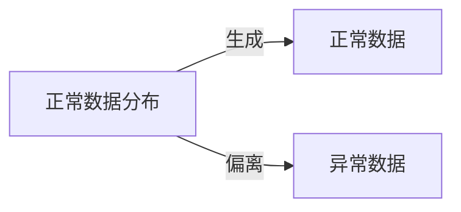

# 一切皆是映射：异常检测：AI捕捉隐藏模式

关键词：异常检测、机器学习、深度学习、数据挖掘、人工智能

## 1. 背景介绍
### 1.1  问题的由来
在当今大数据时代,各行各业都产生了海量的数据。然而,在这些看似正常的数据中,往往隐藏着一些异常和反常的模式。这些异常模式可能预示着系统故障、欺诈行为、网络入侵等问题。及时发现和定位这些异常对于保证系统稳定运行、降低风险损失至关重要。传统的异常检测方法难以应对高维度、非线性、动态变化的复杂数据环境。因此,迫切需要研究先进的异常检测技术,利用人工智能自动捕捉数据中的隐藏异常模式。

### 1.2  研究现状
异常检测是数据挖掘和机器学习领域的一个重要研究课题。传统的异常检测方法主要包括统计学方法、基于距离的方法、基于密度的方法等。这些方法在低维数据上可以取得不错的效果,但在高维复杂数据上往往力不从心。近年来,随着深度学习的崛起,一系列基于深度神经网络的异常检测方法被提出,如自编码器、变分自编码器、生成对抗网络等。这些方法能够自动学习数据的高层特征表示,在图像、视频、时间序列等复杂数据上展现出了优异的异常检测性能。

### 1.3  研究意义
异常检测在工业界有着广泛的应用前景,如设备健康监测、金融欺诈检测、网络入侵检测等。研究先进的异常检测人工智能技术,构建高效、鲁棒、可解释的异常检测模型,对于提升相关行业系统的安全性、可靠性具有重要意义。同时,异常检测也是人工智能模仿人类智能的一个缩影,研究异常检测有助于我们理解人类如何感知异常、挖掘共性。

### 1.4  本文结构
本文将系统阐述异常检测中的核心概念、经典算法、前沿进展。第2部分介绍异常检测的基本概念与问题定义。第3部分讲解主流的异常检测算法原理与步骤。第4部分进一步探讨异常检测算法背后的数学模型与公式推导。第5部分通过项目实践演示如何用Python实现几种典型的异常检测算法。第6部分列举异常检测的实际应用场景。第7部分推荐异常检测领域的学习资源。第8部分对全文进行总结,并展望异常检测技术的未来发展方向。

## 2. 核心概念与联系
异常(Anomaly)是指数据集中明显偏离整体分布的个体数据点或数据子集。根据异常的成因,可以分为以下三类:
1. 点异常(Point Anomaly):单个独立的异常数据点。
2. 上下文异常(Contextual Anomaly):在特定上下文中异常,但在其他上下文中可能是正常的。
3. 集合异常(Collective Anomaly):单个数据可能正常,但是一组数据的集合展现出异常性。

异常检测(Anomaly Detection)就是自动识别数据集中的异常的过程。从机器学习的角度看,异常检测主要有以下三种问题设定:
1. 有监督异常检测:训练数据中包含正常数据和已标记的异常数据。
2. 半监督异常检测:训练数据中只包含正常数据。
3. 无监督异常检测:训练数据中即包含正常数据,也包含未标记的异常数据。

异常检测与以下几个概念密切相关:
- 离群点检测(Outlier Detection):侧重于检测偏离正常范围较远的个体异常点。
- 新颖点检测(Novelty Detection):只用正常数据训练,将偏离正常模式的数据识别为新颖点。
- 噪声去除(Noise Removal):将异常视为噪声,目的是去除异常以净化数据。

异常检测的关键是学习数据的正常表示,将偏离正常表示的数据识别为异常。下图展示了异常数据点偏离正常数据分布的示意:

## 3. 核心算法原理 & 具体操作步骤
异常检测算法从不同角度刻画数据的正常性,进而识别异常。主流的异常检测算法可以分为以下几大类:

### 3.1 统计学方法
统计学方法假设数据服从某种概率分布,将偏离分布的数据点视为异常。常见的做法是:
1. 假设数据服从高斯分布,用均值和方差刻画正常范围。
2. 估计高斯分布参数:均值 $\mu$ 和协方差矩阵 $\Sigma$。 
3. 计算数据点 $x$ 的高斯密度 $p(x)=\frac{1}{(2\pi)^{n/2}|\Sigma|^{1/2}} \exp(-\frac{1}{2}(x-\mu)^T\Sigma^{-1}(x-\mu))$
4. 若 $p(x)$ 小于设定阈值,则判断为异常。

优点是直观易懂,缺点是高斯分布假设较强,难以刻画复杂数据分布。

### 3.2 基于距离的方法
基于距离的方法假设正常数据聚集在一起,异常数据偏离正常数据较远。常见的做法是:
1. 计算每个数据点与其他数据点的距离(如欧氏距离、马氏距离)。
2. 计算每个数据点的k近邻平均距离。
3. 将k近邻平均距离较大的数据点识别为异常。

代表算法有:k近邻(KNN)、基于相对密度的异常点检测(LOF)等。

优点是直观易懂,可解释性强。缺点是计算复杂度高,且难以刻画数据内在结构。

### 3.3 基于密度的方法 
基于密度的方法假设正常数据分布的密度较高,异常数据分布的密度较低。常见的做法是:
1. 估计数据的密度分布,如核密度估计。
2. 计算每个数据点的局部离群因子(LOF)。
3. 将LOF值较大的数据点识别为异常。

代表算法有:局部异常因子(LOF)、基于角度的异常检测(FastABOD)等。

优点是对数据分布假设较少,缺点是计算复杂度高,参数调节困难。

### 3.4 基于聚类的方法
基于聚类的方法先对数据进行聚类,再判断每个聚类是否为异常。常见的做法是:
1. 用聚类算法(如k均值)将数据划分为多个聚类。
2. 定义聚类的异常性度量,如小类、距离较远的类。
3. 将异常性度量高的聚类中的数据点识别为异常。

代表算法有:基于聚类的异常检测(CBLOF)等。

优点是聚类能揭示数据内在结构,缺点是聚类结果不稳定,异常定义主观。

### 3.5 基于神经网络的方法
基于神经网络的方法用神经网络学习数据的正常表示,偏离正常表示的数据即为异常。常见模型有:
1. 自编码器:用编码器将数据压缩到低维,再用解码器重构数据,重构误差大的数据为异常。 
2. 变分自编码器:在自编码器基础上加入变分推断,学习数据的概率分布,概率小的数据为异常。
3. 生成对抗网络:用生成器合成假数据,用判别器区分真假数据,判别器分数低的数据为异常。

优点是能学习数据的高层特征,刻画复杂数据分布,缺点是训练不稳定,可解释性差。

## 4. 数学模型和公式 & 详细讲解 & 举例说明

### 4.1 高斯分布异常检测模型

假设数据服从多元高斯分布 $X \sim \mathcal{N}(\mu,\,\Sigma)$,其中 $\mu$ 为均值向量, $\Sigma$ 为协方差矩阵。给定数据集 $\{x^{(1)}, x^{(2)}, \ldots, x^{(m)}\}$,高斯分布的概率密度函数为:

$$
p(x;\mu,\Sigma) = \frac{1}{(2\pi)^{n/2}|\Sigma|^{1/2}} \exp(-\frac{1}{2}(x-\mu)^T\Sigma^{-1}(x-\mu))
$$

其中, $n$ 为数据维度, $|\Sigma|$ 为 $\Sigma$ 的行列式。

异常检测的步骤如下:
1. 参数估计:极大似然估计高斯分布参数 $\mu$ 和 $\Sigma$:

$$
\mu = \frac{1}{m}\sum_{i=1}^m x^{(i)}
$$

$$
\Sigma = \frac{1}{m}\sum_{i=1}^m (x^{(i)} - \mu)(x^{(i)} - \mu)^T
$$

2. 异常判断:对于新的数据点 $x$,计算其在估计的高斯分布下的概率密度 $p(x)$。若 $p(x) < \epsilon$,则判断 $x$ 为异常,其中 $\epsilon$ 为设定的异常阈值。

举例说明:假设我们收集了一组人的身高、体重数据,想检测出身高体重反常的异常个体。我们假设身高体重服从二维高斯分布,估计出均值 $\mu$ 和协方差矩阵 $\Sigma$:

$$
\mu = \begin{bmatrix}
170 \
65
\end{bmatrix},
\Sigma = \begin{bmatrix}
100 & 50 \
50 & 50 
\end{bmatrix}
$$

对于一个新的身高体重数据 $x = \begin{bmatrix} 200 \ 100 \end{bmatrix}$,代入高斯分布概率密度函数,计算 $p(x)=5.2\times10^{-10}$。设定阈值 $\epsilon=1\times10^{-5}$,则 $p(x) < \epsilon$,判断该数据为异常。

### 4.2 单类SVM异常检测模型

单类SVM(One-Class SVM)通过寻找一个最小化超球面将正常数据包围起来,将落在超球面外的数据视为异常。其优化目标可表示为:

$$
\min_{R,\xi,c} R^2 + \frac{1}{\nu m}\sum_{i=1}^m \xi_i 
$$

$$
s.t. \quad ||x^{(i)}-c||^2 \leq R^2 + \xi_i, \quad \xi_i \geq 0, \quad i=1,2,\ldots,m
$$

其中, $R$ 为超球面半径, $c$ 为超球面中心, $\xi_i$ 为松弛变量, $\nu \in (0,1]$ 为控制异常比例的参数。

引入拉格朗日乘子 $\alpha_i \geq 0$, $\eta_i \geq 0$,得到拉格朗日函数:

$$
L(R,\xi,c,\alpha,\eta) = R^2 + \frac{1}{\nu m}\sum_{i=1}^m \xi_i - \sum_{i=1}^m \alpha_i(R^2+\xi_i-||x^{(i)}-c||^2) - \sum_{i=1}^m \eta_i\xi_i
$$

对偶问题的优化目标为:

$$
\min_{\alpha} \sum_{i=1}^m \sum_{j=1}^m \alpha_i \alpha_j x^{(i)T} x^{(j)} - \sum_{i=1}^m \alpha_i x^{(i)T} x^{(i)}
$$

$$
s.t. \quad 0 \leq \alpha_i \leq \frac{1}{\nu m}, \quad \sum_{i=1}^m \alpha_i = 1
$$

求解出最优 $\alpha$ 后,可得判别函数:

$$
f(x) = sgn(R^2 - \sum_{i=1}^m \alpha_i x^{(i)T} x + \sum_{i=1}^m \sum_{j=1}^m \alpha_i \alpha_j x^{(i)T} x^{(j)} )
$$

若 $f(x)=-1$,则 $x$ 为异常数据。

举例说明:假设我们收集了一组服务器的CPU使用率和内存使用