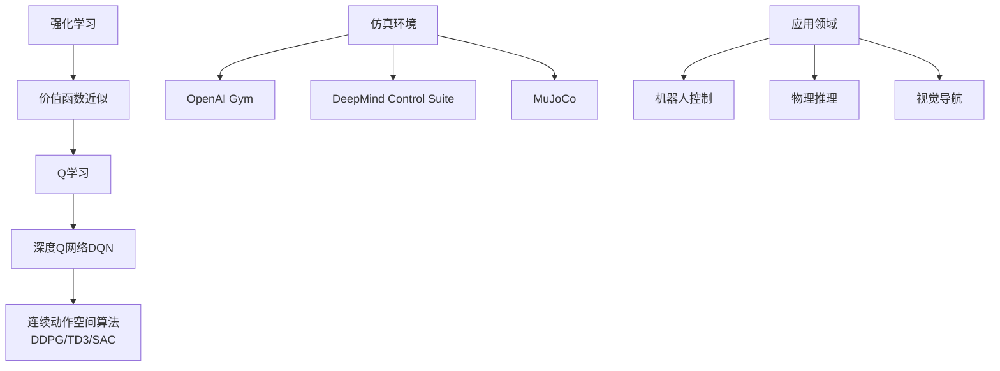

# 一切皆是映射：探索DQN在仿真环境中的应用与挑战

## 1. 背景介绍

### 1.1 问题的由来

在人工智能领域中,强化学习(Reinforcement Learning)是一种基于环境交互的学习范式,旨在通过试错和奖惩机制获取最优策略。传统的强化学习算法在处理高维观测空间和连续动作空间时往往效率低下,这使得它们难以应用于复杂的现实世界问题。为了解决这一挑战,深度强化学习(Deep Reinforcement Learning)应运而生,它将深度神经网络与强化学习相结合,展现出了令人振奋的前景。

其中,深度Q网络(Deep Q-Network, DQN)作为深度强化学习的开创性工作,为解决高维观测和离散动作空间问题提供了有力的解决方案。DQN利用深度神经网络来近似传统Q学习中的Q函数,从而能够处理高维输入并输出离散动作值。自2013年提出以来,DQN及其变体在多个领域取得了卓越的成绩,如Atari游戏、机器人控制和交通控制等。

### 1.2 研究现状

虽然DQN在离散动作空间中表现出色,但对于连续动作空间的问题,它的性能往往受到限制。为了解决这一挑战,研究人员提出了一系列改进方法,如Deep Deterministic Policy Gradient (DDPG)、Twin Delayed DDPG (TD3)和Soft Actor-Critic (SAC)等。这些算法通过引入Actor-Critic架构和策略梯度方法,能够直接优化连续动作空间下的策略,从而显著提高了性能。

另一方面,仿真环境在强化学习研究中扮演着重要角色。它们提供了安全、可控和高效的测试平台,使研究人员能够快速验证和评估新算法。流行的仿真环境包括OpenAI Gym、DeepMind Control Suite和MuJoCo等。这些环境涵盖了多种任务,如机器人控制、物理推理和视觉导航等,为算法的发展和应用提供了宝贵的支持。

### 1.3 研究意义

尽管DQN在离散动作空间中取得了巨大成功,但它在连续动作空间和复杂环境中的应用仍面临诸多挑战。本文旨在探索DQN在仿真环境中的应用,并深入分析其在连续动作空间下的表现和局限性。通过对比分析其他先进算法,我们将揭示DQN的优缺点,并提出潜在的改进方向。

此外,本文还将重点关注DQN在不同类型的仿真环境中的适用性和挑战,包括机器人控制、物理推理和视觉导航等领域。通过实践和案例分析,我们将深入探讨DQN在这些环境中的实现细节、性能表现和遇到的困难,为读者提供宝贵的经验和见解。

### 1.4 本文结构

本文将按照以下结构展开:

1. 背景介绍
2. 核心概念与联系
3. 核心算法原理与具体操作步骤
4. 数学模型和公式详细讲解与举例说明
5. 项目实践:代码实例和详细解释说明
6. 实际应用场景
7. 工具和资源推荐
8. 总结:未来发展趋势与挑战
9. 附录:常见问题与解答

## 2. 核心概念与联系

在探讨DQN在仿真环境中的应用之前,我们需要先了解一些核心概念及其相互关系。

1. **强化学习(Reinforcement Learning)**: 强化学习是一种基于环境交互的学习范式,旨在通过试错和奖惩机制获取最优策略。它广泛应用于机器人控制、游戏AI和自动驾驶等领域。

2. **价值函数近似(Value Function Approximation)**: 在高维观测空间中,传统的表格型强化学习算法无法高效地表示和更新价值函数。因此,我们需要使用函数近似器(如神经网络)来近似价值函数。

3. **Q学习(Q-Learning)**: Q学习是一种基于价值函数的强化学习算法,它通过估计状态-动作对的长期回报(Q值)来学习最优策略。然而,传统的Q学习在处理高维观测空间时效率低下。

4. **深度Q网络(Deep Q-Network, DQN)**: DQN是深度强化学习的开创性工作,它利用深度神经网络来近似Q函数,从而能够处理高维输入并输出离散动作值。DQN在Atari游戏等离散动作空间问题中取得了巨大成功。

5. **连续动作空间算法(DDPG/TD3/SAC)**: 对于连续动作空间的问题,DQN的性能往往受到限制。因此,研究人员提出了一系列改进算法,如DDPG、TD3和SAC等,它们通过引入Actor-Critic架构和策略梯度方法,能够直接优化连续动作空间下的策略。

6. **仿真环境(Simulation Environments)**: 仿真环境在强化学习研究中扮演着重要角色,它们提供了安全、可控和高效的测试平台。流行的仿真环境包括OpenAI Gym、DeepMind Control Suite和MuJoCo等。

7. **应用领域(Application Domains)**: DQN及其变体在多个领域取得了卓越的成绩,如机器人控制、物理推理和视觉导航等。这些领域对算法的性能和鲁棒性提出了不同的挑战。

通过理解这些核心概念及其联系,我们将更好地把握DQN在仿真环境中的应用和挑战。

## 3. 核心算法原理与具体操作步骤

### 3.1 算法原理概述

DQN的核心思想是利用深度神经网络来近似Q函数,从而能够处理高维观测空间并输出离散动作值。它的主要创新点包括:

1. **经验回放(Experience Replay)**: 通过存储过去的经验(状态、动作、奖励和下一状态),并从中随机采样数据进行训练,来打破相关性和提高数据利用率。

2. **目标网络(Target Network)**: 引入一个单独的目标网络,用于计算目标Q值,以稳定训练过程。目标网络的参数会定期从主网络复制而来,但更新频率较低。

3. **双重Q学习(Double Q-Learning)**: 采用两个Q网络,一个用于选择动作,另一个用于评估动作值,以解决过估计问题。

DQN的训练过程可以概括为以下步骤:

1. 初始化主Q网络和目标Q网络,并将目标网络的参数复制自主网络。
2. 在环境中与智能体交互,收集经验(状态、动作、奖励和下一状态),并存储在经验回放池中。
3. 从经验回放池中随机采样一批数据。
4. 使用主Q网络计算当前状态下所有动作的Q值,并选择Q值最大的动作。
5. 使用目标Q网络计算下一状态下所有动作的Q值,并选择Q值最大的动作值作为目标Q值。
6. 计算当前状态下选择动作的Q值与目标Q值之间的损失。
7. 使用优化算法(如梯度下降)更新主Q网络的参数,以最小化损失。
8. 定期将主Q网络的参数复制到目标Q网络。
9. 重复步骤2-8,直到收敛或达到预定迭代次数。

通过上述过程,DQN可以逐步学习到最优的Q函数近似,从而获得最佳的策略。

### 3.2 算法步骤详解

现在,让我们更深入地了解DQN算法的具体实现步骤:

1. **初始化主Q网络和目标Q网络**

我们需要初始化两个深度神经网络:主Q网络和目标Q网络。这两个网络的结构相同,但参数独立。目标Q网络的参数会定期从主Q网络复制而来,但更新频率较低,以保持稳定性。

2. **初始化经验回放池**

我们需要创建一个经验回放池,用于存储智能体与环境交互过程中收集的经验(状态、动作、奖励和下一状态)。经验回放池的大小通常设置为一个固定值,当池满时,新的经验将覆盖旧的经验。

3. **与环境交互并收集经验**

在每个时间步,智能体会观察当前状态,并根据主Q网络输出的Q值选择动作。然后,智能体会执行该动作,观察到下一状态和获得的奖励。这个(状态、动作、奖励、下一状态)元组将被存储在经验回放池中。

4. **从经验回放池中采样数据**

为了打破相关性和提高数据利用率,我们会从经验回放池中随机采样一批数据,用于训练主Q网络。

5. **计算目标Q值**

对于采样的每个(状态、动作、奖励、下一状态)元组,我们需要计算目标Q值。首先,我们使用主Q网络计算当前状态下所有动作的Q值,并选择Q值最大的动作。然后,我们使用目标Q网络计算下一状态下所有动作的Q值,并选择Q值最大的动作值作为目标Q值。目标Q值的计算公式如下:

$$
y_t = r_t + \gamma \max_{a'} Q_{\theta^-}(s_{t+1}, a')
$$

其中,$y_t$是目标Q值,$r_t$是当前奖励,$\gamma$是折扣因子,$Q_{\theta^-}$是目标Q网络,$(s_{t+1}, a')$是下一状态和所有可能动作对。

6. **计算损失并更新主Q网络**

我们使用均方误差(Mean Squared Error, MSE)作为损失函数,计算当前状态下选择动作的Q值与目标Q值之间的差距:

$$
L(\theta) = \mathbb{E}_{(s_t, a_t, r_t, s_{t+1}) \sim D} \left[ \left( y_t - Q_\theta(s_t, a_t) \right)^2 \right]
$$

其中,$L(\theta)$是损失函数,$D$是经验回放池,$(s_t, a_t, r_t, s_{t+1})$是采样的数据,$y_t$是目标Q值,$Q_\theta$是主Q网络。

然后,我们使用优化算法(如梯度下降)更新主Q网络的参数$\theta$,以最小化损失函数$L(\theta)$。

7. **定期更新目标Q网络**

为了保持目标Q网络的稳定性,我们会定期将主Q网络的参数复制到目标Q网络。通常,我们会每隔一定步数或一定迭代次数进行一次复制操作。

8. **重复上述步骤**

我们重复步骤3-7,直到算法收敛或达到预定迭代次数。在训练过程中,智能体会逐步学习到最优的Q函数近似,从而获得最佳的策略。

### 3.3 算法优缺点

DQN算法具有以下优点:

1. **处理高维观测空间**: 通过利用深度神经网络,DQN能够处理高维观测空间,克服了传统强化学习算法的局限性。

2. **稳定训练**: 经验回放和目标网络的引入使得DQN的训练过程更加稳定,减少了训练过程中的振荡和发散问题。

3. **离散动作空间**: DQN在离散动作空间问题中表现出色,如Atari游戏等。

4. **可解释性**: DQN的Q值可以解释为在给定状态下执行某个动作的长期回报,这为算法的决策过程提供了可解释性。

然而,DQN也存在一些缺点和局限性:

1. **连续动作空间**: DQN在连续动作空间问题中表现受限,因为它无法直接输出连续动作值。

2. **过估计问题**: DQN存在过估计Q值的问题,这可能导致不稳定的训练过程和次优策略。

3