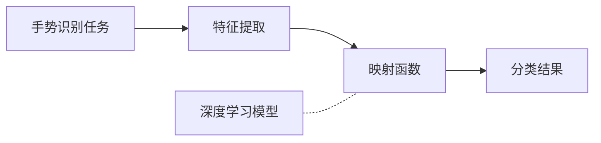

以下是按照您的要求撰写的技术博客文章正文部分：

# 一切皆是映射：深度学习在手势识别中的应用

## 1. 背景介绍

### 1.1 问题的由来

在人机交互领域,手势识别技术一直是一个备受关注的热点话题。随着计算机视觉、机器学习等技术的不断发展,手势识别在多种应用场景中扮演着越来越重要的角色。无论是虚拟现实(VR)、增强现实(AR)、智能家居还是机器人控制等领域,手势识别都是实现自然人机交互的关键技术。

传统的手势识别方法主要依赖于手工设计的特征提取和分类算法,但这种方法存在一些固有的缺陷,例如:

1. 特征提取过程复杂,需要大量的领域知识和人工经验; 
2. 分类算法的性能受数据分布的影响较大,泛化能力有限;
3. 难以处理复杂背景和遮挡等挑战情况。

因此,如何设计一种高效、鲁棒的手势识别方法,成为了当前研究的重点和难点。

### 1.2 研究现状  

近年来,深度学习技术在计算机视觉领域取得了巨大的成功,尤其是卷积神经网络(CNN)在图像分类、目标检测等任务中表现出色。受此启发,研究人员开始将深度学习方法应用于手势识别任务,取得了令人鼓舞的进展。

深度学习的优势在于能够自动从大量数据中学习出高质量的特征表示,从而避免了手工设计特征的复杂过程。同时,深度神经网络具有强大的非线性映射能力,能够学习复杂的映射关系,从而提高了分类性能。

目前,基于深度学习的手势识别方法主要分为两大类:基于RGB图像的方法和基于深度图像(如Kinect获取的深度图)的方法。前者的优点是数据获取方便,后者则能够提供更加精确的手部位置和形状信息。

### 1.3 研究意义

手势识别技术在多个领域具有广阔的应用前景:

1. **虚拟现实/增强现实**: 手势交互是VR/AR体验的重要组成部分,能够带来更加自然、沉浸式的交互体验。

2. **智能家居控制**: 通过手势就能够控制家电、调节灯光、播放音乐等,大大提高了生活便利性。

3. **机器人控制**: 手势作为一种自然的交互方式,能够方便地控制机器人执行各种操作任务。

4. **多媒体交互**: 手势可用于控制多媒体播放、游戏操作等,为用户提供更加直观的交互体验。

5. **无障碍交互**: 对于残障人士而言,手势识别为他们提供了一种全新的交互方式,有助于提高生活质量。

因此,发展高性能、鲁棍的手势识别技术,对于推动人机交互领域的创新具有重要意义。

### 1.4 本文结构  

本文将重点介绍如何利用深度学习技术解决手势识别问题。全文共分为8个部分:

1. 背景介绍
2. 核心概念与联系
3. 核心算法原理与具体操作步骤 
4. 数学模型和公式详细讲解与案例分析
5. 项目实践:代码实例和详细解释
6. 实际应用场景
7. 工具和资源推荐
8. 总结:未来发展趋势与挑战

接下来,我们先从核心概念入手,对手势识别任务及其与深度学习的联系进行阐述。

## 2. 核心概念与联系

手势识别任务的核心可以概括为:从输入的图像(或视频序列)中提取出有效的特征,然后通过某种映射函数将这些特征映射到对应的手势类别上。

传统方法需要人工设计特征提取和映射函数,而深度学习的关键在于:它能够自动学习出这种映射函数,将原始输入(如像素值)直接映射到期望的输出(如手势类别)。

深度神经网络就是这种端到端的映射函数的一种有效参数化形式。不同的网络结构(如卷积网络、递归网络等)对应不同的映射函数族,通过在大量数据上的训练,能够自动学习出高质量的映射,从而完成手势识别等任务。

总的来说,深度学习为手势识别任务提供了一种自动化、端到端的解决方案,极大地降低了人工设计的复杂性,同时有望获得更加优秀的性能表现。

## 3. 核心算法原理与具体操作步骤

### 3.1 算法原理概述  

基于深度学习的手势识别算法的核心思想是:首先使用卷积神经网络(CNN)自动从输入图像中提取出多尺度的特征表示,然后将这些特征输入到分类器(通常是全连接网络)中,从而获得手势类别的预测结果。

CNN由多个卷积层和池化层交替组成,能够有效地捕获图像的局部模式和层次结构信息。全连接层则能够对这些特征进行高层次的组合和非线性映射,最终生成分类概率输出。整个网络通过在大量标注数据上的监督训练,能够自动学习出从像素到手势类别的最优映射。

### 3.2 算法步骤详解

1. **数据预处理**:首先需要对手势图像数据进行预处理,包括数据清洗、增强(如旋转、缩放等)、归一化等,以提高模型的泛化能力。

2. **网络设计**:设计合适的卷积神经网络结构,确定卷积核大小、步长、通道数等超参数,并选择合适的激活函数。

3. **模型训练**:将预处理后的数据输入网络,对网络的可训练参数(卷积核权重和偏置项)进行端到端的训练,使用反向传播算法和优化算法(如SGD、Adam等)迭代更新参数,最小化损失函数(如交叉熵损失)。

4. **模型评估**:在保留的测试集上评估模型的性能指标,如准确率、召回率、F1分数等。根据评估结果,可能需要调整网络结构、超参数或训练策略。

5. **模型部署**:对训练好的模型进行保存,并将其集成到实际的应用系统中,以对新的输入图像进行手势识别和预测。

需要注意的是,手势识别任务还面临一些特殊挑战,如视角变化、遮挡、背景复杂等,因此可能需要采用一些特定的技术来增强模型的鲁棍性,例如数据增强、注意力机制、多模态融合等。我们将在后续章节中进一步探讨这些技术细节。

### 3.3 算法优缺点

基于深度学习的手势识别算法相比传统方法具有以下优点:

1. **自动特征学习**:无需人工设计特征提取器,能够从数据中自动学习出高质量的特征表示。

2. **端到端训练**:整个映射过程可以进行端到端的优化,避免了传统方法中的梯度消失等问题。

3. **泛化能力强**:深度网络具有强大的非线性映射能力,能够很好地适应复杂的数据分布。

4. **利用大数据优势**:通过在海量数据上训练,能够充分挖掘数据中的模式和规律。

但同时,这种方法也存在一些缺点和局限性:

1. **训练数据需求大**:深度网络参数众多,需要大量的训练数据来避免过拟合。

2. **黑箱缺乏可解释性**:网络内部的特征映射过程较为复杂,缺乏可解释性。

3. **硬件资源需求高**:训练深度网络需要大量的计算资源,对硬件配置要求较高。

4. **超参数调优复杂**:网络结构和训练超参数的调优过程较为复杂,需要一定的经验和试错。

5. **可能存在偏差**:由于训练数据的局限性,可能会产生一些潜在的偏差和漏洞。

因此,在实际应用中,需要根据具体的场景需求和条件,权衡利弊选择合适的算法和模型。

### 3.4 算法应用领域

基于深度学习的手势识别技术由于其高效、鲁棍的特点,已经在多个领域得到了广泛的应用,主要包括:

1. **虚拟现实/增强现实**: 手势作为自然交互方式,被广泛应用于VR/AR体验中,如游戏控制、场景交互等。

2. **智能家居控制**: 通过手势即可控制家电、调节灯光、播放音乐等,为用户带来无与伦比的便利体验。

3. **机器人控制**: 手势指令能够直观地控制机器人执行各种操作任务,在工业、服务等领域都有应用。

4. **多媒体交互**: 手势交互被用于控制多媒体播放、游戏操作、PPT演示等场景,为用户提供更加直观的体验。

5. **无障碍交互**: 手势识别为残障人士提供了一种全新的交互方式,有助于提高生活质量。

6. **人机交互分析**: 通过对手势的识别和理解,能够更好地分析人机交互过程,为智能系统的优化提供依据。

7. **安防监控**: 手势识别能够用于识别可疑的手势动作,在公共场所的安防监控中具有重要应用价值。

总的来说,手势识别技术为人机交互领域带来了革命性的变革,未来仍将在更多领域发挥重要作用。

## 4. 数学模型和公式详细讲解与案例分析

### 4.1 数学模型构建

在深度学习中,手势识别任务可以形式化为一个多分类问题。给定一个输入图像$X$,我们的目标是学习一个映射函数$f: X \rightarrow Y$,将输入图像映射到正确的手势类别标签$Y$。

卷积神经网络就是这种映射函数$f$的一种有效参数化形式。CNN由多个卷积层和池化层交替组成,能够自动从原始输入中提取出多尺度的特征表示,并通过全连接层进行高层次的特征融合和映射。

对于一个包含$L$层的CNN,其前向传播过程可以表示为:

$$
\begin{aligned}
X_0 &= X \
X_l &= f_l(X_{l-1}; W_l, b_l) \qquad &\text{for } l=1,\dots,L-1 \
Y &= f_L(X_{L-1}; W_L, b_L)
\end{aligned}
$$

其中$f_l$表示第$l$层的计算函数(如卷积、池化或全连接操作),$W_l$和$b_l$分别表示该层的可训练权重和偏置。

通过在大量标注数据$\{(X_i, Y_i)\}_{i=1}^N$上训练,我们可以学习出这些参数的最优值,使得CNN能够很好地拟合输入到输出的映射关系。

具体来说,我们定义一个损失函数$\mathcal{L}$来衡量模型的预测误差,如交叉熵损失:

$$
\mathcal{L}(Y, \hat{Y}) = -\sum_{i=1}^C Y_i \log \hat{Y}_i
$$

其中$Y$是真实标签的one-hot编码,而$\hat{Y}$是模型的预测输出(通过Softmax函数获得)。

然后,我们使用优化算法(如随机梯度下降SGD)来最小化损失函数:

$$
W^* = \arg\min_W \frac{1}{N} \sum_{i=1}^N \mathcal{L}(Y_i, f(X_i; W))
$$

通过反向传播算法,我们可以计算出损失函数相对于每一层参数的梯度,并据此更新