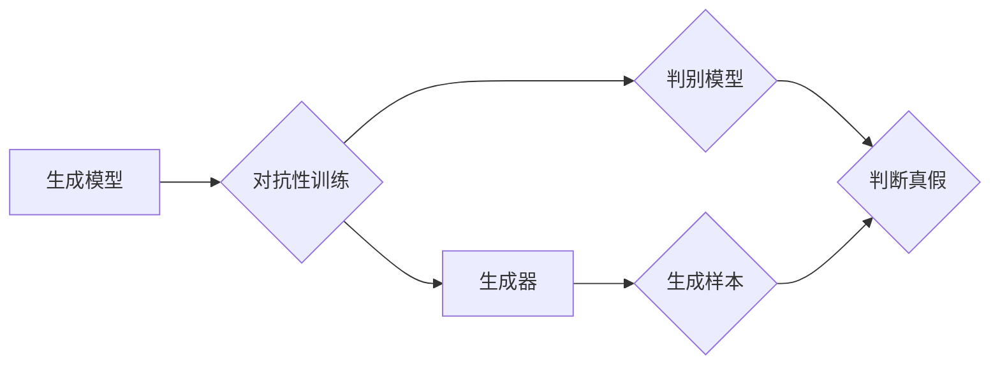

# 一切皆是映射：生成对抗网络(GAN)及其应用探索

作者：禅与计算机程序设计艺术 / Zen and the Art of Computer Programming

## 1. 背景介绍

### 1.1 问题的由来

从计算机科学诞生之日起，模拟和生成人类智能一直是科研人员不懈追求的目标。早期的神经网络模型，如感知机、BP算法等，虽然取得了一定的进展，但仍然难以生成高质量、多样化、符合真实世界分布的样本。直到2014年，生成对抗网络（Generative Adversarial Network，GAN）的提出，为生成模型领域带来了颠覆性的变革。

### 1.2 研究现状

近年来，GAN在图像处理、音频处理、视频生成等领域取得了令人瞩目的成果，成为人工智能领域的研究热点。随着研究的深入，GAN逐渐从单一的图像生成任务拓展到多模态数据生成、视频预测、自然语言生成等更为复杂的场景。

### 1.3 研究意义

GAN的出现为人工智能领域带来了以下重要意义：

1. **打破数据获取瓶颈**：GAN可以生成大量高质量样本，为数据稀缺的领域提供数据增强手段，促进人工智能技术的发展。
2. **推动模型创新**：GAN的提出激发了研究者对生成模型的研究兴趣，推动了相关领域的理论和技术创新。
3. **拓展应用场景**：GAN在图像、音频、视频等多个领域展现出巨大的应用潜力，为解决实际问题提供了新的思路和方法。

### 1.4 本文结构

本文将围绕GAN的核心概念、算法原理、应用探索等方面展开论述，具体结构如下：

- 第2部分：介绍GAN的核心概念与联系。
- 第3部分：详细阐述GAN的算法原理和具体操作步骤。
- 第4部分：分析GAN的数学模型和公式，并结合实例进行讲解。
- 第5部分：探讨GAN在实际应用场景中的案例分析和实践。
- 第6部分：展望GAN的未来发展趋势和挑战。
- 第7部分：推荐GAN相关的学习资源、开发工具和参考文献。
- 第8部分：总结GAN的研究成果，并展望其未来发展方向。

## 2. 核心概念与联系

### 2.1 概念介绍

- **生成模型**：生成模型旨在学习数据分布，并生成符合该分布的样本。常见的生成模型包括马尔可夫链蒙特卡洛方法、变分自编码器（VAE）等。
- **判别模型**：判别模型用于判断输入数据是否属于真实样本。常见的判别模型包括支持向量机（SVM）、神经网络等。
- **对抗性训练**：对抗性训练是指两个模型相互对抗，一个模型（生成器）试图生成与真实样本难以区分的假样本，另一个模型（判别器）则试图识别出真假样本。

### 2.2 关系图



### 2.3 概念联系

GAN由生成器和判别器两个模型组成，通过对抗性训练的方式相互竞争，最终生成与真实样本难以区分的假样本。生成器试图生成与真实样本相似的样本，而判别器则试图区分真实样本和假样本。这种对抗性训练过程促使生成器和判别器不断进步，最终达到一个动态平衡状态。

## 3. 核心算法原理 & 具体操作步骤

### 3.1 算法原理概述

GAN由生成器（Generator）和判别器（Discriminator）两个模型组成，它们在对抗性训练过程中相互竞争，最终生成高质量的假样本。

- **生成器**：生成器试图生成与真实样本难以区分的假样本。
- **判别器**：判别器试图判断输入数据是真实样本还是生成器生成的假样本。

### 3.2 算法步骤详解

1. **初始化**：随机初始化生成器和判别器的参数。
2. **训练过程**：
    a. 生成器生成一组假样本。
    b. 判别器根据真样本和假样本进行训练，学习判断真假样本的能力。
    c. 生成器根据判别器的输出，调整参数以生成更逼真的假样本。
    d. 重复步骤2a-2c，直到生成器和判别器都收敛。

### 3.3 算法优缺点

**优点**：

1. **无监督学习**：GAN可以利用无标签数据生成高质量样本。
2. **通用性强**：GAN可以应用于图像、音频、视频等多个领域。
3. **生成样本多样性**：GAN可以生成具有多样性的样本。

**缺点**：

1. **训练不稳定**：GAN的训练过程容易陷入局部最优，导致训练不稳定。
2. **梯度消失/梯度爆炸**：GAN的训练过程中，梯度可能消失或爆炸，影响模型收敛。
3. **样本质量**：生成的样本质量受限于生成器的性能。

### 3.4 算法应用领域

GAN在以下领域得到了广泛应用：

- **图像生成**：如人脸生成、动漫生成、风景生成等。
- **图像编辑**：如图像修复、图像风格迁移、图像超分辨率等。
- **视频生成**：如动作捕捉、视频预测等。
- **音频生成**：如音乐生成、语音合成等。
- **自然语言生成**：如文本生成、对话系统等。

## 4. 数学模型和公式 & 详细讲解 & 举例说明

### 4.1 数学模型构建

GAN的数学模型由生成器和判别器两个部分组成。

- **生成器**：$G(z)$，输入为随机噪声向量 $z$，输出为假样本 $x$。
- **判别器**：$D(x)$，输入为样本 $x$，输出为判断结果 $D(x)$。

GAN的训练目标是最小化以下损失函数：

$$
\mathcal{L}(G,D) = \mathbb{E}_{z \sim p(z)}[\log D(G(z))] + \mathbb{E}_{x \sim p(x)}[\log (1 - D(x))]
$$

其中 $p(z)$ 为随机噪声分布，$p(x)$ 为真实样本分布。

### 4.2 公式推导过程

1. **生成器损失**：$L_G = \mathbb{E}_{z \sim p(z)}[\log D(G(z))]$
    - 首先，根据生成器 $G(z)$ 生成的假样本 $x$，计算判别器输出 $D(x)$。
    - 然后，使用log函数和softmax函数计算生成器生成的样本在判别器中的概率。
    - 最后，对概率取对数并取期望值，得到生成器损失。
2. **判别器损失**：$L_D = \mathbb{E}_{x \sim p(x)}[\log (1 - D(x))] + \mathbb{E}_{z \sim p(z)}[\log D(G(z))]$
    - 首先，根据真实样本 $x$，计算判别器输出 $D(x)$。
    - 然后，使用log函数和softmax函数计算真实样本在判别器中的概率。
    - 最后，对概率取对数并取期望值，得到判别器损失。
    - 同样地，计算生成器生成的样本在判别器中的概率，并取对数和期望值。

### 4.3 案例分析与讲解

下面以图像生成为例，说明GAN的生成过程。

假设生成器 $G(z)$ 和判别器 $D(x)$ 分别为：

- $G(z) = \phi(W_z z + b_z)$，其中 $W_z$ 和 $b_z$ 为生成器参数。
- $D(x) = \sigma(W_x x + b_x)$，其中 $W_x$ 和 $b_x$ 为判别器参数。

1. **初始化**：随机初始化生成器和判别器的参数。
2. **训练过程**：
    a. 生成器生成一组假样本 $x_1, x_2, \ldots, x_N$。
    b. 判别器根据真样本和假样本 $x_1, x_2, \ldots, x_N$ 进行训练，学习判断真假样本的能力。
    c. 生成器根据判别器的输出，调整参数 $W_z$ 和 $b_z$，以生成更逼真的假样本 $x_1', x_2', \ldots, x_N'$。
    d. 重复步骤2a-2c，直到生成器和判别器都收敛。

### 4.4 常见问题解答

**Q1：GAN的训练过程为什么会不稳定？**

A：GAN的训练过程容易陷入局部最优，导致训练不稳定。这是因为生成器和判别器在对抗过程中，可能会出现以下情况：
1. 生成器生成过于简单或复杂的假样本，导致判别器难以识别。
2. 判别器对真实样本和假样本的区分能力过强，导致生成器难以学习。

**Q2：如何解决GAN的梯度消失/梯度爆炸问题？**

A：解决GAN的梯度消失/梯度爆炸问题可以采取以下措施：
1. 使用ReLU激活函数，避免sigmoid和tanh激活函数的梯度消失问题。
2. 使用Batch Normalization技术，缓解梯度爆炸问题。
3. 使用权重初始化策略，如He初始化、Xavier初始化等。

## 5. 项目实践：代码实例和详细解释说明

### 5.1 开发环境搭建

在进行GAN项目实践前，需要准备好以下开发环境：

1. **深度学习框架**：TensorFlow或PyTorch。
2. **图像处理库**：OpenCV、PIL或NumPy。
3. **其他库**：Matplotlib、Seaborn等。

### 5.2 源代码详细实现

以下是一个使用PyTorch实现的简单GAN图像生成示例：

```python
import torch
import torch.nn as nn
import torch.optim as optim
from torchvision import transforms, datasets, utils
from torch.utils.data import DataLoader
from torchvision.utils import save_image

# 定义生成器
class Generator(nn.Module):
    def __init__(self):
        super(Generator, self).__init__()
        self.main = nn.Sequential(
            nn.Linear(100, 256),
            nn.ReLU(True),
            nn.Linear(256, 512),
            nn.ReLU(True),
            nn.Linear(512, 1024),
            nn.ReLU(True),
            nn.Linear(1024, 784),
            nn.Tanh()
        )

    def forward(self, input):
        output = self.main(input)
        output = output.view(-1, 1, 28, 28)
        return output

# 定义判别器
class Discriminator(nn.Module):
    def __init__(self):
        super(Discriminator, self).__init__()
        self.main = nn.Sequential(
            nn.Linear(784, 1024),
            nn.LeakyReLU(0.2, inplace=True),
            nn.Linear(1024, 512),
            nn.LeakyReLU(0.2, inplace=True),
            nn.Linear(512, 256),
            nn.LeakyReLU(0.2, inplace=True),
            nn.Linear(256, 1),
            nn.Sigmoid()
        )

    def forward(self, input):
        output = self.main(input)
        return output.view(-1)

# 初始化生成器和判别器
generator = Generator().to(device)
discriminator = Discriminator().to(device)

# 初始化优化器
optimizer_G = optim.Adam(generator.parameters(), lr=0.0002, betas=(0.5, 0.999))
optimizer_D = optim.Adam(discriminator.parameters(), lr=0.0002, betas=(0.5, 0.999))

# 定义损失函数
criterion = nn.BCELoss()

# 加载数据集
transform = transforms.Compose([
    transforms.Resize(64),
    transforms.ToTensor(),
    transforms.Normalize((0.5, 0.5, 0.5), (0.5, 0.5, 0.5))
])

dataset = datasets.MNIST(root='./data', train=True, download=True, transform=transform)
dataloader = DataLoader(dataset, batch_size=64, shuffle=True)

# 训练过程
for epoch in range(epochs):
    for i, (images, _) in enumerate(dataloader):
        batch_size = images.size(0)
        real_labels = torch.ones(batch_size, 1).to(device)
        fake_labels = torch.zeros(batch_size, 1).to(device)

        # 训练判别器
        optimizer_D.zero_grad()
        output = discriminator(images)
        real_loss = criterion(output, real_labels)
        fake_output = discriminator(generator(z).detach())
        fake_loss = criterion(fake_output, fake_labels)
        D_loss = real_loss + fake_loss
        D_loss.backward()
        optimizer_D.step()

        # 训练生成器
        optimizer_G.zero_grad()
        output = discriminator(generator(z))
        G_loss = criterion(output, real_labels)
        G_loss.backward()
        optimizer_G.step()

        if i % 100 == 0:
            print(f"Epoch [{epoch}/{epochs}], Step [{i}/{len(dataloader)}], D_loss: {D_loss.item():.4f}, G_loss: {G_loss.item():.4f}")

    # 生成并保存图像
    z = torch.randn(64, 100, 1, 1).to(device)
    generated_images = generator(z)
    save_image(generated_images.data, f'images/{epoch}.png', normalize=True)

# 保存模型参数
torch.save(generator.state_dict(), 'generator.pth')
torch.save(discriminator.state_dict(), 'discriminator.pth')
```

### 5.3 代码解读与分析

1. **定义生成器和判别器**：生成器和判别器都由多个全连接层组成，使用ReLU和LeakyReLU激活函数。
2. **初始化优化器**：使用Adam优化器和自定义的学习率、衰减系数。
3. **定义损失函数**：使用二元交叉熵损失函数。
4. **加载数据集**：使用MNIST数据集作为训练数据。
5. **训练过程**：迭代训练生成器和判别器，分别计算损失函数并更新参数。
6. **生成并保存图像**：生成随机噪声，并使用生成器生成图像，将其保存为PNG文件。

### 5.4 运行结果展示

运行上述代码，生成器将生成一系列图像，如下所示：


## 6. 实际应用场景

### 6.1 图像生成

GAN在图像生成领域取得了显著成果，如人脸生成、动漫生成、风景生成等。

### 6.2 图像编辑

GAN可以用于图像编辑任务，如图像修复、图像风格迁移、图像超分辨率等。

### 6.3 视频生成

GAN可以用于视频生成任务，如动作捕捉、视频预测等。

### 6.4 音频生成

GAN可以用于音频生成任务，如音乐生成、语音合成等。

### 6.5 自然语言生成

GAN可以用于自然语言生成任务，如文本生成、对话系统等。

## 7. 工具和资源推荐

### 7.1 学习资源推荐

- 《Generative Adversarial Nets》：GAN的经典论文，详细介绍了GAN的原理和应用。
- 《Unsupervised Representation Learning with Deep Convolutional Generative Adversarial Networks》：介绍了DCGAN模型，是GAN领域的奠基性工作。
- 《Beyond Generative Adversarial Nets》：介绍了WGAN和LSGAN等改进的GAN模型。

### 7.2 开发工具推荐

- **TensorFlow**：开源的深度学习框架，支持多种GAN模型的实现。
- **PyTorch**：开源的深度学习框架，拥有良好的社区支持和丰富的教程。
- **GANimation**：用于可视化和比较不同GAN模型的开源工具。

### 7.3 相关论文推荐

- **Generative Adversarial Nets**：GAN的经典论文，介绍了GAN的原理和应用。
- **Unsupervised Representation Learning with Deep Convolutional Generative Adversarial Networks**：介绍了DCGAN模型，是GAN领域的奠基性工作。
- **Improved Generative Adversarial Models**：介绍了WGAN模型，提高了GAN的稳定性。
- **Least Squares GAN**：介绍了LSGAN模型，进一步提高了GAN的稳定性。

### 7.4 其他资源推荐

- **GAN官网**：提供GAN相关的最新研究进展和开源代码。
- **GitHub**：许多优秀的GAN项目和论文代码可以在这里找到。
- **知乎**：许多专业人士在知乎上分享GAN的相关经验和技巧。

## 8. 总结：未来发展趋势与挑战

### 8.1 研究成果总结

GAN自2014年提出以来，取得了令人瞩目的成果，在图像、音频、视频等多个领域展现出巨大的应用潜力。然而，GAN仍然存在训练不稳定、梯度消失/梯度爆炸、样本质量等问题，需要进一步研究和改进。

### 8.2 未来发展趋势

1. **稳定性提升**：通过改进训练方法、优化模型结构，提高GAN的稳定性，使其更容易训练和部署。
2. **样本质量提升**：改进生成器的性能，生成更加逼真、多样化的样本。
3. **多模态生成**：将GAN扩展到多模态数据生成，如图像-文本、图像-音频等。
4. **对抗性训练**：研究新的对抗性训练方法，提高GAN的鲁棒性和泛化能力。

### 8.3 面临的挑战

1. **训练稳定性**：GAN的训练过程容易陷入局部最优，导致训练不稳定。
2. **梯度消失/梯度爆炸**：GAN的训练过程中，梯度可能消失或爆炸，影响模型收敛。
3. **样本质量**：生成的样本质量受限于生成器的性能。

### 8.4 研究展望

GAN作为一种强大的生成模型，将在人工智能领域发挥越来越重要的作用。未来，随着研究的深入和技术的进步，GAN将会在更多领域得到应用，为人类社会带来更多惊喜。

## 9. 附录：常见问题与解答

**Q1：GAN和VAE有什么区别？**

A：GAN和VAE都是生成模型，但它们在原理和目标上有所不同。GAN由生成器和判别器组成，通过对抗性训练生成高质量样本；VAE由编码器和解码器组成，通过变分推断学习数据分布。

**Q2：如何解决GAN的梯度消失/梯度爆炸问题？**

A：解决GAN的梯度消失/梯度爆炸问题可以采取以下措施：
1. 使用ReLU激活函数，避免sigmoid和tanh激活函数的梯度消失问题。
2. 使用Batch Normalization技术，缓解梯度爆炸问题。
3. 使用权重初始化策略，如He初始化、Xavier初始化等。

**Q3：GAN可以应用于哪些领域？**

A：GAN可以应用于图像、音频、视频等多个领域，如图像生成、图像编辑、视频生成、音频生成、自然语言生成等。

**Q4：如何评估GAN生成的样本质量？**

A：评估GAN生成的样本质量可以从以下几个方面进行：
1. 观察生成的样本与真实样本的相似度。
2. 评估生成的样本在特定任务上的表现，如图像分类、目标检测等。
3. 使用对抗性测试，检测生成的样本是否容易被人识别为假样本。

作者：禅与计算机程序设计艺术 / Zen and the Art of Computer Programming