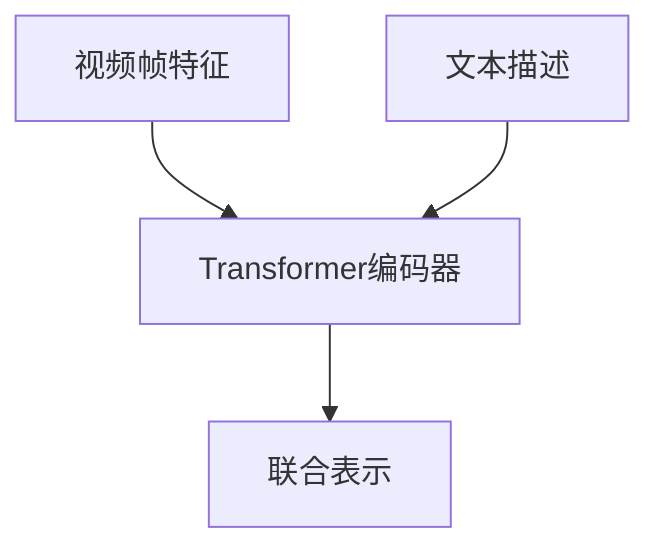

# Transformer大模型实战 预训练VideoBERT模型

## 1.背景介绍

在过去的几年中，Transformer模型在自然语言处理（NLP）领域取得了巨大的成功。自从Vaswani等人于2017年提出Transformer架构以来，基于Transformer的模型如BERT、GPT-3等在各种NLP任务中表现出色。然而，随着视频数据的爆炸性增长，如何有效地处理和理解视频数据成为了一个新的挑战。VideoBERT模型应运而生，它将Transformer架构的优势扩展到视频理解领域。

VideoBERT是一种基于Transformer的预训练模型，旨在通过自监督学习从大量未标注的视频数据中学习视频表示。它不仅能够捕捉视频中的时序信息，还能结合视频和文本信息进行多模态学习。本文将深入探讨VideoBERT的核心概念、算法原理、数学模型、项目实践、实际应用场景、工具和资源推荐，并展望其未来发展趋势与挑战。

## 2.核心概念与联系

### 2.1 Transformer架构

Transformer是一种基于自注意力机制的深度学习模型，主要由编码器和解码器组成。其核心组件包括多头自注意力机制和前馈神经网络。Transformer的优势在于其能够并行处理序列数据，克服了传统RNN的长距离依赖问题。

### 2.2 BERT模型

BERT（Bidirectional Encoder Representations from Transformers）是基于Transformer编码器的预训练模型，通过双向编码器捕捉上下文信息。BERT的预训练任务包括掩码语言模型（MLM）和下一句预测（NSP），使其在各种NLP任务中表现优异。

### 2.3 VideoBERT模型

VideoBERT是将BERT模型扩展到视频数据的一种尝试。它通过将视频帧和文本描述结合起来进行预训练，学习视频的时序和语义信息。VideoBERT的预训练任务包括视频帧掩码预测和视频-文本对齐任务。

### 2.4 多模态学习

多模态学习是指同时处理和理解多种类型的数据，如文本、图像和视频。VideoBERT通过结合视频和文本信息，实现了多模态学习，能够更好地理解视频内容。

## 3.核心算法原理具体操作步骤

### 3.1 数据预处理

在预训练VideoBERT模型之前，需要对视频数据进行预处理。具体步骤如下：

1. **视频分帧**：将视频分割成若干帧，每帧代表一个时间点的图像。
2. **帧特征提取**：使用预训练的图像模型（如ResNet）提取每帧的特征向量。
3. **文本描述提取**：从视频的元数据或字幕中提取文本描述，并进行分词处理。

### 3.2 预训练任务

VideoBERT的预训练任务包括视频帧掩码预测和视频-文本对齐任务。

1. **视频帧掩码预测**：类似于BERT的MLM任务，随机掩码部分视频帧的特征，模型需要预测被掩码的帧特征。
2. **视频-文本对齐任务**：给定视频帧和对应的文本描述，模型需要判断文本描述是否与视频帧匹配。

### 3.3 模型架构

VideoBERT的模型架构基于Transformer编码器，输入包括视频帧特征和文本描述。模型通过多头自注意力机制和前馈神经网络进行编码，输出视频和文本的联合表示。



### 3.4 训练过程

1. **初始化参数**：使用预训练的图像模型和BERT模型初始化VideoBERT的参数。
2. **预训练**：在大规模未标注的视频数据上进行预训练，优化视频帧掩码预测和视频-文本对齐任务的损失函数。
3. **微调**：在特定任务的数据集上进行微调，进一步优化模型参数。

## 4.数学模型和公式详细讲解举例说明

### 4.1 自注意力机制

自注意力机制是Transformer的核心组件，用于计算输入序列中每个元素与其他元素的相关性。其计算公式如下：

$$
\text{Attention}(Q, K, V) = \text{softmax}\left(\frac{QK^T}{\sqrt{d_k}}\right)V
$$

其中，$Q$、$K$、$V$分别表示查询、键和值矩阵，$d_k$是键的维度。

### 4.2 多头自注意力

多头自注意力机制通过并行计算多个自注意力，捕捉不同子空间的相关性。其计算公式如下：

$$
\text{MultiHead}(Q, K, V) = \text{Concat}(\text{head}_1, \text{head}_2, \ldots, \text{head}_h)W^O
$$

其中，$\text{head}_i = \text{Attention}(QW_i^Q, KW_i^K, VW_i^V)$，$W_i^Q$、$W_i^K$、$W_i^V$和$W^O$是可训练的权重矩阵。

### 4.3 视频帧掩码预测

视频帧掩码预测任务的损失函数类似于BERT的MLM任务，使用交叉熵损失：

$$
\mathcal{L}_{\text{mask}} = -\sum_{i \in \text{mask}} \log P(x_i | x_{\text{mask}})
$$

其中，$x_i$表示被掩码的视频帧特征，$x_{\text{mask}}$表示掩码后的输入。

### 4.4 视频-文本对齐任务

视频-文本对齐任务的损失函数使用二元交叉熵损失：

$$
\mathcal{L}_{\text{align}} = -\left(y \log P(y | x, t) + (1 - y) \log (1 - P(y | x, t))\right)
$$

其中，$y$表示视频和文本是否匹配，$x$和$t$分别表示视频帧特征和文本描述。

## 5.项目实践：代码实例和详细解释说明

### 5.1 数据预处理

```python
import cv2
import numpy as np
from transformers import BertTokenizer

# 视频分帧
def extract_frames(video_path, frame_rate=1):
    cap = cv2.VideoCapture(video_path)
    frames = []
    while cap.isOpened():
        ret, frame = cap.read()
        if not ret:
            break
        frames.append(frame)
        cap.set(cv2.CAP_PROP_POS_MSEC, cap.get(cv2.CAP_PROP_POS_MSEC) + 1000/frame_rate)
    cap.release()
    return frames

# 帧特征提取
def extract_features(frames, model):
    features = []
    for frame in frames:
        feature = model(frame)
        features.append(feature)
    return np.array(features)

# 文本描述提取
def extract_text_descriptions(text_path):
    with open(text_path, 'r') as file:
        descriptions = file.readlines()
    tokenizer = BertTokenizer.from_pretrained('bert-base-uncased')
    tokenized_descriptions = [tokenizer.encode(desc, add_special_tokens=True) for desc in descriptions]
    return tokenized_descriptions

# 示例
video_path = 'example_video.mp4'
text_path = 'example_text.txt'
frames = extract_frames(video_path)
features = extract_features(frames, pretrained_image_model)
descriptions = extract_text_descriptions(text_path)
```

### 5.2 模型训练

```python
import torch
from transformers import BertModel, BertConfig

class VideoBERT(torch.nn.Module):
    def __init__(self, config):
        super(VideoBERT, self).__init__()
        self.bert = BertModel(config)
        self.fc = torch.nn.Linear(config.hidden_size, config.vocab_size)

    def forward(self, video_features, text_descriptions):
        inputs = torch.cat((video_features, text_descriptions), dim=1)
        outputs = self.bert(inputs)
        logits = self.fc(outputs.last_hidden_state)
        return logits

# 初始化模型
config = BertConfig.from_pretrained('bert-base-uncased')
config.vocab_size = len(tokenizer.vocab)
model = VideoBERT(config)

# 训练过程
optimizer = torch.optim.Adam(model.parameters(), lr=1e-4)
criterion = torch.nn.CrossEntropyLoss()

for epoch in range(num_epochs):
    for video_features, text_descriptions in dataloader:
        optimizer.zero_grad()
        logits = model(video_features, text_descriptions)
        loss = criterion(logits.view(-1, config.vocab_size), text_descriptions.view(-1))
        loss.backward()
        optimizer.step()
```

## 6.实际应用场景

### 6.1 视频内容理解

VideoBERT可以用于视频内容理解任务，如视频分类、视频摘要生成和视频问答。通过预训练和微调，VideoBERT能够捕捉视频中的时序和语义信息，提高视频内容理解的准确性。

### 6.2 多模态检索

VideoBERT可以用于多模态检索任务，如视频-文本检索和视频-视频检索。通过学习视频和文本的联合表示，VideoBERT能够实现跨模态的检索，提高检索的效果。

### 6.3 视频推荐系统

VideoBERT可以用于视频推荐系统，通过分析用户观看历史和视频内容，生成个性化的推荐列表。VideoBERT能够捕捉视频的时序和语义信息，提高推荐的准确性和用户满意度。

## 7.工具和资源推荐

### 7.1 预训练模型

- [BERT](https://github.com/google-research/bert): BERT的官方实现和预训练模型。
- [VideoBERT](https://github.com/amzn/video-bert): VideoBERT的官方实现和预训练模型。

### 7.2 数据集

- [YouTube-8M](https://research.google.com/youtube8m/): 大规模视频数据集，包含数百万个视频和标签。
- [MSR-VTT](https://www.microsoft.com/en-us/research/project/msr-vtt-a-large-video-description-dataset/): 视频描述数据集，包含视频和对应的文本描述。

### 7.3 工具库

- [Transformers](https://github.com/huggingface/transformers): Hugging Face的Transformers库，提供了多种预训练模型和工具。
- [OpenCV](https://opencv.org/): 计算机视觉库，用于视频处理和帧特征提取。

## 8.总结：未来发展趋势与挑战

VideoBERT作为一种基于Transformer的预训练模型，在视频理解领域展现了巨大的潜力。未来的发展趋势包括：

1. **更大规模的预训练**：随着计算资源的增加，可以在更大规模的视频数据上进行预训练，进一步提高模型的性能。
2. **多模态融合**：结合更多类型的数据，如音频和传感器数据，实现更全面的多模态学习。
3. **实时处理**：优化模型的计算效率，实现实时的视频处理和理解。

然而，VideoBERT也面临一些挑战：

1. **数据标注**：视频数据的标注成本高，如何利用未标注数据进行自监督学习是一个重要问题。
2. **计算资源**：视频数据的处理和模型训练需要大量的计算资源，如何提高计算效率是一个关键问题。
3. **模型解释性**：如何解释和理解VideoBERT的内部机制和决策过程，是一个值得研究的问题。

## 9.附录：常见问题与解答

### 9.1 VideoBERT与BERT的区别是什么？

VideoBERT是将BERT模型扩展到视频数据的一种尝试。BERT主要用于文本数据，而VideoBERT通过结合视频帧和文本描述进行预训练，学习视频的时序和语义信息。

### 9.2 如何选择预训练模型？

选择预训练模型时，可以根据任务的具体需求和数据类型进行选择。对于文本任务，可以选择BERT或GPT-3；对于视频任务，可以选择VideoBERT或其他基于Transformer的视频模型。

### 9.3 如何提高模型的训练效率？

提高模型训练效率的方法包括使用更高效的计算资源（如GPU或TPU）、优化数据预处理流程、使用混合精度训练和分布式训练等。

### 9.4 VideoBERT可以应用于哪些领域？

VideoBERT可以应用于视频内容理解、多模态检索、视频推荐系统等领域。通过预训练和微调，VideoBERT能够捕捉视频中的时序和语义信息，提高任务的准确性。

### 9.5 如何处理视频数据的标注问题？

视频数据的标注成本高，可以通过自监督学习和半监督学习的方法，利用未标注数据进行预训练，减少对标注数据的依赖。

---

作者：禅与计算机程序设计艺术 / Zen and the Art of Computer Programming