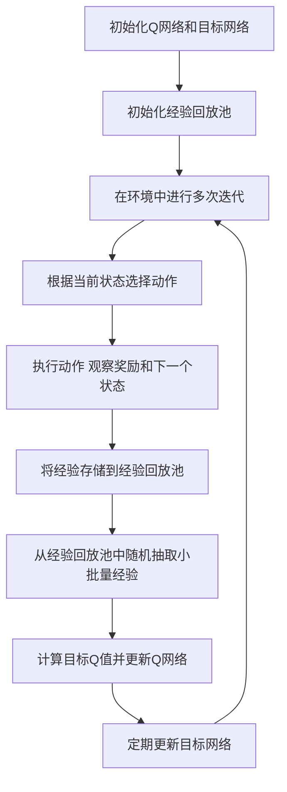

# 一切皆是映射：利用DQN解决路径规划问题：方法与思考

## 1.背景介绍

路径规划问题在机器人导航、自动驾驶、物流配送等领域具有广泛的应用。传统的路径规划算法如A*、Dijkstra等在静态环境中表现良好，但在动态和复杂环境中往往难以应对。近年来，深度强化学习（Deep Reinforcement Learning, DRL）在解决复杂决策问题上展现了强大的能力，特别是深度Q网络（Deep Q-Network, DQN）在游戏AI中的成功应用引起了广泛关注。

DQN通过结合深度学习和Q学习，能够在高维状态空间中进行有效的决策。本文将探讨如何利用DQN解决路径规划问题，详细介绍其核心概念、算法原理、数学模型、项目实践、实际应用场景、工具和资源推荐，并展望未来的发展趋势与挑战。

## 2.核心概念与联系

### 2.1 路径规划

路径规划是指在给定的起点和终点之间找到一条最优路径，使得路径上的代价（如时间、距离、能量消耗等）最小。路径规划问题可以分为静态路径规划和动态路径规划，前者假设环境是静态的，后者则考虑环境的动态变化。

### 2.2 深度强化学习

深度强化学习是将深度学习与强化学习相结合的一种方法。强化学习通过与环境的交互来学习策略，以最大化累积奖励。深度学习则通过神经网络来处理高维状态空间。DQN是深度强化学习的一种典型方法，它使用深度神经网络来近似Q值函数，从而在高维状态空间中进行有效的决策。

### 2.3 Q学习与DQN

Q学习是一种无模型的强化学习算法，通过学习状态-动作对的Q值来指导决策。DQN在Q学习的基础上引入了深度神经网络，用于近似Q值函数，并通过经验回放和目标网络等技术来稳定训练过程。

### 2.4 映射关系

在路径规划问题中，状态可以表示为机器人或车辆在环境中的位置，动作可以表示为移动的方向或速度。通过DQN，我们可以将路径规划问题映射为一个强化学习问题，通过学习状态-动作对的Q值来找到最优路径。

## 3.核心算法原理具体操作步骤

### 3.1 环境建模

首先，需要对路径规划问题进行建模。环境可以表示为一个网格地图，其中每个格子代表一个状态，机器人或车辆可以在格子之间移动。每个动作对应于在网格中的一个移动方向，如上、下、左、右。

### 3.2 奖励函数设计

奖励函数是强化学习中的关键部分，它指导代理如何进行决策。在路径规划问题中，可以设计如下奖励函数：
- 到达目标位置时给予高奖励
- 每移动一步给予小的负奖励
- 碰撞障碍物时给予大的负奖励

### 3.3 DQN网络结构

DQN使用一个深度神经网络来近似Q值函数。网络的输入是当前状态，输出是每个动作的Q值。常见的网络结构包括卷积神经网络（CNN）和全连接神经网络（FCN）。

### 3.4 经验回放与目标网络

为了稳定训练过程，DQN引入了经验回放和目标网络。经验回放通过存储代理的经验（状态、动作、奖励、下一个状态）并随机抽取小批量进行训练，打破了数据之间的相关性。目标网络则是一个延迟更新的Q网络，用于计算目标Q值，减少了训练过程中的震荡。

### 3.5 训练过程

训练过程包括以下步骤：
1. 初始化Q网络和目标网络
2. 初始化经验回放池
3. 在环境中进行多次迭代，每次迭代包括以下步骤：
   - 根据当前状态选择动作（ε-贪婪策略）
   - 执行动作，观察奖励和下一个状态
   - 将经验存储到经验回放池
   - 从经验回放池中随机抽取小批量经验，计算目标Q值并更新Q网络
   - 定期更新目标网络

以下是DQN训练过程的Mermaid流程图：



## 4.数学模型和公式详细讲解举例说明

### 4.1 Q值函数

Q值函数 $Q(s, a)$ 表示在状态 $s$ 下选择动作 $a$ 所能获得的期望累积奖励。Q学习的目标是找到最优的Q值函数 $Q^*(s, a)$，使得在每个状态下选择的动作都能最大化累积奖励。

### 4.2 贝尔曼方程

贝尔曼方程描述了Q值函数的递归关系：

$$
Q(s, a) = r + \gamma \max_{a'} Q(s', a')
$$

其中，$r$ 是当前奖励，$\gamma$ 是折扣因子，$s'$ 是执行动作 $a$ 后的下一个状态，$a'$ 是在状态 $s'$ 下选择的动作。

### 4.3 损失函数

DQN通过最小化以下损失函数来更新Q网络：

$$
L(\theta) = \mathbb{E}[(r + \gamma \max_{a'} Q(s', a'; \theta^-) - Q(s, a; \theta))^2]
$$

其中，$\theta$ 是Q网络的参数，$\theta^-$ 是目标网络的参数。

### 4.4 经验回放

经验回放通过存储代理的经验 $(s, a, r, s')$ 并随机抽取小批量进行训练，打破了数据之间的相关性。经验回放池的大小通常是固定的，当池满时会移除最旧的经验。

### 4.5 目标网络

目标网络是一个延迟更新的Q网络，用于计算目标Q值。目标网络的参数 $\theta^-$ 每隔固定步数从Q网络的参数 $\theta$ 复制一次。

## 5.项目实践：代码实例和详细解释说明

### 5.1 环境搭建

首先，我们需要搭建一个模拟环境。这里我们使用OpenAI Gym库中的网格世界环境。

```python
import gym
import numpy as np

env = gym.make('FrozenLake-v0', is_slippery=False)
```

### 5.2 DQN网络结构

接下来，我们定义DQN的网络结构。这里使用一个简单的全连接神经网络。

```python
import torch
import torch.nn as nn
import torch.optim as optim

class DQN(nn.Module):
    def __init__(self, state_size, action_size):
        super(DQN, self).__init__()
        self.fc1 = nn.Linear(state_size, 24)
        self.fc2 = nn.Linear(24, 24)
        self.fc3 = nn.Linear(24, action_size)

    def forward(self, x):
        x = torch.relu(self.fc1(x))
        x = torch.relu(self.fc2(x))
        return self.fc3(x)

state_size = env.observation_space.n
action_size = env.action_space.n
q_network = DQN(state_size, action_size)
target_network = DQN(state_size, action_size)
target_network.load_state_dict(q_network.state_dict())
target_network.eval()
```

### 5.3 训练过程

定义训练过程，包括经验回放和目标网络更新。

```python
from collections import deque
import random

memory = deque(maxlen=2000)
batch_size = 64
gamma = 0.99
epsilon = 1.0
epsilon_min = 0.01
epsilon_decay = 0.995
learning_rate = 0.001
update_target_every = 5

optimizer = optim.Adam(q_network.parameters(), lr=learning_rate)
criterion = nn.MSELoss()

def replay():
    if len(memory) < batch_size:
        return
    batch = random.sample(memory, batch_size)
    for state, action, reward, next_state, done in batch:
        target = reward
        if not done:
            target += gamma * torch.max(target_network(next_state))
        target_f = q_network(state)
        target_f[action] = target
        optimizer.zero_grad()
        loss = criterion(q_network(state), target_f)
        loss.backward()
        optimizer.step()

def train():
    global epsilon
    for e in range(1000):
        state = env.reset()
        state = torch.tensor(state, dtype=torch.float32)
        for time in range(500):
            if np.random.rand() <= epsilon:
                action = random.randrange(action_size)
            else:
                action = torch.argmax(q_network(state)).item()
            next_state, reward, done, _ = env.step(action)
            next_state = torch.tensor(next_state, dtype=torch.float32)
            memory.append((state, action, reward, next_state, done))
            state = next_state
            if done:
                break
        replay()
        if epsilon > epsilon_min:
            epsilon *= epsilon_decay
        if e % update_target_every == 0:
            target_network.load_state_dict(q_network.state_dict())
```

### 5.4 训练与评估

运行训练过程并评估模型性能。

```python
train()

# 评估模型
state = env.reset()
state = torch.tensor(state, dtype=torch.float32)
total_reward = 0
for _ in range(500):
    action = torch.argmax(q_network(state)).item()
    next_state, reward, done, _ = env.step(action)
    next_state = torch.tensor(next_state, dtype=torch.float32)
    total_reward += reward
    state = next_state
    if done:
        break
print(f'Total reward: {total_reward}')
```

## 6.实际应用场景

### 6.1 机器人导航

在机器人导航中，路径规划是一个关键问题。通过DQN，机器人可以在复杂的环境中自主学习最优路径，避开障碍物并到达目标位置。

### 6.2 自动驾驶

自动驾驶汽车需要在动态环境中进行路径规划，以避开其他车辆和行人。DQN可以帮助自动驾驶系统在复杂的交通环境中进行实时决策，提高行驶安全性和效率。

### 6.3 物流配送

在物流配送中，路径规划可以优化配送路线，减少运输时间和成本。DQN可以根据实时交通状况和配送需求，动态调整配送路线，提高物流效率。

## 7.工具和资源推荐

### 7.1 开发工具

- **Python**：主要编程语言
- **PyTorch**：深度学习框架
- **OpenAI Gym**：强化学习环境库

### 7.2 学习资源

- **《深度强化学习》**：详细介绍了深度强化学习的基本概念和算法
- **Coursera上的强化学习课程**：提供了系统的强化学习课程
- **GitHub上的DQN项目**：可以参考开源项目的代码实现

### 7.3 社区和论坛

- **Stack Overflow**：编程问题的问答社区
- **Reddit的机器学习板块**：讨论机器学习和强化学习的社区
- **Kaggle**：数据科学和机器学习竞赛平台

## 8.总结：未来发展趋势与挑战

### 8.1 未来发展趋势

随着深度学习和强化学习技术的不断发展，DQN在路径规划中的应用前景广阔。未来，DQN有望在更复杂和动态的环境中实现更高效的路径规划，并与其他技术（如多智能体系统、模仿学习等）结合，进一步提升性能。

### 8.2 挑战

尽管DQN在路径规划中展现了强大的能力，但仍面临一些挑战：
- **训练效率**：DQN的训练过程通常需要大量的计算资源和时间，如何提高训练效率是一个重要问题。
- **泛化能力**：DQN在训练环境中的表现往往优于在新环境中的表现，如何提高模型的泛化能力是一个关键挑战。
- **安全性**：在实际应用中，路径规划的安全性至关重要，如何确保DQN在复杂环境中的安全性是一个重要研究方向。

## 9.附录：常见问题与解答

### 9.1 DQN与传统路径规划算法的区别是什么？

DQN通过学习状态-动作对的Q值来进行决策，能够在高维状态空间中进行有效的路径规划。相比之下，传统路径规划算法如A*、Dijkstra等在高维状态空间中计算复杂度较高，难以应对动态环境。

### 9.2 如何选择合适的奖励函数？

奖励函数的设计需要根据具体应用场景进行调整。一般来说，可以根据以下原则设计奖励函数：
- 到达目标位置时给予高奖励
- 每移动一步给予小的负奖励
- 碰撞障碍物时给予大的负奖励

### 9.3 如何提高DQN的训练效率？

可以通过以下方法提高DQN的训练效率：
- 使用更高效的深度神经网络结构
- 增加经验回放池的大小
- 调整训练参数（如学习率、折扣因子等）
- 使用并行训练方法

### 9.4 DQN在实际应用中有哪些限制？

DQN在实际应用中主要面临以下限制：
- 训练过程需要大量的计算资源和时间
- 模型的泛化能力有限，在新环境中的表现可能不如训练环境
- 在复杂环境中可能存在安全性问题

### 9.5 如何评估DQN的性能？

可以通过以下指标评估DQN的性能：
- 累积奖励：在多个测试环境中累积的总奖励
- 路径长度：找到的路径的总长度
- 计算时间：找到最优路径所需的时间
- 成功率：在多个测试环境中成功到达目标位置的比例

作者：禅与计算机程序设计艺术 / Zen and the Art of Computer Programming