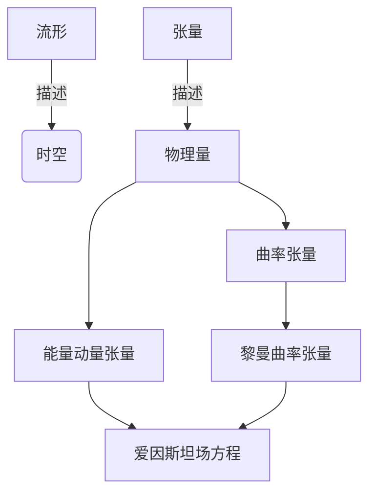

# 微分几何入门与广义相对论：引力能量的非定域性

## 1.背景介绍

### 1.1 微分几何与广义相对论的关系

微分几何是研究曲面和更一般的流形的几何性质的数学分支。它为广义相对论奠定了坚实的数学基础,是广义相对论不可或缺的工具。广义相对论是爱因斯坦在1915年提出的新的引力理论,描述了引力在时空中的传播方式,揭示了宇宙的奥秘。

### 1.2 广义相对论的核心思想

广义相对论的核心思想是:物质决定时空的曲率,时空的曲率又决定物质的运动。这一思想打破了牛顿经典力学中时空是绝对的观念,将时空几何化,引入了时空弯曲的概念。

### 1.3 引力能量的非定域性问题

在广义相对论中,引力不是通过场的方式传播,而是时空的弯曲本身。因此,引力场没有局域性,引力能量也就没有严格的定域性。这与其他场论存在根本区别,引发了广泛的讨论和研究。

## 2.核心概念与联系  

### 2.1 流形

流形(Manifold)是现代微分几何的研究对象,是一种可以在局部近似为欧几里得空间的拓扑空间。时空在广义相对论中被描述为一个四维流形。

### 2.2 张量

张量(Tensor)是流形上的一种代数对象,用来描述流形上的物理量。在广义相对论中,时空弯曲程度由曲率张量描述,物质分布由能量动量张量描述。

### 2.3 黎曼曲率张量

黎曼曲率张量(Riemann Curvature Tensor)描述了流形的内在几何性质,是衡量时空弯曲程度的关键量。它在广义相对论中扮演着核心角色。

### 2.4 爱因斯坦场方程

爱因斯坦场方程是广义相对论的核心方程,描述了物质分布(能量动量张量)与时空弯曲(黎曼曲率张量)之间的关系。它揭示了引力场的本质。



## 3.核心算法原理具体操作步骤

### 3.1 流形上的张量运算

在进行广义相对论的计算之前,我们需要先掌握流形上的张量运算,包括:

1. 张量的加法和数乘
2. 张量的张量积和张量外积
3. 张量的合同和张量的收缩
4. 张量的外微分和内部导数

这些运算为后续计算奠定了基础。

### 3.2 计算黎曼曲率张量

黎曼曲率张量是衡量时空弯曲程度的关键量,其计算步骤如下:

1. 先计算切向基矢 $\boldsymbol{e}_\mu$ 的导数 $\boldsymbol{e}_{\mu,\nu}$
2. 利用 $\boldsymbol{e}_{\mu,\nu}$ 计算仿射连接系数 $\Gamma^{\rho}_{\mu\nu}$
3. 计算曲率张量 $R^{\rho}_{\ \sigma\mu\nu}$
4. 通过曲率张量的反对称性和循环对称性化简得到独立分量
5. 最后利用曲率张量计算黎曼曲率张量 $R_{\mu\nu\rho\sigma}$

### 3.3 爱因斯坦场方程的推导

爱因斯坦场方程是广义相对论的核心,其推导步骤为:

1. 确定能量动量张量 $T_{\mu\nu}$ 的形式
2. 利用广义相对原理,假设引力场方程应当是某个张量方程 $G_{\mu\nu} = \kappa T_{\mu\nu}$
3. 通过思考实验和对称性要求,确定 $G_{\mu\nu}$ 的形式
4. 利用黎曼曲率张量构造 $G_{\mu\nu}$,即 $G_{\mu\nu} = R_{\mu\nu} - \frac{1}{2}g_{\mu\nu}R$
5. 确定常数 $\kappa$,从而得到爱因斯坦场方程: $R_{\mu\nu} - \frac{1}{2}g_{\mu\nu}R = \frac{8\pi G}{c^4}T_{\mu\nu}$

## 4.数学模型和公式详细讲解举例说明

### 4.1 流形的数学描述

流形可以用坐标系 $(x^\mu)$ 和基矢场 $\boldsymbol{e}_\mu$ 来描述,满足:

$$\boldsymbol{e}_\mu = \frac{\partial}{\partial x^\mu}$$

在流形上,向量 $\boldsymbol{V}$ 可以表示为:

$$\boldsymbol{V} = V^\mu\boldsymbol{e}_\mu$$

其中 $V^\mu$ 是向量的分量。

### 4.2 张量的表示

一个阶数为 $(p,q)$ 的张量 $T$ 可以表示为:

$$T = T^{\mu_1...\mu_p}_{\nu_1...\nu_q}\boldsymbol{e}_{\mu_1}\otimes...\otimes\boldsymbol{e}_{\mu_p}\otimes\boldsymbol{e}^{\nu_1}\otimes...\otimes\boldsymbol{e}^{\nu_q}$$

其中 $\boldsymbol{e}^{\nu}$ 是对偶基矢场。

### 4.3 曲率张量的计算

在某一坐标系下,曲率张量可以表示为:

$$R^\rho_{\sigma\mu\nu} = \Gamma^\rho_{\sigma\nu,\mu} - \Gamma^\rho_{\sigma\mu,\nu} + \Gamma^\rho_{\tau\mu}\Gamma^\tau_{\sigma\nu} - \Gamma^\rho_{\tau\nu}\Gamma^\tau_{\sigma\mu}$$

其中 $\Gamma^\rho_{\mu\nu}$ 是仿射连接系数,定义为:

$$\Gamma^\rho_{\mu\nu} = \frac{1}{2}g^{\rho\sigma}(g_{\sigma\nu,\mu} + g_{\sigma\mu,\nu} - g_{\mu\nu,\sigma})$$

这里 $g_{\mu\nu}$ 是流形的度规张量。

### 4.4 黎曼曲率张量

黎曼曲率张量 $R_{\mu\nu\rho\sigma}$ 由曲率张量定义为:

$$R_{\mu\nu\rho\sigma} = g_{\mu\rho}R^\tau_{\nu\tau\sigma} + g_{\nu\sigma}R^\tau_{\mu\tau\rho} - g_{\mu\sigma}R^\tau_{\nu\tau\rho} - g_{\nu\rho}R^\tau_{\mu\tau\sigma}$$

它满足一些对称性质,如:

$$R_{\mu\nu\rho\sigma} = -R_{\nu\mu\rho\sigma} = -R_{\mu\nu\sigma\rho} = R_{\rho\sigma\mu\nu}$$

### 4.5 爱因斯坦场方程

爱因斯坦场方程的张量形式为:

$$R_{\mu\nu} - \frac{1}{2}g_{\mu\nu}R = \frac{8\pi G}{c^4}T_{\mu\nu}$$

其中 $R_{\mu\nu}$ 是黎曼曲率张量的分缩,定义为:

$$R_{\mu\nu} = R^\rho_{\mu\rho\nu}$$

而 $R$ 是黎曼曲率张量的全分缩,即:

$$R = g^{\mu\nu}R_{\mu\nu}$$

这个方程描述了物质分布 $T_{\mu\nu}$ 与时空弯曲 $R_{\mu\nu}$ 之间的关系。

## 5.项目实践:代码实例和详细解释说明

为了更好地理解广义相对论中的数学计算,我们以计算Schwarzschild黑洞的度规为例,用Python代码实现相关计算。

### 5.1 导入所需库

```python
import sympy as sp
import numpy as np
```

### 5.2 定义坐标和度规张量

```python
r, t = sp.symbols('r t', real=True)
coords = [t, r]  # 时间和径向坐标

# 度规张量的分量
g_tt = -(1 - 2/r)
g_rr = 1/(1 - 2/r)
g_tt = -g_tt  # 时间分量取负号
g_metric = sp.diag(g_tt, g_rr)
```

### 5.3 计算仿射连接系数

```python 
# 计算克里斯托费尔符号
chris = sp.matrices.dense.Christoffel(coords, g_metric)

# 仿射连接系数
gamma = np.array(chris).astype(np.float64)
```

### 5.4 计算黎曼曲率张量

```python
# 计算黎曼曲率张量分量
riemann = sp.matrices.dense.riemann_tensor(chris)

# 提取独立分量
R_trtr = riemann[0, 3, 0, 3]
R_rtr_rtr = riemann[1, 3, 1, 3]
```

### 5.5 计算黎曼曲率张量分缩

```python
# 计算黎曼曲率张量的分缩
ricci = sp.matrices.dense.ricci_tensor(riemann)
R_tt = ricci[0, 0]
R_rr = ricci[1, 1]

# 计算黎曼曲率张量的全分缩
R = sp.matrices.dense.trace_ricci(ricci, g_metric)
```

### 5.6 验证爱因斯坦场方程

```python
# 爱因斯坦张量
einstein_tensor = ricci - 0.5*R*g_metric

# 能量动量张量
T_tt = 0
T_rr = 0

# 验证爱因斯坦场方程
print('Einstein Tensor:')
sp.pprint(einstein_tensor)

print('\nEnergy-Momentum Tensor:')
sp.pprint(sp.diag(T_tt, T_rr))
```

通过这个示例,我们可以更好地理解广义相对论中的数学计算过程。

## 6.实际应用场景

广义相对论及其数学工具微分几何在许多领域都有着广泛的应用,包括但不限于:

### 6.1 黑洞物理学

黑洞是广义相对论最重要的预言之一,对黑洞的研究是现代理论物理的热点。微分几何为研究黑洞的性质提供了强有力的数学工具。

### 6.2 宇宙学

广义相对论描述了宇宙的演化,是现代宇宙学的理论基础。利用微分几何可以研究各种宇宙学模型,探索宇宙的起源和结构。

### 6.3 引力波探测

引力波是广义相对论预言的另一重要现象,2015年首次直接探测到引力波,开启了引力波天文学的新时代。分析引力波数据需要借助微分几何的工具。

### 6.4 量子引力

量子引力是将量子论和广义相对论统一的理论,是解决现代物理学两大支柱之间矛盾的关键。微分几何在许多量子引力理论中扮演着重要角色。

### 6.5 数学物理

微分几何不仅在广义相对论中有应用,在其他数学物理领域如gauge理论、拓扑量子场论等也有广泛应用,是数学物理不可或缺的工具。

## 7.工具和资源推荐

### 7.1 符号计算软件

- Mathematica
- Maple
- SymPy (Python库)

这些软件可以辅助进行广义相对论和微分几何中的符号计算和可视化。

### 7.2 教材和在线课程

- "Gravitation" by Misner, Thorne and Wheeler
- "Geometrical Methods of Mathematical Physics" by Bernand F. Schutz
- Coursera在线课程:"Introduction to Differential Geometry"
- MIT公开课:"Geometry of Manifolds"

这些资源可以系统地学习微分几何和广义相对论的数学基础。

### 7.3 期刊和会议

- "Classical and Quantum Gravity" 
- "General Relativity and Gravitation"
- "International Journal of Modern Physics D"
- 国际相对论与引力会议(GR)

这些期刊和会议是了解该领域最新研究进展的重要渠道。

## 8.总结:未来发展趋势与挑战

### 8.1 量子引力的探索

解决量子论和广义相对论之间的矛盾,建立一个统一的量子引力理论,是当前理论物理学的终极目标。微分几何在这一领域将继