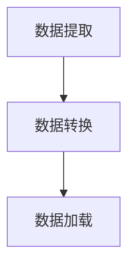
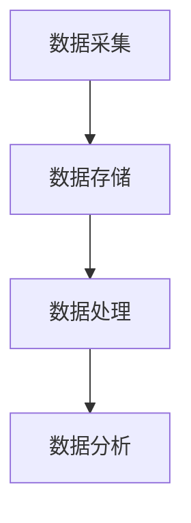

# 数据仓库与数据湖原理与代码实战案例讲解

## 1.背景介绍

在大数据时代，数据已经成为企业最重要的资产之一。如何高效地存储、管理和分析这些数据，成为了企业在数字化转型过程中必须解决的关键问题。数据仓库和数据湖作为两种主要的数据存储和管理方式，分别在不同的应用场景中发挥着重要作用。

数据仓库是一种面向分析的数据库系统，主要用于存储和管理结构化数据。它通过ETL（Extract, Transform, Load）过程，将数据从多个源系统中提取、转换并加载到数据仓库中，以便进行复杂的查询和分析。

数据湖则是一种更加灵活的数据存储方式，能够存储结构化、半结构化和非结构化数据。数据湖通常基于分布式文件系统，如Hadoop HDFS，能够处理大规模的数据存储和计算需求。

本文将深入探讨数据仓库和数据湖的核心概念、算法原理、数学模型、实际应用场景以及代码实例，帮助读者全面理解这两种数据管理方式，并提供实用的技术指导。

## 2.核心概念与联系

### 2.1 数据仓库

数据仓库是一种面向分析的数据库系统，主要用于存储和管理结构化数据。其核心特点包括：

- **面向主题**：数据仓库中的数据是按照主题进行组织的，如销售、客户、产品等。
- **集成性**：数据仓库中的数据来自多个源系统，通过ETL过程进行集成。
- **稳定性**：数据仓库中的数据是稳定的，不会频繁更新。
- **时变性**：数据仓库中的数据包含时间维度，能够反映数据的历史变化。

### 2.2 数据湖

数据湖是一种更加灵活的数据存储方式，能够存储结构化、半结构化和非结构化数据。其核心特点包括：

- **大规模存储**：数据湖能够处理大规模的数据存储需求，通常基于分布式文件系统。
- **多样性**：数据湖能够存储各种类型的数据，包括文本、图像、视频等。
- **灵活性**：数据湖支持多种数据处理和分析工具，能够满足不同的业务需求。
- **低成本**：数据湖的存储成本相对较低，适合存储大量的原始数据。

### 2.3 数据仓库与数据湖的联系

数据仓库和数据湖在数据管理中各有优势，通常可以结合使用。数据湖可以作为数据仓库的前置存储，存储大量的原始数据，而数据仓库则用于存储经过清洗和转换的结构化数据，以便进行高效的查询和分析。

## 3.核心算法原理具体操作步骤

### 3.1 数据仓库的ETL过程

ETL（Extract, Transform, Load）是数据仓库的核心过程，主要包括以下步骤：

1. **数据提取（Extract）**：从多个源系统中提取数据。
2. **数据转换（Transform）**：对提取的数据进行清洗、转换和集成。
3. **数据加载（Load）**：将转换后的数据加载到数据仓库中。

以下是ETL过程的Mermaid流程图：



### 3.2 数据湖的数据处理流程

数据湖的数据处理流程通常包括以下步骤：

1. **数据采集**：从多个数据源中采集数据。
2. **数据存储**：将采集的数据存储到数据湖中。
3. **数据处理**：使用分布式计算框架（如Apache Spark）对数据进行处理和分析。
4. **数据分析**：使用数据分析工具（如Apache Hive）对处理后的数据进行查询和分析。

以下是数据湖的数据处理流程的Mermaid流程图：



## 4.数学模型和公式详细讲解举例说明

### 4.1 数据仓库中的星型模型和雪花模型

数据仓库中的数据通常按照星型模型或雪花模型进行组织。

#### 星型模型

星型模型是一种简单的数据模型，中心是事实表，周围是维度表。事实表存储业务事件的数据，维度表存储描述业务事件的属性。

$$
\text{事实表} = \{ \text{业务事件} \}
$$

#### 雪花模型

雪花模型是星型模型的扩展，维度表进一步规范化，形成多个层次的维度表。

$$
\text{维度表} = \{ \text{属性} \}
$$

### 4.2 数据湖中的MapReduce模型

MapReduce是一种分布式计算模型，主要用于大规模数据处理。其核心思想是将数据处理任务分为Map和Reduce两个阶段。

#### Map阶段

Map阶段将输入数据分割成多个小块，并对每个小块进行处理，生成中间结果。

$$
\text{Map}(k_1, v_1) \rightarrow \{(k_2, v_2)\}
$$

#### Reduce阶段

Reduce阶段对中间结果进行合并，生成最终结果。

$$
\text{Reduce}(k_2, \{v_2\}) \rightarrow \{(k_3, v_3)\}
$$

## 5.项目实践：代码实例和详细解释说明

### 5.1 数据仓库的ETL代码实例

以下是一个简单的ETL代码实例，使用Python和Pandas库进行数据提取、转换和加载。

```python
import pandas as pd

# 数据提取
def extract_data(file_path):
    data = pd.read_csv(file_path)
    return data

# 数据转换
def transform_data(data):
    data['date'] = pd.to_datetime(data['date'])
    data['sales'] = data['sales'].astype(float)
    return data

# 数据加载
def load_data(data, db_connection):
    data.to_sql('sales_data', db_connection, if_exists='replace', index=False)

# 主函数
def main():
    file_path = 'sales_data.csv'
    db_connection = 'sqlite:///sales_data.db'
    
    data = extract_data(file_path)
    transformed_data = transform_data(data)
    load_data(transformed_data, db_connection)

if __name__ == '__main__':
    main()
```

### 5.2 数据湖的数据处理代码实例

以下是一个简单的数据湖数据处理代码实例，使用Apache Spark进行数据处理和分析。

```python
from pyspark.sql import SparkSession

# 创建SparkSession
spark = SparkSession.builder.appName('DataLakeExample').getOrCreate()

# 数据采集
data = spark.read.csv('hdfs://path/to/data.csv', header=True, inferSchema=True)

# 数据处理
data = data.withColumn('date', data['date'].cast('date'))
data = data.withColumn('sales', data['sales'].cast('float'))

# 数据分析
data.createOrReplaceTempView('sales_data')
result = spark.sql('SELECT date, SUM(sales) as total_sales FROM sales_data GROUP BY date')

# 显示结果
result.show()

# 停止SparkSession
spark.stop()
```

## 6.实际应用场景

### 6.1 数据仓库的应用场景

- **商业智能**：数据仓库用于存储和分析企业的业务数据，支持决策制定。
- **报表生成**：数据仓库能够生成各种业务报表，提供数据支持。
- **数据挖掘**：数据仓库中的数据可以用于数据挖掘，发现潜在的业务模式和趋势。

### 6.2 数据湖的应用场景

- **大数据分析**：数据湖能够存储和处理大规模的数据，支持复杂的数据分析任务。
- **机器学习**：数据湖中的数据可以用于训练机器学习模型，提升模型的准确性。
- **数据存档**：数据湖能够存储大量的原始数据，作为数据存档使用。

## 7.工具和资源推荐

### 7.1 数据仓库工具

- **Amazon Redshift**：一种基于云的数据仓库服务，支持大规模数据存储和分析。
- **Google BigQuery**：一种基于云的数据仓库服务，支持快速的SQL查询和分析。
- **Snowflake**：一种基于云的数据仓库服务，支持弹性扩展和高性能查询。

### 7.2 数据湖工具

- **Apache Hadoop**：一种分布式文件系统和计算框架，支持大规模数据存储和处理。
- **Apache Spark**：一种分布式计算框架，支持大规模数据处理和分析。
- **Amazon S3**：一种基于云的对象存储服务，适合作为数据湖的存储层。

## 8.总结：未来发展趋势与挑战

### 8.1 未来发展趋势

- **融合发展**：数据仓库和数据湖的融合发展将成为趋势，企业将同时利用两者的优势，构建更加灵活和高效的数据管理体系。
- **云计算**：云计算将进一步推动数据仓库和数据湖的发展，提供更加弹性和高效的存储和计算资源。
- **智能化**：人工智能和机器学习技术将进一步应用于数据仓库和数据湖，提升数据处理和分析的智能化水平。

### 8.2 挑战

- **数据质量**：如何保证数据的质量和一致性，是数据仓库和数据湖面临的主要挑战。
- **数据安全**：如何保护数据的安全和隐私，是数据仓库和数据湖需要解决的重要问题。
- **性能优化**：如何提升数据处理和分析的性能，是数据仓库和数据湖需要持续优化的方向。

## 9.附录：常见问题与解答

### 9.1 数据仓库和数据湖的区别是什么？

数据仓库主要用于存储和管理结构化数据，支持复杂的查询和分析。数据湖则能够存储结构化、半结构化和非结构化数据，支持大规模的数据存储和处理。

### 9.2 数据仓库和数据湖可以结合使用吗？

是的，数据仓库和数据湖可以结合使用。数据湖可以作为数据仓库的前置存储，存储大量的原始数据，而数据仓库则用于存储经过清洗和转换的结构化数据，以便进行高效的查询和分析。

### 9.3 如何选择数据仓库和数据湖工具？

选择数据仓库和数据湖工具时，需要考虑数据规模、数据类型、业务需求和预算等因素。可以根据具体的应用场景选择合适的工具，如Amazon Redshift、Google BigQuery、Apache Hadoop等。

### 9.4 数据仓库和数据湖的性能如何优化？

数据仓库和数据湖的性能优化可以从数据模型设计、索引优化、查询优化、存储优化等方面入手。可以使用分区、压缩、缓存等技术提升数据处理和分析的性能。

### 9.5 数据仓库和数据湖的安全性如何保障？

数据仓库和数据湖的安全性可以通过访问控制、数据加密、审计日志等措施保障。可以使用身份验证、权限管理、数据加密等技术保护数据的安全和隐私。

---

作者：禅与计算机程序设计艺术 / Zen and the Art of Computer Programming