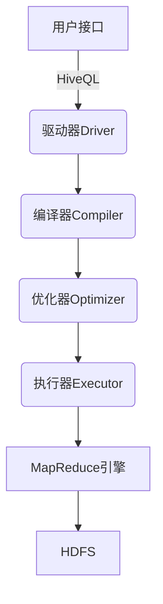

# Hive原理与代码实例讲解

## 1.背景介绍

Apache Hive是一种基于Hadoop的数据仓库工具,它允许使用类似SQL的语言(HiveQL)来处理存储在Hadoop分布式文件系统(HDFS)中的大数据集。Hive的出现,使得数据分析师和传统的SQL程序员无需直接编写MapReduce程序,即可方便地对Hadoop中的数据进行分析和处理。

Hive的核心是将HiveQL语句转换为一系列的MapReduce作业,然后在Hadoop集群上执行。它支持多种数据格式,包括文本文件、SequenceFile和RCFile等,并提供了一系列的内置函数、窗口函数和用户自定义函数(UDF),使得数据处理和分析变得更加高效和灵活。

### 1.1 Hive的优势

- **SQL友好**:Hive使用类似SQL的查询语言HiveQL,降低了编程门槛,使得开发人员无需掌握复杂的MapReduce编程即可进行大数据分析。
- **可扩展性**:Hive建立在Hadoop之上,可以利用Hadoop的分布式计算能力,轻松应对大规模数据处理任务。
- **容错性**:Hadoop的容错机制确保了Hive在节点出现故障时仍能继续工作,提高了系统的可靠性。
- **成本低廉**:Hive基于开源的Hadoop,可以在商用硬件上运行,降低了系统的总体拥有成本(TCO)。

### 1.2 Hive的局限性

- **高延迟**:Hive是针对批处理设计的,不适合需要低延迟响应的场景,如联机事务处理(OLTP)。
- **不支持更新操作**:Hive中的数据是静态的,不支持记录级别的更新和删除操作。
- **资源消耗大**:每个Hive查询都需要启动一个新的MapReduce作业,消耗较多的资源。

## 2.核心概念与联系

### 2.1 Hive的体系结构

Hive的体系结构主要由以下几个核心组件组成:



1. **用户接口**:用户可以通过命令行(CLI)、JDBC/ODBC或Web UI等方式与Hive进行交互,提交HiveQL查询语句。

2. **驱动器(Driver)**:驱动器负责接收HiveQL语句,并与编译器、优化器和执行器等其他组件进行交互,协调整个查询的执行过程。

3. **编译器(Compiler)**:编译器将HiveQL语句转换为一系列的抽象语法树(AST),并生成相应的查询计划。

4. **优化器(Optimizer)**:优化器根据一定的规则对查询计划进行优化,以提高查询的执行效率。

5. **执行器(Executor)**:执行器负责将优化后的查询计划转换为一个或多个MapReduce作业,并提交到Hadoop集群上执行。

6. **MapReduce引擎**:Hadoop的MapReduce引擎负责实际执行MapReduce作业,处理HDFS中的数据。

7. **HDFS**:Hadoop分布式文件系统(HDFS)用于存储Hive中的数据。

### 2.2 Hive的数据模型

Hive中的数据模型与传统的关系数据库管理系统(RDBMS)类似,包括以下几个核心概念:

- **数据库(Database)**:用于存放相关的表,相当于RDBMS中的数据库。
- **表(Table)**:表是存储数据的核心单元,每个表都有一个关联的数据存储路径。
- **分区(Partition)**:表可以根据一个或多个列的值进行分区,每个分区都是表中一个独立的目录。
- **桶(Bucket)**:表也可以根据哈希函数对某些列的值进行桶化,将数据均匀分布到多个桶中。

Hive中的表可以存储在多种不同的文件格式中,包括文本文件、SequenceFile、RCFile等。用户可以根据需求选择合适的文件格式来存储数据。

## 3.核心算法原理具体操作步骤

Hive在执行查询时,会将HiveQL语句转换为一系列的MapReduce作业,并在Hadoop集群上并行执行。这个过程主要包括以下几个步骤:

### 3.1 语法分析和语义分析

1. 用户提交HiveQL语句。
2. 驱动器(Driver)将HiveQL语句传递给编译器(Compiler)进行语法分析和语义分析。
3. 编译器将HiveQL语句解析为抽象语法树(AST)。
4. 编译器对AST进行类型检查、列投影等语义分析,生成逻辑查询计划。

### 3.2 查询优化

1. 优化器(Optimizer)对逻辑查询计划进行一系列的优化,包括投影剪裁、谓词下推、列裁剪等。
2. 优化器应用基于规则和基于成本的优化策略,生成优化后的逻辑查询计划。
3. 优化器将优化后的逻辑查询计划转换为物理查询计划。

### 3.3 执行MapReduce作业

1. 执行器(Executor)根据物理查询计划生成一个或多个MapReduce作业。
2. 执行器将MapReduce作业提交到Hadoop集群上执行。
3. MapReduce引擎在集群节点上并行执行Map和Reduce任务。
4. MapReduce引擎从HDFS读取输入数据,执行Map和Reduce操作,并将结果写回HDFS。

### 3.4 结果返回

1. 执行器从HDFS读取MapReduce作业的输出结果。
2. 执行器对结果进行后处理,如格式化、过滤等。
3. 执行器将最终结果返回给驱动器(Driver)。
4. 驱动器将结果呈现给用户。

## 4.数学模型和公式详细讲解举例说明

在Hive中,一些常见的数学模型和公式包括:

### 4.1 MapReduce成本模型

MapReduce成本模型用于估计MapReduce作业的执行成本,从而指导查询优化器进行优化决策。该模型考虑了多个因素,包括输入数据大小、Map和Reduce任务数量、数据传输开销等。

成本模型的核心公式如下:

$$
Cost = C_{io} \times (Input\_Size + Output\_Size) + C_{cpu} \times (Map\_Time + Reduce\_Time)
$$

其中:

- $C_{io}$是I/O成本系数,表示每传输1字节数据的成本。
- $Input\_Size$和$Output\_Size$分别表示MapReduce作业的输入和输出数据大小。
- $C_{cpu}$是CPU成本系数,表示每消耗1秒CPU时间的成本。
- $Map\_Time$和$Reduce\_Time$分别表示Map和Reduce阶段的执行时间。

优化器会根据这个成本模型,选择具有最小成本的执行计划。

### 4.2 数据采样

在查询优化过程中,Hive会使用数据采样技术来估计查询结果的基本统计信息,如行数、数据分布等。这些统计信息对于选择合适的查询计划至关重要。

常用的数据采样方法包括:

- 随机采样:从数据集中随机选取一部分数据作为样本。
- 分组采样:根据某些列的值对数据进行分组,然后从每个组中采样。

采样的基本公式为:

$$
n = \frac{N}{1 + N \times e^2}
$$

其中:

- $n$是所需的样本大小。
- $N$是数据集的总行数。
- $e$是允许的误差范围,通常取值0.01~0.1。

通过调整误差范围$e$,可以控制样本的大小和精确度之间的平衡。

### 4.3 数据分桶

Hive支持对表进行分桶(Bucketing),即根据某些列的哈希值将数据分布到不同的桶中。分桶可以提高查询效率,特别是在处理基于特定列的连接或聚合操作时。

分桶的公式为:

$$
Bucket\_Number = Hash\_Function(x) \bmod Total\_Buckets
$$

其中:

- $Bucket\_Number$是要分配的桶编号。
- $Hash\_Function(x)$是对列值$x$应用的哈希函数,通常使用murmur哈希。
- $Total\_Buckets$是总的桶数量。

通过调整$Total\_Buckets$的值,可以控制桶的数量和数据分布的均匀程度。

## 5.项目实践:代码实例和详细解释说明

### 5.1 创建表

```sql
CREATE TABLE sales (
    sale_id BIGINT,
    product_id INT,
    customer_id INT,
    sale_date STRING,
    sale_amount DOUBLE
)
PARTITIONED BY (year INT, month INT)
CLUSTERED BY (product_id) INTO 16 BUCKETS
STORED AS ORC;
```

上述语句创建了一个名为`sales`的表,包含以下列:

- `sale_id`:销售记录ID
- `product_id`:产品ID
- `customer_id`:客户ID
- `sale_date`:销售日期
- `sale_amount`:销售金额

该表按照`year`和`month`两个列进行分区,并且根据`product_id`列对数据进行分桶,分为16个桶。数据以ORC格式存储,以提高查询效率。

### 5.2 加载数据

```sql
LOAD DATA INPATH '/data/sales/2022/01' INTO TABLE sales PARTITION (year=2022, month=1);
LOAD DATA INPATH '/data/sales/2022/02' INTO TABLE sales PARTITION (year=2022, month=2);
```

上述语句将HDFS路径`/data/sales/2022/01`和`/data/sales/2022/02`下的数据加载到`sales`表的相应分区中。

### 5.3 查询示例

```sql
SELECT product_id, SUM(sale_amount) AS total_sales
FROM sales
WHERE year = 2022 AND month = 1
GROUP BY product_id;
```

该查询语句计算2022年1月每个产品的总销售额。由于表已经按照`product_id`列进行了分桶,因此Hive可以高效地执行该查询,无需进行额外的数据洗牌(Shuffle)操作。

### 5.4 连接查询

```sql
SELECT s.product_id, p.product_name, SUM(s.sale_amount) AS total_sales
FROM sales s
JOIN product p ON s.product_id = p.product_id
WHERE s.year = 2022 AND s.month = 1
GROUP BY s.product_id, p.product_name;
```

该查询语句计算2022年1月每个产品的总销售额,并显示产品名称。由于`sales`表和`product`表都按照`product_id`列进行了分桶,因此Hive可以高效地执行该连接查询,无需进行全表扫描。

## 6.实际应用场景

Hive广泛应用于以下场景:

1. **数据仓库**:Hive可以作为企业数据仓库的有效补充,用于存储和分析来自各种来源的结构化和半结构化数据。

2. **日志分析**:Hive非常适合处理网站、应用程序和服务器日志等大规模日志数据,可以对日志进行清洗、过滤、聚合和分析。

3. **网络数据分析**:Hive可用于分析来自社交网络、搜索引擎和在线广告系统等的海量网络数据,挖掘有价值的信息。

4. **机器学习和数据挖掘**:Hive可以与Apache Spark、TensorFlow等机器学习框架集成,为机器学习算法提供大规模的训练数据和特征工程支持。

5. **ETL过程**:Hive可以用于构建数据提取、转换和加载(ETL)流程,从各种数据源提取数据,进行清洗和转换,最终加载到数据仓库或其他系统中。

## 7.工具和资源推荐

### 7.1 Hive CLI

Hive CLI是Hive自带的命令行界面,用于执行HiveQL语句。它提供了一个交互式的Shell环境,方便用户进行数据探索和查询。

### 7.2 Hive Web UI

Hive Web UI是一个基于Web的图形用户界面,它允许用户通过浏览器提交和监控Hive查询。Web UI提供了查询历史、作业监控和资源管理等功能。

### 7.3 Hive JDBC/ODBC驱动程序

Hive提供了JDBC和ODBC驱动程序,使得其他应用程序和工具(如BI工具)可以通过标准的SQL接