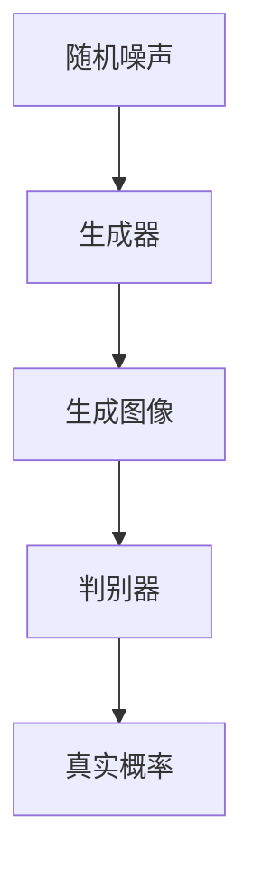
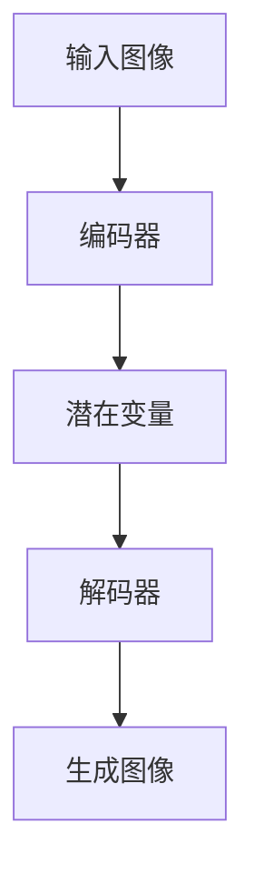

# 图像生成(Image Generation) - 原理与代码实例讲解

## 1.背景介绍

图像生成技术近年来取得了显著的进展，尤其是在深度学习和生成对抗网络（GANs）的推动下。图像生成不仅在学术研究中占据重要地位，还在实际应用中展现了巨大的潜力，如自动驾驶、医疗影像分析、艺术创作等。本文将深入探讨图像生成的核心概念、算法原理、数学模型，并通过代码实例展示其实际应用。

## 2.核心概念与联系

### 2.1 图像生成的定义

图像生成是指通过计算机算法生成新的图像数据，这些图像可以是完全虚构的，也可以是基于现有图像进行变换和增强。图像生成的目标是使生成的图像在视觉上尽可能逼真。

### 2.2 生成对抗网络（GANs）

GANs是图像生成领域的一个重要突破。GANs由两个神经网络组成：生成器（Generator）和判别器（Discriminator）。生成器负责生成图像，而判别器则负责区分生成的图像和真实图像。两者通过对抗训练不断提升生成图像的质量。

### 2.3 自编码器（Autoencoders）

自编码器是一种无监督学习模型，通过编码器将输入图像压缩成低维表示，再通过解码器重建图像。变分自编码器（VAE）是自编码器的一种变体，能够生成新的图像。

### 2.4 图像生成与图像处理的区别

图像生成侧重于从无到有地生成新图像，而图像处理则是对已有图像进行变换和增强。两者在技术上有交集，但目标和应用场景不同。

## 3.核心算法原理具体操作步骤

### 3.1 生成对抗网络（GANs）

#### 3.1.1 GANs的基本结构

GANs由生成器和判别器组成。生成器接受随机噪声作为输入，生成图像；判别器则接受图像作为输入，输出图像是真实的概率。



#### 3.1.2 GANs的训练过程

1. 初始化生成器和判别器的参数。
2. 使用真实图像训练判别器，使其能够区分真实图像和生成图像。
3. 使用生成器生成图像，并训练判别器，使其无法区分生成图像和真实图像。
4. 交替训练生成器和判别器，直到生成图像足够逼真。

### 3.2 变分自编码器（VAE）

#### 3.2.1 VAE的基本结构

VAE由编码器和解码器组成。编码器将输入图像压缩成潜在变量，解码器则从潜在变量生成图像。



#### 3.2.2 VAE的训练过程

1. 使用编码器将输入图像压缩成潜在变量。
2. 从潜在变量生成图像，并计算重建误差。
3. 使用重建误差和KL散度作为损失函数，优化编码器和解码器的参数。

## 4.数学模型和公式详细讲解举例说明

### 4.1 GANs的数学模型

GANs的目标是通过优化生成器和判别器的参数，使生成图像的分布尽可能接近真实图像的分布。其损失函数定义为：

$$
\min_G \max_D V(D, G) = \mathbb{E}_{x \sim p_{data}(x)}[\log D(x)] + \mathbb{E}_{z \sim p_z(z)}[\log(1 - D(G(z)))]
$$

其中，$G$ 是生成器，$D$ 是判别器，$p_{data}(x)$ 是真实图像的分布，$p_z(z)$ 是噪声的分布。

### 4.2 VAE的数学模型

VAE的目标是通过最大化似然函数，使生成图像的分布尽可能接近真实图像的分布。其损失函数定义为：

$$
\mathcal{L} = \mathbb{E}_{q(z|x)}[\log p(x|z)] - KL(q(z|x) || p(z))
$$

其中，$q(z|x)$ 是编码器的输出分布，$p(x|z)$ 是解码器的输出分布，$KL$ 是KL散度。

## 5.项目实践：代码实例和详细解释说明

### 5.1 GANs的代码实例

以下是一个简单的GANs实现示例，使用TensorFlow和Keras库：

```python
import tensorflow as tf
from tensorflow.keras import layers

# 生成器模型
def build_generator():
    model = tf.keras.Sequential()
    model.add(layers.Dense(256, input_dim=100))
    model.add(layers.LeakyReLU(alpha=0.2))
    model.add(layers.Dense(512))
    model.add(layers.LeakyReLU(alpha=0.2))
    model.add(layers.Dense(1024))
    model.add(layers.LeakyReLU(alpha=0.2))
    model.add(layers.Dense(28 * 28 * 1, activation='tanh'))
    model.add(layers.Reshape((28, 28, 1)))
    return model

# 判别器模型
def build_discriminator():
    model = tf.keras.Sequential()
    model.add(layers.Flatten(input_shape=(28, 28, 1)))
    model.add(layers.Dense(512))
    model.add(layers.LeakyReLU(alpha=0.2))
    model.add(layers.Dense(256))
    model.add(layers.LeakyReLU(alpha=0.2))
    model.add(layers.Dense(1, activation='sigmoid'))
    return model

# 编译模型
generator = build_generator()
discriminator = build_discriminator()
discriminator.compile(loss='binary_crossentropy', optimizer='adam', metrics=['accuracy'])

# 构建GAN模型
z = layers.Input(shape=(100,))
img = generator(z)
discriminator.trainable = False
valid = discriminator(img)
combined = tf.keras.Model(z, valid)
combined.compile(loss='binary_crossentropy', optimizer='adam')

# 训练GAN模型
import numpy as np

(X_train, _), (_, _) = tf.keras.datasets.mnist.load_data()
X_train = (X_train.astype(np.float32) - 127.5) / 127.5
X_train = np.expand_dims(X_train, axis=3)

valid = np.ones((batch_size, 1))
fake = np.zeros((batch_size, 1))

for epoch in range(epochs):
    idx = np.random.randint(0, X_train.shape[0], batch_size)
    imgs = X_train[idx]

    noise = np.random.normal(0, 1, (batch_size, 100))
    gen_imgs = generator.predict(noise)

    d_loss_real = discriminator.train_on_batch(imgs, valid)
    d_loss_fake = discriminator.train_on_batch(gen_imgs, fake)
    d_loss = 0.5 * np.add(d_loss_real, d_loss_fake)

    noise = np.random.normal(0, 1, (batch_size, 100))
    g_loss = combined.train_on_batch(noise, valid)

    print(f"{epoch} [D loss: {d_loss[0]}] [G loss: {g_loss}]")
```

### 5.2 VAE的代码实例

以下是一个简单的VAE实现示例，使用TensorFlow和Keras库：

```python
import tensorflow as tf
from tensorflow.keras import layers

# 编码器模型
def build_encoder(input_shape, latent_dim):
    inputs = tf.keras.Input(shape=input_shape)
    x = layers.Flatten()(inputs)
    x = layers.Dense(512, activation='relu')(x)
    x = layers.Dense(256, activation='relu')(x)
    z_mean = layers.Dense(latent_dim)(x)
    z_log_var = layers.Dense(latent_dim)(x)
    return tf.keras.Model(inputs, [z_mean, z_log_var])

# 解码器模型
def build_decoder(latent_dim, output_shape):
    inputs = tf.keras.Input(shape=(latent_dim,))
    x = layers.Dense(256, activation='relu')(inputs)
    x = layers.Dense(512, activation='relu')(x)
    x = layers.Dense(np.prod(output_shape), activation='sigmoid')(x)
    outputs = layers.Reshape(output_shape)(x)
    return tf.keras.Model(inputs, outputs)

# VAE模型
class VAE(tf.keras.Model):
    def __init__(self, encoder, decoder, **kwargs):
        super(VAE, self).__init__(**kwargs)
        self.encoder = encoder
        self.decoder = decoder

    def call(self, inputs):
        z_mean, z_log_var = self.encoder(inputs)
        batch = tf.shape(z_mean)[0]
        dim = tf.shape(z_mean)[1]
        epsilon = tf.keras.backend.random_normal(shape=(batch, dim))
        z = z_mean + tf.exp(0.5 * z_log_var) * epsilon
        reconstructed = self.decoder(z)
        return reconstructed

# 编译和训练VAE模型
input_shape = (28, 28, 1)
latent_dim = 2
encoder = build_encoder(input_shape, latent_dim)
decoder = build_decoder(latent_dim, input_shape)
vae = VAE(encoder, decoder)

vae.compile(optimizer='adam', loss='binary_crossentropy')
(X_train, _), (_, _) = tf.keras.datasets.mnist.load_data()
X_train = X_train.astype('float32') / 255.
X_train = np.expand_dims(X_train, axis=-1)
vae.fit(X_train, X_train, epochs=50, batch_size=128)
```

## 6.实际应用场景

### 6.1 自动驾驶

在自动驾驶中，图像生成技术可以用于生成模拟环境中的图像数据，帮助训练和测试自动驾驶算法。这些生成的图像可以模拟各种天气、光照和交通状况，提高自动驾驶系统的鲁棒性。

### 6.2 医疗影像分析

在医疗影像分析中，图像生成技术可以用于生成高质量的医学图像，帮助医生进行诊断和治疗。例如，GANs可以用于生成高分辨率的MRI图像，辅助医生进行病变检测。

### 6.3 艺术创作

在艺术创作中，图像生成技术可以用于生成新的艺术作品，激发艺术家的创作灵感。例如，DeepArt和Prisma等应用使用深度学习技术将照片转换为艺术风格的图像。

### 6.4 数据增强

在机器学习中，图像生成技术可以用于数据增强，生成更多的训练数据，提高模型的泛化能力。例如，GANs可以用于生成新的训练样本，增强数据集的多样性。

## 7.工具和资源推荐

### 7.1 开源库

- TensorFlow: 一个广泛使用的深度学习框架，支持图像生成模型的实现。
- PyTorch: 另一个流行的深度学习框架，具有灵活的动态计算图和强大的社区支持。
- Keras: 一个高级神经网络API，能够快速构建和训练图像生成模型。

### 7.2 数据集

- MNIST: 一个手写数字数据集，常用于图像生成模型的训练和测试。
- CIFAR-10: 一个包含10类图像的数据集，适用于图像分类和生成任务。
- CelebA: 一个包含名人面部图像的数据集，常用于人脸生成和编辑任务。

### 7.3 在线资源

- Coursera: 提供深度学习和图像生成相关的在线课程。
- GitHub: 许多开源项目和代码示例，可以帮助理解和实现图像生成模型。
- arXiv: 最新的研究论文和技术报告，了解图像生成领域的前沿进展。

## 8.总结：未来发展趋势与挑战

图像生成技术在过去几年中取得了显著的进展，但仍面临许多挑战和机遇。未来的发展趋势包括：

### 8.1 更高质量的图像生成

随着深度学习技术的不断进步，图像生成的质量将不断提高。未来的图像生成模型将能够生成更加逼真和高分辨率的图像，满足更多实际应用的需求。

### 8.2 多模态生成

未来的图像生成技术将不仅限于生成单一模态的图像，还将能够生成多模态的数据。例如，生成图像和文本的结合，生成视频和音频的结合等。

### 8.3 生成模型的可解释性

当前的生成模型大多是黑箱模型，缺乏可解释性。未来的研究将致力于提高生成模型的可解释性，使其生成过程更加透明和可控。

### 8.4 生成模型的安全性

生成模型在实际应用中可能会带来安全性问题，例如生成虚假图像用于欺诈等。未来的研究将致力于提高生成模型的安全性，防止其被滥用。

## 9.附录：常见问题与解答

### 9.1 什么是图像生成？

图像生成是指通过计算机算法生成新的图像数据，这些图像可以是完全虚构的，也可以是基于现有图像进行变换和增强。

### 9.2 什么是生成对抗网络（GANs）？

GANs是图像生成领域的一个重要突破，由生成器和判别器组成，通过对抗训练生成逼真的图像。

### 9.3 什么是变分自编码器（VAE）？

VAE是一种无监督学习模型，通过编码器将输入图像压缩成潜在变量，再通过解码器重建图像，能够生成新的图像。

### 9.4 图像生成技术有哪些实际应用？

图像生成技术在自动驾驶、医疗影像分析、艺术创作和数据增强等领域有广泛的应用。

### 9.5 如何提高图像生成模型的质量？

可以通过改进模型结构、增加训练数据、使用更强大的计算资源等方法提高图像生成模型的质量。

---

作者：禅与计算机程序设计艺术 / Zen and the Art of Computer Programming