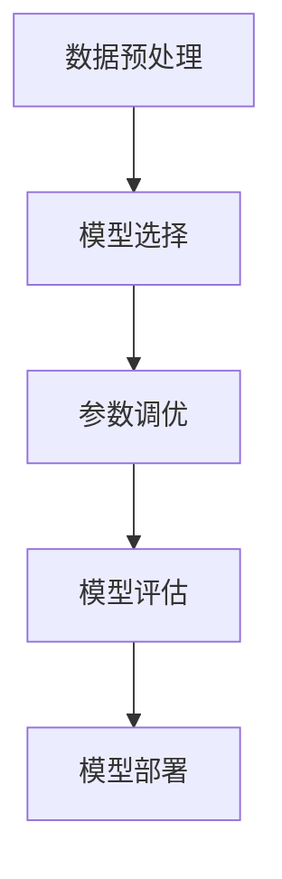

## 1.背景介绍

随着大数据时代的到来，机器学习已经成为了解决复杂问题的重要工具。然而，传统的机器学习方法需要专业的数据科学家手动选择和调整模型，这无疑增加了使用机器学习的难度。自动机器学习（AutoML）的出现，让机器学习变得更加易用和普及。

AutoML 是一种自动化的机器学习方法，它能够自动进行特征选择、模型选择和参数调优。这意味着，即使没有深厚的机器学习背景，我们也可以使用 AutoML 来解决复杂的问题。

## 2.核心概念与联系

AutoML 的核心是利用机器学习的方法来进行机器学习。简单来说，就是让机器自己学习如何学习。AutoML 主要包括以下几个步骤：

- 数据预处理：包括数据清洗、特征选择等。
- 模型选择：根据问题的特性和数据的特性自动选择最合适的模型。
- 参数调优：自动调整模型的参数，以获得最佳的模型性能。



## 3.核心算法原理具体操作步骤

AutoML 的核心算法原理主要包括贝叶斯优化、神经网络架构搜索（NAS）等。这里我们以贝叶斯优化为例，简单介绍一下 AutoML 的操作步骤。

贝叶斯优化是一种全局优化方法，主要用于优化黑箱函数。在 AutoML 中，我们通常将模型的性能视为黑箱函数，然后使用贝叶斯优化来寻找最优的模型和参数。

贝叶斯优化的步骤如下：

1. 定义目标函数：目标函数是我们要优化的对象，通常是模型的性能指标，如准确率、AUC 等。
2. 定义参数空间：参数空间是模型的所有可能的参数组合。
3. 初始化样本点：在参数空间中随机选择几个点，计算这些点的目标函数值。
4. 建立代理模型：根据已知的样本点，建立一个代理模型，通常使用高斯过程。
5. 选择下一个样本点：根据代理模型和已知的样本点，选择下一个样本点，通常使用 EI（Expected Improvement）准则。
6. 更新代理模型：计算新的样本点的目标函数值，然后更新代理模型。
7. 重复步骤5和6，直到满足停止条件。

## 4.数学模型和公式详细讲解举例说明

贝叶斯优化的数学模型主要包括目标函数、参数空间和代理模型。其中，代理模型通常使用高斯过程。

高斯过程是一种随机过程，其任意有限个数的随机变量都服从多元高斯分布。高斯过程可以用来描述不确定的函数，因此非常适合作为代理模型。

高斯过程的定义如下：

设 $X$ 是一个随机过程，如果对任意的 $n$ 和任意的 $t_1, t_2, \cdots, t_n$，都有

$$(X(t_1), X(t_2), \cdots, X(t_n)) \sim N(\mu(t), K(t, t'))$$

则称 $X$ 是高斯过程。

其中，$N(\mu(t), K(t, t'))$ 是多元高斯分布，$\mu(t)$ 是均值函数，$K(t, t')$ 是协方差函数。

在贝叶斯优化中，我们通常假设均值函数为0，协方差函数为高斯核函数：

$$K(t, t') = \exp(-\frac{(t - t')^2}{2l^2})$$

其中，$l$ 是长度参数，控制了函数的平滑程度。

## 5.项目实践：代码实例和详细解释说明

在 Python 中，我们可以使用 sklearn 的 `BayesianOptimization` 类来进行贝叶斯优化。以下是一个简单的例子：

```python
from sklearn.model_selection import cross_val_score
from sklearn.datasets import make_classification
from sklearn.ensemble import RandomForestClassifier
from bayes_opt import BayesianOptimization

# 生成数据
X, y = make_classification(n_samples=1000, n_features=20, n_informative=2, n_redundant=10, random_state=1)

# 定义目标函数
def rf_cv(n_estimators, min_samples_split, max_features):
    val = cross_val_score(
        RandomForestClassifier(n_estimators=int(n_estimators),
            min_samples_split=int(min_samples_split),
            max_features=min(max_features, 0.999),
            random_state=2
        ),
        X, y, 'roc_auc', cv=5
    ).mean()
    return val

# 定义参数空间
pbounds = {
    'n_estimators': (10, 250),
    'min_samples_split': (2, 25),
    'max_features': (0.1, 0.999),
}

# 初始化贝叶斯优化对象
optimizer = BayesianOptimization(
    f=rf_cv,
    pbounds=pbounds,
    random_state=1,
)

# 执行优化
optimizer.maximize(init_points=5, n_iter=10)
```

这段代码首先生成了一个分类问题的数据，然后定义了目标函数 `rf_cv`，这个函数使用随机森林模型对数据进行5折交叉验证，并返回 AUC 值。接着，定义了参数空间 `pbounds`，这个空间包括了随机森林模型的三个参数：`n_estimators`、`min_samples_split` 和 `max_features`。然后，初始化了一个 `BayesianOptimization` 对象，并执行了优化过程。

## 6.实际应用场景

AutoML 在许多实际应用中都有广泛的使用，例如：

- 金融风控：通过自动机器学习，可以自动构建和调优风控模型，提高风控的准确性。
- 广告投放：通过自动机器学习，可以自动优化广告的投放策略，提高广告的转化率。
- 自然语言处理：通过自动机器学习，可以自动选择和调优文本分类、情感分析等任务的模型。

## 7.工具和资源推荐

以下是一些推荐的 AutoML 工具和资源：

- 工具：Auto-sklearn、TPOT、H2O AutoML
- 资源：《Automated Machine Learning: Methods, Systems, Challenges》

## 8.总结：未来发展趋势与挑战

随着人工智能的发展，AutoML 的应用将会越来越广泛。然而，AutoML 也面临着一些挑战，例如如何处理大规模数据、如何保证模型的可解释性等。这些问题需要我们在未来的研究中去解决。

## 9.附录：常见问题与解答

Q: AutoML 是不是可以完全替代数据科学家？

A: 不是的，AutoML 只是一个工具，它可以帮助数据科学家更好地完成工作，但是无法替代数据科学家的专业知识和经验。

Q: AutoML 适合所有的机器学习问题吗？

A: 不是的，AutoML 主要适合于一些标准的机器学习问题，对于一些特殊的问题，可能需要专业的数据科学家来解决。

作者：禅与计算机程序设计艺术 / Zen and the Art of Computer Programming