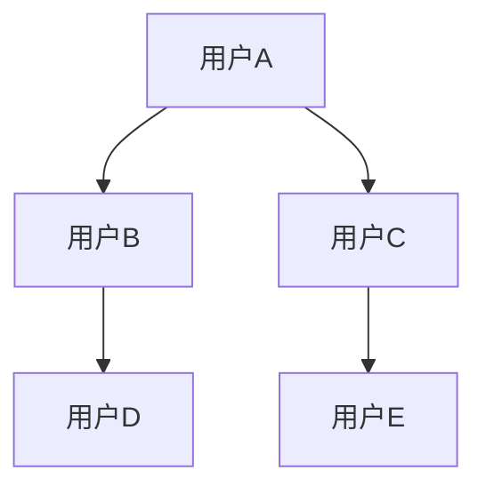

## Label Propagation标签传播算法原理与代码实例讲解

**关键词：**标签传播算法, 半监督学习, 图算法, 社区发现, 分类, 机器学习

## 1. 背景介绍

在机器学习领域，我们常常面临这样的情况：海量的数据唾手可得，但为这些数据打上标签却需要耗费大量的人力物力。这就是半监督学习出现的契机——它巧妙地利用少量已标记数据和大量未标记数据，试图突破监督学习对数据标注的过度依赖。而标签传播算法（Label Propagation Algorithm, LPA）作为半监督学习家族中的一员，以其简洁易懂、高效实用的特点，在众多算法中脱颖而出，成为解决分类和社区发现等问题的利器。

### 1.1 问题的由来

想象一下，我们想要对社交网络上的用户进行群体划分，比如将他们分成不同的兴趣小组。如果完全依靠人工标注，这将是一个极其庞大且耗时的工程。更糟糕的是，随着用户数量的不断增长，人工标注的成本和难度也会随之增加。那么，有没有一种方法可以利用已有的少量标注信息，自动地将标签传播到未标记的数据上呢？答案是肯定的，而这正是标签传播算法所要解决的问题。

### 1.2 研究现状

标签传播算法作为一种基于图的半监督学习方法，自提出以来就受到了学术界和工业界的广泛关注。近年来，研究人员在算法的理论基础、改进策略以及应用领域等方面都取得了一系列成果。例如，一些研究致力于提高算法的鲁棒性，使其能够更好地应对噪声数据；另一些研究则探索将标签传播算法与其他机器学习方法相结合，以进一步提升其性能。

### 1.3 研究意义

标签传播算法的研究意义主要体现在以下几个方面：

* **提高数据利用效率：**  标签传播算法可以充分利用未标记数据的信息，提高模型的学习效率，尤其是在标记数据稀缺的情况下。
* **揭示数据内在结构：**  算法通过标签传播的过程，可以发现数据中潜在的结构关系，例如社区结构、群体划分等。
* **广泛的应用价值：**  标签传播算法在文本分类、图像识别、社区发现、推荐系统等众多领域都有着广泛的应用价值。

### 1.4 本文结构

本文将带领读者逐步深入地了解标签传播算法。首先，我们将介绍算法的核心概念和基本原理，以及算法的详细步骤。然后，我们将通过数学模型和公式推导，深入剖析算法的内在机制。为了帮助读者更好地理解和应用算法，我们还将提供代码实例和详细的解释说明。最后，我们将探讨标签传播算法的实际应用场景、未来发展趋势以及面临的挑战。

## 2. 核心概念与联系

在正式介绍标签传播算法之前，我们需要先了解一些与其密切相关的核心概念，包括：

* **图论（Graph Theory）：**  标签传播算法建立在图论的基础之上，数据点被视为图中的节点，而数据点之间的关系则被抽象成图中的边。
* **半监督学习（Semi-supervised Learning）：**  标签传播算法是一种典型的半监督学习方法，它利用少量已标记数据和大量未标记数据来训练模型。
* **分类（Classification）：**  标签传播算法可以用于解决分类问题，即将数据点划分到不同的类别中。
* **社区发现（Community Detection）：**  标签传播算法可以用于发现数据中潜在的社区结构，即将具有相似特征的数据点聚集在一起。

这些概念相互关联，共同构成了标签传播算法的理论基础。

## 3. 核心算法原理 & 具体操作步骤

### 3.1 算法原理概述

标签传播算法的核心思想可以概括为“近朱者赤，近墨者黑”。通俗地说，如果两个数据点在图中距离很近（例如，它们之间存在一条边，或者它们之间存在一条路径且路径长度很短），那么它们就很有可能属于同一个类别。

算法的实现过程就像是在玩一个“传话游戏”：初始状态下，只有少部分数据点拥有标签，而大部分数据点没有标签；在每一轮迭代中，拥有标签的数据点会将自己的标签信息传递给它的邻居节点；随着迭代的进行，标签信息会逐渐传播到整个图中，最终使得大部分数据点都拥有了标签。

### 3.2 算法步骤详解

标签传播算法的具体操作步骤如下：

1. **构建图模型：**  将数据点表示为图中的节点，根据数据点之间的相似性或关系构建边，并为边赋予权重。
2. **初始化标签：**  为已标记的数据点赋予初始标签，而未标记的数据点则可以随机初始化标签，或者将其标签设置为未知。
3. **迭代更新标签：**  在每一轮迭代中，每个数据点根据其邻居节点的标签和边的权重来更新自己的标签。具体的更新规则有很多种，但核心思想都是倾向于将邻居节点中出现次数较多的标签赋予当前节点。
4. **收敛判断：**  当所有数据点的标签都不再发生变化，或者迭代次数达到预设的最大值时，算法停止迭代。

###  3.3 算法优缺点

**优点：**

* **简洁易懂：**  标签传播算法的原理简单直观，易于理解和实现。
* **高效实用：**  算法的计算复杂度较低，可以处理大规模的数据集。
* **无需参数调优：**  算法不需要过多的人工干预，可以自动学习数据的结构特征。

**缺点：**

* **对噪声敏感：**  如果数据集中存在噪声数据，可能会影响标签传播的结果。
* **收敛性问题：**  算法的收敛性难以保证，有时可能会陷入局部最优解。
* **对图结构敏感：**  算法的结果依赖于图的构建方式，不同的图构建方法可能会导致不同的结果。

### 3.4 算法应用领域

标签传播算法在以下领域都有着广泛的应用：

* **社区发现：**  例如，识别社交网络中的用户群体、发现生物网络中的功能模块等。
* **图像分类：**  例如，利用少量已标记图像对大量未标记图像进行分类。
* **文本分类：**  例如，利用少量已标记文档对大量未标记文档进行分类。
* **推荐系统：**  例如，根据用户的历史行为和社交关系，为用户推荐感兴趣的商品或服务。

## 4. 数学模型和公式 & 详细讲解 & 举例说明

### 4.1 数学模型构建

标签传播算法的数学模型通常基于图论中的随机游走理论。假设我们有一个图 $G = (V, E)$，其中 $V$ 表示节点集合，$E$ 表示边集合。每个节点 $v_i \in V$  都有一个标签 $y_i$，表示该节点所属的类别。边的权重 $w_{ij}$  表示节点 $v_i$  和 $v_j$  之间的相似度或关系强度。

算法的目标是找到一个标签分配方案，使得图中相邻节点的标签尽可能一致。为了实现这一目标，我们可以将标签传播过程看作是一个随机游走的过程：从一个节点出发，沿着图中的边随机游走，最终停留在某个节点上。节点的标签传播概率与其邻居节点的标签和边的权重有关。

### 4.2 公式推导过程

标签传播算法的更新公式可以表示为：

$$
P(y_i = c) = \sum_{j \in N(i)} \frac{w_{ij}}{\sum_{k \in N(i)} w_{ik}} P(y_j = c)
$$

其中：

* $P(y_i = c)$ 表示节点 $v_i$  的标签为 $c$  的概率。
* $N(i)$ 表示节点 $v_i$  的邻居节点集合。
* $w_{ij}$ 表示节点 $v_i$  和 $v_j$  之间的边的权重。

该公式的含义是：节点 $v_i$  的标签为 $c$  的概率等于所有邻居节点的标签为 $c$  的概率的加权平均，权重为边的权重。

### 4.3 案例分析与讲解

为了更好地理解标签传播算法的原理，我们举一个简单的例子。假设我们有一个社交网络，其中包含 5 个用户，他们的关系如图所示：



其中，用户 A 和用户 C 是已标记用户，用户 A 属于类别 1，用户 C 属于类别 2。我们希望利用标签传播算法将标签传播到未标记用户 B、D 和 E 上。

根据图示，我们可以构建一个权重矩阵 $W$，表示用户之间的关系强度：

$$
W = 
\begin{bmatrix}
0 & 1 & 1 & 0 & 0 \
1 & 0 & 0 & 1 & 0 \
1 & 0 & 0 & 0 & 1 \
0 & 1 & 0 & 0 & 0 \
0 & 0 & 1 & 0 & 0
\end{bmatrix}
$$

初始状态下，用户 A 和用户 C 的标签分别为 1 和 2，而用户 B、D 和 E 的标签未知，可以表示为：

$$
Y^{(0)} = 
\begin{bmatrix}
1 \
? \
2 \
? \
?
\end{bmatrix}
$$

根据标签传播算法的更新公式，我们可以逐步计算用户 B、D 和 E 的标签概率：

$$
Y^{(1)} = 
\begin{bmatrix}
1 \
0.5 \
2 \
0.5 \
2
\end{bmatrix}
$$

$$
Y^{(2)} = 
\begin{bmatrix}
1 \
0.67 \
2 \
0.5 \
2
\end{bmatrix}
$$

...

经过多次迭代后，用户 B、D 和 E 的标签概率会逐渐收敛，最终得到一个稳定的标签分配方案。

### 4.4 常见问题解答

**Q1：标签传播算法如何处理噪声数据？**

**A1：** 噪声数据可能会影响标签传播的结果，为了提高算法的鲁棒性，可以采用以下方法：

* **数据预处理：**  在进行标签传播之前，先对数据进行清洗，去除或修正噪声数据。
* **改进算法：**  例如，可以采用基于迭代分类的标签传播算法，该算法可以根据节点的特征信息来修正标签传播的结果。

**Q2：标签传播算法如何保证收敛性？**

**A2：** 标签传播算法的收敛性难以保证，但在实际应用中，通常可以通过以下方法来提高收敛速度或避免陷入局部最优解：

* **设置最大迭代次数：**  限制算法的最大迭代次数，即使算法没有收敛，也可以在一定时间内停止迭代。
* **使用阻尼因子：**  在更新公式中引入阻尼因子，可以控制标签传播的速度，避免算法震荡。

**Q3：标签传播算法如何选择图构建方法？**

**A3：** 图构建方法是影响标签传播算法结果的重要因素，选择合适的图构建方法需要根据具体的应用场景和数据特征。常用的图构建方法包括：

* **K 近邻图：**  将每个数据点与其 K 个最近邻连接起来。
* **ε-邻域图：**  将距离小于 ε 的数据点连接起来。
* **全连接图：**  将所有数据点两两连接起来，边的权重可以根据数据点之间的相似度来设置。


## 5. 项目实践：代码实例和详细解释说明

### 5.1  开发环境搭建

本节将介绍如何使用 Python 语言和 NetworkX 库来实现标签传播算法。

首先，我们需要安装 NetworkX 库：

```bash
pip install networkx
```

NetworkX 是一个用于创建、操作和研究复杂网络的 Python 库。

### 5.2  源代码详细实现

以下是一个简单的标签传播算法的 Python 实现：

```python
import networkx as nx

def label_propagation(graph, labels):
    """
    标签传播算法
    
    参数：
        graph: networkx 图对象
        labels: 节点标签字典，键为节点 ID，值为标签

    返回值：
        字典，键为节点 ID，值为传播后的标签
    """

    # 初始化标签
    propagated_labels = labels.copy()

    # 迭代更新标签
    while True:
        changed = False
        for node in graph.nodes():
            if node in labels:
                continue

            # 获取邻居节点的标签
            neighbor_labels = [propagated_labels[neighbor] for neighbor in graph.neighbors(node)]

            # 统计标签出现次数
            label_counts = {}
            for label in neighbor_labels:
                if label in label_counts:
                    label_counts[label] += 1
                else:
                    label_counts[label] = 1

            # 选择出现次数最多的标签
            most_common_label = max(label_counts, key=label_counts.get)

            # 更新节点标签
            if propagated_labels[node] != most_common_label:
                propagated_labels[node] = most_common_label
                changed = True

        # 如果没有标签发生变化，则停止迭代
        if not changed:
            break

    return propagated_labels


# 创建图对象
graph = nx.Graph()

# 添加节点和边
graph.add_edges_from([(1, 2), (1, 3), (2, 4), (3, 5)])

# 设置节点标签
labels = {1: 'A', 3: 'B'}

# 执行标签传播算法
propagated_labels = label_propagation(graph, labels)

# 打印传播后的标签
print(propagated_labels)
```

### 5.3  代码解读与分析

1. **导入 NetworkX 库：** `import networkx as nx`
2. **定义 `label_propagation` 函数：**  该函数接受两个参数：`graph` 表示 NetworkX 图对象，`labels` 表示节点标签字典。
3. **初始化标签：**  将已知的节点标签复制到 `propagated_labels` 字典中。
4. **迭代更新标签：**  使用 `while True` 循环迭代更新标签，直到没有标签发生变化为止。
5. **获取邻居节点的标签：**  使用 `graph.neighbors(node)` 获取节点的邻居节点，并获取其标签。
6. **统计标签出现次数：**  使用字典 `label_counts` 统计每个标签出现的次数。
7. **选择出现次数最多的标签：**  使用 `max(label_counts, key=label_counts.get)` 选择出现次数最多的标签。
8. **更新节点标签：**  如果节点的标签发生了变化，则更新 `propagated_labels` 字典。
9. **判断是否停止迭代：**  如果 `changed` 变量为 False，表示没有标签发生变化，则停止迭代。
10. **返回传播后的标签：**  函数返回 `propagated_labels` 字典，其中包含传播后的标签。

### 5.4  运行结果展示

运行以上代码，会输出以下结果：

```
{1: 'A', 2: 'A', 3: 'B', 4: 'A', 5: 'B'}
```

这表明节点 2 和 4 的标签被传播为 'A'，节点 5 的标签被传播为 'B'。

## 6. 实际应用场景

标签传播算法在现实世界中有着广泛的应用，以下是一些典型的应用场景：

* **社交网络分析：** 可以利用标签传播算法对社交网络用户进行群体划分，例如识别用户所属的兴趣小组、预测用户的政治倾向等。
* **生物信息学：** 可以利用标签传播算法对蛋白质网络进行功能模块识别，例如识别参与同一生物过程的蛋白质、预测蛋白质的功能等。
* **图像分割：** 可以利用标签传播算法对图像进行分割，例如将图像分割成不同的区域，以便进行目标识别、图像理解等任务。
* **文本分类：** 可以利用标签传播算法对文本进行分类，例如将新闻文章分类到不同的主题类别、将用户评论分类为正面或负面等。

### 6.1  社区发现

在社交网络分析中，社区指的是网络中一群联系紧密的节点。标签传播算法可以用来识别这些社区，方法是将用户视为节点，将用户之间的关系（例如，朋友关系、共同兴趣等）视为边，然后运行标签传播算法。算法会将标签传播到整个网络，最终将属于同一个社区的用户标记为相同的标签。

### 6.2  图像分类

在图像分类中，可以使用标签传播算法来利用少量已标记图像对大量未标记图像进行分类。首先，需要将图像表示为图中的节点，例如，可以使用图像的特征向量来表示节点。然后，可以根据图像之间的相似度来构建边，例如，可以使用欧氏距离或余弦相似度来衡量图像之间的相似度。最后，运行标签传播算法，将标签从已标记图像传播到未标记图像。

### 6.3  推荐系统

在推荐系统中，可以使用标签传播算法来根据用户的历史行为和社交关系，为用户推荐感兴趣的商品或服务。例如，可以将用户和商品都视为图中的节点，将用户的购买行为、浏览历史、评分记录等视为边，然后运行标签传播算法。算法会将标签传播到整个网络，最终可以根据用户的标签来推荐商品。

### 6.4  未来应用展望

随着数据量的不断增长和算法的不断改进，标签传播算法在未来将会应用于更广泛的领域，例如：

* **个性化医疗：** 可以利用标签传播算法分析患者的基因数据、病历信息、生活习惯等，为患者提供个性化的诊疗方案。
* **金融风险控制：** 可以利用标签传播算法分析用户的交易记录、信用历史、社交关系等，识别潜在的风险用户，预防金融欺诈。
* **智能交通：** 可以利用标签传播算法分析道路交通流量、车辆轨迹、天气状况等，预测交通拥堵情况，优化交通路线规划。

## 7. 工具和资源推荐

### 7.1  学习资源推荐

* **书籍：**
    * 《图论导论》（Introduction to Graph Theory） by Douglas West
    * 《机器学习》（Machine Learning） by Tom Mitchell
* **在线课程：**
    * Coursera 上的 "Machine Learning" 课程 by Andrew Ng
    * edX 上的 "Graph Theory" 课程 by UC San Diego

### 7.2  开发工具推荐

* **NetworkX：**  用于创建、操作和研究复杂网络的 Python 库。
* **Scikit-learn：**  包含各种机器学习算法的 Python 库，也包含标签传播算法的实现。
* **igraph：**  用于图论和网络分析的 C++ 库，也提供了 Python 接口。

### 7.3  相关论文推荐

* **"Label propagation through networks" by Zhu and Ghahramani (2002)**
* **"Semi-supervised learning using Gaussian fields and harmonic functions" by Zhu, Ghahramani, and Lafferty (2003)**

### 7.4  其他资源推荐

* **Network Repository：**  提供各种网络数据集的在线资源库。
* **Stanford Network Analysis Project (SNAP)：**  提供网络分析工具和数据集的在线平台。

## 8. 总结：未来发展趋势与挑战

### 8.1  研究成果总结

标签传播算法作为一种简单而有效的半监督学习方法，在过去几年中取得了显著的进展。研究人员已经提出了许多改进算法，以提高算法的鲁棒性、收敛性和效率。同时，标签传播算法也已成功应用于各种领域，包括社区发现、图像分类、文本分类和推荐系统。

### 8.2  未来发展趋势

未来，标签传播算法的研究将集中在以下几个方面：

* **开发更鲁棒的算法：**  以处理噪声数据、缺失数据和不平衡数据。
* **提高算法的可扩展性：**  以处理更大规模的数据集。
* **将标签传播算法与其他机器学习方法相结合：**  以进一步提高算法的性能。

### 8.3  面临的挑战

尽管标签传播算法有许多优点，但在实际应用中仍然面临一些挑战：

* **如何选择合适的图构建方法：**  不同的图构建方法可能会导致不同的结果。
* **如何有效地处理大规模数据集：**  标签传播算法的计算复杂度随着数据规模的增加而增加。
* **如何评估标签传播算法的结果：**  目前还没有一种通用的方法来评估标签传播算法的结果。

### 8.4  研究展望

标签传播算法是一个充满活力的研究领域，未来将会有更多新的算法和应用出现。随着技术的不断发展，标签传播算法将会在解决实际问题中发挥更大的作用。

## 9. 附录：常见问题与解答

**Q1：标签传播算法和 K 近邻算法有什么区别？**

**A1：** 

* **标签传播算法**是一种半监督学习算法，它利用已标记数据和未标记数据来训练模型，而 K 近邻算法是一种监督学习算法，它只使用已标记数据来训练模型。
*  **标签传播算法**在图中传播标签信息，而 K 近邻算法在特征空间中寻找最近邻。

**Q2：标签传播算法如何处理连续标签？**

**A2：** 

标签传播算法通常用于处理离散标签，但也可以扩展到处理连续标签。一种方法是将连续标签离散化，例如，可以使用聚类算法将数据点划分到不同的类别中，然后将类别标签作为离散标签。另一种方法是修改标签传播算法的更新公式，使其能够处理连续标签。


**Q3：标签传播算法有哪些变体？**

**A3：** 

标签传播算法有很多变体，例如：

* **迭代分类的标签传播算法 (ICLP)：** 该算法在每次迭代中，都会根据节点的特征信息和邻居节点的标签信息来更新节点的标签。
* **基于随机游走的标签传播算法 (RWLP)：**  该算法将标签传播过程看作是一个随机游走的过程，节点的标签传播概率与其邻居节点的标签和边的权重有关。
* **基于图正则化的标签传播算法 (GLRP)：** 该算法在标签传播过程中，加入了图正则化项，以防止过拟合。

这些变体都试图解决标签传播算法的一些缺点，例如对噪声数据敏感、收敛性问题等。

希望本文能够帮助您更好地理解和应用标签传播算法。 