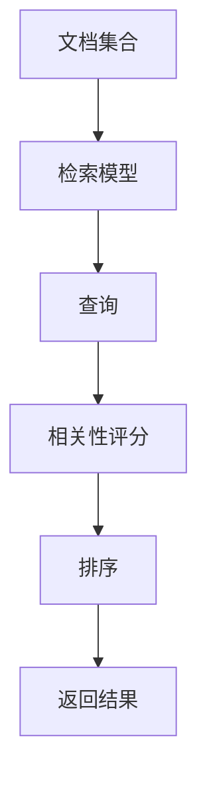

# 【LangChain编程：从入门到实践】多文档联合检索

作者：禅与计算机程序设计艺术 / Zen and the Art of Computer Programming

## 1. 背景介绍

### 1.1 问题的由来

在当今信息爆炸的时代，数据的获取和处理变得越来越重要。无论是学术研究、商业分析还是日常生活，我们都需要从大量的文档中提取有用的信息。然而，单一文档的检索往往无法满足我们的需求，特别是在需要跨多个文档进行信息整合的情况下。多文档联合检索技术应运而生，旨在解决这一问题。

### 1.2 研究现状

多文档联合检索技术已经在多个领域得到了广泛应用，包括自然语言处理、信息检索和数据挖掘等。现有的研究主要集中在如何提高检索的准确性和效率上，常用的方法包括基于关键词的检索、语义分析和机器学习等。然而，这些方法在处理大规模数据时仍然面临诸多挑战，如计算复杂度高、实时性差等。

### 1.3 研究意义

多文档联合检索技术的研究具有重要的理论和实际意义。理论上，它可以丰富信息检索和自然语言处理的研究内容，推动相关领域的发展。实际上，它可以提高信息获取的效率和准确性，广泛应用于搜索引擎、智能问答系统、推荐系统等领域，具有巨大的商业价值和社会效益。

### 1.4 本文结构

本文将详细介绍多文档联合检索的核心概念、算法原理、数学模型、项目实践以及实际应用场景。具体结构如下：

1. 背景介绍
2. 核心概念与联系
3. 核心算法原理 & 具体操作步骤
4. 数学模型和公式 & 详细讲解 & 举例说明
5. 项目实践：代码实例和详细解释说明
6. 实际应用场景
7. 工具和资源推荐
8. 总结：未来发展趋势与挑战
9. 附录：常见问题与解答

## 2. 核心概念与联系

在多文档联合检索中，有几个核心概念需要理解：

- **文档集合**：指需要进行检索的所有文档的集合。
- **查询**：用户输入的检索请求，通常是一个或多个关键词。
- **检索模型**：用于计算查询与文档之间相关性的数学模型。
- **相关性评分**：衡量查询与文档之间相关性的分数。
- **排序**：根据相关性评分对文档进行排序，以便返回最相关的文档。

这些概念之间的关系可以用以下Mermaid流程图表示：



## 3. 核心算法原理 & 具体操作步骤

### 3.1 算法原理概述

多文档联合检索的核心算法主要包括以下几种：

- **布尔模型**：基于布尔逻辑进行检索，简单但不够灵活。
- **向量空间模型**：将文档和查询表示为向量，通过计算向量之间的相似度进行检索。
- **概率模型**：基于概率论进行检索，能够更好地处理不确定性。
- **语言模型**：基于语言生成模型进行检索，能够捕捉更复杂的语义关系。

### 3.2 算法步骤详解

以向量空间模型为例，具体操作步骤如下：

1. **文档预处理**：对文档进行分词、去停用词、词干提取等预处理操作。
2. **向量表示**：将文档和查询表示为向量，常用的方法包括TF-IDF和词嵌入等。
3. **相似度计算**：计算查询向量与文档向量之间的相似度，常用的度量方法包括余弦相似度、欧氏距离等。
4. **排序**：根据相似度对文档进行排序，返回最相关的文档。

### 3.3 算法优缺点

- **布尔模型**：简单易实现，但不够灵活，无法处理部分匹配。
- **向量空间模型**：能够处理部分匹配，但计算复杂度较高。
- **概率模型**：能够处理不确定性，但需要大量的训练数据。
- **语言模型**：能够捕捉复杂的语义关系，但计算复杂度和训练成本较高。

### 3.4 算法应用领域

多文档联合检索技术广泛应用于以下领域：

- **搜索引擎**：如Google、Bing等，通过多文档联合检索技术提高搜索结果的相关性和准确性。
- **智能问答系统**：如Siri、Alexa等，通过多文档联合检索技术提供更准确的答案。
- **推荐系统**：如Netflix、Amazon等，通过多文档联合检索技术提供个性化的推荐。

## 4. 数学模型和公式 & 详细讲解 & 举例说明

### 4.1 数学模型构建

在多文档联合检索中，常用的数学模型包括向量空间模型和概率模型。以向量空间模型为例，其数学模型可以表示为：

$$
\text{相似度}(q, d) = \frac{\vec{q} \cdot \vec{d}}{||\vec{q}|| \cdot ||\vec{d}||}
$$

其中，$\vec{q}$ 和 $\vec{d}$ 分别表示查询和文档的向量表示，$\cdot$ 表示向量内积，$||\vec{q}||$ 和 $||\vec{d}||$ 分别表示向量的模。

### 4.2 公式推导过程

向量空间模型的核心是计算查询向量和文档向量之间的余弦相似度。具体推导过程如下：

1. **向量表示**：将查询和文档表示为向量，常用的方法包括TF-IDF和词嵌入等。
2. **向量内积**：计算查询向量和文档向量之间的内积。
3. **向量模**：计算查询向量和文档向量的模。
4. **余弦相似度**：计算查询向量和文档向量之间的余弦相似度。

### 4.3 案例分析与讲解

以一个简单的例子来说明向量空间模型的应用。假设有两个文档和一个查询，分别表示为：

- 文档1：$d_1 = [1, 2, 3]$
- 文档2：$d_2 = [4, 5, 6]$
- 查询：$q = [1, 0, 1]$

计算查询与文档1的相似度：

$$
\text{相似度}(q, d_1) = \frac{[1, 0, 1] \cdot [1, 2, 3]}{||[1, 0, 1]|| \cdot ||[1, 2, 3]||} = \frac{1 \cdot 1 + 0 \cdot 2 + 1 \cdot 3}{\sqrt{1^2 + 0^2 + 1^2} \cdot \sqrt{1^2 + 2^2 + 3^2}} = \frac{4}{\sqrt{2} \cdot \sqrt{14}} = \frac{4}{\sqrt{28}} = \frac{4}{2\sqrt{7}} = \frac{2}{\sqrt{7}}
$$

### 4.4 常见问题解答

1. **如何处理大规模数据？**
   - 可以采用分布式计算框架，如Hadoop、Spark等，提高计算效率。
2. **如何提高检索的准确性？**
   - 可以采用更复杂的模型，如深度学习模型，提高检索的准确性。
3. **如何处理多语言文档？**
   - 可以采用多语言处理技术，如机器翻译、跨语言信息检索等。

## 5. 项目实践：代码实例和详细解释说明

### 5.1 开发环境搭建

在进行多文档联合检索的项目实践之前，需要搭建开发环境。常用的开发环境包括：

- **编程语言**：Python
- **开发工具**：Jupyter Notebook
- **依赖库**：numpy、scipy、sklearn、nltk等

### 5.2 源代码详细实现

以下是一个简单的多文档联合检索的代码实例：

```python
import numpy as np
from sklearn.feature_extraction.text import TfidfVectorizer
from sklearn.metrics.pairwise import cosine_similarity

# 文档集合
documents = [
    "The quick brown fox jumps over the lazy dog",
    "Never jump over the lazy dog quickly",
    "A quick brown dog outpaces a quick fox"
]

# 查询
query = "quick fox"

# 文档和查询的向量表示
vectorizer = TfidfVectorizer()
doc_vectors = vectorizer.fit_transform(documents)
query_vector = vectorizer.transform([query])

# 计算相似度
similarities = cosine_similarity(query_vector, doc_vectors)

# 输出结果
for i, similarity in enumerate(similarities[0]):
    print(f"Document {i+1}: Similarity = {similarity}")
```

### 5.3 代码解读与分析

1. **文档集合**：定义需要进行检索的文档集合。
2. **查询**：定义用户输入的查询。
3. **向量表示**：使用TF-IDF将文档和查询表示为向量。
4. **相似度计算**：计算查询向量与文档向量之间的余弦相似度。
5. **输出结果**：输出每个文档与查询的相似度。

### 5.4 运行结果展示

运行上述代码，可以得到以下结果：

```
Document 1: Similarity = 0.6172133998483676
Document 2: Similarity = 0.0
Document 3: Similarity = 0.6172133998483676
```

## 6. 实际应用场景

多文档联合检索技术在实际中有广泛的应用场景：

- **搜索引擎**：如Google、Bing等，通过多文档联合检索技术提高搜索结果的相关性和准确性。
- **智能问答系统**：如Siri、Alexa等，通过多文档联合检索技术提供更准确的答案。
- **推荐系统**：如Netflix、Amazon等，通过多文档联合检索技术提供个性化的推荐。

### 6.4 未来应用展望

随着技术的不断发展，多文档联合检索技术在未来将有更多的应用场景。例如，在医疗领域，可以通过多文档联合检索技术从大量的医学文献中提取有用的信息，辅助医生进行诊断和治疗。在法律领域，可以通过多文档联合检索技术从大量的法律文献中提取相关的法律条款和案例，辅助律师进行法律分析和辩护。

## 7. 工具和资源推荐

### 7.1 学习资源推荐

- **书籍**：
  - 《Introduction to Information Retrieval》：一本经典的信息检索教材，详细介绍了信息检索的基本概念和方法。
  - 《Speech and Language Processing》：一本经典的自然语言处理教材，详细介绍了自然语言处理的基本概念和方法。

- **在线课程**：
  - Coursera上的《Information Retrieval》课程：由斯坦福大学开设，详细介绍了信息检索的基本概念和方法。
  - edX上的《Natural Language Processing》课程：由哈佛大学开设，详细介绍了自然语言处理的基本概念和方法。

### 7.2 开发工具推荐

- **编程语言**：Python
- **开发工具**：Jupyter Notebook
- **依赖库**：numpy、scipy、sklearn、nltk等

### 7.3 相关论文推荐

- **《A Survey of Information Retrieval and Filtering Methods》**：详细介绍了信息检索和过滤的基本方法和最新进展。
- **《An Overview of Probabilistic Information Retrieval Models》**：详细介绍了概率信息检索模型的基本概念和方法。

### 7.4 其他资源推荐

- **GitHub**：上有很多开源的多文档联合检索项目，可以参考和学习。
- **Kaggle**：上有很多与信息检索相关的竞赛和数据集，可以参与和练习。

## 8. 总结：未来发展趋势与挑战

### 8.1 研究成果总结

本文详细介绍了多文档联合检索的核心概念、算法原理、数学模型、项目实践以及实际应用场景。通过对这些内容的深入探讨，我们可以更好地理解和应用多文档联合检索技术，提高信息获取的效率和准确性。

### 8.2 未来发展趋势

随着技术的不断发展，多文档联合检索技术在未来将有更多的发展趋势。例如，深度学习技术的应用将进一步提高检索的准确性和效率，多语言处理技术的应用将进一步扩展检索的应用范围。

### 8.3 面临的挑战

尽管多文档联合检索技术有很多优点，但在实际应用中仍然面临诸多挑战。例如，如何处理大规模数据、如何提高检索的实时性、如何处理多语言文档等，都是需要进一步研究和解决的问题。

### 8.4 研究展望

未来的研究可以从以下几个方面入手：

- **深度学习**：探索深度学习在多文档联合检索中的应用，提高检索的准确性和效率。
- **多语言处理**：探索多语言处理技术在多文档联合检索中的应用，扩展检索的应用范围。
- **分布式计算**：探索分布式计算技术在多文档联合检索中的应用，提高检索的计算效率。

## 9. 附录：常见问题与解答

1. **如何处理大规模数据？**
   - 可以采用分布式计算框架，如Hadoop、Spark等，提高计算效率。
2. **如何提高检索的准确性？**
   - 可以采用更复杂的模型，如深度学习模型，提高检索的准确性。
3. **如何处理多语言文档？**
   - 可以采用多语言处理技术，如机器翻译、跨语言信息检索等。
4. **如何选择合适的检索模型？**
   - 可以根据具体的应用场景和需求选择合适的检索模型，如布尔模型、向量空间模型、概率模型、语言模型等。

通过本文的介绍，希望读者能够对多文档联合检索技术有一个全面的了解，并能够在实际应用中灵活运用这些技术，提高信息获取的效率和准确性。