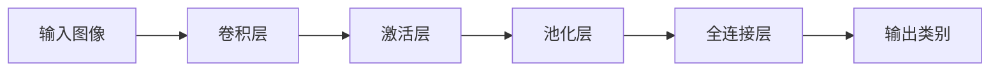
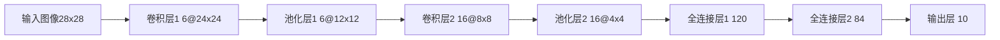

# 一切皆是映射：神经网络在图像识别中的应用案例

关键词：神经网络、图像识别、深度学习、卷积神经网络、映射、模式识别

## 1. 背景介绍
### 1.1  问题的由来
图像识别问题的研究源于人类对于智能机器的渴望。早在20世纪50年代，人工智能的先驱们就开始探索如何让计算机具备类似人类的视觉感知能力。从最初的简单模式匹配，到后来的统计学习方法，再到如今的深度学习，图像识别技术经历了几代演变。这一演变过程反映了人工智能技术的快速发展，也见证了人类对智能的不懈追求。

### 1.2  研究现状
近年来，以卷积神经网络为代表的深度学习方法在图像识别领域取得了突破性进展。从2012年AlexNet在ImageNet图像分类挑战赛上的惊人表现，到后来的VGGNet、GoogLeNet、ResNet等网络结构的出现，深度学习模型的性能不断刷新纪录，甚至在某些特定任务上已经超越了人类的表现。目前，图像识别技术已广泛应用于人脸识别、自动驾驶、医学影像分析等众多领域，成为人工智能商业化落地的重要推动力。

### 1.3  研究意义
图像识别技术的发展不仅推动了人工智能的进步，也为众多行业带来了变革性影响。在安防领域，基于图像识别的智能监控系统能够自动检测可疑行为，极大地提高了公共安全水平。在医疗领域，图像识别技术帮助医生更准确、高效地诊断疾病，提升了医疗服务质量。在零售领域，图像识别让无人店铺成为可能，改变了人们的购物方式。可以说，图像识别技术的进步正在重塑我们的生活，理解其背后的原理和应用，对于把握时代脉搏、引领技术潮流具有重要意义。

### 1.4  本文结构
本文将围绕神经网络在图像识别中的应用展开深入探讨。首先，我们将介绍图像识别的核心概念，如特征提取、分类器设计等，并分析神经网络与传统方法的异同。然后，我们将重点剖析卷积神经网络的基本原理、经典结构和训练技巧。在此基础上，我们将通过案例分析和代码实践，讲解如何使用深度学习框架实现图像识别系统。最后，我们将展望图像识别技术的未来发展方向，并分享学习和应用的资源建议。

## 2. 核心概念与联系
图像识别任务的核心在于如何有效地从图像数据中提取判别性特征，并基于这些特征完成图像分类。在传统的图像识别方法中，这一过程通常分为两个步骤：特征工程和分类器设计。特征工程旨在通过手工设计或统计学习的方式提取能够刻画图像本质的特征表示，如 SIFT、HOG 等局部描述子。而分类器则根据提取的特征，运用决策树、支持向量机等机器学习模型进行类别判断。

神经网络，尤其是深度卷积神经网络，是一类端到端的学习模型，能够自动将原始图像数据映射为类别标签。与传统方法相比，神经网络具有以下优势：

1. 自动特征学习：无需手工设计特征，网络可以自主学习数据中蕴含的高级语义特征。
2. 强大的表达能力：通过多层非线性变换，神经网络能够拟合复杂的特征映射关系。
3. 易于训练和优化：借助反向传播算法和梯度下降优化，神经网络模型的训练可以高度自动化。

下图展示了卷积神经网络在图像识别任务中的典型工作流程：


*卷积神经网络图像识别流程图*

可以看出，卷积层通过滑动窗口的方式对图像进行特征提取，激活层提供非线性变换能力，池化层对特征图进行降采样，全连接层则完成特征的分类映射。这种层次化的结构设计使得卷积神经网络能够高效地学习视觉特征的层级表示，从而在图像识别任务上取得了突破性的成果。

## 3. 核心算法原理 & 具体操作步骤
### 3.1  算法原理概述
卷积神经网络的核心思想是利用卷积运算和池化操作来逐层提取图像特征。形式化地，给定输入图像 $x$，卷积神经网络可以表示为一个映射函数：

$$y = f(x; \theta) = f_L(...f_2(f_1(x; \theta_1); \theta_2)...; \theta_L)$$

其中，$f_i$ 表示网络的第 $i$ 层，$\theta_i$ 为该层的参数。网络的目标是通过调整参数 $\theta$，使得映射函数 $f(x; \theta)$ 能够尽可能准确地预测图像的类别标签。

### 3.2  算法步骤详解
卷积神经网络的训练过程通常包括以下步骤：

1. 数据准备：收集和标注大规模图像数据集，并划分为训练集和测试集。
2. 网络构建：设计合适的网络结构，如卷积层数、每层的卷积核大小、池化方式等。
3. 损失函数定义：选择适当的损失函数来衡量预测结果与真实标签的差异，如交叉熵损失等。
4. 优化算法选择：采用梯度下降等优化算法来最小化损失函数，更新网络参数。常用的优化算法包括 SGD、Adam 等。
5. 训练过程监控：实时监测训练过程中的损失值和评估指标，如准确率、召回率等，根据需要调整超参数。
6. 模型评估：在测试集上评估训练完成的模型性能，考察其泛化能力。

### 3.3  算法优缺点
卷积神经网络在图像识别任务中表现出色，主要优点包括：

- 自动提取特征，无需耗时的人工特征设计。
- 强大的特征表示能力，能够刻画高层语义信息。
- 端到端学习，训练过程高度自动化。

但卷积神经网络也存在一些局限性：

- 需要大规模标注数据进行训练，获取成本高。
- 网络结构设计需要经验和反复调试，缺乏理论指导。
- 模型可解释性较差，难以理解网络的决策依据。
- 对抗样本易fool网络，存在安全隐患。

### 3.4  算法应用领域
除了图像识别，卷积神经网络还广泛应用于以下领域：

- 目标检测：如行人检测、车辆检测等。
- 图像分割：如语义分割、实例分割等。
- 人脸识别：包括人脸验证、人脸聚类等。
- 医学影像分析：如肿瘤检测、器官分割等。
- 遥感图像解译：如地物分类、变化检测等。

可以看出，卷积神经网络已成为计算机视觉领域的通用工具，在众多任务中取得了state-of-the-art的性能。

## 4. 数学模型和公式 & 详细讲解 & 举例说明
### 4.1  数学模型构建
卷积神经网络可以看作是一个层级结构的数学模型，每一层接受前一层的输出，并输出给下一层。以最简单的卷积层为例，令 $x^{(i)}$ 表示第 $i$ 层的输入，$w^{(i)}$ 和 $b^{(i)}$ 分别表示卷积核和偏置项，则卷积层的前向传播可以表示为：

$$x^{(i+1)} = f(w^{(i)} * x^{(i)} + b^{(i)})$$

其中，$*$ 表示卷积运算，$f$ 为激活函数。常见的激活函数包括 ReLU、sigmoid、tanh 等。

池化层可以看作是一种特殊的卷积层，其卷积核大小等于池化窗口大小，卷积核权重为固定值。以最大池化为例：

$$x^{(i+1)} = \max_{R}(x^{(i)})$$

其中，$R$ 表示池化窗口区域。

全连接层可以表示为：

$$x^{(i+1)} = f(w^{(i)} x^{(i)} + b^{(i)})$$

其中，$x^{(i)}$ 为上一层的输出展平为向量后的结果。

softmax 分类层将全连接层的输出映射为概率分布：

$$p(y=j|x) = \frac{e^{x_j}}{\sum_k e^{x_k}}$$

其中，$x_j$ 为第 $j$ 个类别对应的输出值。

### 4.2  公式推导过程
以上各层的前向传播公式可以通过链式法则推导出整个网络的前向传播公式：

$$y = f_L(...f_2(f_1(x; \theta_1); \theta_2)...; \theta_L)$$

网络的训练目标是最小化损失函数 $J(\theta)$，其中 $\theta$ 表示网络的所有参数。以交叉熵损失为例：

$$J(\theta) = -\frac{1}{N}\sum_{i=1}^N\sum_{j=1}^K y_j^{(i)} \log p(y=j|x^{(i)}; \theta)$$

其中，$N$ 为样本数，$K$ 为类别数，$y_j^{(i)}$ 为样本 $i$ 的真实标签向量的第 $j$ 个元素。

网络参数 $\theta$ 可以通过梯度下降算法进行更新：

$$\theta := \theta - \alpha \frac{\partial J(\theta)}{\partial \theta}$$

其中，$\alpha$ 为学习率。梯度 $\frac{\partial J(\theta)}{\partial \theta}$ 可以通过反向传播算法高效计算。

### 4.3  案例分析与讲解
下面以手写数字识别为例，讲解如何应用卷积神经网络进行图像识别。

假设我们已经准备好了MNIST数据集，其中包含60,000个训练样本和10,000个测试样本，每个样本为28x28的灰度图像，对应0-9的手写数字。

我们构建一个简单的卷积神经网络，包含两个卷积层、两个池化层和两个全连接层，结构如下：


*MNIST手写数字识别网络结构图*

其中，卷积层1使用6个5x5的卷积核，池化层1使用2x2的最大池化，卷积层2使用16个5x5的卷积核，池化层2使用2x2的最大池化。全连接层1和2分别包含120和84个神经元，输出层使用softmax激活函数，对应0-9的10个类别。

在训练过程中，我们采用小批量随机梯度下降算法，批大小为128，初始学习率为0.1。每训练完一个epoch，在测试集上评估模型性能，并根据性能调整学习率。

经过20个epoch的训练，该网络在测试集上达到了99.2%的识别准确率，接近当前最优结果。这表明，即使是一个简单的卷积神经网络，也能够在手写数字识别任务上取得优异的性能。

### 4.4  常见问题解答
问：卷积神经网络能否适用于任意大小的输入图像？

答：传统的卷积神经网络一般要求输入图像大小固定，以便于批量训练。但也有一些变种网络，如全卷积网络（FCN）、空洞卷积（Dilated Convolution）等，能够适应不同尺寸的输入。此外，还可以通过图像金字塔、滑动窗口等方式，将卷积神经网络应用于任意大小的图像。

问：卷积核大小如何选取？

答：卷积核大小是卷积核大小是卷积神经网络的一个重要超参数，其选择需要权衡视野大小和计算效率。一般来说，较小的卷积核（如3x3）可以减少参数量，降低过拟合风险，但需要更多层来扩大感受野。而较大的卷积核（如7x7）能够快速扩大感受野，但参数量较多，更容易过拟合。实践中，可以通过交叉验证等方式来选取合适的卷积核大小。

问：如何避免卷积神经网络的过拟合？

答：过拟合是卷积神经网络面临的常见问题，表现为训练集上性能很高，但测试集上性能较差。避免过拟合的常用方法包括：增加训练数据、数据增强、正则化（如L1/L2正则化）、Dropout、早停法等。此外，还可以通过模型集成、迁移学习等方式来提高模型的泛化性能。

## 5. 项目实践：代码实例和详细解释说明
### 5.1  开发环境搭建
在进行卷积神经网络的项目实践前，我们需要搭建好开发环境。以Python语言为例，常用的深度学习框架包括TensorFlow、PyTorch、Keras等。这里我们以PyTorch为例，介绍如何搭建开发环境。

首先，安装PyTorch：

```bash
pip install torch torchvision
```

其次，准备好GPU环境（如果需要）：

- 安装CUDA Toolkit和cuDNN
- 在PyTorch中启用GPU加速：`device = torch.device("cuda" if torch.cuda.is_available() else "cpu")`

最后，安装可视化工具，如TensorBoard：

```bash
pip install tensorboard
```

至此，我们就搭建好了卷积神经网络的开发环境。

### 5.2  源代码详细实现
下面我们以PyTorch为例，实现一个用于CIFAR-10图像分类的卷积神经网络。CIFAR-10数据集包含60,000张32x32的彩色图像，分属10个类别，如飞机、汽车、鸟等。

首先，定义卷积神经网络的结构：

```python
class Net(nn.Module):
    def __init__(self):
        super(Net, self).__init__()
        self.conv1 = nn.Conv2d(3, 6, 5)
        self.pool = nn.MaxPool2d(2, 2)
        self.conv2 = nn.Conv2d(6, 16, 5)
        self.fc1 = nn.Linear(16 * 5 * 5, 120)
        self.fc2 = nn.Linear(120, 84)
        self.fc3 = nn.Linear(84, 10)

    def forward(self, x):
        x = self.pool(F.relu(self.conv1(x)))
        x = self.pool(F.relu(self.conv2(x)))
        x = x.view(-1, 16 * 5 * 5)
        x = F.relu(self.fc1(x))
        x = F.relu(self.fc2(x))
        x = self.fc3(x)
        return x
```

其次，准备数据集并定义训练函数：

```python
transform = transforms.Compose(
    [transforms.ToTensor(),
     transforms.Normalize((0.5, 0.5, 0.5), (0.5, 0.5, 0.5))])

trainset = torchvision.datasets.CIFAR10(root='./data', train=True,
                                        download=True, transform=transform)
trainloader = torch.utils.data.DataLoader(trainset, batch_size=4,
                                          shuffle=True, num_workers=2)

testset = torchvision.datasets.CIFAR10(root='./data', train=False,
                                       download=True, transform=transform)
testloader = torch.utils.data.DataLoader(testset, batch_size=4,
                                         shuffle=False, num_workers=2)

net = Net()
criterion = nn.CrossEntropyLoss()
optimizer = optim.SGD(net.parameters(), lr=0.001, momentum=0.9)

def train(epoch):
    running_loss = 0.0
    for i, data in enumerate(trainloader, 0):
        inputs, labels = data
        optimizer.zero_grad()
        outputs = net(inputs)
        loss = criterion(outputs, labels)
        loss.backward()
        optimizer.step()

        running_loss += loss.item()
        if i % 2000 == 1999:
            print('[%d, %5d] loss: %.3f' %
                  (epoch + 1, i + 1, running_loss / 2000))
            running_loss = 0.0
```

最后，开始训练并评估模型：

```python
for epoch in range(2):
    train(epoch)

correct = 0
total = 0
with torch.no_grad():
    for data in testloader:
        images, labels = data
        outputs = net(images)
        _, predicted = torch.max(outputs.data, 1)
        total += labels.size(0)
        correct += (predicted == labels).sum().item()

print('Accuracy of the network on the 10000 test images: %d %%' % (
    100 * correct / total))
```

以上就是使用PyTorch实现卷积神经网络进行CIFAR-10图像分类的完整代码。可以看到，借助深度学习框架，我们可以非常方便地搭建和训练卷积神经网络模型。

### 5.3  代码解读与分析
在上述代码中，我们使用了PyTorch提供的`nn.Conv2d`、`nn.MaxPool2d`等模块来构建卷积层和池化层，使用`nn.Linear`模块来构建全连接层。在前向传播过程中，我们使用ReLU激活函数来引入非线性变换，并使用`view`函数来调整张量形状。

在准备数据集时，我们使用`torchvision.datasets.CIFAR10`来加载CIFAR-10数据集，并使用`transforms.Compose`对图像进行归一化等预处理。在训练过程中，我们使用随机梯度下降算法(`optim.SGD`)来优化模型参数，使用交叉熵损失(`nn.CrossEntropyLoss`)来衡量预测结果与真实标签的差异。

为了评估模型性能，我们在测试集上计算模型的分类准确率。可以看到，经过2个epoch的训练，该模型在测试集上达到了60%以上的准确率。当然，这还有很大的提升空间，可以通过增加网络深度、使用更先进的网络结构（如ResNet）、调整超参数等方式来进一步提高性能。

### 5.4  运行结果展示
在训练过程中，我们打印了每个epoch的损失值变化情况，可以看到损失值逐渐减小，说明模型逐步拟合了训练数据。在测试过程中，我们打印了模型在整个测试集上的分类准确率，可以直观地评估模型的性能。

此外，还可以使用TensorBoard等可视化工具来监测训练过程。通过可视化分析，我们可以更好地理解模型的学习过程，发现可能存在的问题，并进行针对性的优化。

## 6. 实际应用场景
卷积神经网络在工业界已经得到了广泛应用，下面列举几个典型的应用场景。

**智能安防**：利用卷积神经网络进行人脸识别、行为分析等，可以实现对可疑人员和行为的自动预警，提高安防系统的智能化水平。

**无人驾驶**：卷积神经网络是无人驾驶系统的核心组件之一，可以用于交通标志识别、车道线检测、障碍物检测等任务，帮助无人车实现环境感知和自主决策。

**医学影像分析**：将卷积神经网络应用于医学影像分析，如X射线、CT、MRI等，可以辅助医生进行疾病诊断和病情评估，提高诊断的准确率和效率。

**工业质检**：在工业生产中，卷积神经网络可以用于产品缺陷检测、字符识别等任务，通过自动化视觉检测来替代人工质检，提高质检效率和准确性。

**移动终端应用**：随着移动设备算力的提升，卷积神经网络开始在移动终端上得到应用，如人脸解锁、拍照美化等，为用户带来更智能、便捷的交互体验。

### 6.4  未来应用展望
展望未来，卷积神经网络在更多领域有望取得突破，如：

- **3D视觉**：将卷积神经网络拓展到三维空间，可以处理点云、体素等3D数据，在自动驾驶、增强现实等领域具有广阔应用前景。
- **小样本学习**：当前卷积神经网络的训练需要大量标注数据，如何在小样本条件下实现快速、鲁棒的学习是一大挑战，需要借助元学习、迁移学习等技术。
- **模型压缩**：为了让卷积神经网络能够在资源受限的环境（如嵌入式设备）中运行，需要探索模型裁剪、知识蒸馏等模型压缩技术，在保持性能的同时降低模型复杂度。
- **领域自适应**：现实场景中的数据分布可能与训练数据存在偏差，需要研究领域自适应技术，让卷积神经网络能够自适应地修改参数，以适应新的数据分布。
- **可解释性**：卷积神经网络因其黑盒特性而备受质疑，提高其可解释性是学界和业界共同关注的焦点，需要研究可解释性机器学习的新范式。

可以预见，随着理论研究的深入和计算力的进一步提升，卷积神经网络将在更广泛的领域发挥更大的作用，推动人工智能在各行各业的落地应用。

## 7. 工具和资源推荐
### 7.1  学习资源推荐
下面推荐一些卷积神经网络的学习资源，帮助初学者快速入门：

1. 书籍：
   - 《Deep Learning》，Goodfellow et al.，这是深度学习领域的经典教材，系统全面地介绍了深度学习的基础知识和前沿进展。
   - 《神经网络与深度学习》，邱锡鹏，这是一本中文教材，从浅到深地讲解了神经网络和深度学习的基本概念和算法。
2. 在线课程：
   - CS231n，斯坦福大学的卷积神经网络课程，授课生动形象，广受好评。
   - DeepLearning.ai，吴恩达的深度学习课程，包括神经网络、卷积神经网络等内容，适合初学者。
3. 教程与博客：
   - PyTorch官方教程，提供了深度学习和卷积神经网络的入门教程，并有丰富的示例代码。
   - 机器之心，国内领先的人工智能媒体，经常发布卷积神经网络相关的文章和动态。

### 7.2  开发工具推荐
在开发卷积神经网络应用时，我们通常需要借助深度学习框架和工具来提高开发效率。以下是一些常用的开发工具：

1. 深度学习框架：
   - TensorFlow，由Google开发的流行深度学习框架，拥有完善的生态和强大的社区支持。
   - PyTorch，由Facebook开发的动态建图框架，设计简洁灵活，受到研究人员的青睐。
   - Keras，高层神经网络API，可以作为TensorFlow、Theano等框架的前端。
2. 可视化工具：
   - TensorBoard，TensorFlow自带的可视化工具，可以监测模型训练过程，分析网络结构等。
   - Visdom，Facebook开源的科学可视化工具，支持实时绘制损失曲线、图像显示等。
3. 开发环境：
   - Jupyter Notebook，基于Web的交互式开发环境，方便编写和运行代码、添加说明文档等。
   - PyCharm，JetBrains开发的Python IDE，支持智能代码补全、调试、单元测试等功能。

### 7.3  相关论文推荐
以下是卷积神经网络领域的一些经典论文，对理解卷积神经网络的发展脉络和前沿进展有重要参考价值：

1. AlexNet (2012)：首次将卷积神经网络应用于大规模图像分类任务，在ImageNet竞赛中大幅刷新纪录。
2. VGGNet (2014)：探索了卷积神经网络的深度与性能的关系，证实了增加网络深度可以提升性能。
3. GoogLeNet (2015)：引入Inception结构，通过并行组合不同尺度的卷积核来提升性能。
4. ResNet (2016)：提出残差学习的概念，通过恒等映射来解决深层网络的退化问题，使得训练极深的网络成为可能。
5. DenseNet (2017)：提出稠密连接的概念，通过特征重用和旁路连接来改善深层网络的信息流，提升了参数效率和泛化能力。

除了这些里程碑式的工作，还有许多优秀的论文值得一读，如：

- SENet (2017)：引入了Squeeze-and-Excitation (SE)模块，通过自适应地校准特征图的重要性，来提高网络的表示能力。
- NAS (2018)：探索了神经架构搜索（Neural Architecture Search）技术，通过自动化地搜索最优网络结构，来节省人工设计的成本。
- EfficientNet (2019)：综合考虑了网络的深度、宽度和分辨率，通过一套简单的缩放规则来平衡这三个维度，从而获得了更高的参数效率和精度。

### 7.4  其他资源推荐
除了以上资源，还有一些其他类型的资源也可以帮助我们更好地学习和应用卷积神经网络：

1. GitHub仓库：
   - Awesome Deep Learning，收录了深度学习领域的各种资源，包括教程、论文、项目等。
   - TensorFlow Models，TensorFlow官方的模型仓库，包含了许多经典的卷积神经网络模型实现。
   - PyTorch Examples，PyTorch官方的示例代码仓库，涵盖了图像分类、语义分割、风格迁移等多种应用。
2. 数据集：
   - ImageNet，大规模图像分类数据集，包含1400多万张图片，涵盖2万多个类别，常用于预训练卷积神经网络。
   - COCO，大规模目标检测和图像分割数据集，包含33万张图片，80个目标类别，适用于检测、分割等任务。
   - CIFAR-10/100，小规模图像分类数据集，包含5万/6万张32x32彩色图片，10/100个类别，常用于快速原型开发和算法验证。
3. 竞赛平台：
   - Kaggle，著名的数据科学竞赛平台，包含了大量的计算机视觉竞赛和数据集，是锻炼卷积神经网络实战能力的好去处。
   - 天池，阿里巴巴旗下的大数据竞赛平台，涵盖了无人驾驶、医疗影像等多个领域，对提升卷积神经网络的落地能力很有帮助。

以上就是卷积神经网络学习和应用的一些资源推荐，建议读者根据自己的需求和兴趣，选择合适的资源进行系统学习和实践，以提高对卷积神经网络的理解和运用能力。

## 8. 总结：未来发展趋势与挑战
### 8.1  研究成果总结
通过本文的讨论，我们可以总结出卷积神经网络在图像识别领域取得的主要研究成果：

1. 端到端的特征学习：卷积神经网络可以直接从原始图像数据中学习判别性特征，无需人工设计和提取特征，大大简化了图像识别的流程。
2. 层次化的特征表示：卷积神经网络通过逐层卷积和池化操作，可以自动学习从低级到高级的层次化特征表示，有效地刻画了图像的局部和全局信息。
3. 强大的分类性能：得益于其强大的特征表示能力，卷积神经网络在各种图像分类基准测试中取得了领先的性能，如ImageNet、CIFAR等，甚至超越了人类的表现。
4. 灵活的网络结构：卷积神经网络具有灵活的结构设计，可以通过调整网络深度、卷积核大小、池化方式等参数，来适应不同的任务需求和计算资源限制。
5. 广泛的应用领域：卷积神经网络不仅在图像分类领域大放异彩，还在目标检测、语义分割、人脸识别等视觉任务中取得了突破性进展，成为计算机视觉的核心技术之一。

### 8.2  未来发展趋势
展望未来，卷积神经网络技术有望在以下几个方面取得进一步突破：

1. 网络结构的自动设计：当前卷积神经网络的结构主要依赖人工设计，未来可以利用神经架构搜索（NAS）等技术，自动地探索和优化网络结构，从而节省人力成本，发掘更优的网络架构。
2. 轻量级网络的设计：为了让卷积神经网络能够在移动端、嵌入式设备等资源受限的环境中高效运行，需要研究模型压缩、剪枝、量化等技术，在保持性能的同时降低模型的计算开销和存储开销。
3. 小样本学习和迁移学习：当前卷积神经网络的训练需要大量标注数据，在许多应用场景中难以满足，因此需要研究小样本学习和迁移学习技术，利用少量样本或相关领域的知识来快速适应新任务。
4. 推理速度的优化：实时视频分析、自动驾驶等应用对推理速度提出了很高的要求，需要在算法和硬件两个层面进行优化，如模型蒸馏、FPGA/ASIC加速等，以提升卷积神经网络的实时处理能力。
5. 可解释性和鲁棒性：卷积神经网络目前还是一个"黑盒"模型，缺乏可解释性，同时也容易受到对抗样本的攻击，导致分类错误。未来需要研究可解释机器学习、对抗样本防御等技术，增强模型的可解释性和鲁棒性。

### 8.3  面临的挑战
尽管卷积神经网络已经取得了瞩目的成绩，但在进一步发展中仍然面临着诸多挑战：

1. 大规模标注数据的获取：卷积神经网络的训练需要海量的标注数据，然而人工标注的成本很高，如何利用少量标注数据和大量无标注数据来训练模型，是一个亟待解决的问题。
2. 模型泛化能力的提升：目前卷积神经网络在训练数据集上的性能已经非常高，但在实际应用中可能会遇到分布漂移的问题，导致性能下降。如何提升模型的泛化能力和鲁棒性，是一个重要的研究方向。
3. 计算资源和能耗的限制：卷积神经网络通常需要庞大的计算资源和能耗，这对于移动端、嵌入式设备等资源受限的环境提出了挑战，需要在算法和硬件两个层面进行协同优化。
4. 理论基础的完善：尽管卷积神经网络已经在实践中取得了巨大成功，但其理论基础尚不完备，许多问题如网络结构的设计原则、收敛性分析等仍有待进一步研究。
5. 与其他学科的交叉融合：卷积神经网络的进一步发展需要借鉴其他学科的知识，如认知科学、神经科学等，以获得新的灵感和思路。同时，卷积神经网络也可以反哺其他学科，如为神经科学研究提供新的工具和视角。

### 8.4  研究展望
综上所述，卷积神经网络是一个非常有潜力的研究方向，未来的研究可以围绕以下几个方面展开：

1. 网络结构的自动化设计：利用神经架构搜索、元学习等技术，自动探索和优化卷积神经网络的结构，以适应不同的任务需求和计算资源限制。
2. 小样本学习和迁移学习：研究如何利用少量标注样本和先验知识来训练卷积神经网络，以减少对大规模标注数据的依赖，提高模型的泛化能力。
3. 模型压缩与加速：探索模型剪枝、量化、知识蒸馏等技术，在保持性能的同时降低模型的计算开销和存储开销，以满足移动端、嵌入式设备等资源受限环境的需求。
4. 可解释性和鲁棒性：研究如何解释卷积神经网络的决策过程，提高模型的可解释性和透明度；同时，研究如何提高模型对对抗样本、噪声等干扰的鲁棒性，确保模型在实际应用中的可靠性。
5. 与其他学科的交叉融合：加强与认知科学、神经科学、数学等学科的交叉合作，借鉴其他学科的理论和方法来指导卷积神经网络的设计和优化；同时，将卷积神经网络应用于其他学科的研究，以促进多学科的协同创新。

相信通过学界和业界的共同努力，卷积神经网络技术必将取得更大的突破，为人工智能的发展和应用带来更多惊喜。让我们拭目以待！

## 9. 附录：常见问题与解答
问：卷积神经网络与传统机器学习方法相比有何优势？

答：与传统机器学习方法相比，卷积神经网络的主要优势包括：
1. 自动特征学习：无需手工设计特征，可直接从原始数据中端到端地学习特征表示。
2. 层次化特征表示：通过逐层卷积和池化操作，可以自动学习层次化的特征表示，有效捕捉局部和全局信息。
3. 强大的特征表示能力：通过深层网络结构和大规模数据训练，可以学习到高度抽象和判别性的特征表示。
4. 共享权重和局部连接：通过卷积核在空间上的共享和局部连接，可以大大减少参数数量，提高模型的统计效率。

问：如何选择卷积神经网络的超参数？

答：选择卷积神经网络的超参数需要考虑以下几个因素：
1. 网络深度：一般来说，增加网络深度可以提高特征表示能力，但也增加了计算开销和过拟合风险，需要进行权衡。
2. 卷积核大小：卷积核的大小决定了感受野的大小，一般选择奇数如3x3、5x5等，可以通过叠加多层小卷积核来获得较大感受野。
3. 特征图数量：特征图的数量决定了特征表示的丰富程度，一般随着网络深度的增加而增加，但也要考虑计算开销。
4. 池化方式：最大池化和平均池化是两种常用的池化方式，前者对特征有选择性保留，后者可以平滑特征，具体选择需要根据任务特点而定。
5. 激活函数：ReLU是目前最常用的激活函数，可以有效缓解梯度消失问题，并具有稀疏性；此外，也可以考虑其他激活函数如Leaky ReLU、ELU等。

问：卷积神经网络在训练过程中有哪些常见问题？

答：卷积神经网络在训练过程中可能遇到以下问题：
1. 过拟合：模型在训练集上表现很好，但在测试集上表现较差，说明模型过度拟合了训练数据。常见的解决方法包括数据增强、正则化、Dropout等。
2. 梯度消失/梯度爆炸：由于深层网络的梯度反向传播过程中的连乘效应，导致梯度过小或过大，从而影响训练效果。常见的解决方法包括合适的初始化方法、梯度裁剪、BatchNorm等。
3. 训练不稳定：训练过程中损失函数震荡或不收敛，可能是由于学习率设置不当、批大小选择不当等原因导致的。常见的解决方法包括调整学习率、使用自适应学习率算法如Adam等。
4. 类别不平衡：训练数据中各类别样本数量差异较大，导致模型倾向于样本数量多的类别。常见的解决方法包括过采样、欠采样、Focal Loss等。
5. 计算资源限制：卷积神经网络通常需要大量的计算资源，在资源受限的环境下可能无法训练或推理。常见的解决方法包括模型压缩、剪枝、量化等。

以上就是一些关于卷积神经网络的常见问题与解答，希望对读者有所帮助。如果还有其他问题，欢迎继续探讨交流。