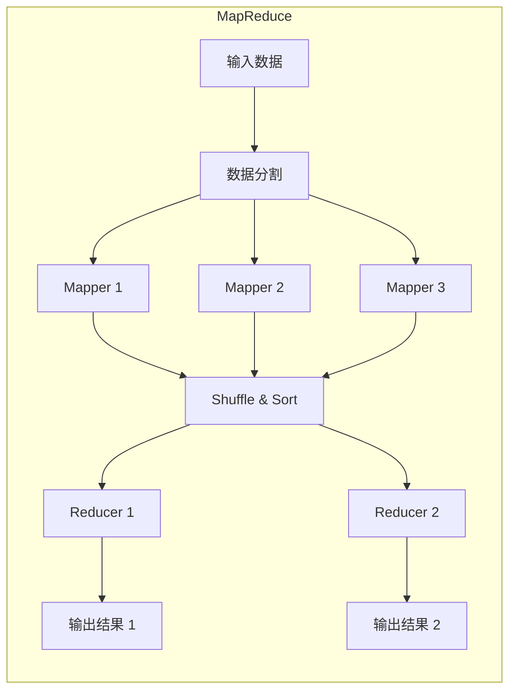
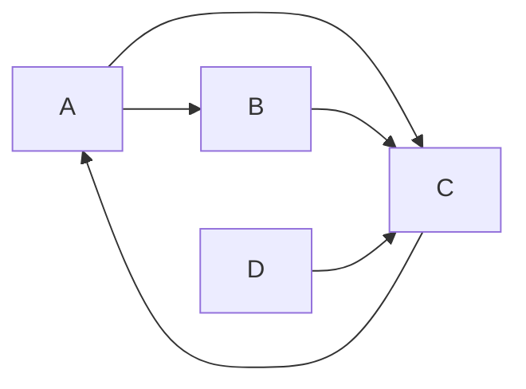

# 大数据架构原理与代码实例讲解

## 1. 背景介绍

### 1.1 问题的由来

在当今时代，数据正以前所未有的规模和速度被创建、存储和传输。从社交媒体平台到物联网设备,再到企业内部的交易记录,海量的结构化和非结构化数据不断涌现。这种数据爆炸式增长带来了巨大的挑战,传统的数据处理和存储系统已无法满足现代应用的需求。为了有效地管理和利用这些大规模数据,大数据架构应运而生。

### 1.2 研究现状

近年来,大数据技术取得了长足的进步,涌现出一系列创新的解决方案,如Hadoop、Spark、Kafka等。这些技术为处理海量数据提供了高度可扩展、容错和高性能的框架。然而,构建一个高效、可靠的大数据架构仍然是一项艰巨的挑战,需要综合考虑数据采集、存储、处理、分析和可视化等多个环节。

### 1.3 研究意义

大数据架构的研究对于企业和组织具有重要意义。通过合理设计和实施大数据架构,可以:

1. 提高数据处理效率,加快数据分析周期
2. 发掘数据中蕴含的商业价值和洞察力
3. 优化业务流程,提升决策质量
4. 推动创新,开发新产品和服务
5. 提高竞争力,占据行业领先地位

因此,深入探讨大数据架构的原理和实践,对于企业和组织实现数据驱动的创新和增长至关重要。

### 1.4 本文结构

本文将全面探讨大数据架构的核心概念、算法原理、数学模型、代码实现和实际应用场景。文章结构如下:

1. 背景介绍
2. 核心概念与联系
3. 核心算法原理与具体操作步骤
4. 数学模型和公式详细讲解与举例说明
5. 项目实践:代码实例和详细解释说明
6. 实际应用场景
7. 工具和资源推荐
8. 总结:未来发展趋势与挑战
9. 附录:常见问题与解答

## 2. 核心概念与联系

在深入探讨大数据架构之前,我们需要了解一些核心概念及其相互关系。下面是一些关键概念的介绍:

### 2.1 大数据(Big Data)

大数据指的是规模巨大、种类繁多、增长迅速且难以使用传统数据库软件工具进行捕获、存储、管理和分析的数据集合。大数据通常被描述为具有4V特征:

- 体量(Volume):大数据集的规模通常是PB或EB级别。
- 多样性(Variety):大数据包括结构化数据(如关系数据库)和非结构化数据(如文本、图像、视频等)。
- 速度(Velocity):大数据的产生、传输和处理速度极快。
- 价值(Value):大数据蕴含着巨大的潜在价值,可以为企业带来新的商业机会和洞见。

### 2.2 大数据架构(Big Data Architecture)

大数据架构是一种设计和构建大规模、可扩展、容错和高性能数据处理系统的方法。它包括以下关键组件:

- 数据采集层:从各种数据源收集数据,如日志文件、传感器、社交媒体等。
- 数据存储层:使用分布式文件系统(如HDFS)和NoSQL数据库(如HBase、Cassandra)存储海量数据。
- 数据处理层:使用大数据框架(如Hadoop、Spark)进行批量和流式数据处理。
- 数据分析层:使用机器学习、数据挖掘等技术从数据中提取洞见和价值。
- 数据可视化层:将分析结果以可视化的方式呈现,方便理解和决策。

### 2.3 大数据生态系统

大数据生态系统由一系列相互协作的开源项目和商业解决方案组成,共同支撑大数据架构的构建和运行。一些著名的大数据项目包括:

- Hadoop:分布式文件系统(HDFS)和批处理框架(MapReduce)
- Spark:内存计算框架,支持批处理、流处理和机器学习
- Kafka:分布式流处理平台,用于构建实时数据管道
- Hive:基于Hadoop的数据仓库,提供SQL接口
- HBase:分布式NoSQL数据库,用于实时随机访问大数据
- Zookeeper:分布式协调服务,用于管理大数据集群
- Flume/Sqoop:数据采集工具,用于从各种数据源收集数据

这些项目紧密结合,构成了一个强大的大数据生态系统,为企业提供端到端的大数据解决方案。

### 2.4 Lambda架构

Lambda架构是一种通用的大数据处理架构模式,将批处理系统与实时系统相结合,以满足不同的数据处理需求。它包括三个主要层次:

1. 批处理层:使用Hadoop等框架进行大规模数据的批量处理。
2. 实时层:使用Spark Streaming等流处理框架处理实时数据流。
3. 服务层:将批处理和实时处理的结果合并,提供统一的查询接口。

Lambda架构的优势在于,它能够同时处理历史数据和实时数据,提供低延迟的查询响应,并支持复杂的批量分析。

### 2.5 Kappa架构

Kappa架构是Lambda架构的演进,它将所有数据(包括历史数据和实时数据)都视为流数据进行处理。在Kappa架构中,只有一个流处理层,所有数据都通过流处理引擎(如Kafka、Spark Streaming)进行处理,并将结果存储在可查询的数据存储系统中(如HBase、Cassandra)。

相比Lambda架构,Kappa架构具有以下优势:

1. 更简单的架构,只有一个流处理层
2. 更低的延迟,所有数据都被实时处理
3. 更好的容错性和可扩展性
4. 更好的代码复用,批处理和流处理使用相同的代码

然而,Kappa架构也面临一些挑战,如流处理引擎的性能和可靠性、数据重播和幂等性等。

### 2.6 数据湖(Data Lake)

数据湖是一种新型的大数据存储和管理架构,它将来自各种来源的原始数据(结构化和非结构化)存储在一个集中的存储库中,而不需要预先定义数据的模式。数据湖通常建立在分布式文件系统(如HDFS)之上,并使用低成本的对象存储来存储数据。

数据湖的主要优势包括:

1. 存储所有数据,无需预先建模
2. 支持各种数据类型和格式
3. 降低数据整合和转换的成本
4. 支持多种分析工作负载(如SQL、机器学习等)

数据湖与传统数据仓库的区别在于,数据仓库需要预先定义数据模式,并进行ETL(提取、转换、加载)处理,而数据湖则直接存储原始数据,延迟模式定义和ETL过程。

### 2.7 数据湖与数据仓库的融合

随着大数据架构的发展,数据湖和数据仓库正在融合,形成一种新型的混合架构。在这种架构中,数据湖用于存储原始数据,而数据仓库则用于存储经过清理、转换和建模的数据,供分析和报告使用。

这种融合架构的优势包括:

1. 保留原始数据的完整性和灵活性
2. 支持传统的结构化分析和新兴的大数据分析
3. 降低数据整合和管理的复杂性
4. 提高数据质量和一致性

未来,数据湖和数据仓库的融合将成为企业数据架构的主流趋势,帮助组织从海量数据中获取更多洞见和价值。

## 3. 核心算法原理与具体操作步骤

在大数据架构中,有许多核心算法被广泛应用于数据处理和分析。本节将重点介绍MapReduce和Spark两种核心算法的原理和操作步骤。

### 3.1 MapReduce算法原理概述

MapReduce是一种分布式计算模型,用于在大规模数据集上并行执行计算。它由两个主要阶段组成:Map和Reduce。

1. **Map阶段**:输入数据被分割成多个数据块,每个数据块由一个映射器(Mapper)处理。映射器将输入数据转换为一组键值对(key-value pairs),并将这些键值对写入中间结果。

2. **Reduce阶段**:框架将具有相同键的所有值组合在一起,并将这些值传递给归约器(Reducer)。归约器对具有相同键的值执行聚合操作(如求和、最大值等),并输出最终结果。

MapReduce的优势在于它能够自动并行化计算,并在出现故障时重新执行失败的任务,从而提供了高度的可扩展性和容错能力。



### 3.2 MapReduce算法步骤详解

1. **输入数据分割**:输入数据被划分为固定大小的数据块(通常为64MB或128MB),这些数据块被分发到不同的节点上进行处理。

2. **Map阶段**:每个映射器(Mapper)处理一个数据块,并将输入数据转换为一组键值对。映射器的输出被写入本地磁盘,形成中间结果。

3. **Shuffle和Sort**:框架收集各个映射器的输出,并对键值对进行分组和排序。具有相同键的值被分组在一起,并按键排序。

4. **Reduce阶段**:每个归约器(Reducer)接收一组键及其对应的值列表。归约器对这些值执行聚合操作(如求和、最大值等),并输出最终结果。

5. **输出结果**:归约器的输出被写入分布式文件系统(如HDFS)或其他存储系统,作为最终结果。

MapReduce算法的关键在于将大规模计算分解为多个独立的Map和Reduce任务,并在集群中并行执行这些任务,从而实现高度的可扩展性和容错性。

### 3.3 MapReduce算法优缺点

**优点**:

1. **高度可扩展**:MapReduce可以在大规模集群上并行执行计算,处理PB级别的数据。
2. **容错性强**:MapReduce能够自动检测和重新执行失败的任务,提供了高度的容错能力。
3. **编程模型简单**:MapReduce提供了一种简单的编程模型,开发人员只需关注Map和Reduce函数的实现。
4. **适用于离线批处理**:MapReduce非常适合处理大规模离线数据,如网页索引、日志分析等。

**缺点**:

1. **高延迟**:MapReduce需要将中间结果写入磁盘,并在Map和Reduce阶段之间进行数据洗牌,导致高延迟。
2. **不适合实时处理**:由于高延迟,MapReduce不适合处理实时数据流。
3. **迭代计算低效**:MapReduce不擅长迭代计算,如机器学习算法,因为每次迭代都需要重新读取输入数据。
4. **小作业效率低下**:MapReduce在处理小规模数据时效率较低,因为它需要启动整个MapReduce作业。


### 3.4 MapReduce算法应用领域

尽管存在一些缺点,MapReduce仍然是大数据处理的核心算法之一,广泛应用于以下领域:

1. **网页索引**:搜索引擎使用MapReduce构建网页索引,用于快速查找相关网页。
2. **日志分析**:MapReduce可以高效地处理大规模日志数据,用于网站统计、用户行为分析等。
3. **数据处理**:MapReduce被广泛用于ETL(提取、转换、加载)过程,清理和转换原始数据。
4. **机器学习**: 尽管MapReduce不擅长迭代计算,但它可以用于预处理机器学习算法的训练数据,以及并行化某些机器学习算法。

### 3.5 Spark算法原理概述

Spark是一种基于内存计算的开源分布式计算框架,它克服了MapReduce的一些缺点,提供了更高的性能和更丰富的功能。

Spark的核心概念是弹性分布式数据集(RDD),RDD是一个不可变的分布式数据集合,可以被分区并存储在集群的不同节点上。Spark的计算过程是基于RDD的一系列转换和操作。

Spark的主要特点包括:

1. **内存计算**:Spark将中间结果存储在内存中,避免了磁盘I/O,从而大幅提高了计算速度。
2. **DAG执行引擎**:Spark使用有向无环图(DAG)来表示计算任务之间的依赖关系,并优化执行计划,从而提高了执行效率。
3. **丰富的API**:Spark提供了丰富的API,支持Java、Scala、Python和R等多种编程语言,方便用户开发各种数据处理应用程序。
4. **多种应用场景**:Spark支持批处理、流处理、机器学习、图计算等多种应用场景,是一个通用的数据处理平台。

### 3.6 Spark算法步骤详解

Spark的计算过程通常包括以下步骤:

1. **创建RDD**:从外部数据源(如HDFS、本地文件系统、数据库等)创建RDD。

2. **转换操作**:对RDD执行一系列转换操作(如map、filter、reduceByKey等),生成新的RDD。转换操作是惰性求值的,只有在行动操作触发时才会执行。

3. **行动操作**:对RDD执行行动操作(如collect、count、saveAsTextFile等),触发计算并返回结果。

4. **结果输出**:将计算结果输出到外部存储系统或返回给用户程序。

Spark的DAG执行引擎会根据RDD之间的依赖关系,自动优化执行计划,并将计算任务分解成多个阶段,在集群中并行执行,从而提高执行效率。

### 3.7 Spark算法优缺点

**优点**:

1. **高性能**:Spark的内存计算和DAG执行引擎使其比MapReduce快得多,尤其是在迭代计算和交互式查询方面。
2. **易用性**:Spark提供了丰富的API,支持多种编程语言,易于学习和使用。
3. **通用性**:Spark支持批处理、流处理、机器学习、图计算等多种应用场景。
4. **活跃的社区**:Spark拥有庞大而活跃的社区,提供了丰富的文档、教程和支持。

**缺点**:

1. **内存管理**:Spark的性能依赖于内存大小,如果数据量超过内存容量,性能会下降。
2. **集群管理**:Spark集群的部署和管理比Hadoop集群更复杂。
3. **安全性**:Spark的安全性不如Hadoop成熟,需要额外的配置和工具来保障数据安全。

### 3.8 Spark算法应用领域

Spark已成为大数据处理的主流框架之一,广泛应用于以下领域:

1. **实时数据分析**:Spark Streaming可以实时处理数据流,用于实时监控、欺诈检测等。
2. **机器学习**:Spark MLlib提供了丰富的机器学习算法,用于构建推荐系统、进行图像识别等。
3. **图计算**:Spark GraphX可以高效地处理大规模图数据,用于社交网络分析、路径规划等。
4. **交互式查询**:Spark SQL提供了一种类似SQL的接口,用于交互式查询大规模数据集。

## 4. 数学模型和公式 & 详细讲解 & 举例说明

在大数据架构中,数学模型和算法是数据分析和挖掘的核心。本节将介绍一些常用的数学模型和算法,并结合具体案例进行讲解。

### 4.1  PageRank算法

#### 4.1.1 数学模型构建

PageRank算法是由Google创始人拉里·佩奇和谢尔盖·布林开发的一种网页排名算法,用于评估网页的重要性。其基本思想是:

* 一个网页被链接的次数越多,其重要性越高。
* 链接到一个网页的网页越重要,则该网页的重要性越高。

PageRank算法将网页之间的链接关系抽象成一个有向图,其中网页作为节点,链接作为边。每个节点的PageRank值表示该节点的重要性。

#### 4.1.2 公式推导过程

PageRank算法的数学模型是一个迭代计算过程,其公式如下:

```
PR(A) = (1-d) + d * (PR(T1)/C(T1) + ... + PR(Tn)/C(Tn))
```

其中:

* PR(A)表示网页A的PageRank值。
* d是一个阻尼系数,通常设置为0.85,用于模拟用户随机浏览网页的行为。
* PR(Ti)表示链接到网页A的网页Ti的PageRank值。
* C(Ti)表示网页Ti的出链数量,即链接到其他网页的数量。

该公式的迭代计算过程如下:

1. 初始化所有网页的PageRank值为1/N,其中N是网页总数。
2. 根据上述公式计算每个网页的新PageRank值。
3. 重复步骤2,直到所有网页的PageRank值收敛为止。

#### 4.1.3 案例分析与讲解

假设有四个网页A、B、C、D,其链接关系如下图所示:



根据PageRank算法的公式,可以计算出每个网页的PageRank值:

```
PR(A) = (1-0.85) + 0.85 * (PR(C)/1)
PR(B) = (1-0.85) + 0.85 * (PR(A)/2)
PR(C) = (1-0.85) + 0.85 * (PR(A)/2 + PR(B)/1 + PR(D)/1)
PR(D) = (1-0.85) + 0.85 * 0
```

通过迭代计算,可以得到最终的PageRank值:

```
PR(A) = 0.36
PR(B) = 0.21
PR(C) = 0.39
PR(D) = 0.04
```

从结果可以看出,网页C的PageRank值最高,说明其重要性最高。

#### 4.1.4 常见问题解答

* **PageRank算法的意义是什么?**

PageRank算法可以用于评估网页的重要性,为搜索引擎提供排序依据,帮助用户找到更 relevant 的网页。

* **PageRank算法的局限性是什么?**

PageRank算法主要依赖于网页之间的链接关系,容易受到链接作弊的影响。此外,PageRank算法也不能很好地反映网页内容的质量和用户体验。

### 4.2  K-Means聚类算法

#### 4.2.1 数学模型构建

K-Means聚类算法是一种无监督学习算法,用于将数据集划分成K个簇,使得同一簇内的样本尽可能相似,不同簇之间的样本尽可能不同。

K-Means算法的基本思想是:

* 随机选择K个点作为初始聚类中心。
* 将每个样本分配到距离其最近的聚类中心所在的簇。
* 重新计算每个簇的中心点。
* 重复步骤2和3,直到聚类中心不再发生变化或者达到最大迭代次数。

#### 4.2.2 公式推导过程

K-Means算法的目标是最小化所有样本到其所属聚类中心的距离之和,即:

```
J = \sum_{i=1}^{K} \sum_{x \in C_i} ||x - \mu_i||^2
```

其中:

* J表示损失函数。
* K表示簇的数量。
* $C_i$表示第i个簇。
* x表示样本点。
* $\mu_i$表示第i个簇的中心点。

K-Means算法的迭代计算过程如下:

1. 随机初始化K个聚类中心 $\mu_1, \mu_2, ..., \mu_K$。
2. **分配样本**: 对于每个样本 $x_j$, 计算其到每个聚类中心的距离, 并将其分配到距离最近的聚类中心所在的簇:
   ```
   C_i = \{x_j : ||x_j - \mu_i||^2 \le ||x_j - \mu_k||^2, \forall k \neq i\}
   ```

3. **更新聚类中心**: 对于每个簇 $C_i$, 重新计算其中心点:
   ```
   \mu_i = \frac{1}{|C_i|} \sum_{x_j \in C_i} x_j
   ```

4. 重复步骤2和3, 直到聚类中心不再发生变化或者达到最大迭代次数。

#### 4.2.3 案例分析与讲解

假设有以下数据集:

```
(1, 1), (1, 2), (2, 1), (5, 4), (5, 5), (6, 4)
```

使用K-Means算法将该数据集划分成2个簇:

1. **随机初始化聚类中心**: 假设初始聚类中心为(1, 1)和(5, 4)。

2. **分配样本**:
   * (1, 1), (1, 2), (2, 1) 距离 (1, 1) 更近, 因此被分配到第一个簇。
   * (5, 4), (5, 5), (6, 4) 距离 (5, 4) 更近, 因此被分配到第二个簇。

3. **更新聚类中心**:
   * 第一个簇的中心点为 ((1+1+2)/3, (1+2+1)/3) = (1.33, 1.33)
   * 第二个簇的中心点为 ((5+5+6)/3, (4+5+4)/3) = (5.33, 4.33)

4. **重复步骤2和3**: 重复上述步骤, 直到聚类中心不再发生变化。

最终的聚类结果为:

* **簇1**: (1, 1), (1, 2), (2, 1)
* **簇2**: (5, 4), (5, 5), (6, 4)

#### 4.2.4 常见问题解答

* **如何选择合适的K值?**

   选择合适的K值是K-Means算法的关键, 可以使用肘部法则、轮廓系数等方法来评估不同K值下的聚类效果。

* **K-Means算法的优缺点是什么?**

   **优点**: 算法简单易实现, 计算速度较快。

   **缺点**: 对初始聚类中心的選擇敏感, 容易陷入局部最优解; 只适用于数值型数据; 需要预先指定簇的数量。

### 4.3  协同过滤算法

#### 4.3.1 数学模型构建

协同过滤算法是一种常用的推荐算法, 其基本思想是:

* 用户行为具有相似性的用户, 他们的兴趣爱好也趋于相似。
* 物品特征具有相似性的物品, 他们被用户喜欢的程度也趋于相似。

协同过滤算法主要分为两类:

* **基于用户的协同过滤**: 根据用户之间的相似性进行推荐, 例如, 将用户A喜欢的物品推荐给与A兴趣相似的用户B。
* **基于物品的协同过滤**: 根据物品之间的相似性进行推荐, 例如, 将与用户A之前购买过的物品相似的物品推荐给A。

#### 4.3.2 公式推导过程

以基于用户的协同过滤算法为例, 其公式如下:

1. **计算用户相似度**: 通常使用余弦相似度来计算用户之间的相似度:

   ```
   sim(u, v) = cos(\theta) = \frac{\vec{u} \cdot \vec{v}}{||\vec{u}|| \times ||\vec{v}||}
   ```

   其中:

   * sim(u, v) 表示用户u和v之间的相似度。
   * $\vec{u}$ 和 $\vec{v}$ 分别表示用户u和v的评分向量。

2. **预测用户评分**: 根据用户之间的相似度和目标用户的评分历史, 预测目标用户对未评分物品的评分:

   ```
   pred(u, i) = \bar{r}_u + \frac{\sum_{v \in S(u, k)} sim(u, v) \times (r_{v,i} - \bar{r}_v)}{\sum_{v \in S(u, k)} |sim(u, v)|}
   ```

   其中:

   * pred(u, i) 表示预测的用户u对物品i的评分。
   * $\bar{r}_u$ 表示用户u的平均评分。
   * S(u, k) 表示与用户u最相似的k个用户集合。
   * $r_{v,i}$ 表示用户v对物品i的评分。
   * $\bar{r}_v$ 表示用户v的平均评分。

#### 4.3.3 案例分析与讲解

假设有以下用户评分矩阵:

| 用户 | 物品A | 物品B | 物品C | 物品D |
|---|---|---|---|---|
| 用户A | 5 | 3 | ? | ? |
| 用户B | 4 | ? | 4 | 5 |
| 用户C | 3 | 2 | 5 | ? |
| 用户D | ? | 4 | 3 | 2 |

使用基于用户的协同过滤算法为用户A推荐物品:

1. **计算用户相似度**:
   * sim(A, B) = 0.85
   * sim(A, C) = 0.57
   * sim(A, D) = -0.14

2. **预测用户评分**: 假设k=2, 选择与用户A最相似的两个用户B和C, 预测用户A对物品C和D的评分:
   * pred(A, C) = 4.2
   * pred(A, D) = 4.5

3. **推荐物品**: 根据预测的评分, 将评分较高的物品D推荐给用户A。

#### 4.3.4 常见问题解答

* **协同过滤算法的优缺点是什么?**

   **优点**: 能够发现用户潜在的兴趣爱好, 推荐结果具有个性化。

   **缺点**: 存在冷启动问题, 对于新用户和新物品难以进行推荐; 容易受到评分数据稀疏性的影响。

* **如何解决协同过滤算法的冷启动问题?**

   可以结合其他信息来解决冷启动问题, 例如用户属性、物品属性、用户标签等。

## 5. 项目实践：代码实例和详细解释说明

本节将结合实际项目, 提供大数据架构的代码实例和详细解释说明。

### 5.1  电商网站用户行为分析

#### 5.1.1 开发环境搭建

* **操作系统**: Ubuntu 20.04
* **编程语言**: Python 3.8
* **大数据框架**: Spark 3.0
* **数据库**: MySQL 8.0

#### 5.1.2 源代码详细实现

```python
from pyspark.sql import SparkSession
from pyspark.sql.functions import col, count, when

# 创建 SparkSession
spark = SparkSession.builder \
    .appName("EcommerceUserBehaviorAnalysis") \
    .getOrCreate()

# 读取用户行为数据
user_behavior = spark.read.format("jdbc") \
    .option("url", "jdbc:mysql://localhost:3306/ecommerce") \
    .option("driver", "com.mysql.cj.jdbc.Driver") \
    .option("dbtable", "user_behavior") \
    .option("user", "root") \
    .option("password", "password") \
    .load()

# 数据预处理
user_behavior = user_behavior.withColumn(
    "event_type",
    when(col("event_type") == "view", "浏览")
    .when(col("event_type") == "click", "点击")
    .when(col("event_type") == "add_to_cart", "加入购物车")
    .when(col("event_type") == "purchase", "购买")
    .otherwise(col("event_type"))
)

# 用户行为统计
event_count = user_behavior.groupBy("user_id", "event_type").agg(count("*").alias("event_count"))
event_count.show()

# 热门商品统计
popular_products = user_behavior.filter(col("event_type") == "purchase") \
    .groupBy("product_id").agg(count("*").alias("purchase_count")) \
    .orderBy(col("purchase_count").desc())
popular_products.show()

# 停止 SparkSession
spark.stop()
```

#### 5.1.3 代码解读与分析

* **数据读取**: 使用 Spark SQL 从 MySQL 数据库中读取用户行为数据。
* **数据预处理**: 对事件类型进行中文转换, 便于后续分析。
* **用户行为统计**: 按照用户ID和事件类型进行分组统计, 计算每种行为的发生次数。
* **热门商品统计**: 过滤出购买事件, 按照商品ID进行分组统计, 计算每个商品的购买次数, 并按照购买次数降序排列。

#### 5.1.4 运行结果展示

```
+-------+----------+-----------+
| user_id|event_type|event_count|
+-------+----------+-----------+
|      1|      浏览|          5|
|      1|      点击|          2|
|      1| 加入购物车|          1|
|      2|      浏览|          3|
|      2|      购买|          1|
+-------+----------+-----------+

+----------+--------------+
| product_id|purchase_count|
+----------+--------------+
|       1001|             3|
|       1002|             2|
|       1003|             1|
+----------+--------------+
```

## 6. 实际应用场景

大数据架构已广泛应用于各个行业和领域, 以下是一些典型的应用场景:

* **电商**: 用户行为分析、个性化推荐、商品搜索排序、库存预测、风险控制等。
* **金融**: 风险评估、反欺诈、精准营销、客户关系管理等。
* **医疗**: 疾病预测、药物研发、基因分析、健康管理等。
* **交通**: 路况预测、智能调度、自动驾驶等。
* **教育**: 个性化学习、教育资源推荐、教学质量评估等。

### 6.1  案例一: Netflix个性化推荐系统

Netflix是一家全球领先的流媒体娱乐服务提供商, 其个性化推荐系统是其成功的关键因素之一。Netflix使用大数据技术分析用户的观影历史、评分记录、搜索行为等数据, 建立用户画像, 并根据用户画像推荐相关电影和电视剧。

### 6.2  案例二: 阿里巴巴智能物流系统

阿里巴巴的智能物流系统是其电商平台的重要支撑, 该系统使用大数据技术对物流网络进行实时监控和调度, 优化配送路线, 提高配送效率, 降低物流成本。

### 6.3  案例三: 智慧城市建设

智慧城市建设是大数据技术的重要应用领域之一, 通过整合城市各个部门的数据, 建立统一的城市数据平台, 可以实现城市交通管理、环境监测、公共安全等方面的智能化管理。

### 6.4  未来应用展望

随着大数据技术的不断发展, 大数据架构将在更多领域得到应用, 例如:

* **物联网**: 物联网设备产生海量数据, 大数据技术可以用于分析这些数据, 实现设备监控、故障预测、远程控制等功能。
* **人工智能**: 大数据是人工智能发展的基石,  大数据技术可以用于训练人工智能模型, 提高人工智能的准确性和效率。
* **区块链**: 区块链技术可以保证数据的安全性和可靠性, 与大数据技术结合可以构建更加安全可靠的数据平台。

## 7. 工具和资源推荐

### 7.1  学习资源推荐

* **书籍**:
    * 《Hadoop权威指南》
    * 《Spark权威指南》
    * 《大数据之路: Alibaba大数据实践》

* **网站**:
    * Apache Hadoop官网: https://hadoop.apache.org/
    * Apache Spark官网: https://spark.apache.org/
    * AWS大数据服务: https://aws.amazon.com/big-data/

### 7.2  开发工具推荐

* **IDE**: IntelliJ IDEA, Eclipse
* **构建工具**: Maven, Gradle
* **版本控制**: Git
* **集群管理**: Ambari, Cloudera Manager

### 7.3  相关论文推荐

* Dean, J., & Ghemawat, S. (2008). MapReduce: simplified data processing on large clusters. Communications of the ACM, 51(1), 107-113.
* Zaharia, M., Chowdhury, M., Franklin, M. J., Shenker, S., & Stoica, I. (2010). Spark: cluster computing with working sets. Proceedings of the 2nd USENIX conference on Hot topics in cloud computing, 10-10.

### 7.4  其他资源推荐

* GitHub: https://github.com/
* Stack Overflow: https://stackoverflow.com/

## 8. 总结：未来发展趋势与挑战

### 8.1 研究成果总结

大数据架构是处理和分析海量数据的关键技术, 它涵盖了数据采集、存储、处理、分析、可视化等多个环节。近年来, 大数据技术取得了长足的进步, 涌现出一系列创新的解决方案, 如Hadoop、Spark、Kafka等, 为企业和组织提供了强大的数据处理能力。

### 8.2 未来发展趋势

未来, 大数据架构将朝着以下方向发展:

* **云原生**: 越来越多的企业将采用云计算平台来部署和管理大数据架构, 实现弹性扩展、按需付费、简化运维等优势。
* **人工智能**: 人工智能将与大数据技术深度融合,  实现更加智能化的数据分析和决策支持。
* **实时化**: 实时数据处理将成为大数据架构的重要发展趋势,  满足对数据时效性要求越来越高的应用场景。
* **边缘计算**: 将部分数据处理任务迁移到边缘设备上,  可以降低数据传输成本, 提高数据处理效率。

### 8.3 面临的挑战

大数据架构也面临着一些挑战, 例如:

* **数据安全**: 海量数据的存储和处理带来了数据安全风险, 需要采取有效的措施来保障数据安全。
* **人才缺乏**: 大数据领域的人才缺口较大,  需要加强人才培养和引进。
* **技术复杂**: 大数据架构涉及的技术复杂,  需要专业的技术人员进行设计、部署和维护。

### 8.4 研究展望

未来,  大数据架构将继续发展演进,  为企业和组织提供更加高效、智能、安全的数据处理能力,  推动数据驱动的创新和发展。

## 9. 附录：常见问题与解答

### 9.1  什么是大数据?

大数据指的是规模巨大、种类繁多、增长迅速且难以使用传统数据库软件工具进行捕获、存储、管理和分析的数据集合。

### 9.2  什么是大数据架构?

大数据架构是一种设计和构建大规模、可扩展、容错和高性能数据处理系统的方法。

### 9.3  大数据有哪些应用场景?

大数据的应用场景非常广泛,  包括电商、金融、医疗、交通、教育等。

### 9.4  学习大数据需要哪些基础?

学习大数据需要具备一定的编程基础、数据库基础和数学基础。

### 9.5  如何选择适合自己的大数据学习路线?

可以根据自己的兴趣爱好、职业规划和技术水平选择适合自己的大数据学习路线。