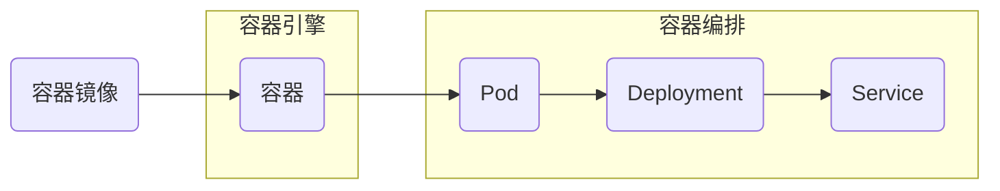

# 容器 原理与代码实例讲解

作者：禅与计算机程序设计艺术 / Zen and the Art of Computer Programming

关键词：容器、Docker、Kubernetes、虚拟化、隔离、镜像、编排

## 1. 背景介绍
### 1.1  问题的由来
在软件开发和部署过程中,环境配置和依赖管理一直是一个棘手的问题。不同的操作系统、库版本、配置等差异,导致了应用在开发、测试和生产环境中的行为不一致,给开发和运维带来了巨大的困扰。为了解决这些问题,容器技术应运而生。
### 1.2  研究现状
容器技术经过多年的发展,已经日趋成熟。Docker作为容器引擎的代表,极大地推动了容器的普及。而Kubernetes作为容器编排平台的事实标准,让大规模容器集群管理变得更加简单高效。越来越多的企业开始拥抱容器,云原生架构也成为业界趋势。
### 1.3  研究意义 
容器改变了应用的开发、交付和运行方式。它为应用提供了一致的运行环境,简化了环境配置和依赖管理。通过容器镜像,可以将应用及其依赖打包在一起,实现"一次构建,到处运行"。容器化让开发和运维更加高效,推动了DevOps实践和微服务架构的发展。
### 1.4  本文结构
本文将全面探讨容器的原理和实践。第2节介绍容器的核心概念。第3节深入容器引擎的实现原理。第4节讲解容器相关的数学模型。第5节通过代码实例演示容器的使用。第6节展示容器的实际应用场景。第7节推荐容器相关的工具和资源。第8节总结容器技术的发展趋势与挑战。

## 2. 核心概念与联系
容器是一种操作系统级虚拟化技术,通过namespace和cgroup等机制实现资源隔离和限制,让多个容器在宿主机上共享内核,同时保持相互独立。

容器镜像是一个只读模板,包含了运行容器所需的文件系统和配置。通过镜像可以快速创建容器实例。

容器引擎如Docker,负责容器的生命周期管理,包括镜像构建、容器创建和删除等。

容器编排工具如Kubernetes,用于大规模容器集群的自动化部署、扩缩容和管理。

下图展示了容器的核心概念及其关系:



## 3. 核心算法原理 & 具体操作步骤
### 3.1  算法原理概述
容器引擎如Docker,基于Linux内核的Namespace和Cgroups等特性,实现了进程、网络、文件系统等资源的隔离和限制。
- Namespace为容器提供了独立的进程、网络、文件系统等视图。不同容器内的进程无法感知彼此的存在。
- Cgroups限制了容器可以使用的CPU、内存等资源,避免容器间相互影响。
- UnionFS通过分层的方式构建容器镜像,节省了存储空间,提高了分发效率。
### 3.2  算法步骤详解
1. 容器创建:通过调用clone()系统调用,传入CLONE_NEWNS、CLONE_NEWPID等参数,创建一个隔离的Namespace。然后在容器进程启动前,通过CgroupManager将其加入Cgroup限制资源使用。
2. 容器文件系统:容器镜像使用UnionFS如aufs、overlay2等,通过分层的方式组织rootfs。镜像包含一个个只读层,在容器启动时,添加一个可写层供容器修改。多个容器可共享底层的只读镜像层,写时复制可最小化容器间的存储开销。
3. 容器网络:Docker默认使用veth pair将容器接入宿主机网络命名空间。容器内看到的是独立的网络设备和协议栈。Docker通过iptables或者IPVS实现容器的端口映射和负载均衡。
4. 容器资源限制:通过Cgroups限制容器可使用的CPU、内存、IO等资源。避免容器占用过多资源影响其他容器和宿主机。
### 3.3  算法优缺点
优点:
- 容器通过Namespace和Cgroups实现了高效轻量的隔离,比虚拟机更加灵活和可移植
- 容器镜像分层存储和写时复制,节省了存储空间,提高了分发和部署效率
- 容器网络基于veth pair等技术,不需要复杂的网络配置,容器可方便地与外界通信

缺点:
- 容器隔离性不如虚拟机,存在一定的安全风险
- 容器对宿主机内核有一定要求,跨平台支持有限
- 容器数量过多时,NAT性能可能成为瓶颈
### 3.4  算法应用领域
- 应用开发:开发人员使用容器搭建标准的开发环境,消除环境差异
- 持续集成/持续部署:每次代码提交触发容器镜像构建和自动化测试,加速软件交付
- 微服务架构:每个微服务独立部署为容器,方便单独扩缩容和升级
- Serverless:容器是实现FaaS的理想载体,可根据请求弹性伸缩

## 4. 数学模型和公式 & 详细讲解 & 举例说明
### 4.1  数学模型构建
我们可以用集合论来描述容器镜像。设计算机系统所有文件的集合为 $F$,一个镜像 $I$ 可表示为 $F$ 的一个子集,即 $I \subseteq F$。

层(Layer) $L$ 代表了镜像中的修改,是 $F$ 的子集,即 $L \subseteq F$。

镜像 $I$ 可表示为一系列层 $L_i$ 的有序集合: $I = \{L_1, L_2, ..., L_n\}$,其中 $L_i \subseteq F$。

两个层 $L_i$ 和 $L_j$ 的并集 $L_i \cup L_j$ 表示合并后的修改。

UnionFS可以表示为层集合 $\{L_1, L_2, ..., L_n\}$ 的并集:

$$UnionFS = \bigcup_{i=1}^{n} L_i, L_i \subseteq F$$

### 4.2  公式推导过程
假设基础镜像 $I_base$ 包含层 $\{L_1, L_2\}$,在此基础上安装软件包后得到新的层 $L_3$,则新的镜像 $I_new$ 可表示为:

$$
\begin{aligned}
I_base & = \{L_1, L_2\} \
I_new & = I_base \cup \{L_3\} \
          & = \{L_1, L_2\} \cup \{L_3\} \
          & = \{L_1, L_2, L_3\}
\end{aligned} 
$$

可见,新镜像在原有基础镜像层上添加了新的层,而不是完全复制所有文件。

### 4.3  案例分析与讲解
以Dockerfile构建一个Python应用镜像为例:

```dockerfile
FROM python:3.9-slim
COPY requirements.txt .
RUN pip install -r requirements.txt
COPY app.py .  
CMD ["python", "app.py"]
```

构建过程可表示为:
1. 基础镜像层: $L_base = \{python解释器及依赖\}$
2. 添加requirements.txt文件: $L_1 = L_base \cup \{requirements.txt\}$
3. 安装依赖包: $L_2 = L_1 \cup \{依赖包文件\}$
4. 添加应用代码: $L_3 = L_2 \cup \{app.py\}$

最终镜像为 $I = \{L_base, L_1, L_2, L_3\}$,采用分层构建,节省了存储空间。

### 4.4  常见问题解答
问题1: 如何最小化镜像大小?
- 使用轻量级的基础镜像,如alpine
- 合并RUN指令,减少层数
- 及时清理构建过程中产生的缓存和临时文件
- 压缩镜像,如docker-squash

问题2: 容器时间与宿主机不一致如何解决?
- 将宿主机的/etc/localtime以只读方式挂载到容器的/etc/localtime
- 传入TZ环境变量,如`-e TZ=Asia/Shanghai`

## 5. 项目实践：代码实例和详细解释说明
### 5.1  开发环境搭建
1. 安装Docker引擎
   - Linux: `curl -fsSL https://get.docker.com | bash -s docker --mirror Aliyun`
   - macOS: `brew install --cask docker`
   - Windows: 下载安装Docker Desktop
2. 拉取Python基础镜像
   - `docker pull python:3.9-slim`
3. 编写Dockerfile
   - 参考4.3节的Dockerfile示例
4. 准备应用代码
   - 编写app.py和requirements.txt
### 5.2  源代码详细实现
app.py:
```python
from flask import Flask

app = Flask(__name__)

@app.route('/')
def hello():
    return 'Hello, World!'

if __name__ == '__main__':
    app.run(host='0.0.0.0', port=8080)
```

requirements.txt:
```
flask
```

### 5.3  代码解读与分析
- app.py使用Flask框架实现了一个简单的Web应用,监听8080端口。
- requirements.txt声明了应用依赖的Python包。
- Dockerfile以python:3.9-slim为基础镜像,复制requirements.txt并安装依赖,然后复制应用代码,最后设置容器启动命令。

### 5.4  运行结果展示
1. 构建镜像
   - `docker build -t hello-flask .`
2. 运行容器 
   - `docker run -d -p 8080:8080 --name hello hello-flask`
3. 访问应用
   - 在浏览器中打开`http://localhost:8080`,可看到"Hello, World!"输出

## 6. 实际应用场景
容器技术在以下场景有广泛应用:
- 开发环境标准化:开发、测试、生产环境保持一致,避免环境差异导致的问题。
- 持续集成与部署:代码提交触发自动构建镜像,再部署到不同环境,实现流水线式交付。
- 微服务架构:将单体应用拆分为多个独立的微服务,每个微服务单独部署为容器,实现解耦和弹性伸缩。
- 多租户隔离:为每个租户分配独立的容器,在共享宿主机的同时,保证良好的隔离性。
- Serverless:容器是实现FaaS和Serverless的理想载体。函数代码被打包为镜像,根据请求弹性伸缩。
### 6.4  未来应用展望
- 边缘计算:在边缘节点上部署容器应用,实现低时延和数据本地处理。
- AI应用:利用容器简化AI框架和模型的部署,方便在不同环境复现。
- 混合云管理:跨云平台统一管理容器,实现多云和混合云部署。
- 安全容器:引入可信执行环境(TEE),进一步提升容器的安全性。

## 7. 工具和资源推荐
### 7.1  学习资源推荐
- 官方文档:
  - Docker: https://docs.docker.com/
  - Kubernetes: https://kubernetes.io/docs/
- 在线课程:
  - Docker从入门到实践: https://yeasy.gitbook.io/docker_practice/
  - Kubernetes Basics: https://kubernetes.io/docs/tutorials/kubernetes-basics/
- 书籍:
  - 《Docker容器与容器云》 杨保华 戴王剑 张亚 编著
  - 《Kubernetes权威指南》 龚正 吴治辉 崔秀龙 编著
### 7.2  开发工具推荐
- 镜像仓库:
  - Docker Hub: https://hub.docker.com/
  - Harbor: https://goharbor.io/
- 镜像安全扫描:
  - Trivy: https://github.com/aquasecurity/trivy
  - Anchore Engine: https://anchore.com/opensource/
- 容器监控:
  - cAdvisor: https://github.com/google/cadvisor
  - Prometheus: https://prometheus.io/
### 7.3  相关论文推荐
- Merkel, D. (2014). Docker: lightweight linux containers for consistent development and deployment. Linux journal, 2014(239), 2.
- Bernstein,