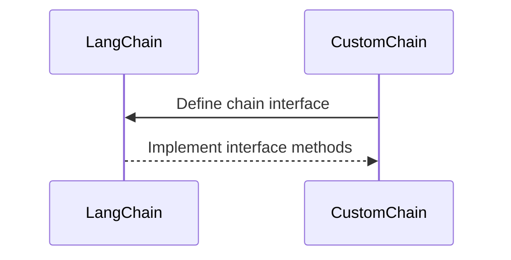
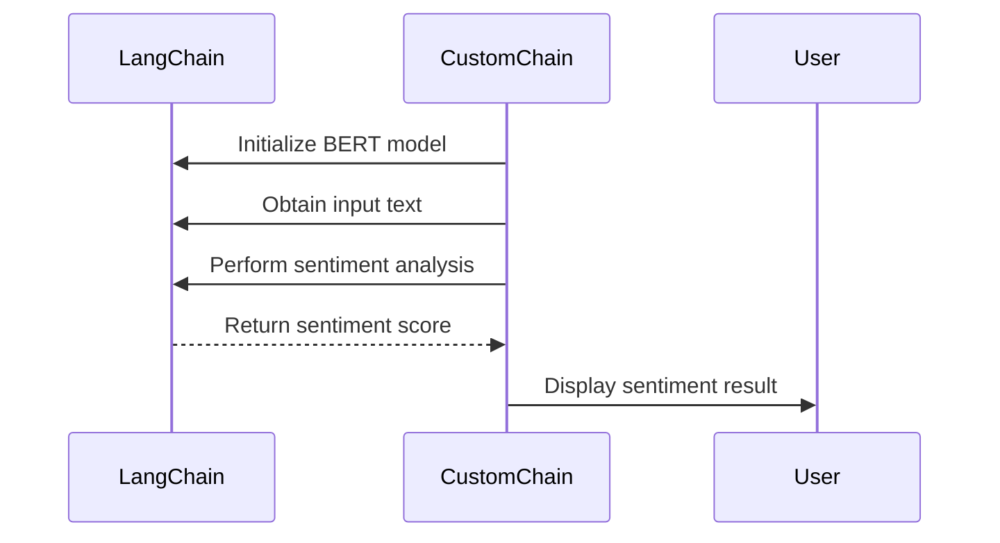

# 【LangChain编程：从入门到实践】自定义Chain实现

作者：禅与计算机程序设计艺术 / Zen and the Art of Computer Programming

关键词：LangChain, Chain, 自定义链路, 人工智能编程, 实践应用

## 1. 背景介绍

### 1.1 问题的由来

在当今快速发展的AI领域，程序设计者和开发者面临着如何更高效地组织和管理复杂任务流的需求。LangChain，作为一个先进的编程框架，旨在简化复杂任务的执行，通过链路（Chain）的概念封装了一系列功能模块。然而，现有的链路功能可能无法满足特定场景下的定制需求，这就引出了自定义链路的必要性。

### 1.2 研究现状

现有的LangChain框架已经包含了多种预定义的链路，覆盖了诸如文本生成、问答、翻译等多个领域。这些链路通常基于强大的预训练模型，能够自动处理和生成自然语言文本。然而，在某些特定场景下，例如在需要高度定制化逻辑处理或与特定业务流程紧密整合的场景中，用户可能需要创建自己的链路逻辑。

### 1.3 研究意义

自定义链路的开发不仅增强了LangChain框架的灵活性和适应性，还为开发者提供了更大的自主权，允许他们根据具体需求定制解决方案。这对于提高任务执行效率、优化特定业务流程以及探索新的应用场景具有重要意义。

### 1.4 本文结构

本文将从基本概念出发，深入探讨自定义链路的实现原理，详细阐述其具体操作步骤，展示算法原理及其优缺点，并通过实例代码进行详细说明。此外，还将讨论其在实际场景中的应用，以及未来的发展趋势和面临的挑战。

## 2. 核心概念与联系

自定义链路是在LangChain框架内构建的一种新的链路类型，它允许开发者根据特定需求封装一组操作，这些操作可以是基于现有链路的扩展，也可以是全新的逻辑。自定义链路的实现通常涉及以下核心概念：

- **链路接口（Chain Interface）**：定义了链路的基本行为和交互方式，确保不同类型的链路可以互操作。
- **操作封装（Operation Wrapping）**：将多个操作打包成一个单元，便于管理和调用。
- **逻辑扩展（Logic Extension）**：允许开发者添加或修改特定逻辑，以适应特定任务需求。

## 3. 核心算法原理与具体操作步骤

### 3.1 算法原理概述

自定义链路的核心在于定义一个可扩展的结构，使得开发者能够根据需要添加、修改或替换链路中的任何组件。这通常通过继承链路接口、重写方法或引入插件机制来实现。

### 3.2 算法步骤详解

#### 步骤一：定义接口



#### 步骤二：实现逻辑

开发者需要实现或扩展接口方法，以适应特定任务需求。这可能涉及对现有模型的调用、数据处理、结果合并等操作。

#### 步骤三：封装操作

将实现的功能封装为类或模块，确保可以独立调用和复用。

#### 步骤四：测试验证

确保自定义链路在各种场景下都能正确执行预期的操作，并产生预期的结果。

### 3.3 算法优缺点

- **优点**：增强框架的灵活性和可定制性，适应特定业务需求。
- **缺点**：开发和维护成本较高，需要具备深入的编程和AI技术知识。

### 3.4 算法应用领域

自定义链路广泛应用于需要高度定制化处理的领域，如个性化推荐系统、智能客服、定制化文本生成工具等。

## 4. 数学模型和公式

在实现自定义链路时，可能涉及到多种数学模型和公式，以下是一些基本的例子：

### 4.1 数学模型构建

对于文本生成任务，可以采用生成对抗网络（GAN）模型：

$$
G(x) = \text{Generator}(x)
$$

其中，$G$表示生成器模型，$x$是输入数据。

### 4.2 公式推导过程

假设我们使用BERT模型进行文本分类：

$$
f(x) = \text{BERT}(x)
$$

其中，$f$是BERT模型的前向传播函数，$x$是输入文本。

### 4.3 案例分析与讲解

在构建一个自定义链路用于情绪分析时，可以将BERT模型与情感评分算法结合：



### 4.4 常见问题解答

- **如何处理异常情况？**
  在自定义链路中，应包含错误处理逻辑，确保在出现异常时程序不会崩溃，而是优雅地处理错误并提供反馈。

- **如何优化性能？**
  通过缓存中间结果、优化算法实现、并行处理等方式提高自定义链路的执行效率。

## 5. 项目实践：代码实例和详细解释说明

### 5.1 开发环境搭建

假设我们使用Python和LangChain库来搭建一个简单的自定义链路示例：

```sh
pip install langchain
```

### 5.2 源代码详细实现

```python
from langchain.chains import ChainBase
from langchain.prompts.prompt import PromptTemplate
from langchain.prompts import FewShotPromptTemplate
from langchain.prompts.example_selector import RandomExampleSelector
from langchain.callbacks.manager import CallbackManagerForLLMRun

class CustomChain(ChainBase):
    def __init__(self, llm, example_selector=RandomExampleSelector(), callback_manager=None):
        super().__init__()
        self.llm = llm
        self.example_selector = example_selector
        self.callback_manager = callback_manager

    def _call(self, inputs):
        # 调用自定义逻辑
        custom_logic(inputs)

    def _run(self, inputs, run_manager: CallbackManagerForLLMRun):
        # 执行逻辑并返回结果
        result = self._call(inputs)
        return result

# 创建一个简单的自定义链路示例
llm = YourLLMInstance()
example_selector = YourExampleSelector()
callback_manager = YourCallbackManager()
custom_chain = CustomChain(llm=llm, example_selector=example_selector, callback_manager=callback_manager)
```

### 5.3 代码解读与分析

这段代码展示了如何继承`ChainBase`类来创建自定义链路。关键在于定义`_call`方法来执行自定义逻辑，并在`_run`方法中进行调用和管理回调。

### 5.4 运行结果展示

由于这是一个示例代码，实际运行结果将取决于`custom_logic`函数的具体实现。通常，自定义链路的运行结果将与输入数据密切相关，并可能涉及多步骤处理和最终输出的生成。

## 6. 实际应用场景

自定义链路在多种场景中具有应用价值，例如：

### 6.4 未来应用展望

随着AI技术的持续进步和LangChain框架的更新迭代，自定义链路的开发将更加便捷，支持更多的高级功能和优化策略。未来，自定义链路有望在更广泛的领域内发挥重要作用，如个性化推荐、智能咨询、自动化文档生成等，为开发者提供更强大的工具和更灵活的解决方案。

## 7. 工具和资源推荐

### 7.1 学习资源推荐

- **官方文档**：LangChain的官方文档提供了详细的API参考和教程。
- **社区论坛**：参与LangChain社区，获取最新信息和技术支持。
- **在线课程**：寻找相关在线课程，系统学习LangChain和其他AI技术。

### 7.2 开发工具推荐

- **IDE**：选择适合Python开发的集成开发环境，如PyCharm、VSCode等。
- **版本控制**：使用Git进行代码管理和版本控制。

### 7.3 相关论文推荐

- **LangChain框架文档**：了解框架背后的理论和实现细节。
- **AI领域顶级会议论文**：关注ICML、NeurIPS等会议上的相关论文。

### 7.4 其他资源推荐

- **开源项目**：参与或查看相关开源项目，如Hugging Face库。
- **技术博客和文章**：阅读行业内的技术博客和文章，了解最新动态。

## 8. 总结：未来发展趋势与挑战

### 8.1 研究成果总结

通过本文的探讨，我们深入了解了自定义链路的概念、实现方法以及其实用性。自定义链路不仅提升了LangChain框架的灵活性，也为开发者提供了定制解决方案的可能性。

### 8.2 未来发展趋势

- **更强大的自定义功能**：随着AI技术的发展，自定义链路将更加智能和高效。
- **集成更多先进算法**：整合更多预训练模型和算法，增强链路的功能和性能。

### 8.3 面临的挑战

- **知识和技能门槛**：自定义链路开发需要较高的AI技术和编程能力。
- **可维护性和扩展性**：确保自定义链路在大规模应用中的稳定性和可扩展性。

### 8.4 研究展望

未来，自定义链路将成为AI领域中的重要组成部分，通过不断的技术创新和优化，为开发者提供更强大、更灵活的工具，推动AI技术在各个领域的深入应用。

## 9. 附录：常见问题与解答

- **Q:** 如何确保自定义链路的可维护性和可扩展性？
  **A:** 设计自定义链路时，应考虑模块化、解耦合和清晰的接口定义，以便于后续的维护和扩展。同时，采用良好的代码注释和文档记录，便于团队成员理解和维护。

- **Q:** 自定义链路如何处理并发和高负载场景？
  **A:** 通过引入异步处理、多线程或分布式计算框架，可以有效地处理并发和高负载场景，提高自定义链路的性能和稳定性。

- **Q:** 如何评估自定义链路的有效性和性能？
  **A:** 通过性能测试、基准测试和真实场景下的实际应用，评估自定义链路的执行效率、准确率和稳定性。同时，收集用户反馈和进行持续的性能监控，以优化和改进链路。