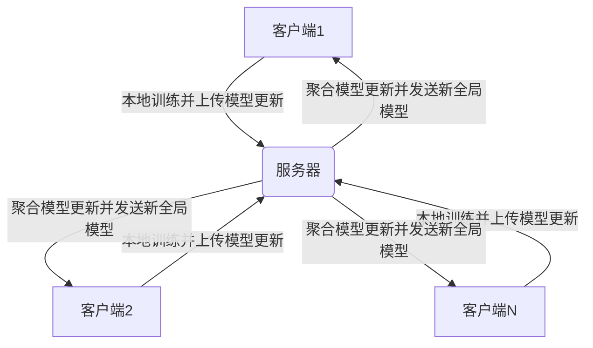

# 联邦学习(Federated Learning) - 原理与代码实例讲解

## 1. 背景介绍

### 1.1 问题的由来

在当今大数据时代，数据被视为新的"燃料"，推动着人工智能和机器学习的飞速发展。然而,随着隐私保护意识的增强,人们越来越关注数据安全和隐私问题。传统的集中式机器学习方法需要将所有训练数据集中存储,这可能会导致隐私泄露和数据滥用的风险。此外,一些领域(如医疗、金融等)由于监管和合规性要求,数据无法轻易跨机构共享。因此,如何在保护数据隐私的同时,利用分散在不同设备或机构中的数据进行高效的模型训练,成为了一个亟待解决的问题。

### 1.2 研究现状

为了解决这一问题,谷歌(Google)于2017年提出了联邦学习(Federated Learning)的概念。联邦学习允许多个客户端(如手机、平板电脑等)在不共享原始数据的情况下,共同训练一个机器学习模型。每个客户端只需在本地使用自己的数据训练模型,然后将本地模型的更新(如梯度或模型参数)上传到一个中央服务器。服务器将所有客户端的更新聚合,并将聚合后的全局模型更新发送回各个客户端。通过这种方式,联邦学习实现了隐私保护和高效模型训练的平衡。

### 1.3 研究意义

联邦学习的出现为解决隐私保护和数据孤岛问题提供了一种全新的范式。它具有以下重要意义:

1. **隐私保护**: 联邦学习不需要客户端上传原始数据,从根本上避免了数据泄露的风险,有效保护了用户隐私。
2. **数据利用**: 联邦学习可以利用分散在不同设备或机构中的数据,提高了数据的利用率和模型的泛化能力。
3. **高效训练**: 通过在本地进行训练,联邦学习减少了数据传输的带宽需求,提高了训练效率。
4. **合规性**: 联邦学习符合一些行业的监管和合规性要求,如医疗和金融领域的数据保护法规。

### 1.4 本文结构

本文将全面介绍联邦学习的原理、算法、数学模型、实现细节和应用场景。文章结构如下:

1. 背景介绍
2. 核心概念与联系
3. 核心算法原理与具体操作步骤
4. 数学模型和公式详细讲解与举例说明
5. 项目实践:代码实例和详细解释说明
6. 实际应用场景
7. 工具和资源推荐
8. 总结:未来发展趋势与挑战
9. 附录:常见问题与解答

## 2. 核心概念与联系

联邦学习融合了多个领域的概念和技术,包括分布式优化、隐私保护、机器学习等。下面我们将介绍联邦学习的几个核心概念及其相互关系。

### 2.1 分布式优化

联邦学习的核心思想是将机器学习模型的训练过程分散到多个客户端,每个客户端在本地使用自己的数据进行模型更新,然后将更新上传到中央服务器进行聚合。这种分布式优化的思路源于分布式计算和并行计算领域。

在传统的分布式优化中,我们通常将一个大规模优化问题分解为多个子问题,分别在不同的计算节点上求解,然后将各个节点的结果进行合并,得到最终的优化解。联邦学习借鉴了这一思路,将模型训练过程分散到多个客户端,每个客户端相当于一个计算节点,在本地进行模型更新,然后将更新上传到服务器进行聚合。

### 2.2 隐私保护

隐私保护是联邦学习的核心目标之一。在联邦学习中,客户端不需要上传原始数据,只需上传模型更新(如梯度或模型参数),从而避免了数据泄露的风险。此外,联邦学习还融合了一些隐私保护技术,如差分隐私(Differential Privacy)、安全多方计算(Secure Multi-Party Computation)等,进一步增强了隐私保护能力。

### 2.3 机器学习

联邦学习的最终目标是在分散的数据上训练出高质量的机器学习模型。因此,机器学习理论和算法是联邦学习的基础。在联邦学习中,我们需要考虑如何在分布式环境下有效地训练模型,如何处理数据不平衡和异构性问题,如何设计高效的聚合算法等。同时,联邦学习也为机器学习领域带来了新的挑战和机遇,如隐私保护机器学习、分布式机器学习等。

### 2.4 系统架构

为了实现联邦学习,我们需要一个分布式系统架构来支持客户端与服务器之间的通信和协作。这个架构通常包括以下几个关键组件:

1. **客户端(Client)**: 负责在本地数据上训练模型,并将模型更新上传到服务器。
2. **服务器(Server)**: 负责接收来自客户端的模型更新,进行聚合,并将聚合后的全局模型发送回客户端。
3. **通信协议(Communication Protocol)**: 定义了客户端和服务器之间的通信方式,如何传输模型更新、全局模型等。
4. **聚合算法(Aggregation Algorithm)**: 决定了如何将来自不同客户端的模型更新进行聚合,以获得新的全局模型。
5. **安全和隐私保护机制(Security and Privacy Protection)**: 确保通信过程中的数据安全,并采用适当的隐私保护技术,如差分隐私、安全多方计算等。

这些组件的设计和实现对于联邦学习系统的性能、可扩展性和隐私保护能力至关重要。

### 2.5 Mermaid 流程图

下面的 Mermaid 流程图展示了联邦学习的基本工作流程:

在这个流程中,每个客户端使用本地数据训练模型,并将模型更新上传到服务器。服务器使用聚合算法将所有客户端的更新聚合,得到新的全局模型,然后将新的全局模型发送回各个客户端。客户端接收到新的全局模型后,将其作为新的初始模型,并在下一轮迭代中继续训练。通过不断地本地训练、上传更新、聚合模型的过程,最终可以得到一个在所有客户端数据上训练的高质量模型。

## 3. 核心算法原理与具体操作步骤

### 3.1 算法原理概述

联邦学习的核心算法是联邦平均算法(Federated Averaging,FedAvg)。FedAvg算法由谷歌提出,它将传统的分布式优化思路应用到了联邦学习场景中。

FedAvg算法的基本思路是:

1. 服务器向所有客户端发送初始模型参数。
2. 每个客户端使用本地数据在初始模型的基础上进行一定轮次的训练,得到本地模型更新(如梯度或模型参数)。
3. 客户端将本地模型更新上传到服务器。
4. 服务器对所有客户端的模型更新进行加权平均,得到新的全局模型参数。
5. 服务器将新的全局模型参数发送回各个客户端,作为下一轮迭代的初始模型。
6. 重复步骤2-5,直到模型收敛或达到预设的迭代次数。

FedAvg算法的关键点在于:

1. 每个客户端只需使用本地数据进行模型更新,无需上传原始数据,从而保护了数据隐私。
2. 服务器通过对客户端的模型更新进行加权平均,实现了模型在整个数据集上的训练,提高了模型的泛化能力。
3. 算法采用了异步更新的方式,客户端可以在任何时候上传模型更新,无需等待所有客户端完成,提高了训练效率。

### 3.2 算法步骤详解

下面我们详细介绍FedAvg算法的具体步骤:

1. **初始化**

服务器初始化一个全局模型参数 $\theta_0$,并将其发送给所有客户端。

2. **客户端本地训练**

对于每个客户端 k,它将接收到服务器发送的当前全局模型参数 $\theta_t$。然后,客户端 k 使用本地数据集 $D_k$ 在当前模型参数的基础上进行 $E$ 轮本地训练,得到新的本地模型参数 $\theta_k^{t+1}$。本地训练通常使用随机梯度下降(SGD)或其变体算法进行,目标是最小化本地损失函数:

$$\min_\theta \frac{1}{|D_k|} \sum_{x \in D_k} f(x; \theta)$$

其中 $f(x; \theta)$ 是模型在数据点 $x$ 上的损失函数。

3. **上传本地模型更新**

客户端 k 将本地模型更新 $\Delta_k^{t+1} = \theta_k^{t+1} - \theta_t$ 上传到服务器。注意,客户端只上传模型参数的更新,而不是原始数据,从而保护了数据隐私。

4. **服务器聚合模型更新**

服务器收集来自所有客户端的本地模型更新 $\{\Delta_k^{t+1}\}$,并对它们进行加权平均,得到新的全局模型参数更新:

$$\Delta^{t+1} = \sum_{k=1}^{K} \frac{n_k}{n} \Delta_k^{t+1}$$

其中 $n_k$ 是客户端 k 的本地数据集大小,n 是所有客户端数据集的总大小,即 $n = \sum_{k=1}^{K} n_k$。加权平均的目的是为了让拥有更多数据的客户端在聚合过程中占有更大的权重。

然后,服务器使用当前全局模型参数 $\theta_t$ 和聚合后的模型更新 $\Delta^{t+1}$ 计算出新的全局模型参数:

$$\theta_{t+1} = \theta_t + \eta \Delta^{t+1}$$

其中 $\eta$ 是服务器端的学习率。

5. **发送新的全局模型**

服务器将新的全局模型参数 $\theta_{t+1}$ 发送回各个客户端,作为下一轮迭代的初始模型。

6. **迭代训练**

重复步骤2-5,直到模型收敛或达到预设的最大迭代次数。

### 3.3 算法优缺点

FedAvg算法具有以下优点:

1. **隐私保护**: 客户端无需上传原始数据,只需上传模型更新,从根本上避免了数据泄露的风险。
2. **异步更新**: 客户端可以在任何时候上传模型更新,无需等待所有客户端完成,提高了训练效率。
3. **通信效率**: 只需传输模型更新,而不是整个模型,减少了通信带宽的需求。
4. **容错性**: 即使部分客户端离线或失效,算法仍然可以继续进行,具有一定的容错能力。

但FedAvg算法也存在一些缺点和挑战:

1. **收敛速度慢**: 由于客户端之间的数据分布不均匀,以及异步更新带来的噪声,FedAvg算法的收敛速度通常较慢。
2. **数据异构性**: 不同客户端的数据分布可能存在较大差异,导致模型在某些客户端上表现不佳。
3. **系统异构性**: 客户端的硬件配置、网络环境等也可能存在差异,影响训练效率和模型性能。
4. **隐私攻击风险**:虽然FedAvg算法本身可以保护数据隐私,但仍然存在一些