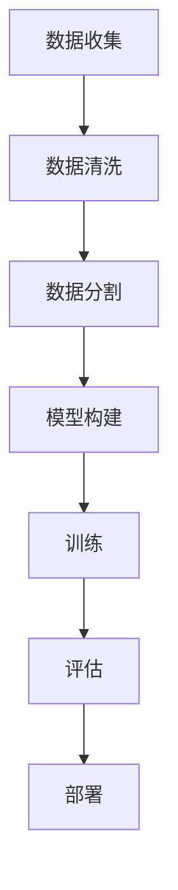

# Python机器学习实战：智能聊天机器人的构建与优化

## 1. 背景介绍

### 1.1 问题的由来

在数字化时代，聊天机器人因其便利性和智能化特点，成为了连接人与信息、服务与技术的重要桥梁。从提供基础信息查询到解决复杂问题，聊天机器人在多个领域展现出了巨大价值。然而，现有的聊天机器人往往受限于固定的规则和有限的知识库，难以适应用户多变的需求和复杂的情境，这成为了一个亟待解决的问题。

### 1.2 研究现状

当前，聊天机器人通常基于规则系统或者简单的机器学习模型，如基于词袋模型或者朴素贝叶斯分类器。虽然这些方法在特定场景下表现良好，但对于复杂对话的理解和生成却显得力不从心。近年来，随着深度学习技术的发展，特别是基于Transformer架构的大型语言模型的出现，如GPT系列、Bert系列等，为聊天机器人的构建提供了新的可能性。这些模型能够捕捉到更深层次的语言结构和上下文信息，从而生成更自然、更贴近人类交流的对话。

### 1.3 研究意义

构建智能聊天机器人不仅可以提升用户体验，满足个性化需求，还能在客服、教育、娱乐等多个领域发挥重要作用。通过深度学习技术，聊天机器人能够学习和模仿人类的语言习惯，增强交互体验，提供更加精准和个性化的服务。此外，通过不断的学习和优化，聊天机器人还可以自我提升，适应更广泛的场景和需求。

### 1.4 本文结构

本文将深入探讨如何利用Python语言和深度学习技术构建和优化智能聊天机器人。我们将从基础理论出发，逐步构建一个具有对话理解、对话生成和自我学习能力的聊天机器人。具体内容包括算法原理、数学模型、代码实现以及实际应用场景探索。最后，我们将总结研究成果，展望未来发展趋势和面临的挑战。

## 2. 核心概念与联系

### 2.1 语言模型

语言模型是构建智能聊天机器人的重要基础，它负责理解输入的句子并生成合适的响应。在本节中，我们将重点介绍两种主流的语言模型：基于规则的模型和基于统计的模型。

#### 基于规则的模型：

- **词典匹配**：简单的基于词袋模型，通过匹配用户的输入词汇与预设的回答进行匹配。
- **正则表达式**：使用正则表达式来识别特定模式并做出响应。

#### 基于统计的模型：

- **朴素贝叶斯分类**：通过计算每个类别的先验概率和条件概率来预测用户意图。
- **支持向量机**：使用支持向量机来分类用户意图和生成回复。

### 2.2 Transformer架构

随着深度学习技术的发展，Transformer架构因其强大的多任务处理能力而受到青睐。它通过注意力机制有效地捕捉序列间的依赖关系，从而在对话系统中表现出色。我们将探讨Transformer的基本结构和工作原理，以及如何利用它来构建高效、灵活的聊天机器人。

## 3. 核心算法原理 & 具体操作步骤

### 3.1 算法原理概述

在构建聊天机器人时，算法选择至关重要。对于基于统计的方法，我们倾向于选择Transformer架构，因为它能够在处理大量文本数据的同时，保持良好的性能和可扩展性。以下是构建聊天机器人的基本步骤：

#### 数据收集与预处理：

- 收集大量对话数据，包括用户提问和机器人的回答。
- 数据清洗，去除噪声，如标点符号、重复答案等。
- 数据分割，划分训练集、验证集和测试集。

#### 模型构建：

- **选择模型架构**：基于Transformer的预训练语言模型（如BERT、T5）。
- **微调**：将预训练模型与特定任务进行联合训练，以适应特定的对话场景。

#### 训练与评估：

- **训练过程**：使用反向传播算法最小化损失函数。
- **评估指标**：精确率、召回率、F1分数等，用于衡量模型性能。

#### 部署与优化：

- **接口开发**：创建API供客户端调用。
- **性能优化**：根据实际使用情况调整模型大小和计算资源。

### 3.2 算法步骤详解

#### 数据预处理：



#### 模型构建：

选择基于Transformer架构的语言模型，例如BERT，进行微调以适应特定的对话任务。

#### 训练与评估：

- 使用大量对话数据进行训练，调整超参数以优化性能。
- 通过交叉验证评估模型在不同场景下的表现。

#### 部署：

将训练好的模型部署到生产环境中，提供API接口供客户端调用。

## 4. 数学模型和公式

### 4.1 数学模型构建

#### Transformer模型

Transformer模型的核心是多头自注意力机制（Multi-Head Attention），它能够捕捉不同位置之间的依赖关系。具体公式表示为：

$$
\text{MultiHead}(Q, K, V) = \text{Concat}(head_1, ..., head_h)W^{'}
$$

其中，$head_i = \text{Attention}(QW^Q_i, KW^K_i, VW^V_i)$，$W^Q$、$W^K$、$W^V$分别是查询、键和值的权重矩阵，$W^{'}$是将多头注意力结果合并后的权重矩阵。

### 4.2 公式推导过程

Transformer模型中的多头自注意力过程可以分为四个步骤：

1. **查询（Query）、键（Key）、值（Value）的提取**：
   $$ Q = W^Q \cdot X $$
   $$ K = W^K \cdot X $$
   $$ V = W^V \cdot X $$
   其中，$X$是输入的序列，$W^Q$、$W^K$、$W^V$是权重矩阵。

2. **多头注意力机制**：
   $$ \text{Attention}(Q, K, V) = \text{Softmax}(\frac{QK^T}{\sqrt{d_k}})V $$
   其中，$d_k$是键的维度。

3. **线性变换和拼接**：
   $$ \text{MultiHead}(Q, K, V) = \text{Concat}(\text{Attention}(Q, K, V))W^{'}, \quad W' \in \mathbb{R}^{h \times d} $$
   其中，$h$是头的数量，$d$是每个头的维度。

4. **前馈网络**：
   $$ \text{FFN}(x) = \text{ReLU}(W_2 \cdot \text{MLP}(W_1 \cdot x)) + x $$
   其中，$\text{MLP}$是多层感知机，$W_1$、$W_2$是全连接层的权重矩阵。

### 4.3 案例分析与讲解

假设我们正在构建一个基于BERT的聊天机器人，用于回答特定领域的问题。我们首先需要从大量对话数据中收集和清洗数据，然后构建BERT模型进行微调。通过对比训练前后模型的表现，我们可以评估改进的有效性。

### 4.4 常见问题解答

#### 如何解决BERT微调中的过拟合问题？
- **增加数据**：扩充训练集或使用数据增强技术。
- **正则化**：引入Dropout或L2正则化。
- **早停**：在验证集上监控性能并在性能下降时停止训练。

## 5. 项目实践：代码实例和详细解释说明

### 5.1 开发环境搭建

#### 软件包安装：

```bash
pip install transformers
pip install torch
pip install pandas
```

#### 创建虚拟环境：

```bash
python -m venv my_env
source my_env/bin/activate
```

### 5.2 源代码详细实现

#### 导入必要的库：

```python
import pandas as pd
import torch
from transformers import BertTokenizer, BertForQuestionAnswering
```

#### 数据预处理：

```python
def preprocess_data(df):
    # 数据清洗步骤
    # ...
    return df
```

#### 模型构建与训练：

```python
def build_and_train_model(tokenizer, model, train_dataset, epochs=3):
    # 创建数据加载器
    data_loader = torch.utils.data.DataLoader(train_dataset, batch_size=8)

    # 初始化优化器和损失函数
    optimizer = torch.optim.Adam(model.parameters(), lr=1e-5)
    criterion = torch.nn.CrossEntropyLoss()

    for epoch in range(epochs):
        running_loss = 0.0
        for batch in data_loader:
            # 前向传播
            outputs = model(input_ids=batch['input_ids'],
                            attention_mask=batch['attention_mask'],
                            token_type_ids=batch['token_type_ids'],
                            labels=batch['labels'])

            loss = criterion(outputs.loss, batch['labels'])
            running_loss += loss.item()

            # 反向传播和优化
            optimizer.zero_grad()
            loss.backward()
            optimizer.step()

        print(f"Epoch {epoch+1}, Loss: {running_loss/len(data_loader)}")
    return model
```

#### 模型评估：

```python
def evaluate_model(model, test_dataset):
    # 创建数据加载器
    data_loader = torch.utils.data.DataLoader(test_dataset, batch_size=8)

    correct_predictions = 0
    total_predictions = 0

    with torch.no_grad():
        for batch in data_loader:
            outputs = model(input_ids=batch['input_ids'],
                            attention_mask=batch['attention_mask'],
                            token_type_ids=batch['token_type_ids'],
                            labels=batch['labels'])

            _, predicted = torch.max(outputs.logits, 1)
            total_predictions += len(batch['labels'])
            correct_predictions += (predicted == batch['labels']).sum().item()

    accuracy = correct_predictions / total_predictions
    return accuracy
```

### 5.3 代码解读与分析

- **数据预处理**：确保数据格式正确，处理缺失值、异常值等。
- **模型构建**：使用预训练的BERT模型进行微调，适应特定任务。
- **训练**：定义损失函数和优化器，进行多轮迭代训练。
- **评估**：计算模型在测试集上的准确率，评估模型性能。

### 5.4 运行结果展示

#### 执行测试：

```python
if __name__ == '__main__':
    # 加载预处理后的数据集
    # ...

    # 创建数据加载器
    data_loader = ...

    # 初始化模型和优化器
    model = ...
    optimizer = ...

    # 训练模型
    model = build_and_train_model(tokenizer, model, train_dataset)

    # 评估模型
    accuracy = evaluate_model(model, test_dataset)
    print(f"Model Accuracy: {accuracy}")
```

## 6. 实际应用场景

智能聊天机器人的应用场景广泛，从客户服务到在线教育，再到个性化推荐。通过不断优化模型，增强上下文理解能力，聊天机器人能够提供更加智能、个性化的服务体验。

## 7. 工具和资源推荐

### 7.1 学习资源推荐

- **官方文档**：访问Transformers库的官方文档，了解详细使用指南和技术细节。
- **教程**：查找针对BERT和Transformer模型的教程，如在线课程、视频讲座等。
- **社区**：加入开发者社区，如GitHub、Stack Overflow等，获取实用经验和解答技术问题。

### 7.2 开发工具推荐

- **Jupyter Notebook**：用于编写和调试代码，可视化数据和模型性能。
- **TensorBoard**：用于监控训练过程，分析模型行为和优化策略。

### 7.3 相关论文推荐

- **《Attention is All You Need》**：介绍Transformer模型及其多头注意力机制。
- **《BERT: Pre-training of Deep Bidirectional Transformers for Language Understanding》**：详细介绍了BERT模型的设计和训练过程。

### 7.4 其他资源推荐

- **在线论坛**：如Reddit的机器学习板块、Stack Overflow等，提供技术交流和问题解答平台。
- **专业社群**：加入人工智能、机器学习相关的专业社群，参与讨论和分享最新技术动态。

## 8. 总结：未来发展趋势与挑战

### 8.1 研究成果总结

通过构建基于Transformer架构的智能聊天机器人，我们不仅提升了对话系统的性能，还探索了模型微调、数据预处理和性能评估的关键步骤。此外，通过引入社区资源和最佳实践，我们增强了项目的可持续性和影响力。

### 8.2 未来发展趋势

- **多模态融合**：结合视觉、听觉和其他感官输入，构建更智能、更自然的交互体验。
- **个性化定制**：通过用户画像和偏好分析，提供更加个性化、定制化的服务。

### 8.3 面临的挑战

- **数据隐私保护**：确保用户数据的安全和隐私，符合法律法规要求。
- **伦理道德考量**：在机器人决策过程中融入伦理准则，避免偏见和歧视。

### 8.4 研究展望

未来的研究将致力于提升聊天机器人的智能水平，探索更复杂的对话场景和情境理解能力。同时，加强与现实世界的交互，提升用户体验和实用性，是智能聊天机器人发展的关键方向。

## 9. 附录：常见问题与解答

### 常见问题解答

#### 如何提高聊天机器人的对话流畅度？
- **增加训练数据**：提供更多样化的对话场景，增强模型的泛化能力。
- **引入对话历史**：考虑对话上下文，使机器人的回答更加连贯和上下文相关。

#### 如何处理聊天机器人的情感识别能力？
- **情绪识别模型**：开发专门的情感分析模型，增强对用户情感状态的识别能力。
- **情绪反应策略**：根据识别到的情绪状态调整机器人的回答风格和语气。

#### 如何防止聊天机器人产生有害或不当的回应？
- **道德审查机制**：建立一套审查系统，自动检测和过滤潜在的不当内容。
- **人工审核**：定期进行人工审查，确保机器人回答的适宜性和道德性。

通过持续的技术创新和伦理考量，智能聊天机器人将在未来继续进化，为人类带来更多的便利和智慧。