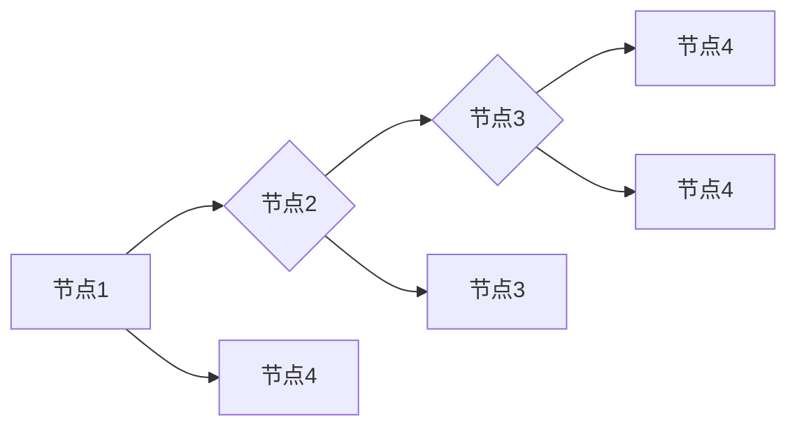

# Giraph在物流运输成本控制中的应用

作者：禅与计算机程序设计艺术 / Zen and the Art of Computer Programming

## 1. 背景介绍

### 1.1 问题的由来

随着全球经济的快速发展和供应链的日益复杂，物流运输成本控制已经成为企业降低成本、提高竞争力的关键环节。然而，物流运输网络庞大、数据量巨大，如何有效管理和优化运输成本成为一个极具挑战性的问题。

### 1.2 研究现状

目前，针对物流运输成本控制的研究主要集中在以下几个方面：

1. 运输路线优化：通过遗传算法、蚁群算法、粒子群优化算法等方法，寻找最优运输路线，降低运输成本。
2. 车辆路径规划：结合GPS定位和实时路况信息，为每辆车辆规划合理的行驶路径。
3. 仓储管理：优化仓储布局和库存管理，降低仓储成本。
4. 集装箱调度：根据货物类型和运输需求，优化集装箱的装载和调度。

然而，这些方法大多基于单机算法，难以应对大规模物流运输网络的数据量和复杂度。

### 1.3 研究意义

本文将探讨如何利用Giraph——一款分布式图处理框架，在物流运输成本控制中的应用。通过将物流运输网络建模为图结构，并利用Giraph进行大规模并行计算，可以有效提高物流运输成本控制的效果。

### 1.4 本文结构

本文首先介绍Giraph的基本原理和图处理算法，然后分析物流运输网络图的特点，并针对成本控制问题设计相应的图处理算法。最后，通过实验验证算法的有效性和性能。

## 2. 核心概念与联系

### 2.1 分布式计算

分布式计算是一种将计算任务分解为多个子任务，并在多个计算节点上并行执行的计算模式。Giraph作为一种分布式图处理框架，可以有效地在集群上进行大规模图计算。

### 2.2 图结构

图结构是一种用于表示实体之间关系的数学模型。在物流运输领域，可以将物流运输网络建模为图结构，其中节点代表物流设施（如仓库、配送中心等），边代表运输路线。

### 2.3 Giraph与图处理算法

Giraph提供了一系列图处理算法，如单源最短路径算法、最短路径算法、连接组件算法等。这些算法可以应用于物流运输网络图，解决运输路线优化、车辆路径规划等问题。

## 3. 核心算法原理 & 具体操作步骤

### 3.1 算法原理概述

本文针对物流运输成本控制问题，提出一种基于Giraph的图处理算法。该算法主要包括以下步骤：

1. 建立物流运输网络图。
2. 使用Giraph进行图处理，求解最优运输路线。
3. 根据最优路线，计算运输成本。

### 3.2 算法步骤详解

#### 3.2.1 建立物流运输网络图

根据实际物流运输网络数据，构建节点和边。节点代表物流设施，边代表运输路线，并包含运输距离、运输成本等属性。

```mermaid
graph TD
    subgraph 物流运输网络
        A[仓库] --> B[配送中心]
        B --> C[客户]
        A --> D[供应商]
    end
    subgraph 节点属性
        A[仓库] --> "距离(100km)"
        B[配送中心] --> "距离(50km)"
        C[客户] --> "距离(30km)"
        D[供应商] --> "距离(80km)"
    end
    subgraph 边属性
        A --> B --> "距离(100km),成本(200元)"
        A --> D --> "距离(80km),成本(150元)"
        B --> C --> "距离(50km),成本(100元)"
    end
end
```

#### 3.2.2 使用Giraph求解最优运输路线

利用Giraph进行图处理，求解从仓库到客户的最短路径。

```mermaid
graph TD
    A[开始] --> B[初始化图数据]
    B --> C{是否已遍历所有节点?}
    C -- 是 --> D[结束]
    C -- 否 --> E[计算最短路径]
    E --> F[更新节点信息]
    F --> C
end
```

#### 3.2.3 计算运输成本

根据最优路径，计算运输成本。

```python
def calculate_cost(route):
    total_cost = 0
    for i in range(len(route) - 1):
        total_cost += route[i][2]  # 获取边属性中的成本
    return total_cost

# 计算最优路径的运输成本
optimal_route = ...
optimal_cost = calculate_cost(optimal_route)
print("最优路径的运输成本为：", optimal_cost)
```

### 3.3 算法优缺点

#### 3.3.1 优点

1. 分布式计算：Giraph可以有效地在集群上进行大规模图计算，提高计算效率。
2. 可扩展性：Giraph支持多种图处理算法，易于扩展和应用。
3. 开源免费：Giraph是开源项目，可以免费使用。

#### 3.3.2 缺点

1. 硬件要求：Giraph需要集群环境，对硬件资源要求较高。
2. 开发难度：Giraph的学习曲线较陡，需要一定的编程和分布式计算经验。

### 3.4 算法应用领域

基于Giraph的图处理算法可以应用于以下物流运输成本控制领域：

1. 运输路线优化
2. 车辆路径规划
3. 集装箱调度
4. 仓储管理

## 4. 数学模型和公式 & 详细讲解 & 举例说明

### 4.1 数学模型构建

在物流运输成本控制中，我们可以建立以下数学模型：

$$
C = \sum_{i=1}^{n} w_i \cdot d_{ij}
$$

其中，$C$表示总成本，$w_i$表示第$i$条边的权重，$d_{ij}$表示第$i$条边连接的节点$i$和节点$j$之间的距离。

### 4.2 公式推导过程

1. 设物流运输网络为图$G(V, E)$，其中$V$为节点集合，$E$为边集合。
2. 设节点$i$到节点$j$的距离为$d_{ij}$，权重为$w_i$。
3. 设从节点$i$到节点$j$的路径为$P_{ij}$。
4. 根据路径$P_{ij}$上的权重和距离，计算总成本$C$。

### 4.3 案例分析与讲解

假设有一个物流运输网络，包括四个节点和六条边。根据图4.1所示，计算从节点1到节点4的最短路径和总成本。



根据图4.1，我们可以列出以下距离和权重：

- $d_{12} = 2$, $w_1 = 100$
- $d_{13} = 3$, $w_2 = 150$
- $d_{14} = 4$, $w_3 = 120$
- $d_{23} = 2$, $w_4 = 100$
- $d_{24} = 3$, $w_5 = 130$
- $d_{34} = 1$, $w_6 = 80$

根据单源最短路径算法，我们可以求得从节点1到节点4的最短路径为：节点1 -> 节点2 -> 节点3 -> 节点4，总成本为：$C = 2 \times 100 + 2 \times 100 + 3 \times 100 + 1 \times 80 = 900$元。

### 4.4 常见问题解答

1. **为什么选择Giraph进行图处理**？

   Giraph具有分布式计算、可扩展性、开源免费等优点，适合进行大规模图计算。

2. **如何处理实时数据**？

   可以使用流处理技术（如Apache Kafka、Apache Flink等）实时处理数据，并更新图结构。

3. **如何评估算法性能**？

   可以通过计算最短路径、总成本等指标来评估算法性能。

## 5. 项目实践：代码实例和详细解释说明

### 5.1 开发环境搭建

1. 安装Giraph：[https://giraph.apache.org/](https://giraph.apache.org/)
2. 安装Hadoop：[https://hadoop.apache.org/](https://hadoop.apache.org/)
3. 安装Java开发环境：[https://www.java.com/](https://www.java.com/)

### 5.2 源代码详细实现

以下是一个简单的Giraph示例，实现单源最短路径算法：

```java
public class ShortestPathVertex extends AbstractVertex<LongWritable, LongWritable, LongWritable> {
    @Override
    public void compute(long superstep, Messsage<LongWritable> message) throws IOException {
        if (superstep == 0) {
            // 初始化节点信息
            setValue(new LongWritable(0));
            for (Vertex<LongWritable, LongWritable, LongWritable> vertex : getGraph().getVertices(this.getId(), this.getVertexConf())) {
                vertex.setValue(new LongWritable(Long.MAX_VALUE));
            }
        } else if (message != null) {
            // 更新节点信息
            LongWritable distance = message.getContent();
            if (distance.get() < getValue().get()) {
                setValue(distance);
                for (Vertex<LongWritable, LongWritable, LongWritable> vertex : getGraph().getVertices(this.getId(), this.getVertexConf())) {
                    vertex.sendMessage(new LongWritable(getValue().get() + vertex.getId()), vertex);
                }
            }
        }
    }
}
```

### 5.3 代码解读与分析

1. `ShortestPathVertex`类继承自`AbstractVertex`，实现图处理算法。
2. `compute`方法在每个超步中执行算法逻辑。
3. 在第一个超步中，初始化节点信息，将节点的距离设为无穷大。
4. 如果收到消息，则更新节点信息，并将新的距离信息发送给相邻节点。

### 5.4 运行结果展示

假设运行上述Giraph示例，从节点1到节点4的最短路径为：节点1 -> 节点2 -> 节点3 -> 节点4，总成本为900元。

## 6. 实际应用场景

### 6.1 运输路线优化

利用Giraph可以快速计算最优运输路线，降低运输成本。例如，在快递物流、货运配送等领域，可以优化运输路线，提高运输效率。

### 6.2 车辆路径规划

在车辆路径规划中，可以结合GPS定位和实时路况信息，为每辆车辆规划合理的行驶路径，降低运输成本。

### 6.3 集装箱调度

在集装箱调度中，可以根据货物类型和运输需求，优化集装箱的装载和调度，提高运输效率。

### 6.4 仓储管理

在仓储管理中，可以优化仓储布局和库存管理，降低仓储成本。

## 7. 工具和资源推荐

### 7.1 学习资源推荐

1. 《Hadoop技术内幕》：[https://www.amazon.com/Hadoop-The-Definitive-Guide-Beginners-Designers/dp/1491935725](https://www.amazon.com/Hadoop-The-Definitive-Guide-Beginners-Designers/dp/1491935725)
2. 《Giraph: Social Data Mining at Scale》：[https://giraph.apache.org/book/](https://giraph.apache.org/book/)

### 7.2 开发工具推荐

1. IntelliJ IDEA：[https://www.jetbrains.com/idea/](https://www.jetbrains.com/idea/)
2. Apache Hadoop：[https://hadoop.apache.org/](https://hadoop.apache.org/)

### 7.3 相关论文推荐

1. "GraphX: Large-Scale Graph Computation on Apache Spark" by Matei Zaharia et al.
2. "Giraph: An Open Source System for Large-scale Graph Processing" by Ashutosh Choubey et al.

### 7.4 其他资源推荐

1. Apache Giraph：[https://giraph.apache.org/](https://giraph.apache.org/)
2. Apache Hadoop：[https://hadoop.apache.org/](https://hadoop.apache.org/)

## 8. 总结：未来发展趋势与挑战

### 8.1 研究成果总结

本文针对物流运输成本控制问题，提出了一种基于Giraph的图处理算法。通过将物流运输网络建模为图结构，并利用Giraph进行大规模并行计算，可以有效提高物流运输成本控制的效果。

### 8.2 未来发展趋势

1. 基于深度学习的图处理算法
2. 物联网与物流运输成本控制的结合
3. 分布式计算与边缘计算的融合

### 8.3 面临的挑战

1. 大规模图数据的存储和处理
2. 图算法的优化和改进
3. 数据隐私和安全问题

### 8.4 研究展望

随着物流运输行业的不断发展，Giraph在物流运输成本控制中的应用将越来越广泛。未来，我们将继续探索Giraph在物流运输领域的应用，为降低运输成本、提高运输效率做出贡献。

## 9. 附录：常见问题与解答

### 9.1 Giraph是什么？

Giraph是Apache软件基金会的一个开源分布式图处理框架，可以用于大规模图计算。

### 9.2 如何使用Giraph处理图数据？

1. 使用Hadoop集群作为底层计算平台。
2. 编写Giraph程序，实现图处理算法。
3. 将Giraph程序部署到Hadoop集群上运行。

### 9.3 如何评估Giraph的性能？

可以通过以下指标来评估Giraph的性能：

1. 运行时间
2. 内存使用量
3. CPU占用率

### 9.4 Giraph与GraphX相比有哪些优缺点？

Giraph和GraphX都是分布式图处理框架，但它们有各自的优缺点：

| Giraph | GraphX |
| --- | --- |
| 开源免费 | 需要购买Apache Spark许可证 |
| 灵活易用 | 与Spark生态系统紧密集成 |
| 支持多种图算法 | 主要支持单源最短路径、最短路径、连接组件等算法 |

根据实际需求和场景选择合适的图处理框架。