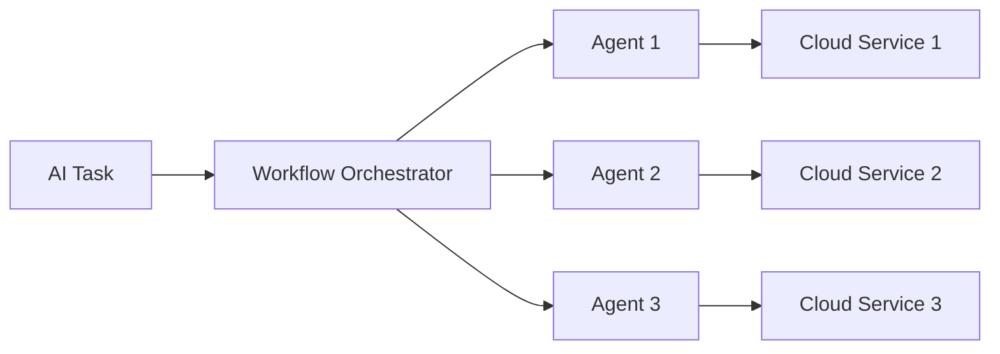
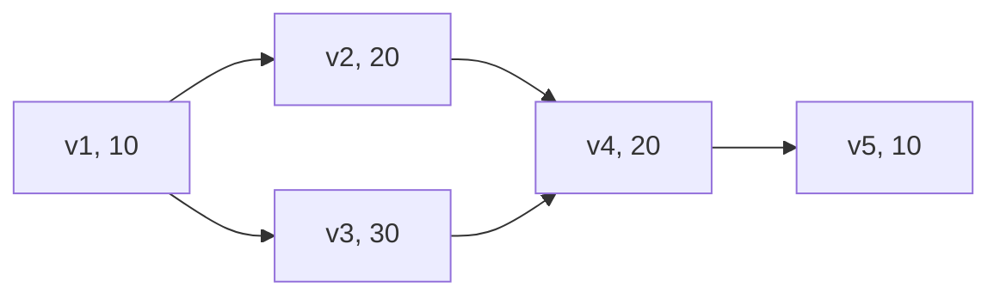

# 基于云服务的AI代理工作流部署策略

关键词：云服务、AI代理、工作流、部署策略、机器学习、人工智能

## 1. 背景介绍
### 1.1  问题的由来
随着人工智能技术的飞速发展，越来越多的企业开始将AI应用于各个业务场景，以提高效率、降低成本。然而，AI模型的开发、训练和部署往往需要大量的计算资源和专业知识，对于许多中小企业来说是一个不小的挑战。为了解决这一问题，基于云服务的AI代理工作流部署策略应运而生。

### 1.2  研究现状
目前，各大云服务提供商如AWS、Azure、Google Cloud等都推出了AI平台和服务，提供了从数据处理、模型训练到部署的全流程支持。一些研究者提出了基于微服务架构的AI工作流部署方案[1]，通过将AI工作流拆分为多个微服务，实现灵活的资源调度和弹性伸缩。另一些研究者探索了基于Serverless计算的AI工作流部署模式[2]，利用FaaS(Function as a Service)实现AI任务的自动触发和执行。

### 1.3  研究意义
基于云服务的AI代理工作流部署策略有助于降低AI应用的开发门槛，让更多的企业和个人能够便捷地使用AI技术赋能业务创新。同时，云服务的弹性伸缩和按需付费等特性，可以大幅节约计算成本，提高资源利用率。研究高效的AI工作流部署策略，对于推动AI技术的普及应用具有重要意义。

### 1.4  本文结构
本文将首先介绍AI代理工作流的核心概念和关键技术，然后重点阐述工作流中的核心算法原理和实现步骤。接着，我们将建立AI工作流部署的数学模型，给出详细的公式推导和案例分析。在项目实践部分，我们将给出具体的代码实现和环境搭建指南。最后，探讨AI工作流的实际应用场景和未来发展趋势，并总结全文。

## 2. 核心概念与联系
在基于云服务的AI代理工作流部署中，涉及到以下几个核心概念：

- AI代理：代表AI工作流中的一个独立任务或服务，负责完成特定的AI计算过程，如数据预处理、特征提取、模型推理等。
- 工作流：由多个AI代理按照一定的逻辑顺序和依赖关系组成的任务流，用于完成端到端的AI应用。
- 云服务：提供弹性计算、存储、网络等资源的服务化平台，为AI工作流提供所需的基础设施和服务。
- 部署策略：确定AI代理在云服务中的部署方式、资源配置、容错机制等，保障工作流的高效执行和稳定运行。

下图展示了基于云服务的AI代理工作流部署的总体架构：

AI任务首先被提交到工作流编排器，编排器将任务拆分为多个AI代理，并确定它们的执行顺序和依赖关系。每个AI代理根据部署策略被分配到对应的云服务中执行。云服务提供计算、存储等资源，保障代理高效完成计算任务。

## 3. 核心算法原理 & 具体操作步骤
### 3.1  算法原理概述
在AI代理工作流中，核心算法主要包括两个方面：工作流编排算法和代理部署算法。

工作流编排算法的目标是根据AI任务的依赖关系和执行约束，生成最优的工作流拓扑结构和执行计划。常见的编排算法包括：

- DAG(Directed Acyclic Graph)算法：将任务依赖关系抽象为有向无环图，通过拓扑排序确定任务执行顺序[3]。
- 关键路径算法：通过计算工作流中每条路径的最长执行时间，找出影响整个工作流执行效率的关键路径[4]。
- 启发式算法：引入启发式规则，如最小执行时间优先、最小资源占用优先等，指导工作流的编排优化[5]。

代理部署算法的目标是根据AI代理的资源需求和执行约束，确定最优的云服务资源配置和部署方案。常见的部署算法包括：

- 贪心算法：根据当前状态，选择局部最优的部署方案，如优先选择空闲资源最多的云服务节点[6]。
- 动态规划算法：将部署问题建模为多阶段决策问题，通过递归求解找出全局最优部署方案[7]。
- 强化学习算法：通过不断试错和反馈，学习最优的部署策略，动态适应负载变化和故障恢复[8]。

### 3.2  算法步骤详解
下面以DAG算法为例，详细说明工作流编排的具体步骤。

输入：AI任务的依赖关系图G=(V,E)，其中V为任务节点集合，E为任务间依赖关系集合。
输出：工作流的拓扑排序结果和执行计划。

步骤1：检查G是否存在环，如果存在则报错并退出。
步骤2：初始化一个空的拓扑排序队列T和一个入度为0的节点队列Q。
步骤3：遍历图G，将所有入度为0的节点加入Q。
步骤4：while (Q不为空) do
- 从Q中取出一个节点v，加入T。
- 遍历v的所有出边(v,w)，将边(v,w)从图G中删除。
- 如果删除边(v,w)后，节点w的入度变为0，则将w加入Q。

步骤5：如果G中所有节点都已加入T，则输出拓扑排序结果T和对应的执行计划；否则说明图G中存在环，报错并退出。

### 3.3  算法优缺点
DAG算法的优点是实现简单，时间复杂度为O(V+E)，适用于大多数工作流场景。但是，DAG算法只考虑了任务的依赖约束，没有考虑任务的执行时间、资源需求等因素，可能导致生成的执行计划不够优化。

动态规划算法可以考虑更多的约束条件，生成全局最优的部署方案，但是时间复杂度较高，不适合实时调度决策。

强化学习算法通过不断学习和优化，可以找出接近最优的部署策略，但是需要大量的训练数据和时间，前期部署成本较高。

### 3.4  算法应用领域
工作流编排和代理部署算法广泛应用于科学计算、业务流程管理、微服务编排等领域，特别是在云计算环境下，如何高效地组织和调度大规模并发的任务流，是一个亟待解决的关键问题。

近年来，随着AI技术的发展，工作流编排和代理部署算法在机器学习平台、深度学习框架中得到广泛应用，如Kubeflow[9]、TensorFlow Extended[10]等。通过引入工作流的思想，将机器学习过程抽象为一个由数据处理、特征工程、模型训练、模型评估等阶段组成的端到端流水线，可以显著提升机器学习的开发和部署效率。

## 4. 数学模型和公式 & 详细讲解 & 举例说明
### 4.1  数学模型构建
为了优化AI工作流的执行效率和资源利用率，我们可以建立如下的数学模型：

目标函数：最小化工作流的总执行时间
$$\min T = \max_{p \in P} \sum_{v \in p} t(v)$$

其中，$P$表示工作流中所有可能的执行路径集合，$p$表示其中一条执行路径，$v$表示路径$p$上的一个任务节点，$t(v)$表示任务$v$的执行时间。

约束条件：
1. 任务依赖约束：如果任务$v_i$依赖任务$v_j$，则$v_i$的开始时间必须晚于$v_j$的结束时间。
$$s(v_i) \geq f(v_j), \forall (v_j,v_i) \in E$$

2. 资源容量约束：任意时刻，每种资源的使用量不能超过其总容量。
$$\sum_{v \in V_t} r(v,k) \leq R_k, \forall t, \forall k \in K$$

其中，$V_t$表示时刻$t$正在执行的任务集合，$r(v,k)$表示任务$v$对资源$k$的需求量，$R_k$表示资源$k$的总容量，$K$为资源类型集合。

3. 任务部署约束：每个任务节点只能部署在一个云服务节点上。
$$\sum_{n \in N} x(v,n) = 1, \forall v \in V$$

其中，$N$为云服务节点集合，$x(v,n)$为二元决策变量，表示任务$v$是否部署在节点$n$上。

### 4.2  公式推导过程
根据上述数学模型，我们可以通过整数规划求解最优的工作流执行计划和任务部署方案。

首先，定义决策变量：
- $s(v)$：任务$v$的开始时间
- $f(v)$：任务$v$的结束时间
- $x(v,n)$：任务$v$是否部署在节点$n$上，取值为0或1

然后，将目标函数和约束条件转化为线性规划模型：

$$\min T$$
$$s.t. \quad f(v_i) - s(v_j) \geq t(v_i), \forall (v_j,v_i) \in E$$
$$\sum_{v \in V} r(v,k) \cdot \sum_{n \in N} x(v,n) \leq R_k, \forall k \in K$$
$$\sum_{n \in N} x(v,n) = 1, \forall v \in V$$
$$x(v,n) \in \{0,1\}, \forall v \in V, \forall n \in N$$
$$s(v) \geq 0, \forall v \in V$$

最后，利用求解器（如CPLEX、Gurobi）求解上述整数规划模型，得到最优的工作流执行计划和任务部署方案。

### 4.3  案例分析与讲解
下面我们以一个简单的AI工作流为例，说明如何应用上述数学模型进行优化求解。

假设某AI工作流由5个任务节点组成，其依赖关系和执行时间如下图所示：

可用的云服务节点有3个，每个节点的CPU和内存容量如下：

| 节点 | CPU(核) | 内存(GB) |
| ---- | ------- | -------- |
| n1   | 2       | 8        |
| n2   | 4       | 16       |
| n3   | 8       | 32       |

每个任务节点的资源需求量如下：

| 任务 | CPU(核) | 内存(GB) |
| ---- | ------- | -------- |
| v1   | 1       | 4        |
| v2   | 2       | 8        |
| v3   | 4       | 16       |
| v4   | 2       | 8        |
| v5   | 1       | 4        |

根据上述输入，可以建立整数规划模型并求解，得到最优的工作流执行计划和任务部署方案：

- 执行计划：v1 -> v3 -> v2 -> v4 -> v5
- 部署方案：
    - v1部署在n1上
    - v2部署在n2上
    - v3部署在n3上
    - v4部署在n2上
    - v5部署在n1上
- 最优执行时间：70

可以看出，通过数学建模和优化求解，可以显著缩短AI工作流的端到端执行时间，提高云服务资源的利用率。

### 4.4  常见问题解答
1. 问：在实际应用中，工作流的规模可能很大，导致整数规划模型难以求解，怎么办？
答：可以考虑采用启发式算法，如遗传算法、蚁群算法等，在合理的时间内找到近似最优解。

2. 问：在动态环境下，任务执行时间、资源需求量可能发