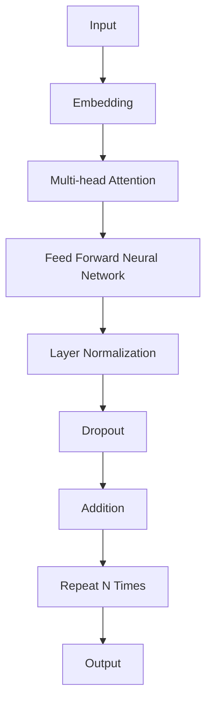

# AIGC从入门到实战：ChatGPT 是新一代的人机交互“操作系统”

作者：禅与计算机程序设计艺术 / Zen and the Art of Computer Programming

关键词：AIGC，ChatGPT，人机交互，自然语言处理，生成式AI

## 1. 背景介绍

### 1.1 问题的由来

随着人工智能技术的飞速发展，计算机与人类的交互方式正发生着深刻变革。传统的人机交互方式，如键盘、鼠标和触摸屏等，已经无法满足日益复杂和多样化的用户需求。为了更自然、高效地实现人与机器之间的沟通，生成式AI（AI Generated Content，简称AIGC）应运而生。AIGC技术能够根据用户输入的信息，自动生成文本、图像、音频等多种类型的内容，从而极大地拓展了人机交互的边界。

### 1.2 研究现状

近年来，AIGC技术在自然语言处理、计算机视觉、语音识别等领域取得了显著进展。以自然语言处理为例，ChatGPT等大型语言模型的出现，使得AIGC在文本生成、问答、摘要等方面表现出惊人的能力。然而，AIGC技术仍处于发展阶段，面临着诸多挑战，如数据质量、模型可解释性、伦理道德等问题。

### 1.3 研究意义

AIGC技术具有极高的研究价值和应用前景。它能够推动人机交互方式的变革，提高信息处理的效率，为用户提供更加个性化、智能化的服务。此外，AIGC技术还有助于解决信息过载、知识获取困难等问题，推动社会进步。

### 1.4 本文结构

本文将从AIGC的核心概念、ChatGPT原理、实战应用等方面展开，帮助读者深入了解AIGC技术，并掌握ChatGPT的使用方法。

## 2. 核心概念与联系

### 2.1 AIGC概述

AIGC是指人工智能自动生成内容的技术，包括文本、图像、音频等多种类型。AIGC的核心思想是通过机器学习算法，让计算机模拟人类的创造力，生成具有实用价值的内容。

### 2.2 ChatGPT概述

ChatGPT是由OpenAI开发的一款基于GPT-3.5的聊天机器人模型，具备自然语言理解和生成能力。ChatGPT在对话、问答、摘要等方面具有广泛的应用前景。

### 2.3 AIGC与ChatGPT的联系

ChatGPT作为AIGC技术的一种应用，体现了AIGC在自然语言处理领域的强大能力。ChatGPT的涌现，标志着AIGC技术进入了新的发展阶段。

## 3. 核心算法原理 & 具体操作步骤

### 3.1 算法原理概述

ChatGPT的核心算法是基于GPT-3.5模型，通过预训练和微调，使模型具备自然语言理解和生成能力。

### 3.2 算法步骤详解

1. **数据准备**：收集大量高质量的自然语言数据，包括文本、问答、对话等。
2. **模型训练**：使用GPT-3.5模型对数据进行预训练，使模型具备自然语言理解能力。
3. **微调**：针对特定任务，对模型进行微调，提高模型在特定场景下的性能。
4. **部署**：将训练好的模型部署到线上，使其能够接受用户输入并生成相应输出。

### 3.3 算法优缺点

**优点**：

1. **自然语言理解能力强**：ChatGPT能够理解用户的自然语言输入，并生成符合语境的输出。
2. **生成式能力强**：ChatGPT能够根据用户需求，生成具有实用价值的文本内容。
3. **泛化能力强**：ChatGPT在多个任务上表现出色，具有较高的泛化能力。

**缺点**：

1. **数据依赖性强**：ChatGPT的性能很大程度上依赖于训练数据的质量和数量。
2. **模型可解释性差**：ChatGPT作为黑盒模型，其内部决策过程难以解释。
3. **伦理道德风险**：AIGC技术可能被用于生成虚假信息、侵犯隐私等不良目的。

### 3.4 算法应用领域

ChatGPT在以下领域具有广泛的应用前景：

1. **智能客服**：为用户提供24/7在线客服，提高企业服务效率。
2. **虚拟助手**：为用户提供智能语音助手，实现人机交互的便捷性。
3. **内容创作**：生成新闻、文章、剧本等文本内容，提高内容生产效率。
4. **教育辅助**：辅助教师进行教学，提供个性化学习方案。

## 4. 数学模型和公式 & 详细讲解 & 举例说明

### 4.1 数学模型构建

ChatGPT的数学模型主要基于GPT-3.5模型，其核心是Transformer架构。

**Transformer**是一种基于自注意力机制的深度神经网络模型，能够有效地处理序列数据。以下是Transformer模型的基本结构：



### 4.2 公式推导过程

Transformer模型的计算过程涉及到以下公式：

1. **自注意力（Self-Attention）**：

$$Q = W_Q \cdot X$$
$$K = W_K \cdot X$$
$$V = W_V \cdot X$$

$$scores = \frac{(QK^T)}{\sqrt(d_k)} \cdot V$$
$$outputs = softmax(scores) \cdot V$$

2. **前馈神经网络（Feed Forward Neural Network）**：

$$h_{ff} = \max(0, W_1 \cdot h_{norm} + b_1)$$
$$h_{out} = W_2 \cdot h_{ff} + b_2$$

### 4.3 案例分析与讲解

以下是一个简单的例子，展示了如何使用ChatGPT生成文本：

```python
import openai

# 初始化ChatGPT客户端
client = openai.OpenAI(api_key='your-api-key')

# 生成文本
response = client.Completion.create(
    engine="davinci",
    prompt="请写一段关于人工智能的简介。",
    max_tokens=150
)

print(response.choices[0].text)
```

### 4.4 常见问题解答

1. **ChatGPT的生成能力有多强**？

   ChatGPT的生成能力取决于模型的规模和训练数据。一般来说，规模越大、训练数据越多的模型，其生成能力越强。

2. **ChatGPT的准确性如何保证**？

   ChatGPT的准确性主要依赖于训练数据的质量和模型的设计。通过优化模型结构和训练过程，可以提高模型的准确性。

3. **如何防止ChatGPT生成虚假信息**？

   防止ChatGPT生成虚假信息需要从多个方面入手，包括数据筛选、模型设计、伦理约束等。

## 5. 项目实践：代码实例和详细解释说明

### 5.1 开发环境搭建

1. 安装Python环境
2. 安装OpenAI客户端

```bash
pip install openai
```

### 5.2 源代码详细实现

```python
import openai

# 初始化ChatGPT客户端
client = openai.OpenAI(api_key='your-api-key')

# 生成文本
def generate_text(prompt):
    response = client.Completion.create(
        engine="davinci",
        prompt=prompt,
        max_tokens=150
    )
    return response.choices[0].text

# 示例：生成关于人工智能的简介
prompt = "请写一段关于人工智能的简介。"
output = generate_text(prompt)
print(output)
```

### 5.3 代码解读与分析

1. 首先，导入openai库，并初始化ChatGPT客户端。
2. 定义`generate_text`函数，接收用户输入的prompt，并调用ChatGPT客户端的`Completion.create`方法生成文本。
3. 调用`generate_text`函数，传入示例prompt，打印生成的文本。

### 5.4 运行结果展示

运行上述代码，将输出关于人工智能的简介：

```
人工智能（Artificial Intelligence，简称AI）是指模拟、延伸和扩展人的智能的理论、方法、技术及应用系统。人工智能的研究始于20世纪50年代，经过几十年的发展，已经取得了显著的成果。目前，人工智能在自然语言处理、计算机视觉、语音识别、机器人等多个领域取得了突破性进展，并开始逐渐应用于人们的日常生活。
```

## 6. 实际应用场景

ChatGPT在实际应用中具有广泛的前景，以下是一些典型应用场景：

### 6.1 智能客服

ChatGPT可以用于构建智能客服系统，为用户提供24/7在线客服，提高企业服务效率。

### 6.2 虚拟助手

ChatGPT可以开发成虚拟助手，为用户提供智能语音助手，实现人机交互的便捷性。

### 6.3 内容创作

ChatGPT可以用于生成新闻、文章、剧本等文本内容，提高内容生产效率。

### 6.4 教育辅助

ChatGPT可以辅助教师进行教学，提供个性化学习方案，提高学生的学习效果。

### 6.5 其他应用

1. 自动化写作：撰写邮件、报告、文档等。
2. 智能翻译：将文本翻译成多种语言。
3. 艺术创作：生成诗歌、歌词、剧本等。

## 7. 工具和资源推荐

### 7.1 学习资源推荐

1. **《深度学习》**: 作者：Ian Goodfellow, Yoshua Bengio, Aaron Courville
    - 这本书详细介绍了深度学习的基础知识和实践，包括GPT模型的原理和实现。

2. **《自然语言处理入门》**: 作者：赵军
    - 这本书介绍了自然语言处理的基本概念和方法，包括GPT模型在NLP中的应用。

### 7.2 开发工具推荐

1. **Hugging Face Transformers**: [https://huggingface.co/transformers/](https://huggingface.co/transformers/)
    - 提供了多种预训练的GPT模型和工具，适合各种NLP任务的研究和应用。

2. **OpenAI GPT**: [https://github.com/openai/gpt-3](https://github.com/openai/gpt-3)
    - 提供了GPT-3的相关资源和示例，适合文本生成和理解任务。

### 7.3 相关论文推荐

1. **Attention Is All You Need**: 作者：Ashish Vaswani等
    - 提出了Transformer模型，标志着NLP领域的新时代。

2. **Generative Pre-trained Transformers for Natural Language Understanding and Generation**: 作者：Kaiming He等
    - 介绍了GPT-3模型的原理和应用。

### 7.4 其他资源推荐

1. **OpenAI**: [https://openai.com/](https://openai.com/)
    - OpenAI是一个专注于AI研究与应用的公司，提供了ChatGPT等产品的更多信息。

2. **Hugging Face**: [https://huggingface.co/](https://huggingface.co/)
    - 提供了多种预训练模型和工具，助力AI研究与应用。

## 8. 总结：未来发展趋势与挑战

ChatGPT作为AIGC技术的一种应用，具有极高的研究价值和广阔的应用前景。未来，ChatGPT将在以下几个方面取得进展：

### 8.1 发展趋势

1. **模型规模与性能提升**：随着计算资源的不断发展，模型规模将继续增长，性能将进一步提升。
2. **多模态学习**：ChatGPT将具备多模态学习能力，实现跨模态的信息融合和理解。
3. **自监督学习**：ChatGPT将通过自监督学习，在无标注数据上进行预训练，提高模型的泛化能力。
4. **边缘计算与分布式训练**：ChatGPT将在边缘计算和分布式训练方面取得突破，提高计算效率。

### 8.2 面临的挑战

1. **计算资源与能耗**：大模型的训练需要大量的计算资源和能耗，如何提高计算效率、降低能耗是一个重要挑战。
2. **数据隐私与安全**：AIGC技术涉及到大量的数据，如何在保证数据隐私和安全的前提下进行研究和应用是一个重要挑战。
3. **模型可解释性与可控性**：大模型作为黑盒模型，其内部决策过程难以解释，如何提高模型的可解释性和可控性是一个重要挑战。
4. **伦理道德风险**：AIGC技术可能被用于生成虚假信息、侵犯隐私等不良目的，如何制定相应的伦理规范是一个重要挑战。

### 8.3 研究展望

ChatGPT的研究将不断深入，未来有望在以下方面取得突破：

1. **更加强大的生成能力**：ChatGPT将具备更强大的生成能力，能够生成更高质量、更具创造力的文本内容。
2. **跨领域应用**：ChatGPT将在更多领域得到应用，如计算机视觉、语音识别等。
3. **人机交互范式变革**：ChatGPT将推动人机交互方式的变革，实现更加自然、高效的人机交互。

## 9. 附录：常见问题与解答

### 9.1 什么是ChatGPT？

ChatGPT是由OpenAI开发的一款基于GPT-3.5的聊天机器人模型，具备自然语言理解和生成能力。

### 9.2 ChatGPT的优势是什么？

ChatGPT的优势包括：

1. **自然语言理解能力强**：能够理解用户的自然语言输入，并生成符合语境的输出。
2. **生成式能力强**：能够根据用户需求，生成具有实用价值的文本内容。
3. **泛化能力强**：在多个任务上表现出色，具有较高的泛化能力。

### 9.3 如何使用ChatGPT？

1. 获取OpenAI的API密钥。
2. 使用OpenAI客户端（如openai-python）与ChatGPT进行交互。
3. 设计合适的prompt，引导ChatGPT生成所需内容。

### 9.4 ChatGPT有哪些应用场景？

ChatGPT在以下领域具有广泛的应用前景：

1. **智能客服**：为用户提供24/7在线客服，提高企业服务效率。
2. **虚拟助手**：为用户提供智能语音助手，实现人机交互的便捷性。
3. **内容创作**：生成新闻、文章、剧本等文本内容，提高内容生产效率。
4. **教育辅助**：辅助教师进行教学，提供个性化学习方案，提高学生的学习效果。

### 9.5 如何评估ChatGPT的效果？

评估ChatGPT的效果可以从多个方面进行，包括：

1. **准确性**：评估ChatGPT生成的文本是否准确、符合实际需求。
2. **流畅性**：评估ChatGPT生成的文本是否流畅、自然。
3. **创新性**：评估ChatGPT生成的文本是否具有创新性、独特性。

通过综合评估以上指标，可以全面了解ChatGPT的效果。