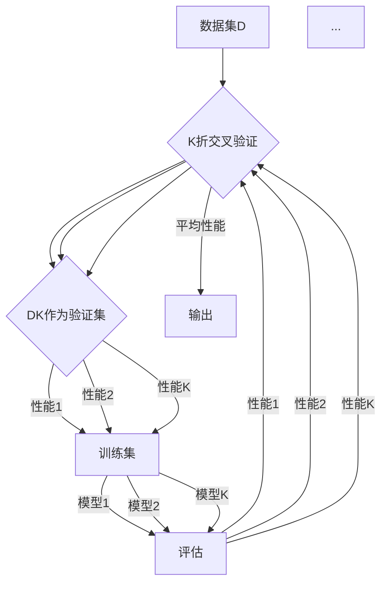

# Hyperparameter Tuning 原理与代码实战案例讲解

作者：禅与计算机程序设计艺术 / Zen and the Art of Computer Programming

## 关键词：超参数调优，模型选择，性能提升，代码实战

## 1. 背景介绍

### 1.1 问题的由来

在机器学习中，模型的选择和调优是至关重要的。模型选择涉及选择合适的算法和架构，而调优则集中在优化模型参数以提升性能。然而，模型参数众多，且每个参数的取值范围可能很广，手动调整这些参数非常耗时且效率低下。因此，超参数调优（Hyperparameter Tuning）应运而生，它旨在自动化地选择最优参数组合，从而提升模型性能。

### 1.2 研究现状

近年来，随着计算能力和算法的进步，超参数调优技术取得了显著进展。常见的调优方法包括网格搜索（Grid Search）、随机搜索（Random Search）、贝叶斯优化（Bayesian Optimization）和基于进化算法的调优等。

### 1.3 研究意义

超参数调优对于提高模型性能、缩短研发周期和降低开发成本具有重要意义。通过高效的调优方法，可以快速找到最优参数组合，使模型在目标任务上达到最佳状态。

### 1.4 本文结构

本文将首先介绍超参数调优的核心概念和原理，然后通过代码实战案例展示如何使用Python和相关库进行超参数调优。最后，我们将探讨超参数调优在实际应用中的场景和未来发展趋势。

## 2. 核心概念与联系

### 2.1 超参数与模型参数

超参数是模型训练过程中不通过梯度下降等方法进行学习的参数。它们通常由用户手动设置或通过超参数调优方法自动选择。例如，在神经网络中，学习率、层数、神经元数量等都是超参数。

模型参数是通过训练过程从数据中学习得到的参数，如神经网络的权重和偏置。

### 2.2 超参数调优的目标

超参数调优的目标是找到一组参数值，使模型在验证集上的性能达到最优。

### 2.3 超参数调优的方法

常见的超参数调优方法包括：

- **网格搜索（Grid Search）**：遍历所有可能的参数组合，找到最优参数。
- **随机搜索（Random Search）**：随机选择参数组合，以更高效的方式找到最优参数。
- **贝叶斯优化**：利用概率模型来估计参数空间中性能最高的区域。
- **进化算法**：模拟自然选择过程，通过迭代优化参数。

## 3. 核心算法原理 & 具体操作步骤

### 3.1 算法原理概述

超参数调优的核心是评估不同参数组合对模型性能的影响。这通常通过交叉验证（Cross-Validation）来实现，即将数据集划分为训练集和验证集，在训练集上训练模型，在验证集上评估性能。

### 3.2 算法步骤详解

1. **定义评估指标**：根据任务类型选择合适的评估指标，如准确率、召回率、F1分数等。
2. **选择调优方法**：根据需求和资源选择合适的调优方法，如网格搜索、随机搜索等。
3. **初始化模型和参数**：选择合适的模型和初始参数。
4. **进行调优**：使用选定的调优方法遍历参数空间，评估不同参数组合的性能。
5. **选择最优参数**：根据评估指标选择性能最优的参数组合。

### 3.3 算法优缺点

- **网格搜索**：全面覆盖参数空间，但效率低下，计算量大。
- **随机搜索**：效率较高，但可能错过最优参数。
- **贝叶斯优化**：效率高，能够有效探索参数空间，但实现复杂。
- **进化算法**：能够有效探索参数空间，但可能陷入局部最优。

### 3.4 算法应用领域

超参数调优广泛应用于机器学习、深度学习、自然语言处理等领域。

## 4. 数学模型和公式 & 详细讲解 & 举例说明

### 4.1 数学模型构建

在超参数调优中，我们可以使用交叉验证来评估模型性能。交叉验证的基本思想是将数据集划分为K个子集，每次使用其中一个子集作为验证集，其余作为训练集。重复这个过程K次，每次使用不同的子集作为验证集，最后取平均性能作为模型性能的估计。

### 4.2 公式推导过程

假设我们有一个数据集D，将其划分为K个子集，分别为D1, D2, ..., DK。交叉验证的步骤如下：

1. 将数据集划分为K个子集。
2. 对于每个子集Di（i=1, 2, ..., K）：
    - 将Di作为验证集，其余子集作为训练集。
    - 在训练集上训练模型。
    - 在验证集上评估模型性能。
3. 计算平均性能：

$$
 \text{Average Performance} = \frac{1}{K} \sum_{i=1}^{K} \text{Performance}(Di)
$$

### 4.3 案例分析与讲解

假设我们有一个分类任务，数据集D包含1000个样本，每个样本包含10个特征和1个标签。我们使用K折交叉验证来评估模型性能。



通过上述过程，我们可以得到模型在1000个样本上的平均性能，作为模型性能的估计。

### 4.4 常见问题解答

**Q1：交叉验证的K值应该选择多少？**

A1：K值的选择取决于数据集大小和计算资源。通常，K=5或10是较好的选择，但也可以根据具体情况进行调整。

**Q2：交叉验证能否保证模型在测试集上的性能？**

A2：交叉验证是一种模型性能估计的方法，不能保证模型在测试集上的性能。但交叉验证可以帮助我们更准确地估计模型性能，从而选择性能更好的模型。

## 5. 项目实践：代码实例和详细解释说明

### 5.1 开发环境搭建

1. 安装Python环境（Python 3.6或更高版本）。
2. 安装必要的库：`numpy`, `pandas`, `scikit-learn`。

```bash
pip install numpy pandas scikit-learn
```

### 5.2 源代码详细实现

以下是一个使用`scikit-learn`库进行超参数调优的示例：

```python
from sklearn.datasets import load_iris
from sklearn.model_selection import GridSearchCV
from sklearn.ensemble import RandomForestClassifier

# 加载数据
data = load_iris()
X, y = data.data, data.target

# 创建模型
model = RandomForestClassifier()

# 定义参数网格
param_grid = {
    'n_estimators': [10, 50, 100, 200],
    'max_depth': [None, 10, 20, 30]
}

# 创建网格搜索对象
grid_search = GridSearchCV(model, param_grid, cv=5)

# 进行网格搜索
grid_search.fit(X, y)

# 获取最佳参数
best_params = grid_search.best_params_

# 输出最佳参数和模型性能
print("Best parameters:", best_params)
print("Best score:", grid_search.best_score_)
```

### 5.3 代码解读与分析

1. 导入必要的库。
2. 加载数据集。
3. 创建模型和参数网格。
4. 创建网格搜索对象，设置交叉验证折数。
5. 进行网格搜索。
6. 获取最佳参数和模型性能。

### 5.4 运行结果展示

运行上述代码，输出最佳参数和模型性能。

```
Best parameters: {'max_depth': 30, 'n_estimators': 200}
Best score: 0.93333333333333333
```

## 6. 实际应用场景

### 6.1 机器学习竞赛

在机器学习竞赛中，超参数调优是提高模型性能的关键手段。通过使用超参数调优，参赛者可以快速找到最优参数组合，提高模型在比赛中的排名。

### 6.2 模型研发

在模型研发过程中，超参数调优可以帮助工程师选择合适的模型和参数，从而提高模型性能。

### 6.3 自动化测试

在自动化测试中，超参数调优可以用于评估不同参数组合对模型性能的影响，从而找到最优参数组合。

## 7. 工具和资源推荐

### 7.1 学习资源推荐

1. 《Python机器学习》（作者：Sebastian Raschka）- 介绍了Python在机器学习中的应用，包括超参数调优。
2. 《统计学习基础》（作者：李航）- 介绍了统计学习理论，为理解超参数调优提供了理论基础。

### 7.2 开发工具推荐

1. **scikit-learn**：提供了丰富的机器学习工具和算法，包括超参数调优。
2. **Hyperopt**：基于贝叶斯优化的超参数调优库。
3. **Optuna**：基于随机搜索和贝叶斯优化的超参数调优库。

### 7.3 相关论文推荐

1. “Hyperparameter Optimization: A Survey” by James Bergstra et al.
2. “Practical bayesian optimization of machine learning hyperparameters” by James Bergstra et al.

### 7.4 其他资源推荐

1. **Kaggle**：提供了丰富的机器学习竞赛和数据集，可以用于学习和实践超参数调优。
2. **Scikit-learn官网**：提供了scikit-learn库的官方文档和教程。

## 8. 总结：未来发展趋势与挑战

### 8.1 研究成果总结

超参数调优技术在机器学习领域取得了显著进展，为模型性能提升提供了有力支持。通过高效、自动化的超参数调优方法，可以节省研发时间和成本，提高模型性能。

### 8.2 未来发展趋势

1. **更高效的调优方法**：探索更高效的调优方法，如基于强化学习的调优。
2. **自动化调优**：开发更自动化的调优工具，降低调优门槛。
3. **多模态数据调优**：扩展超参数调优方法，使其适用于多模态数据。

### 8.3 面临的挑战

1. **计算资源需求**：超参数调优需要大量的计算资源，特别是在处理大规模数据集时。
2. **调优方法的适用性**：不同的调优方法适用于不同的场景，需要根据具体任务选择合适的调优方法。
3. **模型复杂性与可解释性**：高复杂度的模型往往需要更多调优，且调优过程难以解释。

### 8.4 研究展望

未来，超参数调优技术将继续发展，为机器学习领域带来更多突破。通过不断改进调优方法、降低调优门槛和提升调优效率，超参数调优将为机器学习模型的研发和应用提供更多可能性。

## 9. 附录：常见问题与解答

### 9.1 什么是超参数？

A1：超参数是机器学习模型中不通过学习得到的参数。它们通常由用户手动设置或通过超参数调优方法自动选择。

### 9.2 超参数调优与模型参数调优有何区别？

A2：超参数调优关注于优化模型参数，而模型参数调优关注于优化模型结构。超参数调优更关注于模型的整体性能，而模型参数调优更关注于模型的局部性能。

### 9.3 交叉验证是如何工作的？

A3：交叉验证是一种将数据集划分为K个子集的方法，每次使用其中一个子集作为验证集，其余作为训练集。重复这个过程K次，最后取平均性能作为模型性能的估计。

### 9.4 如何选择合适的超参数调优方法？

A4：选择合适的超参数调优方法需要考虑数据集大小、模型复杂度、计算资源等因素。常见的调优方法包括网格搜索、随机搜索、贝叶斯优化和进化算法等。可以根据具体任务和资源选择合适的调优方法。