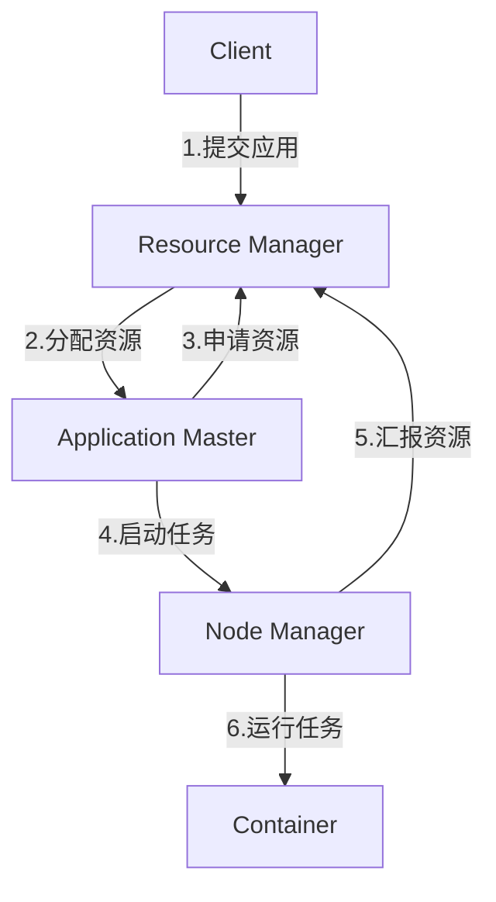

# Yarn资源管理和任务调度原理与代码实例讲解

关键词：Yarn、资源管理、任务调度、Hadoop、大数据

## 1. 背景介绍
### 1.1  问题的由来
在大数据时代,海量数据的存储和处理已成为企业和组织面临的重大挑战。Hadoop作为一个开源的分布式计算平台,为大规模数据处理提供了有力支持。然而,Hadoop 1.0在资源管理和任务调度方面存在一些局限性,难以满足日益增长的大数据应用需求。为了克服这些局限性,Hadoop 2.0引入了Yarn(Yet Another Resource Negotiator)作为全新的资源管理和任务调度系统。
### 1.2  研究现状
目前,关于Yarn的研究主要集中在资源管理和任务调度算法的优化、Yarn与其他大数据框架的集成、Yarn在特定领域的应用等方面。一些研究致力于提高Yarn的资源利用率和任务执行效率,如改进资源请求和分配策略、优化任务调度算法等。另一些研究则探索Yarn与Spark、Flink等新兴大数据处理框架的集成方案,以发挥不同框架的优势。此外,Yarn在机器学习、图计算、流处理等领域的应用也受到关注。
### 1.3  研究意义
深入研究Yarn的资源管理和任务调度原理,对于优化Hadoop集群性能、提高大数据处理效率具有重要意义。通过分析Yarn的架构设计和工作机制,可以发现系统瓶颈所在,进而提出有针对性的优化策略。同时,基于Yarn开发大数据应用,有助于充分利用集群资源,加速数据处理和分析。此外,Yarn的资源隔离和多租户支持,为构建多框架统一的大数据平台奠定了基础。
### 1.4  本文结构
本文将全面介绍Yarn的资源管理和任务调度原理,并结合代码实例进行讲解。内容安排如下:第2部分介绍Yarn的核心概念;第3部分重点阐述资源管理和任务调度的原理与算法;第4部分给出相关的数学模型和公式推导;第5部分通过具体的代码实例演示Yarn的使用;第6部分讨论Yarn的实际应用场景;第7部分推荐相关的学习资源;第8部分总结全文并展望Yarn的未来发展。

## 2. 核心概念与联系
在Yarn中,有几个核心概念需要理解:
- Resource Manager(RM):负责整个系统的资源管理和调度,是Yarn的核心组件。它处理客户端请求,并与Node Manager协调为应用分配资源。
- Node Manager(NM):运行在集群的各个节点上,负责管理单个节点的资源,并向RM报告资源使用情况。NM接收RM的资源分配请求,启动Container来执行任务。
- Application Master(AM):用户提交的每个应用都有一个AM,负责向RM申请资源,并与NM通信来执行任务,监控任务状态。不同的应用框架可以实现自己的AM。
- Container:表示一个资源分配单元,包含一定数量的CPU、内存等资源。AM会向RM申请Container,用于运行任务。

下图展示了这些概念之间的关系:


从图中可以看出,Client向RM提交应用,RM为每个应用启动一个AM,并为AM分配第一个Container。此后AM向RM申请更多的Container资源用于执行任务,RM根据资源调度算法选择合适的NM来分配Container。NM在收到资源请求后,启动Container并运行相应的任务。同时,NM会向RM汇报节点上资源的使用情况,供RM进行全局的资源调度决策。

## 3. 核心算法原理 & 具体操作步骤
### 3.1  算法原理概述
Yarn的资源调度算法主要包括容量调度器(Capacity Scheduler)和公平调度器(Fair Scheduler)。容量调度器按照预先配置的队列容量分配资源,先满足容量保证,再在队列内部实现公平性。而公平调度器动态调整队列资源,在不同队列之间实现最大程度的公平。两种调度器都支持层次化队列,可以对不同的用户和应用进行隔离,提高集群的利用率。
### 3.2  算法步骤详解
以容量调度器为例,说明资源调度的具体步骤:
1. 初始化队列树:根据配置文件定义队列层次结构和容量比例,并初始化每个队列的资源量。
2. 接收资源请求:AM向RM提交应用,并请求所需的资源量(CPU、内存等)。
3. 选择队列:RM根据请求的队列名和用户组,找到对应的队列。
4. 检查队列容量:比较队列的已用资源与最大容量,判断是否有足够的资源满足请求。
5. 分配资源:如果队列有空闲资源,RM将选择合适的NM,为应用分配Container。
6. 更新队列状态:根据分配结果,更新队列的已用资源量和资源占用比例。
7. 执行任务:NM启动Container,运行AM或任务进程,并监控资源使用情况。
8. 释放资源:任务执行完毕后,AM向RM注销Container,释放占用的资源。

### 3.3  算法优缺点
容量调度器的优点是可以通过队列容量来控制不同应用的资源使用,避免相互影响,适合多租户环境。但在同一队列内部,资源分配还是遵循先到先得的原则,可能会造成头部阻塞。

公平调度器的优点是可以在队列之间动态调整资源,尽可能提高资源利用率和作业公平性。但队列容量不再受控,可能影响队列之间的隔离性。

### 3.4  算法应用领域
Yarn的资源调度算法广泛应用于各种大数据处理场景,如批处理、机器学习、图计算、流处理等。通过对任务的调度和资源分配,可以提高集群的吞吐量和性能,加速数据处理过程。同时,Yarn也成为主流大数据框架(如Spark、Flink)的基础设施,为上层应用提供统一的资源管理和调度服务。

## 4. 数学模型和公式 & 详细讲解 & 举例说明
### 4.1  数学模型构建
为了刻画Yarn的资源分配问题,可以建立如下的数学模型:

假设有$n$个队列$\{Q_1,Q_2,...,Q_n\}$,每个队列$Q_i$的容量为$C_i$,已分配资源量为$A_i$。共有$m$个资源请求$\{R_1,R_2,...,R_m\}$,第$j$个请求$R_j$的资源需求量为$D_j$。

目标是最大化资源利用率,同时兼顾公平性。可以定义资源利用率$U$和公平性指标$F$如下:

$$
U = \frac{\sum_{i=1}^{n}A_i}{\sum_{i=1}^{n}C_i} \times 100\%
$$

$$
F = \frac{1}{n}\sum_{i=1}^{n}(\frac{A_i}{C_i} - \overline{\frac{A}{C}})^2
$$

其中,$\overline{\frac{A}{C}}$表示所有队列的平均资源利用率。$F$值越小,表示资源分配越公平。

### 4.2  公式推导过程
由于资源请求是动态到达的,Yarn需要在每个请求到达时,重新进行资源分配决策。设第$j$个请求$R_j$到达时,对应的队列为$Q_i$,则资源分配问题可以表示为:

$$
\max U' = \frac{\sum_{k=1}^{n}A_k + D_j}{\sum_{k=1}^{n}C_k} \times 100\%
$$

$$
s.t. \quad A_i + D_j \leq C_i
$$

即在满足队列容量约束的前提下,最大化分配后的资源利用率$U'$。

同时,还需要考虑公平性目标,可以将其作为一个约束条件:

$$
F' = \frac{1}{n}\sum_{k=1}^{n}(\frac{A_k + \delta_{ik}D_j}{C_k} - \overline{\frac{A'+D_j}{C}})^2 \leq \epsilon
$$

其中,$\delta_{ik}$是克罗内克符号,当$i=k$时取1,否则取0。$\epsilon$是一个小的正数,表示可接受的公平性损失阈值。

### 4.3  案例分析与讲解
举一个简单的例子,假设有两个队列$Q_1$和$Q_2$,容量分别为60%和40%。当前$Q_1$已用资源量为40%,Q2为10%。

此时,用户向$Q_1$提交了一个20%资源量的请求。如果直接满足该请求,则分配后的资源利用率为:

$$
U' = \frac{40\% + 20\% + 10\%}{60\% + 40\%} \times 100\% = 70\%
$$

但是这样会导致$Q_1$的资源使用量超过其容量,违背了容量约束。

如果考虑公平性,可以计算分配后的公平性指标:

$$
F' = \frac{1}{2}[(\frac{60\%}{60\%} - \frac{70\%}{100\%})^2 + (\frac{10\%}{40\%} - \frac{70\%}{100\%})^2] \approx 0.125
$$

假设可接受的公平性损失阈值$\epsilon=0.1$,则该分配方案也不满足公平性约束。

因此,需要在$Q_1$的容量约束内,尽可能分配资源,同时兼顾公平性。一个可行的分配方案是,为$Q_1$分配10%的资源,使其达到容量上限。这样分配后的资源利用率为60%,公平性指标约为0.08,满足了所有约束条件。

### 4.4  常见问题解答
Q: 如果多个队列同时有资源请求,如何选择满足哪个队列的请求?

A: 可以综合考虑以下因素:
1. 队列的当前资源利用率与其容量的差距,优先满足利用率较低的队列;
2. 请求的资源量与队列剩余容量的比例,优先满足占比小的请求;
3. 请求所属应用的优先级或权重,优先满足重要应用的请求;
4. 请求的等待时间,优先满足等待时间长的请求,避免"饥饿"现象。

Q: 如何权衡资源利用率和公平性这两个目标?

A: 可以采用加权组合的方法,引入一个权重参数$\alpha \in [0,1]$,构建目标函数:

$$
\max \quad \alpha U' + (1-\alpha)(1-F')
$$

通过调节$\alpha$的取值,来控制资源利用率和公平性的相对重要程度。当$\alpha$趋近于1时,更重视资源利用率;当$\alpha$趋近于0时,更重视公平性。在实际系统中,需要根据具体需求来选择合适的权重值。

## 5. 项目实践：代码实例和详细解释说明
### 5.1  开发环境搭建
首先需要搭建Hadoop和Yarn的开发环境。以下是基于Ubuntu系统的搭建步骤:
1. 安装JDK:
   ```bash
   sudo apt-get install openjdk-8-jdk
   ```
2. 下载并解压Hadoop:
   ```bash
   wget https://archive.apache.org/dist/hadoop/common/hadoop-3.2.1/hadoop-3.2.1.tar.gz
   tar -zxvf hadoop-3.2.1.tar.gz
   ```
3. 配置环境变量:
   ```bash
   export HADOOP_HOME=/path/to/hadoop-3.2.1
   export PATH=$PATH:$HADOOP_HOME/bin:$HADOOP_HOME/sbin
   ```
4. 配置Hadoop和Yarn:
   修改`$HADOOP_HOME/etc/hadoop/core-site.xml`,添加:
   ```xml
   <property>
     <name>fs.defaultFS</name>
     <value>hdfs://localhost:9000</value>
   </property>
   ```
   修改`$HADOOP_HOME/etc/hadoop/hdfs-site.xml`,添加: