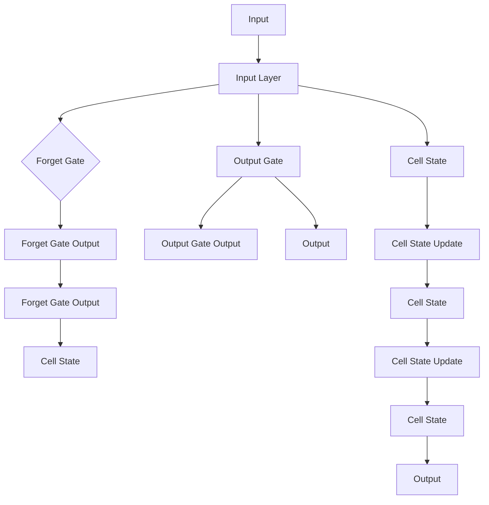
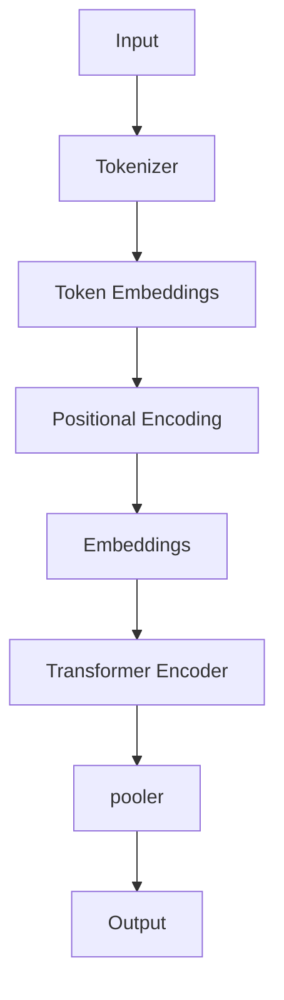

# AI人工智能深度学习算法：在自然语言处理中的运用

作者：禅与计算机程序设计艺术 / Zen and the Art of Computer Programming

关键词：深度学习，自然语言处理，神经网络，序列模型，语言模型

## 1. 背景介绍

### 1.1 问题的由来

自然语言处理（Natural Language Processing，NLP）作为人工智能领域的一个重要分支，旨在让计算机理解和处理人类语言。随着互联网的迅速发展和信息量的爆炸性增长，对NLP的需求日益增加。传统的基于规则的方法在处理复杂语言现象时往往力不从心，而深度学习算法的兴起为NLP带来了新的突破。

### 1.2 研究现状

近年来，深度学习在NLP领域取得了显著进展，尤其是在语言模型、文本分类、情感分析、机器翻译等方面。深度学习算法能够自动从海量数据中学习到复杂的语言规律，从而实现高精度的语言理解和生成。

### 1.3 研究意义

深度学习在NLP中的应用具有重要意义，主要体现在以下几个方面：

1. **提高NLP任务的性能**：深度学习算法能够显著提高NLP任务的准确性和效率。
2. **扩展NLP任务范围**：深度学习能够处理更复杂的语言现象，如句法分析、语义理解等。
3. **促进跨学科研究**：深度学习为NLP与其他领域的交叉研究提供了新的思路和方法。

### 1.4 本文结构

本文将首先介绍深度学习的基本概念和NLP中的常见深度学习算法。然后，详细讲解几种典型的NLP深度学习任务，如语言模型、文本分类和机器翻译。最后，探讨深度学习在NLP中的未来发展趋势与挑战。

## 2. 核心概念与联系

### 2.1 深度学习

深度学习是一种基于神经网络的学习方法，通过多层非线性变换来提取数据特征，从而实现复杂函数的逼近。深度学习在图像识别、语音识别、自然语言处理等领域取得了显著成果。

### 2.2 自然语言处理

自然语言处理是研究如何让计算机理解和处理人类语言的技术。NLP的目标是使计算机能够：

1. 理解自然语言文本的含义。
2. 生成自然语言文本。
3. 分析自然语言文本的结构和语法。

### 2.3 深度学习与自然语言处理的联系

深度学习为NLP提供了强大的工具和方法，使得NLP任务能够自动从海量数据中学习到复杂的语言规律，从而实现高精度的语言理解和生成。

## 3. 核心算法原理 & 具体操作步骤

### 3.1 算法原理概述

深度学习在NLP中主要涉及以下几种核心算法：

1. **神经网络**：神经网络是一种模拟人脑神经元连接的计算机模型，通过学习数据特征来实现复杂函数的逼近。
2. **卷积神经网络（CNN）**：卷积神经网络是一种在图像识别等视觉任务中表现优异的深度学习算法。
3. **循环神经网络（RNN）**：循环神经网络是一种在序列数据处理中表现优异的深度学习算法。
4. **长短期记忆网络（LSTM）**：长短期记忆网络是一种特殊的循环神经网络，能够有效处理长序列数据。
5. **Transformer模型**：Transformer模型是一种基于自注意力机制的深度学习模型，在语言模型、文本分类等任务中表现出色。

### 3.2 算法步骤详解

以下以语言模型为例，介绍深度学习在NLP中的应用步骤：

1. **数据预处理**：对原始文本数据进行分词、去停用词等预处理操作，将文本转换为机器可处理的格式。
2. **模型构建**：选择合适的深度学习模型，如LSTM、Transformer等，并构建相应的神经网络结构。
3. **模型训练**：利用大量标注数据进行模型训练，通过优化模型参数，使模型在训练数据上取得较好的效果。
4. **模型评估**：使用测试集对模型进行评估，检验模型在未知数据上的表现。
5. **模型应用**：将训练好的模型应用于实际任务，如文本分类、情感分析等。

### 3.3 算法优缺点

#### 3.3.1 优点

1. **自动特征提取**：深度学习算法能够自动从数据中学习到复杂的语言特征，无需人工设计特征。
2. **泛化能力强**：深度学习模型在训练数据上取得较好的效果后，往往能够泛化到未知数据上。
3. **性能优越**：深度学习在许多NLP任务上取得了显著的性能提升。

#### 3.3.2 缺点

1. **数据依赖性强**：深度学习模型对数据量有较高要求，数据不足可能导致模型性能下降。
2. **过拟合风险**：深度学习模型可能存在过拟合风险，需要通过正则化等方法进行控制。
3. **计算复杂度高**：深度学习模型的训练过程需要大量的计算资源。

### 3.4 算法应用领域

深度学习在NLP中的主要应用领域包括：

1. **语言模型**：如GPT、BERT等。
2. **文本分类**：如新闻分类、情感分析等。
3. **机器翻译**：如神经机器翻译。
4. **文本摘要**：如自动文摘、问答系统等。
5. **命名实体识别**：如人名、地名、组织机构名的识别。

## 4. 数学模型和公式 & 详细讲解 & 举例说明

### 4.1 数学模型构建

深度学习在NLP中的应用涉及到多种数学模型和公式，以下以LSTM模型为例进行讲解。

#### 4.1.1 LSTM模型

LSTM是一种特殊的循环神经网络，能够有效地处理长序列数据。其基本结构如图所示：



#### 4.1.2 数学公式

LSTM模型的数学公式如下：

$$
\begin{align*}
i_t &= \sigma(W_{xi}x_t + W_{hi}h_{t-1} + b_i) \
f_t &= \sigma(W_{xf}x_t + W_{hf}h_{t-1} + b_f) \
o_t &= \sigma(W_{xo}x_t + W_{ho}h_{t-1} + b_o) \
c_t &= f_t \circ c_{t-1} + i_t \circ \tanh(W_{xc}x_t + W_{hc}h_{t-1} + b_c) \
h_t &= o_t \circ \tanh(c_t)
\end{align*}
$$

其中，

- $i_t$、$f_t$、$o_t$分别表示输入门、遗忘门和输出门的激活函数输出。
- $\sigma$表示Sigmoid激活函数。
- $\circ$表示逐元素乘法。
- $W_{xi}$、$W_{xf}$、$W_{xo}$、$W_{hi}$、$W_{hf}$、$W_{ho}$、$W_{xc}$、$W_{hc}$分别表示权重矩阵。
- $b_i$、$b_f$、$b_o$、$b_c$表示偏置项。

### 4.2 公式推导过程

LSTM模型的推导过程较为复杂，涉及门控机制、非线性变换等。这里简要介绍其核心思想：

1. **遗忘门**：根据输入和前一个隐藏状态，决定哪些信息应该被遗忘。
2. **输入门**：根据输入和前一个隐藏状态，决定哪些信息应该被保存到细胞状态。
3. **输出门**：根据细胞状态和当前输入，决定哪些信息应该被输出。

通过这种门控机制，LSTM能够有效地处理长序列数据，保留重要的信息。

### 4.3 案例分析与讲解

以BERT模型为例，讲解Transformer模型在自然语言处理中的应用。

#### 4.3.1 BERT模型

BERT（Bidirectional Encoder Representations from Transformers）是一种基于Transformer模型的预训练语言表示模型。其基本结构如图所示：



#### 4.3.2 数学公式

BERT模型的数学公式如下：

$$
\begin{align*}
E &= \text{Concat}(E_1, E_2, \dots, E_N) \
P &= \text{MaskedLM}(E, \text{mask}) \
M &= \text{Softmax}(P) \
\hat{y} &= \text{argmax}(M)
\end{align*}
$$

其中，

- $E$表示输入的文本序列。
- $P$表示MaskedLM层的输出。
- $M$表示Softmax层的输出。
- $\hat{y}$表示预测的词向量。

BERT模型通过预训练和微调，能够有效地学习到语言的深层表示，从而在NLP任务中取得优异的性能。

### 4.4 常见问题解答

#### 4.4.1 深度学习模型如何处理稀疏数据？

对于稀疏数据，可以采用以下方法：

1. 使用稀疏矩阵表示输入数据。
2. 采用稀疏优化算法，如稀疏梯度下降。
3. 优化模型结构，减少参数数量。

#### 4.4.2 深度学习模型如何避免过拟合？

为了避免过拟合，可以采取以下措施：

1. 使用数据增强技术，如数据扩充、数据变换等。
2. 采用正则化技术，如L1、L2正则化等。
3. 使用dropout技术，在网络中随机丢弃部分神经元。
4. 使用早停法，当验证集上的性能不再提升时停止训练。

## 5. 项目实践：代码实例和详细解释说明

### 5.1 开发环境搭建

1. 安装Python和TensorFlow库：

```bash
pip install python tensorflow
```

2. 安装PyTorch库：

```bash
pip install torch
```

### 5.2 源代码详细实现

以下使用PyTorch实现一个简单的LSTM模型：

```python
import torch
import torch.nn as nn

class LSTMModel(nn.Module):
    def __init__(self, input_size, hidden_size, output_size):
        super(LSTMModel, self).__init__()
        self.lstm = nn.LSTM(input_size, hidden_size, batch_first=True)
        self.fc = nn.Linear(hidden_size, output_size)

    def forward(self, x):
        h0 = torch.zeros(1, x.size(0), hidden_size).to(x.device)
        c0 = torch.zeros(1, x.size(0), hidden_size).to(x.device)
        out, _ = self.lstm(x, (h0, c0))
        out = self.fc(out[:, -1, :])
        return out

# 示例：构建LSTM模型
input_size = 10
hidden_size = 20
output_size = 2
model = LSTMModel(input_size, hidden_size, output_size)
```

### 5.3 代码解读与分析

1. **导入库**：导入PyTorch相关库。
2. **定义LSTM模型**：定义一个LSTM模型类，继承自nn.Module。
3. **构建LSTM层**：使用nn.LSTM构建LSTM层，设置输入大小、隐藏层大小和输出大小。
4. **构建全连接层**：使用nn.Linear构建全连接层，将LSTM层的输出映射到输出大小。
5. **前向传播**：定义模型的前向传播函数，接收输入数据，通过LSTM层和全连接层进行计算。

### 5.4 运行结果展示

运行以下代码，展示LSTM模型在简单数据上的训练和预测过程：

```python
# 示例：构建数据
input_data = torch.randn(5, 1, input_size)
target = torch.tensor([[1], [0]])

# 训练LSTM模型
criterion = nn.CrossEntropyLoss()
optimizer = torch.optim.Adam(model.parameters(), lr=0.01)
for epoch in range(100):
    optimizer.zero_grad()
    output = model(input_data)
    loss = criterion(output, target)
    loss.backward()
    optimizer.step()

    if epoch % 10 == 0:
        print(f"Epoch {epoch}, Loss: {loss.item()}")

# 预测
with torch.no_grad():
    output = model(input_data)
    pred = torch.argmax(output, dim=1)
    print(f"Predicted class: {pred.item()}")
```

## 6. 实际应用场景

### 6.1 语言模型

语言模型是NLP中最基础的模型之一，旨在预测下一个单词、短语或句子。常见的语言模型有：

1. **N-gram模型**：基于N个单词的历史信息预测下一个单词的概率分布。
2. **神经网络语言模型**：使用深度神经网络来学习语言序列的概率分布。
3. **Transformer语言模型**：基于Transformer模型的语言模型，在自然语言生成、文本分类等任务中表现优异。

### 6.2 文本分类

文本分类是NLP中的一个重要任务，旨在将文本数据分类到预定义的类别中。常见的文本分类任务有：

1. **情感分析**：根据文本内容判断其情感倾向，如正面、负面、中性。
2. **主题分类**：根据文本内容判断其所属的主题类别。
3. **垃圾邮件检测**：根据文本内容判断邮件是否为垃圾邮件。

### 6.3 机器翻译

机器翻译是将一种语言翻译成另一种语言的NLP任务。常见的机器翻译模型有：

1. **基于短语的机器翻译**：将文本分解为短语，然后逐个翻译短语。
2. **基于统计的机器翻译**：利用统计方法进行翻译，如基于N-gram的翻译模型。
3. **基于神经网络的机器翻译**：使用深度神经网络进行翻译，如神经机器翻译（NMT）。

### 6.4 其他应用场景

除了上述应用场景，深度学习在NLP中还广泛应用于以下领域：

1. **文本摘要**：自动生成文本摘要，如新闻摘要、会议摘要等。
2. **问答系统**：根据用户提问，从知识库或文本数据中检索答案。
3. **命名实体识别**：识别文本中的命名实体，如人名、地名、组织机构名等。

## 7. 工具和资源推荐

### 7.1 学习资源推荐

1. **书籍**：
    - 《深度学习》
    - 《自然语言处理入门》
    - 《深度学习与自然语言处理》
2. **在线课程**：
    - Coursera: 自然语言处理与深度学习
    - Udacity: 深度学习工程师纳米学位
    - fast.ai: 深度学习

### 7.2 开发工具推荐

1. **编程语言**：Python、Python3
2. **深度学习框架**：TensorFlow、PyTorch、Keras
3. **NLP工具库**：NLTK、spaCy、transformers

### 7.3 相关论文推荐

1. **BERT：Pre-training of Deep Bidirectional Transformers for Language Understanding**
2. **GPT-3：Language Models are Few-Shot Learners**
3. **Transformers：Attention is All You Need**

### 7.4 其他资源推荐

1. **Hugging Face：https://huggingface.co/**
    - 提供预训练模型、工具和文档。
2. **TensorFlow：https://www.tensorflow.org/**
    - 提供深度学习框架和相关资源。
3. **PyTorch：https://pytorch.org/**
    - 提供深度学习框架和相关资源。

## 8. 总结：未来发展趋势与挑战

深度学习在自然语言处理中的应用取得了显著成果，但仍面临着一些挑战和未来发展趋势。

### 8.1 研究成果总结

1. **深度学习模型在NLP任务上取得了显著性能提升**。
2. **预训练模型的应用使得NLP任务更加高效和易于部署**。
3. **多模态学习、知识图谱等技术的发展为NLP带来了新的机遇**。

### 8.2 未来发展趋势

1. **模型性能持续提升**：通过改进模型结构、优化算法和增加训练数据，模型性能将持续提升。
2. **多模态学习**：将深度学习与其他模态（如图像、音频）结合，实现更丰富的语言理解能力。
3. **知识图谱与NLP结合**：将知识图谱与NLP相结合，提高NLP任务的准确性和可靠性。

### 8.3 面临的挑战

1. **数据隐私与安全**：如何保护用户隐私和数据安全，是一个重要的挑战。
2. **模型可解释性和可控性**：如何提高模型的解释性和可控性，使其决策过程更加透明。
3. **模型公平性和偏见**：如何减少模型中的偏见，提高模型的公平性。

### 8.4 研究展望

深度学习在自然语言处理中的应用将不断拓展，未来有望实现以下目标：

1. **实现更高级的语言理解能力**。
2. **构建更加智能的对话系统**。
3. **推动NLP在更多领域的应用**。

总之，深度学习在自然语言处理中的应用前景广阔，但仍需克服诸多挑战。随着技术的不断进步，深度学习将为NLP带来更多可能性，推动人工智能领域的发展。

## 9. 附录：常见问题与解答

### 9.1 什么是深度学习？

深度学习是一种基于人工神经网络的学习方法，通过多层非线性变换来提取数据特征，从而实现复杂函数的逼近。

### 9.2 什么是自然语言处理？

自然语言处理是研究如何让计算机理解和处理人类语言的技术。

### 9.3 深度学习在NLP中有哪些应用？

深度学习在NLP中的应用包括语言模型、文本分类、机器翻译、文本摘要、问答系统、命名实体识别等。

### 9.4 如何选择合适的深度学习模型？

选择合适的深度学习模型需要考虑以下因素：

1. **任务类型**：针对不同的NLP任务，选择合适的模型结构。
2. **数据规模**：根据数据规模选择合适的模型复杂度。
3. **计算资源**：根据计算资源限制选择合适的模型结构和训练方法。

### 9.5 深度学习模型如何避免过拟合？

为了避免过拟合，可以采取以下措施：

1. 使用数据增强技术。
2. 采用正则化技术。
3. 使用dropout技术。
4. 使用早停法。

### 9.6 深度学习模型如何处理稀疏数据？

对于稀疏数据，可以采用以下方法：

1. 使用稀疏矩阵表示输入数据。
2. 采用稀疏优化算法。
3. 优化模型结构。