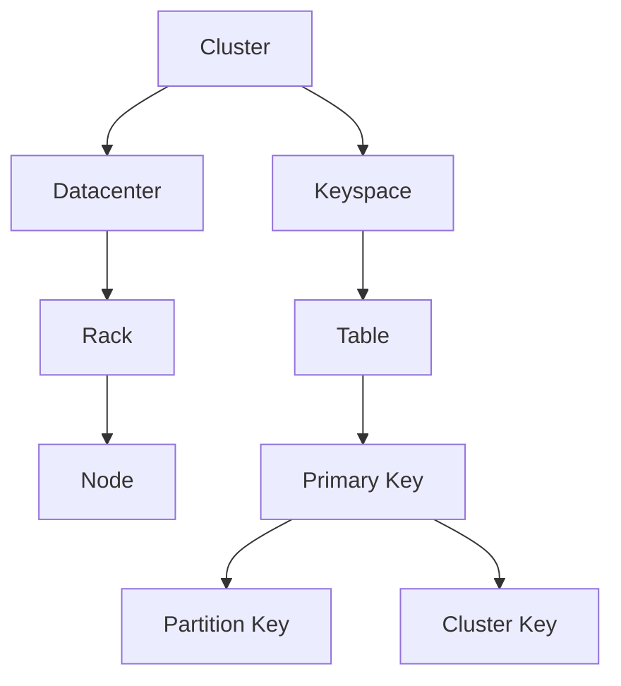
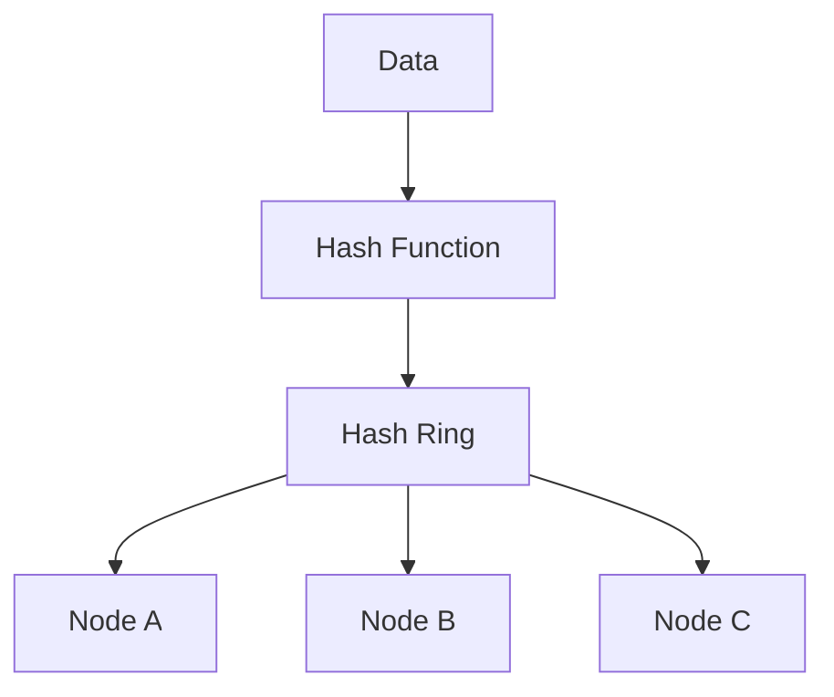
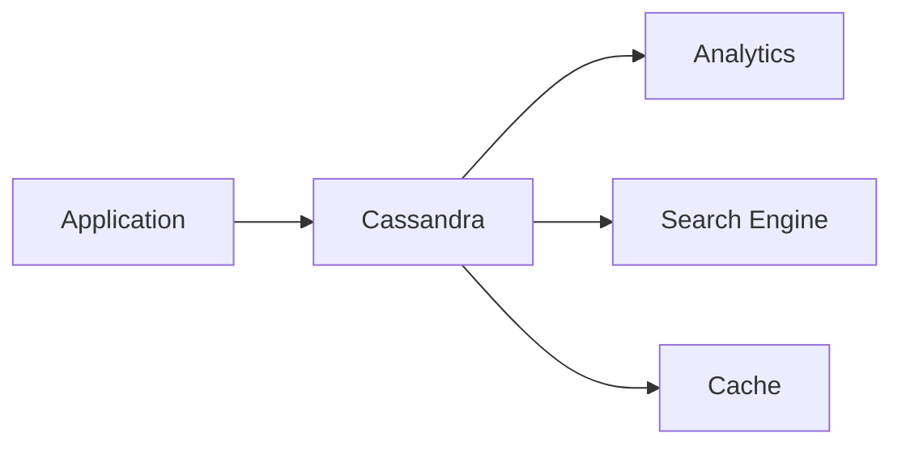

# AI系统Cassandra原理与代码实战案例讲解

关键词：AI系统、Cassandra、分布式数据库、NoSQL、大数据

## 1. 背景介绍
### 1.1  问题的由来
随着大数据时代的到来,传统的关系型数据库已经无法满足海量数据存储和实时处理的需求。NoSQL数据库应运而生,其中Apache Cassandra作为一款高度可扩展的分布式NoSQL数据库,在众多互联网公司得到了广泛应用。然而,对于初学者来说,理解和掌握Cassandra的原理和使用方法仍然存在一定难度。
### 1.2  研究现状
目前业界对Cassandra的研究主要集中在性能优化、数据模型设计、故障恢复等方面。例如,Netflix、Apple、GitHub等公司都在生产环境中大规模使用Cassandra,并分享了宝贵的实践经验。同时,Apache社区也在不断完善Cassandra,发布了多个稳定版本。
### 1.3  研究意义
深入理解Cassandra的工作原理,对于设计和开发高可用、高性能的分布式系统具有重要意义。通过剖析Cassandra的内部机制,可以学习到分布式系统设计的精髓,为解决实际问题提供有益的思路。此外,Cassandra丰富的特性和活跃的社区生态,也为开发者提供了便利的工具和资源。
### 1.4  本文结构
本文将从Cassandra的核心概念出发,详细讲解其工作原理和关键技术。然后,通过实际的代码案例,演示如何使用Cassandra进行数据建模和CRUD操作。最后,总结Cassandra的特点和适用场景,展望其未来的发展方向,并提供一些学习资源。

## 2. 核心概念与联系
要理解Cassandra的工作原理,首先需要了解一些核心概念:
- 集群(Cluster):由多个Cassandra节点组成,协同提供数据服务。
- 节点(Node):集群中的一个Cassandra实例,负责数据存储和查询。
- 数据中心(Datacenter):物理上相近、网络连接良好的一组节点。
- 机架(Rack):数据中心内部的物理子集群,提高容错性。
- 键空间(Keyspace):类似于关系数据库的Schema,包含多个表。
- 表(Table):数据存储的基本单元,类似于关系表,但是结构更灵活。
- 主键(Primary Key):唯一标识一行数据,决定数据分布。
- 分区键(Partition Key):主键的第一部分,用于确定数据在集群中的分布。
- 集群键(Cluster Key):主键的第二部分,用于在分区内部排序数据。

下图展示了Cassandra的核心概念之间的关系:



## 3. 核心算法原理 & 具体操作步骤
### 3.1  算法原理概述
Cassandra采用一致性哈希(Consistent Hashing)算法来决定数据在集群中的分布。一致性哈希将整个哈希空间看作一个环,每个节点都被分配到环上的某个位置。当写入数据时,Cassandra根据分区键计算哈希值,将数据映射到哈希环上,并存储在顺时针方向最近的节点上。
### 3.2  算法步骤详解
1. 计算分区键的哈希值
2. 将哈希值映射到一致性哈希环上
3. 顺时针查找最近的节点
4. 将数据写入该节点
5. 根据复制因子,同步数据到其他节点

下图展示了一致性哈希算法的基本原理:



### 3.3  算法优缺点
一致性哈希算法的优点包括:
- 节点的增删对系统影响小,只需重新分配一小部分数据
- 数据分布均匀,负载均衡效果好
- 支持动态水平扩展,方便应对数据量增长

缺点包括:
- 数据倾斜问题,可能导致某些节点负载过高
- 数据迁移代价较大,需要在后台执行

### 3.4  算法应用领域
一致性哈希广泛应用于分布式系统设计中,除了NoSQL数据库,还被用于:
- 分布式缓存系统,如Memcached
- 内容分发网络(CDN)
- 对象存储系统,如Amazon S3

## 4. 数学模型和公式 & 详细讲解 & 举例说明
### 4.1  数学模型构建
为了描述Cassandra的数据分布,我们可以建立如下数学模型:

设哈希空间的范围为$[0,2^{n}-1]$,哈希函数为$hash(x)$。假设有$m$个节点,第$i$个节点的哈希值为$h_i$,则数据$x$被分配到节点$i$的条件为:

$$hash(x)\in[h_i,h_{(i+1) \bmod m}]$$

即数据的哈希值落在节点$i$和它的下一个节点之间。

### 4.2  公式推导过程
根据上述数学模型,我们可以推导出数据在Cassandra集群中的分布公式。

假设数据的总量为$N$,节点$i$存储的数据量为$N_i$,则有:

$$N_i=\sum_{x=0}^{N-1} I\{hash(x)\in[h_i,h_{(i+1) \bmod m}]\}$$

其中$I\{\cdot\}$为指示函数,当条件满足时取1,否则取0。

进一步,假设哈希函数是均匀的,则每个节点分配到的数据量的期望为:

$$E(N_i)=\frac{N}{m}$$

即数据在节点之间是均匀分布的。

### 4.3  案例分析与讲解
下面通过一个具体的例子来说明Cassandra的数据分布。

假设哈希空间的范围为$[0,999]$,有3个节点A、B、C,其哈希值分别为$200$、$500$、$800$。现在要插入5个数据,其分区键的哈希值分别为$100$、$300$、$600$、$700$、$900$。

根据一致性哈希算法,数据的分布如下:
- $100$落在$[800,200]$,分配到节点A
- $300$落在$[200,500]$,分配到节点B
- $600$、$700$落在$[500,800]$,分配到节点C
- $900$落在$[800,200]$,分配到节点A

可以看出,数据在节点间的分布是比较均匀的。

### 4.4  常见问题解答
问题1:如果某个节点宕机,会发生什么?
答:Cassandra会自动将宕机节点的数据迁移到其他节点,保证数据的可用性。迁移过程通过反熵(Anti-Entropy)机制在后台自动完成。

问题2:Cassandra如何处理数据倾斜问题?
答:Cassandra引入了虚拟节点(Virtual Node)的概念,将每个物理节点映射到多个虚拟节点上,从而使数据分布更加均匀。同时,Cassandra支持自定义分区器(Partitioner),可以根据具体的业务场景优化数据分布。

## 5. 项目实践：代码实例和详细解释说明
### 5.1  开发环境搭建
首先需要搭建Cassandra的开发环境。可以选择在本地安装Cassandra,或者使用Docker镜像。本文采用Docker方式。

```bash
# 拉取Cassandra镜像
docker pull cassandra

# 启动Cassandra容器
docker run --name cassandra -p 9042:9042 -d cassandra
```

然后,安装Python的Cassandra驱动:

```bash
pip install cassandra-driver
```

### 5.2  源代码详细实现
下面通过Python代码演示如何使用Cassandra进行数据建模和CRUD操作。

```python
from cassandra.cluster import Cluster

# 连接Cassandra集群
cluster = Cluster(['localhost'])
session = cluster.connect()

# 创建键空间和表
session.execute("""
    CREATE KEYSPACE IF NOT EXISTS demo
    WITH replication = { 'class': 'SimpleStrategy', 'replication_factor': '1' }
""")

session.execute("""
    CREATE TABLE IF NOT EXISTS demo.users (
        user_id int,
        name text,
        email text,
        PRIMARY KEY (user_id)
    )
""")

# 插入数据
session.execute("""
    INSERT INTO demo.users (user_id, name, email)
    VALUES (%s, %s, %s)
""", (1, 'Alice', 'alice@example.com'))

session.execute("""
    INSERT INTO demo.users (user_id, name, email)
    VALUES (%s, %s, %s)
""", (2, 'Bob', 'bob@example.com'))

# 查询数据
rows = session.execute("SELECT * FROM demo.users")
for row in rows:
    print(row.user_id, row.name, row.email)

# 更新数据
session.execute("""
    UPDATE demo.users
    SET email = %s
    WHERE user_id = %s
""", ('alice@new.com', 1))

# 删除数据
session.execute("""
    DELETE FROM demo.users
    WHERE user_id = %s
""", (2,))

# 关闭连接
cluster.shutdown()
```

### 5.3  代码解读与分析
上述代码主要分为以下几个部分:

1. 连接Cassandra集群:使用`Cluster`对象指定节点的IP地址,然后调用`connect()`方法创建`Session`对象。

2. 创建键空间和表:使用CQL(Cassandra Query Language)语句创建键空间和表。这里使用`SimpleStrategy`的复制策略,复制因子为1。表的主键为`user_id`。

3. 插入数据:使用`INSERT INTO`语句插入数据,可以使用占位符`%s`传递参数。

4. 查询数据:使用`SELECT`语句查询数据,返回结果为一个`Row`对象的迭代器。

5. 更新数据:使用`UPDATE`语句更新数据,指定主键和要更新的列。

6. 删除数据:使用`DELETE`语句删除数据,指定主键。

7. 关闭连接:使用`shutdown()`方法关闭集群连接。

可以看出,Cassandra提供了简洁的API和CQL语句,使得数据操作非常方便。同时,Cassandra的数据模型灵活,支持宽行存储和多级嵌套。

### 5.4  运行结果展示
运行上述代码,可以看到如下输出:

```
1 Alice alice@example.com
2 Bob bob@example.com
```

说明数据已经成功插入并查询出来。同时,集群中的数据也会自动同步。

## 6. 实际应用场景
Cassandra凭借其出色的可扩展性和高可用性,在很多场景下得到了应用,例如:

- 物联网(IoT):处理海量的传感器数据。
- 时序数据库:存储监控指标、日志等时间序列数据。
- 社交网络:存储用户的个人信息、好友关系等。
- 推荐系统:基于用户行为数据进行实时推荐。
- 消息系统:提供消息的持久化存储。

下图展示了Cassandra在实际系统架构中的位置:



### 6.4  未来应用展望
随着5G、人工智能等新技术的发展,Cassandra有望在更多领域发挥作用,例如:

- 边缘计算:在边缘节点上部署Cassandra,实现数据的就近存储和处理。
- 机器学习:Cassandra可以作为特征存储,支持实时的特征提取和更新。
- 区块链:Cassandra可以存储区块链的状态信息,提高查询性能。

未来Cassandra还将不断演进,引入更多新特性,如:
- 改进的存储引擎,提供更好的压缩和性能
- 支持图数据模型,便于处理复杂的关联关系
- 集成机器学习框架,实现智能的数据管理和分析

## 7. 工具和资源推荐
### 7.1  学习资源推荐
- 官方文档:https://cassandra.apache.org/doc/latest/
- DataStax Academy:https://academy.datastax.com/
- Cassandra权威指南:http://shop.oreilly.com/product/0636920043041.do

### 7.2  开发工具推荐
- DataStax DevCenter:可视