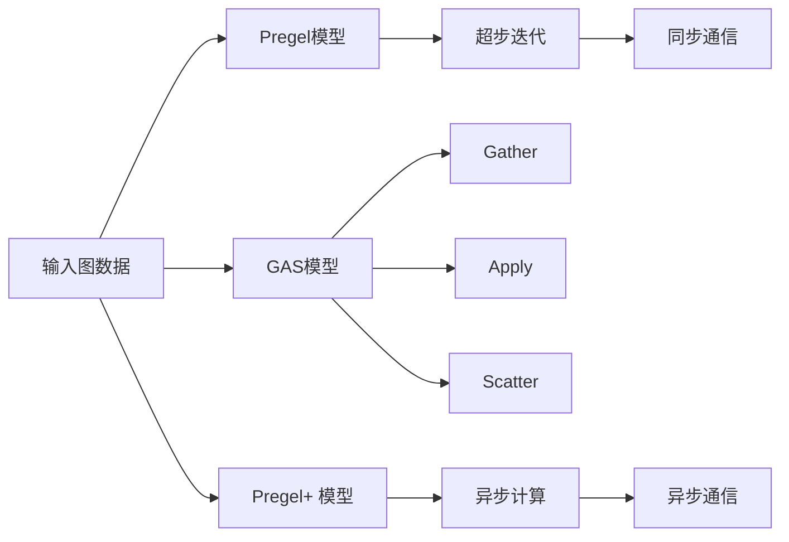

# 图计算引擎 原理与代码实例讲解

## 1. 背景介绍
### 1.1 图计算的兴起
在大数据时代,越来越多的数据呈现出网状结构的特点,传统的关系型数据库已经无法满足复杂网络数据的存储和计算需求。图计算作为一种新兴的计算范式,可以高效地处理图结构数据,在社交网络、推荐系统、金融风控等领域得到广泛应用。

### 1.2 图计算引擎的重要性
图计算引擎是支撑图计算的核心系统,它提供了图数据的存储、查询、分析等基础功能,大大简化了图计算应用的开发。一个优秀的图计算引擎不仅要有高性能,还要具备良好的可扩展性和易用性。

### 1.3 本文的目的
本文将深入剖析图计算引擎的核心原理,并结合代码实例进行讲解,帮助读者全面理解图计算引擎的实现细节。同时,本文也会介绍图计算引擎的实际应用场景和未来发展趋势,为从事图计算相关工作的读者提供参考。

## 2. 核心概念与联系
### 2.1 图的基本概念
- 顶点(Vertex):图中的基本单元,表示一个实体对象
- 边(Edge):连接顶点的线,表示顶点之间的关系
- 属性(Property):顶点和边的附加信息,用于描述它们的特征

### 2.2 图数据模型
常见的图数据模型有以下几种:
- 属性图(Property Graph):顶点和边都可以携带属性信息
- RDF图(RDF Graph):用于描述实体之间语义关系的图
- 时态图(Temporal Graph):包含时间维度的动态演化图

### 2.3 图计算模型  
图计算模型定义了对图数据进行计算的方式,主要有:
- Pregel模型:基于BSP(Bulk Synchronous Parallel)的图计算模型,由Google提出
- GAS模型:由PowerGraph提出,包含Gather、Apply、Scatter三个阶段
- Pregel+ 模型:在Pregel的基础上进行了改进,更适合异步计算

下图展示了这三种模型的异同:



## 3. 核心算法原理与具体操作步骤
### 3.1 Pregel算法原理
Pregel的核心思想是将图计算分解为一系列的超步(Superstep),每个超步包含以下步骤:
1. 每个顶点根据上一轮计算结果,更新自己的状态,并向相邻顶点发送消息
2. 所有顶点接收消息并更新状态
3. 如果没有顶点状态发生变化,则计算结束,否则进入下一个超步

### 3.2 GAS算法原理
GAS模型将计算分为三个阶段:
1. Gather:收集相邻顶点传来的消息
2. Apply:根据聚合的消息更新顶点状态  
3. Scatter:根据新的顶点状态,向相邻顶点发送消息

这三个阶段会迭代进行,直到达到终止条件。

### 3.3 Pregel+ 算法原理
Pregel+ 对Pregel进行了改进:
1. 采用异步计算模式,不再需要全局同步
2. 允许灵活的消息传递方式,顶点可以直接给任意顶点发消息
3. 支持动态图,可以在计算过程中添加或删除顶点和边

### 3.4 常见图算法及其实现步骤
接下来我们看几个常见图算法在图计算引擎中的实现。

#### 3.4.1 单源最短路径(SSSP)算法
1. 将源点的距离设为0,其他点设为无穷大
2. 每个顶点向相邻顶点发送自己的距离信息
3. 每个顶点接收距离信息,如果有更短的路径,则更新自己的距离
4. 重复2-3步,直到没有距离更新

#### 3.4.2 PageRank算法
1. 为每个网页顶点赋予初始PR值
2. 每个网页将PR值分配给出链网页
3. 每个网页收集入链网页的PR值,更新自己的PR值
4. 重复2-3步,直到PR值收敛

#### 3.4.3 社区发现算法(LPA)
1. 为每个顶点分配唯一的社区标签
2. 每个顶点采用出现频率最高的相邻标签作为新标签
3. 重复2步,直到所有顶点标签不再变化

## 4. 数学模型和公式详细讲解举例说明
图计算涉及的数学知识主要有图论和线性代数。下面列举几个重要的公式。

### 4.1 顶点度
顶点的度表示与它相连的边数,记作 $d(v)$。无向图中每条边对度的贡献为1,有向图中分为出度和入度。
$$d(v) = \sum_{u \in N(v)} 1$$
其中 $N(v)$ 表示 $v$ 的邻居顶点集合。

### 4.2 邻接矩阵
邻接矩阵用于表示图的顶点连接关系,是一个 $n \times n$ 的方阵,记作 $A$。当顶点 $i$ 和 $j$ 之间有边相连时, $A_{ij}=1$,否则为0。
$$A_{ij} = \begin{cases}
1, & \text{if $(i,j) \in E$} \\
0, & \text{otherwise}
\end{cases}$$

### 4.3 PageRank计算公式
PageRank值表示网页的重要性,记作 $PR(i)$。它由所有入链网页的PR值经过加权求和得到。
$$PR(i) = \frac{1-d}{N} + d \sum_{j \in B(i)} \frac{PR(j)}{L(j)}$$
其中 $d$ 是阻尼系数, $N$ 是网页总数, $B(i)$ 是指向 $i$ 的网页集合, $L(j)$ 是网页 $j$ 的出链数。

### 4.4 标签传播算法(LPA)
LPA通过迭代传播标签来发现社区结构。第 $t$ 轮迭代时,顶点 $i$ 的标签 $l_i^{(t)}$ 由下式决定:
$$l_i^{(t)} = \arg\max_{l} \sum_{j \in N(i)} w_{ij} \cdot \delta(l_j^{(t-1)}, l)$$
其中 $w_{ij}$ 为边 $(i,j)$ 的权重, $\delta(x, y)$ 为克罗内克函数,当 $x=y$ 时取1,否则为0。

## 5. 项目实践：代码实例和详细解释说明
接下来我们用Python实现一个简单的Pregel模型,并用它来解决单源最短路径问题。

### 5.1 定义图类
首先定义一个图类,用于表示输入的图数据:

```python
class Graph:
    def __init__(self):
        self.vertices = {}  # 顶点集合
        
    def add_vertex(self, vid, data=None):
        if vid not in self.vertices:
            self.vertices[vid] = Vertex(vid, data)
            
    def add_edge(self, src_vid, dst_vid, weight=1):
        if src_vid not in self.vertices:
            self.add_vertex(src_vid)
        if dst_vid not in self.vertices:
            self.add_vertex(dst_vid)
        self.vertices[src_vid].add_neighbor(dst_vid, weight)
        
class Vertex:
    def __init__(self, vid, data=None):
        self.vid = vid  # 顶点ID
        self.data = data  # 顶点数据
        self.neighbors = {}  # 邻居顶点ID和边权重
        
    def add_neighbor(self, dst_vid, weight=1):
        self.neighbors[dst_vid] = weight
```

### 5.2 定义Pregel计算模型
然后定义Pregel计算模型,包含初始化、发送消息、接收消息等基本操作:

```python
class Pregel:
    def __init__(self, graph, max_iter):
        self.graph = graph
        self.max_iter = max_iter
        
    def run(self):
        for i in range(self.max_iter):
            for v in self.graph.vertices.values():
                v.send_message()  # 发送消息
            for v in self.graph.vertices.values():
                v.update_vertex()  # 更新顶点
                
class PregelVertex:
    def __init__(self, vid, data=None):
        self.vid = vid
        self.data = data
        self.neighbors = {}
        self.value = float('inf')  # 最短距离
        self.received_messages = []
        
    def add_neighbor(self, dst_vid, weight=1):
        self.neighbors[dst_vid] = weight
        
    def send_message(self):
        for nbr_vid, weight in self.neighbors.items():
            new_dist = self.value + weight
            if new_dist < self.graph.vertices[nbr_vid].value:
                msg = Message(self.vid, nbr_vid, new_dist)
                self.graph.vertices[nbr_vid].received_messages.append(msg)
                
    def update_vertex(self):
        min_dist = self.value
        for msg in self.received_messages:
            if msg.value < min_dist:
                min_dist = msg.value
        if min_dist < self.value:
            self.value = min_dist
        self.received_messages = []  # 清空消息
        
class Message:
    def __init__(self, src_vid, dst_vid, value):
        self.src_vid = src_vid
        self.dst_vid = dst_vid
        self.value = value
```

### 5.3 运行单源最短路径算法
最后构建图数据,设置源点,运行Pregel模型进行计算:

```python
# 构建图
graph = Graph()
graph.add_edge(0, 1, 4)
graph.add_edge(0, 7, 8)
graph.add_edge(1, 7, 11)
graph.add_edge(1, 2, 8)
...

# 设置源点
source_vid = 0
graph.vertices[source_vid].value = 0

# 运行Pregel计算
pregel = Pregel(graph, max_iter=10)
pregel.run()

# 输出结果
for v in graph.vertices.values():
    print(f'Vertex {v.vid}: Shortest distance = {v.value}')
```

以上就是一个简单的Pregel模型实现,通过定义图类、顶点类、消息类,实现了图计算的基本逻辑。在实际的图计算引擎中,还需要考虑更多的优化细节,如图划分、负载均衡、容错处理等。

## 6. 实际应用场景
图计算引擎在许多领域都有重要应用,下面列举几个典型场景:

### 6.1 社交网络分析
- 用户关系挖掘:通过LPA等社区发现算法,识别紧密联系的用户群体
- 影响力分析:通过PageRank等算法,发现具有重要影响力的用户
- 好友推荐:通过共同好友、相似兴趣等,给用户推荐潜在的好友

### 6.2 金融风险管控
- 反欺诈:通过图挖掘算法,识别异常的资金流动模式,发现欺诈行为
- 关联分析:挖掘用户、商户、设备之间的可疑关联,评估交易风险
- 信用评估:根据用户的历史行为、社交关系等,构建用户信用画像

### 6.3 知识图谱
- 实体链接:识别文本中的实体,并链接到知识库中已有的实体
- 关系抽取:从非结构化文本中抽取实体之间的语义关系
- 知识推理:基于已有的实体和关系,推断出新的隐含知识

### 6.4 推荐系统
- 协同过滤:利用用户或物品之间的相似性,给用户推荐感兴趣的物品
- 基于内容:根据物品的内容属性,给用户推荐类似的其他物品
- 组合推荐:综合利用多种推荐算法,得到更加准确和多样的推荐结果

## 7. 工具和资源推荐
### 7.1 开源图计算引擎
- Apache Giraph:基于Pregel模型的分布式图计算框架
- GraphX:基于Apache Spark的图计算框架,提供了丰富的图算法库
- JanusGraph:一个可扩展的分布式图数据库,支持OLAP和OLTP场景
- Neo4j:最流行的原生图数据库之一,提供了声明式的查询语言Cypher

### 