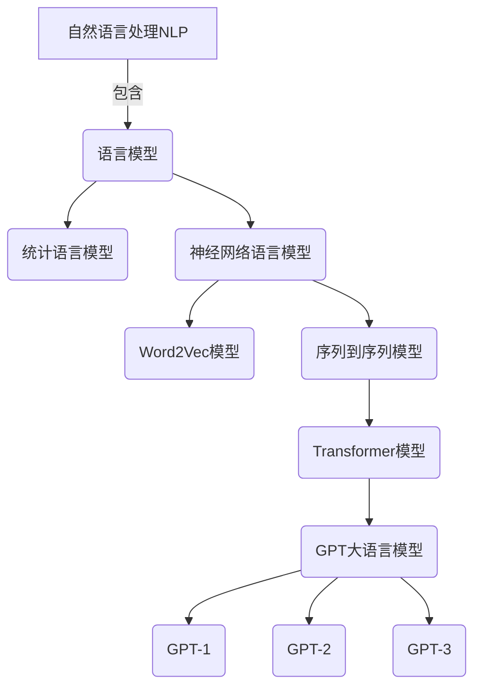
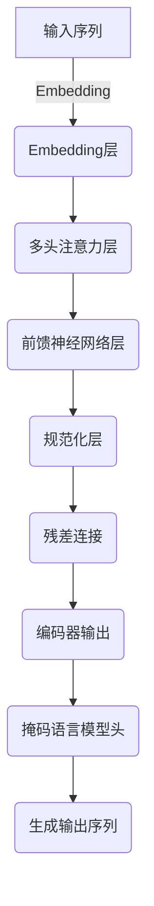

# 大语言模型应用指南：OpenAI大语言模型简介

## 1. 背景介绍

### 1.1 问题的由来

在过去几年中,自然语言处理(NLP)领域取得了长足的进步,这主要归功于大型语言模型(Large Language Models, LLMs)的出现和发展。LLMs是一种基于深度学习的人工智能模型,能够从大量文本数据中学习语言模式和语义关系,从而生成看似人类写作的自然语言输出。

随着计算能力和数据可用性的不断提高,LLMs的规模也在不断扩大。OpenAI的GPT(Generative Pre-trained Transformer)系列模型就是这一领域的代表作之一,其最新版本GPT-3拥有惊人的1750亿个参数,在各种自然语言任务上表现出色,引起了学术界和工业界的广泛关注。

### 1.2 研究现状

虽然LLMs在自然语言生成、理解和任务完成等方面展现出了强大的能力,但它们也存在一些明显的缺陷和局限性。例如,LLMs往往缺乏对话的连贯性和一致性,容易产生矛盾和事实错误的输出;它们也缺乏真正的理解和推理能力,只是在模仿人类语言。此外,训练LLMs需要消耗大量的计算资源和能源,存在一定的环境和伦理问题。

为了更好地利用LLMs的潜力并解决其局限性,研究人员正在探索各种优化和应用方法,例如结合外部知识库、引入人工干预、设计更加可控和可解释的模型架构等。同时,LLMs在自然语言处理、对话系统、内容生成等领域也得到了广泛的实际应用。

### 1.3 研究意义

作为当前自然语言处理领域的前沿技术,深入研究和理解LLMs不仅具有重要的理论价值,也将为其在实际应用中的部署和优化提供指导。本文将重点介绍OpenAI公司开发的GPT系列大语言模型,阐述其核心概念、算法原理、数学模型,并通过实例分析其在各个领域的应用前景,旨在为读者提供一个全面的认识。

### 1.4 本文结构

本文共分为9个部分:

1. 背景介绍
2. 核心概念与联系
3. 核心算法原理与具体操作步骤
4. 数学模型和公式详细讲解与举例说明
5. 项目实践:代码实例和详细解释说明
6. 实际应用场景
7. 工具和资源推荐
8. 总结:未来发展趋势与挑战
9. 附录:常见问题与解答

## 2. 核心概念与联系

大语言模型(LLMs)是近年来自然语言处理(NLP)领域的一个重要突破,它建立在语言模型和神经网络语言模型的基础之上。

### 2.1 语言模型

语言模型是自然语言处理的基础,旨在捕获语言的统计规律。根据建模方法的不同,语言模型可以分为统计语言模型和神经网络语言模型两大类。

#### 2.1.1 统计语言模型

统计语言模型是基于统计学习原理,通过分析大量语料库数据,计算单词序列的概率分布,从而预测下一个单词的可能性。常见的统计语言模型包括N-gram模型、隐马尔可夫模型等。

#### 2.1.2 神经网络语言模型

神经网络语言模型则是利用神经网络来建模语言,能够自动学习单词的语义表示和上下文关系。其中,Word2Vec模型通过浅层神经网络学习单词的分布式向量表示;序列到序列(Seq2Seq)模型则使用递归神经网络或卷积神经网络对整个句子进行建模。

### 2.2 Transformer与自注意力机制

2017年,Transformer模型的提出彻底改变了序列建模的范式。它完全基于注意力机制,摒弃了之前的递归和卷积结构,大大提升了并行计算能力。其中,自注意力机制能够捕捉输入序列中任意两个位置之间的依赖关系,成为了Transformer的核心组件。

### 2.3 GPT大语言模型

OpenAI于2018年提出的GPT(Generative Pre-trained Transformer)大语言模型,就是以Transformer编码器为骨干,并在大规模文本语料上进行预训练而得到的。GPT通过自回归语言模型的方式生成文本,具有出色的生成能力。

GPT系列模型按时间顺序包括GPT、GPT-2和GPT-3三个版本,参数规模从最初的1.1亿增长到了惊人的1750亿,展现了大模型的强大潜力。GPT-3已经能够在不少自然语言任务上达到人类水平,被认为是通向人工通用智能(AGI)的一个重要里程碑。

## 3. 核心算法原理与具体操作步骤  

### 3.1 算法原理概述

GPT大语言模型的核心算法原理可以概括为:

1. 基于Transformer的编码器-解码器架构
2. 使用自回归语言模型进行文本生成
3. 在大规模语料库上进行自监督预训练
4. 对下游任务进行微调(finetuning)

具体来说,GPT首先将输入文本序列转换为词嵌入向量,并通过编码器的多层Transformer块进行编码,每个块由多头自注意力层和前馈神经网络层组成,通过残差连接和层归一化来增强模型性能。

在预训练阶段,GPT采用自回归语言模型的目标,给定前面的文本,对后面的词进行概率预测。通过最大化语料库上的似然概率,模型可以自主学习文本的语义和语法知识。

预训练完成后,GPT可以在特定的下游任务上进行微调,如文本生成、机器翻译、问答等,通过添加相应的输出头来指导模型输出。值得一提的是,GPT-3由于其巨大的规模,在很多任务上甚至可以通过简单的提示就取得很好的效果,这种方式被称为"少量提示学习"(few-shot learning)。

### 3.2 算法步骤详解

1. **输入处理**:将原始文本序列转换为词嵌入向量表示,作为Transformer编码器的输入。

2. **位置编码**:因为自注意力层不保持序列顺序,因此需要加入位置编码,让模型知道每个词的位置信息。

3. **多头注意力层**:该层包含多个注意力头,每个头对输入序列进行不同的注意力计算,最后将所有头的结果拼接起来。具体计算过程为:
    - 将输入分别与查询(Query)、键(Key)和值(Value)的投影矩阵相乘,得到Q、K、V
    - 计算Q和K的点积得分,施加掩码并执行softmax得到注意力权重
    - 将注意力权重与V相乘,得到编码后的表示
    - 对多个注意力头的结果进行拼接

4. **前馈神经网络层**:对注意力层的输出进行两次线性变换和非线性激活,并与输入进行残差连接。

5. **层归一化**:对每个子层的输出进行归一化,以防止梯度消失或爆炸。

6. **重复编码器层**:上述注意力层和前馈层按序重复N次(如GPT-3中N=96)。

7. **输出层**:将最终的编码器输出通过线性层和softmax激活,得到对下一个词的概率分布预测。

8. **预训练**:基于语料库最大化模型对下一个词的预测概率(即最大似然估计)。

9. **微调**:在特定任务上对预训练模型进行微调,根据需要添加额外的输出头。

10. **生成**:给定一个起始文本,通过自回归的方式逐词生成后续文本。

### 3.3 算法优缺点

**优点**:

- 自注意力机制能够有效捕捉长距离依赖关系
- 预训练使模型学习大量语料的先验知识
- 大规模参数有助于泛化和迁移能力
- 通过少量示例即可快速适应新任务

**缺点**:

- 训练成本高,需要大量计算资源
- 缺乏长期记忆和逻辑推理能力
- 生成的文本缺乏连贯性和一致性
- 存在事实错误、偏见和不当内容

### 3.4 算法应用领域

GPT大语言模型的应用领域非常广泛,包括但不限于:

- 自然语言生成:文本创作、对话系统、机器翻译等
- 自然语言理解:文本分类、情感分析、阅读理解等
- 任务完成:问答系统、智能助手、代码生成等

## 4. 数学模型和公式详细讲解与举例说明

### 4.1 数学模型构建

GPT大语言模型的核心是基于Transformer的自注意力机制。我们先来构建自注意力层的数学模型。

对于长度为n的输入序列$\boldsymbol{x} = (x_1, x_2, \ldots, x_n)$,我们首先将其映射为d维的向量序列$\boldsymbol{z} = (z_1, z_2, \ldots, z_n)$,其中$z_i \in \mathbb{R}^d$。然后计算查询(Query)、键(Key)和值(Value)向量:

$$
\begin{aligned}
\boldsymbol{Q} &= \boldsymbol{z} \boldsymbol{W}^Q \
\boldsymbol{K} &= \boldsymbol{z} \boldsymbol{W}^K \
\boldsymbol{V} &= \boldsymbol{z} \boldsymbol{W}^V
\end{aligned}
$$

其中$\boldsymbol{W}^Q, \boldsymbol{W}^K, \boldsymbol{W}^V \in \mathbb{R}^{d \times d_k}$分别为查询、键和值的投影矩阵。

接下来,我们计算查询向量与所有键向量的点积得分,并除以缩放因子$\sqrt{d_k}$:

$$
\text{Attention}(\boldsymbol{Q}, \boldsymbol{K}, \boldsymbol{V}) = \text{softmax}\left(\frac{\boldsymbol{Q}\boldsymbol{K}^\top}{\sqrt{d_k}}\right)\boldsymbol{V}
$$

其中softmax函数用于获得归一化的注意力权重。对于序列中的每个位置$i$,我们可以计算其加权值向量$v_i$:

$$
v_i = \sum_{j=1}^n \alpha_{ij}z_j
$$

这里$\alpha_{ij} = \text{Attention}(q_i, k_j, v_j)$表示位置$i$对位置$j$的注意力权重。将所有位置的$v_i$拼接,即得到了自注意力层的输出。

在实际应用中,我们会使用多头注意力机制,将注意力层的计算过程分成多个并行的"头",然后将每个头的输出拼接起来,从而捕捉不同的依赖关系模式。

### 4.2 公式推导过程  

现在让我们推导一下GPT中用于语言模型的损失函数。我们的目标是最大化语料库$\mathcal{D}$中所有文本序列的条件概率:

$$
\begin{aligned}
\mathcal{L}(\theta) &= \mathbb{E}_{x \sim \mathcal{D}}\left[\log P(x|\theta)\right] \
                   &= \mathbb{E}_{x \sim \mathcal{D}}\left[\sum_{t=1}^{|x|} \log P(x_t|x_{<t}, \theta)\right