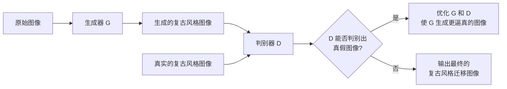

# 基于生成对抗网络的复古风格图像迁移技术开发

关键词：生成对抗网络, 图像迁移, 复古风格, 深度学习, 计算机视觉

## 1. 背景介绍

### 1.1 问题的由来

随着数字图像处理技术的飞速发展,图像风格迁移已经成为计算机视觉领域的一个热门研究方向。图像风格迁移旨在将一幅图像的风格迁移到另一幅图像上,同时保持原图像的内容不变。传统的图像风格迁移方法通常需要大量的人工操作和专业知识,而基于深度学习的方法为图像风格迁移提供了一种更加自动化和高效的解决方案。

### 1.2 研究现状

近年来,生成对抗网络(Generative Adversarial Networks, GANs)在图像风格迁移领域取得了令人瞩目的成果。GANs由生成器和判别器两部分组成,通过两个网络的对抗学习,可以生成高质量的风格迁移图像。基于GANs的图像风格迁移方法已经被广泛应用于艺术创作、游戏设计、虚拟现实等领域。

### 1.3 研究意义

复古风格一直以来都深受人们的喜爱,将现代图像转换为复古风格不仅可以满足人们的审美需求,还可以为艺术创作提供新的灵感。基于GANs的复古风格图像迁移技术可以自动化地完成这一过程,大大提高了图像处理的效率和质量。同时,这一技术的研究也有助于推动计算机视觉和人工智能的发展。

### 1.4 本文结构

本文将详细介绍基于GANs的复古风格图像迁移技术的原理和实现。第二部分将介绍GANs和图像迁移的核心概念;第三部分将详细阐述基于GANs的图像迁移算法原理和步骤;第四部分将建立数学模型并推导相关公式;第五部分将给出代码实例和详细解释;第六部分将讨论该技术的实际应用场景;第七部分将推荐相关的工具和资源;第八部分将总结全文并展望未来的发展趋势和挑战;第九部分为常见问题解答。

## 2. 核心概念与联系

生成对抗网络(GANs)由Goodfellow等人于2014年提出,是一种基于对抗学习的深度学习模型。GANs由生成器(Generator)和判别器(Discriminator)两部分组成,生成器负责生成尽可能逼真的假样本,判别器负责判断输入的样本是真是假。两个网络相互对抗、不断博弈,最终使生成器能够生成以假乱真的样本。

图像风格迁移是指将一幅图像的风格迁移到另一幅图像上,同时保持原图像的内容不变。传统的图像风格迁移方法主要有基于纹理合成的方法和基于神经网络的方法。基于纹理合成的方法通过匹配纹理特征来实现风格迁移,而基于神经网络的方法则利用卷积神经网络提取图像的内容和风格特征,并通过优化目标函数来生成风格迁移图像。

将GANs应用于图像风格迁移,可以利用GANs强大的生成能力和对抗学习机制,自动学习复古风格的特征,并生成高质量的复古风格图像。与传统方法相比,基于GANs的方法具有更高的自动化程度和生成效果。

下图展示了基于GANs的图像风格迁移的核心流程:



## 3. 核心算法原理 & 具体操作步骤

### 3.1 算法原理概述

基于GANs的图像风格迁移算法的核心思想是利用生成器和判别器的对抗学习,使生成器能够生成复古风格的图像。具体来说,生成器接收原始图像作为输入,并生成对应的复古风格图像;判别器接收生成器生成的图像和真实的复古风格图像,并试图判别它们是真是假。通过不断的训练和优化,生成器最终能够生成以假乱真的复古风格图像。

### 3.2 算法步骤详解

1. 准备数据集:收集大量的现代图像和复古风格图像,并进行预处理。
2. 构建生成器和判别器网络:设计并搭建生成器和判别器的网络结构。
3. 定义损失函数:定义生成器和判别器的损失函数,用于衡量生成图像的质量和真实性。
4. 训练模型:交替训练生成器和判别器,使它们相互对抗、不断优化。
5. 测试模型:使用训练好的模型对新的图像进行复古风格迁移,并评估生成效果。
6. 优化模型:根据测试结果对模型进行优化和改进,提高生成质量。

### 3.3 算法优缺点

优点:
- 自动化程度高,无需人工操作和专业知识
- 生成效果逼真,能够生成高质量的复古风格图像
- 通用性强,可以适用于各种风格的图像迁移

缺点:
- 训练过程复杂,需要大量的计算资源和时间
- 生成的图像可能存在伪影和噪点,需要进一步优化
- 对训练数据的质量和数量要求较高,否则可能影响生成效果

### 3.4 算法应用领域

- 艺术创作:自动生成各种风格的艺术作品
- 游戏设计:为游戏角色和场景生成复古风格的贴图
- 虚拟现实:将现实场景转换为复古风格,提升沉浸感
- 影视后期:为影视作品添加复古风格的滤镜效果
- 图像处理:自动化地进行图像风格转换和增强

## 4. 数学模型和公式 & 详细讲解 & 举例说明

### 4.1 数学模型构建

设原始图像为 $x$,复古风格图像为 $y$,生成器为 $G$,判别器为 $D$。生成器 $G$ 接收原始图像 $x$ 作为输入,并生成对应的复古风格图像 $G(x)$。判别器 $D$ 接收一张图像作为输入,并输出该图像为真实复古风格图像的概率。

生成器 $G$ 和判别器 $D$ 的目标函数可以表示为:

$$
\min_G \max_D V(D,G) = \mathbb{E}_{y \sim p_{data}(y)}[\log D(y)] + \mathbb{E}_{x \sim p_{data}(x)}[\log (1-D(G(x)))]
$$

其中,$p_{data}(x)$ 表示原始图像的分布,$p_{data}(y)$ 表示真实复古风格图像的分布。生成器 $G$ 的目标是最小化 $\log (1-D(G(x)))$,即使 $D$ 无法判别出 $G(x)$ 是生成的图像;判别器 $D$ 的目标是最大化 $\log D(y)$ 和 $\log (1-D(G(x)))$,即正确判别出真实图像和生成图像。

### 4.2 公式推导过程

根据生成器和判别器的目标函数,可以推导出它们的优化过程。

生成器 $G$ 的优化目标是最小化以下损失函数:

$$
L_G = \mathbb{E}_{x \sim p_{data}(x)}[\log (1-D(G(x)))]
$$

判别器 $D$ 的优化目标是最大化以下损失函数:

$$
L_D = \mathbb{E}_{y \sim p_{data}(y)}[\log D(y)] + \mathbb{E}_{x \sim p_{data}(x)}[\log (1-D(G(x)))]
$$

在训练过程中,生成器 $G$ 和判别器 $D$ 交替进行优化。固定生成器 $G$,优化判别器 $D$ 使其最大化 $L_D$;然后固定判别器 $D$,优化生成器 $G$ 使其最小化 $L_G$。不断重复这个过程,直到达到平衡状态。

### 4.3 案例分析与讲解

下面以一个具体的例子来说明基于GANs的复古风格图像迁移过程。

假设我们要将一张现代风格的人像照片转换为20世纪50年代的复古风格。首先,我们准备一批现代人像照片和对应风格的复古照片作为训练数据。然后,我们构建生成器 $G$ 和判别器 $D$ 的网络结构,并定义相应的损失函数。

在训练过程中,生成器 $G$ 接收现代照片作为输入,并生成对应的复古风格照片。判别器 $D$ 接收生成器生成的照片和真实的复古照片,并试图判别它们是真是假。通过不断的训练和优化,生成器 $G$ 最终能够生成以假乱真的复古风格照片。

在测试阶段,我们可以使用训练好的生成器 $G$ 对新的现代照片进行复古风格迁移。生成器 $G$ 将现代照片作为输入,并输出对应的复古风格照片。通过对比原始照片和生成的复古照片,我们可以评估模型的生成效果和迁移质量。

### 4.4 常见问题解答

1. 问:训练GANs需要多少数据和时间?
   答:训练GANs通常需要大量的数据和较长的训练时间。数据量越大,模型的生成效果越好,但同时也需要更多的计算资源和训练时间。根据任务的复杂程度和数据的质量,训练时间可能从几个小时到几天不等。

2. 问:如何评估生成图像的质量?
   答:评估生成图像的质量主要有定性和定量两种方法。定性评估通过人工观察生成图像的视觉效果来判断质量,如图像的清晰度、真实感等。定量评估则使用一些指标来衡量生成图像的质量,如 Inception Score、Fréchet Inception Distance 等。

3. 问:GANs生成的图像是否存在版权问题?
   答:GANs生成的图像是通过学习大量真实图像的特征而生成的,其版权归属问题还没有明确的法律规定。一般来说,如果生成图像与原始图像差异较大,且不影响原作者的利益,则可以认为不存在版权问题。但如果生成图像与原始图像非常相似,则可能涉嫌侵权。在使用GANs生成图像时,需要谨慎处理版权问题。

## 5. 项目实践:代码实例和详细解释说明

### 5.1 开发环境搭建

本项目使用 Python 语言和 PyTorch 深度学习框架进行开发。首先,需要安装以下依赖库:

- Python 3.6+
- PyTorch 1.7+
- torchvision 0.8+
- NumPy
- Matplotlib

可以使用 pip 命令进行安装:

```bash
pip install torch torchvision numpy matplotlib
```

### 5.2 源代码详细实现

下面给出基于GANs的复古风格图像迁移的核心代码实现。

首先,定义生成器 $G$ 和判别器 $D$ 的网络结构:

```python
class Generator(nn.Module):
    def __init__(self):
        super(Generator, self).__init__()
        # 定义生成器网络结构
        # ...

    def forward(self, x):
        # 前向传播过程
        # ...
        return out

class Discriminator(nn.Module):
    def __init__(self):
        super(Discriminator, self).__init__()
        # 定义判别器网络结构
        # ...

    def forward(self, x):
        # 前向传播过程
        # ...
        return out
```

然后,定义损失函数和优化器:

```python
# 定义损失函数
criterion = nn.BCELoss()

# 定义优化器
optimizer_G = torch.optim.Adam(generator.parameters(), lr=learning_rate)
optimizer_D = torch.optim.Adam(discriminator.parameters(), lr=learning_rate)
```

接下来,实现训练过程: