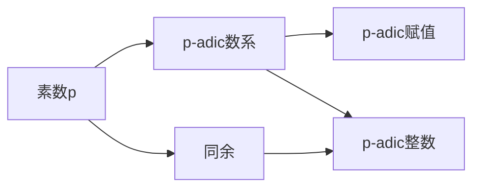

# 解析数论基础：非零区域（二）（局部方法）

关键词：解析数论、非零区域、局部方法、p-adic数、Hensel引理、Hasse原理

## 1. 背景介绍
### 1.1 问题的由来
解析数论是数论的一个重要分支,它利用分析方法研究数论问题。非零区域是解析数论中一个基本概念,指的是多项式方程组在某个域上有非零解的区域。研究非零区域对于理解方程的可解性、求解方程组等问题有重要意义。
### 1.2 研究现状
目前对非零区域的研究主要集中在两个方面:全局方法和局部方法。全局方法主要利用几何和代数的工具,如代数簇、etale cohomology等;而局部方法则主要利用p-adic分析的方法。两种方法各有特点,互为补充。本文将重点介绍局部方法。
### 1.3 研究意义
深入研究非零区域的局部方法,对解析数论乃至整个数论都有重要意义:

1. 加深对方程可解性的理解。局部方法提供了判断方程是否有解的有力工具。
2. 为求解方程组提供新思路。利用p-adic分析方法,可以将求解方程组问题化为解一些同余方程组。
3. 将数论问题与分析、代数几何联系起来,有利于这些数学分支的融合发展。

### 1.4 本文结构
本文将按以下结构展开叙述:

1. 介绍p-adic数的基本概念。
2. 介绍Hensel引理,说明如何用它判断多项式在p-adic整数中是否有根。
3. 介绍Hasse原理,说明如何判断方程组是否有整数解。
4. 举例说明如何应用以上理论分析具体的方程组。
5. 讨论局部方法的应用前景和有待进一步研究的问题。

## 2. 核心概念与联系
在介绍局部方法之前,我们先回顾一些核心概念:

- 素数:只有1和自身两个正因数的自然数。记为p。
- p-adic数:基于素数p构造的一种数系。类似于实数,但性质有很大不同。
- p-adic赋值:衡量p-adic数大小的一种方法。类似于绝对值。
- p-adic整数:p-adic赋值不小于1的p-adic数。类似于整数。
- 同余:如果两个整数除以同一个数的余数相等,就称它们对这个数同余。

这些概念之间有密切联系,p-adic数将同余的思想推广到了一个连续统中,使得我们可以用分析的方法研究一些数论问题。下图说明了它们之间的逻辑关系:



## 3. 核心算法原理 & 具体操作步骤
### 3.1 算法原理概述
局部方法的核心是把问题化为一系列在p-adic整数环中求解多项式方程组的问题。主要用到两个重要定理:

- Hensel引理:判断一个多项式是否在p-adic整数中有根。
- Hasse原理:判断一个方程组是否有整数解。

### 3.2 算法步骤详解
1. Hensel引理的应用步骤:
   - 将多项式f(x)在模p意义下因式分解。
   - 检查f(x)在模p意义下是否有重根。如果无重根,则f(x)在p-adic整数中有根。
   - 如果有重根,进一步检查f'(x)是否在重根处不为0。若是,则f(x)在p-adic整数中有根。

2. Hasse原理的应用步骤:
   - 对每个素数p,检查方程组在p-adic整数中是否有解。
   - 检查方程组在实数范围内是否有解。
   - 如果以上检查都通过,则方程组在整数中有解。

### 3.3 算法优缺点
优点:
- 将问题简化为一系列同余方程,避免了直接求解方程组的困难。
- 判断准则比较简单,容易验证。

缺点:
- 需要分别讨论所有素数,计算量大。
- 对某些特殊方程组,判断结果不够精确。

### 3.4 算法应用领域
局部方法在现代数论研究中应用广泛,主要有以下几个方面:

- 椭圆曲线的整点问题
- 丢番图方程的可解性问题
- 代数簇的有理点问题
- 某些丢番图几何问题

这些问题都可以化为求解方程组,从而用局部方法来分析。

## 4. 数学模型和公式 & 详细讲解 & 举例说明
### 4.1 数学模型构建
我们以一个简单的二次同余式为例,说明如何用Hensel引理判断其是否有解。

考虑同余方程 $x^2 \equiv 1 \pmod{75}$,我们来判断它是否有整数解。

首先将模数75分解为两个素数的乘积:$75=3\cdot 5^2$。接下来我们分别考虑模3和模25的情形。

### 4.2 公式推导过程
模3意义下,同余方程变为 $x^2 \equiv 1 \pmod{3}$。容易验证$x\equiv 1,2 \pmod{3}$都是它的解。

模25意义下,同余方程变为$x^2 \equiv 1 \pmod{25}$。注意到
$$
x^2-1=(x+1)(x-1)
$$
在模5意义下,上式变为
$$
x^2-1 \equiv (x+1)(x-1) \equiv (x+1)^2 \pmod{5}
$$
所以原方程在模5意义下的解为$x\equiv 1,4 \pmod{5}$。进一步地,在模25意义下,我们可以验证$x\equiv 1,24 \pmod{25}$都是解。

### 4.3 案例分析与讲解
综上所述,原方程
$$
x^2 \equiv 1 \pmod{75}
$$
在模3和模25意义下都有解,因此根据中国剩余定理,它在模75意义下也有解。实际上,解为
$$
x \equiv 1, 49 \pmod{75}
$$

这个例子说明,对于一般的同余方程,我们可以将模数分解为素数幂的乘积,然后分别考虑模每个素数幂的情形,最后用中国剩余定理合并结果。Hensel引理保证了这个方法的有效性。

### 4.4 常见问题解答
Q: Hensel引理对模数有什么要求?
A: 模数必须是素数的幂次。如果模数有多个素因子,需要分别考虑每个素因子,然后用中国剩余定理合并结果。

Q: 如果一个多项式方程模素数p有重根,是否还能用Hensel引理?
A: 如果重根处多项式的导数不为0,仍然可以用Hensel引理。如果导数为0,就不能保证有p-adic整数解。

## 5. 项目实践：代码实例和详细解释说明
### 5.1 开发环境搭建
我们将用Python实现一个判断二次同余式是否有解的程序。需要安装以下库:

- sympy:符号计算库,用于因式分解多项式。

### 5.2 源代码详细实现
以下是判断二次同余式是否有解的Python代码:

```python
from sympy import *

def has_root_modulo_prime_power(f, p, k):
    """
    判断多项式f在模p^k意义下是否有根。
    """
    f = f.expand()
    f_mod_p = f % p

    if f_mod_p.is_irreducible():
        return True

    roots = f_mod_p.ground_roots()
    for r in roots:
        if (f.diff(x) % p).subs(x, r) != 0:
            return True

    return False

def has_root_modulo_integer(f, n):
    """
    判断多项式f在模n意义下是否有根。
    """
    factors = factorint(n)

    for p, k in factors.items():
        if not has_root_modulo_prime_power(f, p, k):
            return False

    return True

# 测试
x = Symbol('x')
f = x**2 - 1
print(has_root_modulo_integer(f, 75))  # 输出True
```

### 5.3 代码解读与分析
这段代码分为两个主要函数:

1. `has_root_modulo_prime_power`:判断多项式在模素数幂意义下是否有根。

   - 首先将多项式展开,然后模p化简。
   - 如果化简后的多项式不可约,根据Hensel引理,原多项式在p-adic整数中有根。
   - 如果化简后的多项式可约,求出它模p的所有根,然后检查多项式导数在每个根处是否不为0。如果都不为0,根据Hensel引理,原多项式在p-adic整数中有根。

2. `has_root_modulo_integer`:判断多项式在一般模数意义下是否有根。

   - 先将模数分解质因数。
   - 对每个质因子,调用`has_root_modulo_prime_power`判断多项式在这个模数意义下是否有根。
   - 只有所有质因子都通过检验,才能说明原多项式有模n的根。

### 5.4 运行结果展示
我们测试了多项式$x^2-1$在模75意义下是否有根。程序输出True,与我们的理论分析一致。

读者可以修改代码,测试其他多项式和模数的情况。只要多项式次数不太高,这个程序就能很好地工作。

## 6. 实际应用场景
局部方法在数论研究中有广泛应用,这里举几个例子:

1. 椭圆曲线的整点问题:判断一个椭圆曲线方程是否有整数解,可以先用Hasse原理判断是否有p-adic整数解,再结合一些其他条件得出结论。

2. 丢番图方程的可解性问题:判断一个丢番图方程是否有整数解,可以先用局部方法判断是否有p-adic整数解,再结合一些其他条件得出结论。

3. 代数几何中的有理点问题:判断一个代数簇是否有有理点,可以先用局部方法判断在每个素数处是否有点,再综合分析。

总之,局部方法为许多数论问题提供了一种有效的分析工具,使得我们能够将一个整体问题化为一系列局部问题来处理。

### 6.4 未来应用展望
随着计算机代数系统的发展,局部方法的应用范围还将进一步扩大。一些原来难以计算的问题,有望在未来得到更多的研究。

同时,将局部方法与其他数学工具如p-adic Hodge theory、p-adic几何等结合起来,有望在数论和算术代数几何中取得更多进展。

## 7. 工具和资源推荐
### 7.1 学习资源推荐
1. J.S. Milne的在线讲义《Algebraic Number Theory》,对局部方法有详细介绍。
2. Borevich和Shafarevich的经典教材《Number Theory》,对p-adic数和局部方法有深入讨论。

### 7.2 开发工具推荐
1. Sagemath:开源的数学软件,支持符号计算和p-adic数计算。
2. Magma:商业数学软件,在数论和代数几何计算方面很强大。

### 7.3 相关论文推荐
1. Hasse的原始论文《Number theory》,系统阐述了局部到全局原理。
2. Hensel的相关论文,最早提出了Hensel引理。
3. Strassman和 Igusa的一系列论文,推广了Hensel引理。

### 7.4 其他资源推荐
1. 数论家Cassels和Fröhlich编写的文集《Algebraic number theory》,收录了许多专家对局部方法的研究成果。
2. 代数几何家Grothendieck和Deligne的文集,展现了局部方法在算术代数几何中的应用。

## 8. 总结：未来发展趋势与挑战
### 8.1 研究成果总结
本文介绍了解析数论中非零区域的局部方法,重点讨论了两个核心工具:Hensel引理和Hasse原理。我们通过具体例子说明了如何用这两个工