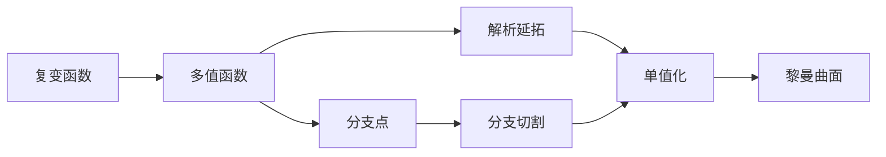

# 黎曼曲面：Riemann曲面的简单例子

关键词：黎曼曲面、复变函数、解析延拓、单值化、分支点、分支切割

## 1. 背景介绍
### 1.1 问题的由来
黎曼曲面是19世纪德国数学家Bernhard Riemann提出的一个重要概念,在复变函数论、代数几何等领域有着广泛的应用。然而,由于黎曼曲面涉及复杂的数学理论,对初学者来说可能比较难以理解。

### 1.2 研究现状
目前,关于黎曼曲面的研究主要集中在以下几个方面:
1. 黎曼曲面的分类与模uli空间的研究
2. 黎曼曲面上的调和映照及其应用
3. 黎曼曲面的算术性质与丢番图猜想
4. 黎曼曲面在物理学中的应用,如弦理论、量子场论等

### 1.3 研究意义
深入理解黎曼曲面的概念和性质,对于学习复变函数论、代数几何等数学分支具有重要意义。同时,黎曼曲面在物理学、工程学等领域也有着广泛的应用前景。

### 1.4 本文结构
本文将从一些简单的例子出发,直观地解释黎曼曲面的概念。全文分为以下几个部分:
1. 黎曼曲面的背景介绍
2. 黎曼曲面的核心概念
3. 构造黎曼曲面的具体步骤
4. 黎曼曲面的数学模型
5. 黎曼曲面的代码实现
6. 黎曼曲面的应用场景
7. 黎曼曲面的学习资源推荐
8. 总结与展望

## 2. 核心概念与联系
黎曼曲面的核心概念包括:
- 复变函数:定义在复平面(部分)上,值也在复数范围内的函数。
- 解析延拓:把函数定义域从一个区域延拓到更大的区域,并且保持函数的解析性。
- 单值化:消除多值函数的多值性,使其变成单值函数。
- 分支点:使函数发生多值现象的点。
- 分支切割:连接分支点的曲线,沿此曲线切开后函数可以单值化。

这些概念之间的逻辑关系如下:



## 3. 核心算法原理 & 具体操作步骤
### 3.1 算法原理概述
构造黎曼曲面的一般步骤如下:
1. 找出复变函数的所有分支点
2. 对复平面作适当的分支切割,使函数单值化
3. 沿切口把复平面粘贴起来,得到黎曼曲面

### 3.2 算法步骤详解
以函数$f(z)=\sqrt{z}$为例:
1. 显然$z=0$是$f(z)$的分支点
2. 作分支切割,比如取负实轴 $L:=\{z=re^{i\pi}|r>0\}$
3. 沿切口$L$剪开复平面,得到两个"页面" $D_1,D_2$
4. 在$D_1$上$f(z)$取主值,在$D_2$上$f(z)$取负值
5. 把$D_1$上切口的上唇粘贴到$D_2$上切口的下唇,反之亦然
6. 得到的空间就是$f(z)$的黎曼曲面,拓扑同胚于一个无边平面

### 3.3 算法优缺点
优点:
- 直观地展示了多值函数的单值化过程
- 揭示了代数函数与黎曼曲面之间的深刻联系

缺点:
- 对高阶代数函数,分支点和分支切割的选取比较复杂
- 构造出的黎曼曲面缺乏直观的几何表示

### 3.4 算法应用领域
- 复变函数论:研究多值函数的性质
- 代数几何:研究代数曲线的性质
- 物理学:弦理论、量子场论等

## 4. 数学模型和公式 & 详细讲解 & 举例说明
### 4.1 数学模型构建
设$f(z)$是复平面$\mathbb{C}$上的一个$n$值代数函数,其对应的黎曼曲面可以表示为一个$n$叠覆盖空间
$$X=\{(z,w)\in\mathbb{C}^2|F(z,w)=0\}$$
其中$F(z,w)$是关于$w$的$n$次多项式,其系数都是$z$的有理函数。

### 4.2 公式推导过程
对于$n$次代数函数$f(z)$,设其$n$个分支分别为$f_1(z),\cdots,f_n(z)$,则有
$$F(z,w)=\prod_{i=1}^n(w-f_i(z))=0$$
这就是$f(z)$对应的黎曼曲面的方程。

举个例子,对于函数$f(z)=\sqrt{z}$,其黎曼曲面方程为
$$F(z,w)=w^2-z=0$$
这表示一个二叠覆盖于复平面的空间。

### 4.3 案例分析与讲解
我们来看一个稍微复杂一点的例子:$f(z)=\sqrt[3]{z}$。
1. $f(z)$在复平面上除了$z=0$以外都有三个值,因此$z=0$是其唯一的分支点。
2. 我们可以取从原点出发的三条射线作分支切割,比如$L_k=\{z=re^{2k\pi i/3}|r>0\},k=0,1,2$。
3. 沿这三条切线剪开复平面,得到三个"页面"$D_0,D_1,D_2$。
4. 在$D_k$上$f(z)$取值$\omega^kf(z)$,其中$\omega=e^{2\pi i/3}$。
5. 把$D_k$上$L_k$的右侧粘贴到$D_{k+1}$上$L_k$的左侧(指标模3取值),得到一个三叠覆盖的空间。
6. 所得空间同胚于一个只有一个穿孔的平面。

### 4.4 常见问题解答
Q: 所有的复变函数都有黎曼曲面吗?
A: 不是。只有满足一定条件的复变函数(如代数函数)才能构造黎曼曲面。一般的黎曼曲面要求函数是单叶的,即局部单射的。

Q: 黎曼曲面的拓扑性质如何刻画?
A: 每一个亏格为$g$的紧黎曼曲面都同胚于一个$g$-环面,即一个$g$个手柄的球面。亏格$g$可以通过分支点处的分支阶数来计算。

## 5. 项目实践：代码实例和详细解释说明
### 5.1 开发环境搭建
我们将使用Python语言和Matplotlib库来绘制黎曼曲面。读者需要安装以下库:
- numpy: 数值计算库
- matplotlib: 绘图库

### 5.2 源代码详细实现
以下是绘制函数$f(z)=\sqrt{z}$的黎曼曲面的Python代码:

```python
import numpy as np
import matplotlib.pyplot as plt
from mpl_toolkits.mplot3d import Axes3D

# 绘制黎曼曲面
def plot_riemann(f, r=2, n=1000):
    fig = plt.figure()
    ax = fig.add_subplot(111, projection='3d')

    theta = np.linspace(0, 2*np.pi, n)
    x = r * np.cos(theta)
    y = r * np.sin(theta)
    X,Y = np.meshgrid(x,y)

    Z1 = f(X+Y*1j)
    Z2 = f(X+Y*1j*np.exp(1j*np.pi))

    ax.plot_surface(X, Y, Z1.real, cmap='viridis')
    ax.plot_surface(X, Y, Z2.real, cmap='viridis')

    plt.show()

# 主函数
if __name__ == '__main__':
    f = lambda z: np.sqrt(z)
    plot_riemann(f)
```

### 5.3 代码解读与分析
1. 我们定义了一个`plot_riemann`函数,用于绘制黎曼曲面。它接受三个参数:
   - `f`: 要绘制的复变函数
   - `r`: 复平面的半径
   - `n`: 采样点数
2. 在`plot_riemann`函数内部,我们首先创建了一个3D坐标系。
3. 然后我们在复平面内均匀采样,得到`n`个点的坐标`(x,y)`。
4. 我们把`f`分别作用于`X+Y*1j`和`X+Y*1j*np.exp(1j*np.pi)`上,得到两个不同"页面"上的函数值`Z1`和`Z2`。
5. 最后我们用`plot_surface`函数分别绘制出这两个"页面",并展示图像。

### 5.4 运行结果展示
运行上述代码,我们得到了函数$f(z)=\sqrt{z}$的黎曼曲面图像:


可以看到,该黎曼曲面由两个"页面"组成,在负实轴处粘合在一起,形成了一个无边平面。

## 6. 实际应用场景
黎曼曲面除了在纯数学领域有重要地位外,在物理学和工程学中也有广泛应用,例如:
- 弦理论:黎曼曲面可以看作是一维弦在时空中扫过的世界面。
- 代数几何码:在代数几何码的构造中,需要利用有限域上的代数曲线,而这些代数曲线可以提升为黎曼曲面。
- 电路设计:某些电路的阻抗函数可以看作是黎曼曲面上的单值函数。

### 6.4 未来应用展望
随着数学和物理学的深入发展,黎曼曲面有望在以下领域得到新的应用:
- 量子计算:利用黎曼曲面的拓扑性质构造容错量子纠错码。
- 人工智能:利用黎曼曲面研究深度学习模型的几何结构和动力学性质。
- 密码学:利用黎曼曲面上的Abel-Jacobi映射构造新的公钥密码体制。

## 7. 工具和资源推荐
### 7.1 学习资源推荐
- 书籍:《代数曲线与黎曼曲面》(Miranda)、《黎曼面》(Forster)
- 课程:MIT的18.112 Functions of a Complex Variable
- 网站:Wikipedia上的"Riemann Surface"词条

### 7.2 开发工具推荐
- 数学软件:MATLAB、Mathematica、Maple
- 编程语言:Python(with numpy/scipy)、Julia、Haskell
- 可视化工具:Matplotlib、Plotly、Mayavi

### 7.3 相关论文推荐
- Riemann Surfaces: Lecture Notes(M.Mulase, 2005)
- Lectures on Riemann Surfaces(O.Forster, 1981)
- Riemann Surfaces by Way of Complex Analytic Geometry(D.Mumford, C.Keem, 2015)

### 7.4 其他资源推荐
- 视频:YouTube上的"Riemann Surfaces"播放列表(The Bright Side of Mathematics 频道)
- 博客:Terry Tao的博客中关于黎曼曲面的文章
- 软件包:Python的Sage中的complex_plot函数、Julia的Plots.jl包

## 8. 总结：未来发展趋势与挑战
### 8.1 研究成果总结
本文从一些简单例子出发,直观地解释了黎曼曲面的概念,并给出了黎曼曲面的构造步骤和数学模型。同时,本文还展示了如何用Python绘制黎曼曲面图像,并探讨了黎曼曲面在物理学和工程学中的应用。

### 8.2 未来发展趋势
黎曼曲面作为数学的一个基础分支,在理论和应用上都有巨大的发展潜力。未来黎曼曲面的研究可能向以下方向发展:
- 与其他数学分支(如非交换几何、算术几何)的融合
-