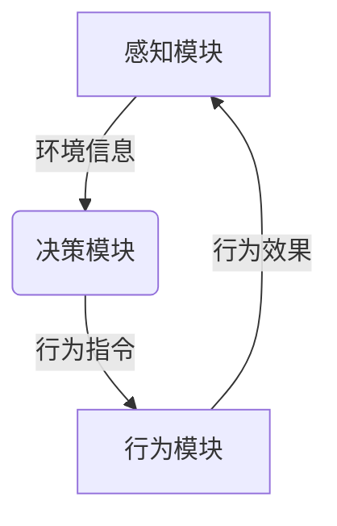

# AI Agent: AI的下一个风口 具身智能的商业潜力与市场前景

## 1. 背景介绍

### 1.1 问题的由来

在过去几十年中,人工智能(AI)技术取得了长足的进步,尤其是在机器学习和深度学习领域的突破性发展。然而,传统的AI系统大多局限于虚拟世界,缺乏与现实物理世界的直接交互能力。这种局限性阻碍了AI技术在诸多实际应用场景中的广泛应用,例如服务机器人、智能制造、智能家居等。

为了克服这一挑战,具身智能(Embodied AI)应运而生。具身智能旨在赋予AI系统物理形态,使其能够感知、理解并与真实世界环境进行自然交互。这种新型AI范式将人工智能与机器人技术、计算机视觉、自然语言处理等多个领域相结合,为AI系统提供了更加丰富的感知和行为能力。

### 1.2 研究现状

近年来,具身智能领域的研究活动日益活跃,吸引了众多科技公司和研究机构的投入。谷歌、Meta(Facebook)、OpenAI等科技巨头均已开展了大规模的具身智能项目。同时,一些创新型初创公司也在这一领域取得了令人瞩目的进展。

目前,具身智能的研究主要集中在以下几个方面:

1. 感知与环境理解技术,如计算机视觉、深度学习等,赋予AI系统对环境的感知能力。
2. 决策与控制算法,使AI系统能够根据感知信息作出合理决策并执行相应的行为。
3. 机器人硬件平台的设计与优化,为具身智能系统提供物理载体。
4. 模拟环境的构建,用于训练和测试具身智能系统。
5. 安全性和可解释性研究,确保具身智能系统的可靠性和透明度。

### 1.3 研究意义

具身智能技术的发展将为人工智能系统带来革命性的变革,打破其局限于虚拟世界的束缚,使AI能够真正融入现实生活。具体来说,具身智能技术具有以下重要意义:

1. 扩展AI的应用场景,使其能够在制造业、服务业、家庭生活等多个领域发挥作用。
2. 提高AI系统的智能水平,使其具备更加接近人类的感知、理解和行为能力。
3. 促进AI技术与其他领域的融合,推动跨学科创新。
4. 为解决一些棘手的现实问题提供新的思路和方法。
5. 开拓全新的商业机遇和应用前景。

### 1.4 本文结构

本文将全面介绍具身智能的核心概念、算法原理、数学模型、实际应用等多个方面的内容。文章结构安排如下:

1. 背景介绍
2. 核心概念与联系
3. 核心算法原理与具体操作步骤
4. 数学模型和公式详细讲解与案例分析
5. 项目实践:代码实例和详细解释说明
6. 实际应用场景
7. 工具和资源推荐
8. 总结:未来发展趋势与挑战
9. 附录:常见问题与解答

## 2. 核心概念与联系

具身智能(Embodied AI)是一种新兴的人工智能范式,旨在赋予AI系统物理形态,使其能够感知、理解并与真实世界环境进行自然交互。它融合了多个学科领域的知识和技术,包括机器学习、计算机视觉、自然语言处理、机器人技术等。

具身智能系统通常由以下三个核心组件构成:

1. **感知模块**: 利用传感器(如相机、激光雷达等)获取环境信息,并使用计算机视觉、语音识别等技术对信息进行处理和理解。

2. **决策模块**: 基于感知信息,结合预先设定的目标和约束,运用机器学习、规划算法等技术作出合理的决策。

3. **行为模块**: 根据决策指令,控制机器人执行相应的动作,如移动、操作物体等,与环境进行交互。

这三个模块相互协作,构成了具身智能系统的感知-决策-行为闭环。具身智能系统需要持续地从环境获取信息、做出决策并执行行为,并根据行为的效果调整后续的决策,不断优化自身的能力。

具身智能与其他AI技术存在密切联系,例如:

- **机器学习**: 具身智能系统依赖机器学习算法从数据中获取知识,用于感知、决策和控制。
- **计算机视觉**: 计算机视觉技术赋予具身智能系统视觉感知能力。
- **自然语言处理**: 自然语言处理技术使具身智能系统能够理解和生成自然语言,实现人机交互。
- **规划与控制**: 规划与控制算法为具身智能系统的决策和行为提供支持。
- **机器人技术**: 机器人硬件平台为具身智能系统提供了物理载体。

总的来说,具身智能是一种跨学科的综合性技术,将多个领域的知识和方法有机结合,旨在创造出能够自主感知、思考和行动的智能体系。

## 3. 核心算法原理与具体操作步骤

### 3.1 算法原理概述

具身智能系统的核心算法主要包括以下几个方面:

1. **感知算法**: 用于从传感器数据中提取有用信息,建立对环境的理解。常见的感知算法包括计算机视觉算法(如目标检测、语义分割等)、语音识别算法等。

2. **决策算法**: 根据感知信息和预定目标,作出合理的行为决策。主要的决策算法有强化学习算法、规划算法等。

3. **控制算法**: 将决策转化为对机器人执行器(如电机、机械臂等)的具体控制指令。常用的控制算法有PID控制、模型预测控制等。

4. **模型学习算法**: 从数据中学习环境模型,用于模拟交互、预测未来状态等,为决策提供支持。

5. **多模态融合算法**: 将来自不同传感器的异构信息(如视觉、语音等)融合起来,获得更加全面的环境表示。

这些算法相互协作,构成了具身智能系统的核心算法框架。下面将详细介绍其中的决策算法和模型学习算法。

### 3.2 算法步骤详解

#### 3.2.1 决策算法

决策算法是具身智能系统的大脑和核心,负责根据感知信息作出行为决策。主要的决策算法包括:

**1. 强化学习算法**

强化学习算法通过与环境的交互,不断试错并从经验中学习,逐步优化决策策略。它包括以下几个关键步骤:

1) 初始化一个策略模型(如深度神经网络),用于从状态映射到行为。

2) 让智能体与环境交互,执行行为并获得奖励。

3) 根据经验(状态、行为、奖励)更新策略模型的参数。

4) 重复上述过程,直至策略收敛。

常见的强化学习算法有深度Q学习(DQN)、策略梯度(PG)、Actor-Critic等。

**2. 规划算法**

规划算法旨在找到从当前状态到目标状态的最优行为序列。主要步骤包括:

1) 建立环境模型,描述状态转移和代价函数。

2) 设定初始状态和目标状态。

3) 基于模型,运用搜索算法(如A*算法)或数学规划方法(如线性规划)求解最优行为序列。

4) 执行规划出的行为序列。

常见的规划算法有RRT(快速随机树)、CHOMP(与障碍物有内在冲突的运动规划)等。

#### 3.2.2 模型学习算法

模型学习算法旨在从环境交互数据中学习一个模型,用于模拟交互、预测未来状态等。主要步骤包括:

1) 收集环境交互数据,包括状态序列、行为序列、奖励序列。

2) 设计模型结构(如深度神经网络)。

3) 将数据输入模型,通过监督学习或强化学习等方法训练模型参数。

4) 利用训练好的模型进行模拟、预测等任务。

常见的模型学习算法有:

- 基于深度神经网络的模型,如World Models、Dreamer等。
- 基于概率模型的模型,如高斯过程等。
- 基于物理模拟引擎的模型。

### 3.3 算法优缺点

上述算法各有优缺点:

**强化学习算法**:
- 优点:无需事先建模,可以直接从环境中学习最优策略。
- 缺点:收敛慢,样本复杂度高,存在不稳定性。

**规划算法**:
- 优点:能够有效求解最优解,尤其适用于确定性环境。
- 缺点:需要事先建模,无法处理复杂动态环境。

**模型学习算法**:
- 优点:能够学习复杂环境的行为模型,为决策提供支持。
- 缺点:模型偏差和方差问题,学习效果依赖数据质量。

因此,在实际应用中往往需要结合使用多种算法,发挥各自的优势。

### 3.4 算法应用领域

上述算法在具身智能的多个领域得到了广泛应用,包括:

- 服务机器人:使用决策算法控制机器人执行服务任务。
- 智能制造:利用规划算法优化工业机器人的运动路径。
- 自动驾驶:结合感知、决策和控制算法实现自动驾驶功能。
- 智能家居:通过模型学习算法预测用户意图,优化家居设备控制。
- 虚拟助手:基于自然语言处理和决策算法构建智能虚拟助手。

总的来说,这些算法为具身智能系统赋予了智能化的感知、决策和行为能力,推动了该领域的快速发展。

## 4. 数学模型和公式详细讲解与案例分析

### 4.1 数学模型构建

在具身智能系统中,通常需要构建数学模型来描述和分析系统的行为。常见的数学模型包括:

1. **马尔可夫决策过程(MDP)模型**

MDP模型是强化学习算法的理论基础,用于描述智能体与环境的交互过程。一个MDP可以用一个四元组 $(S, A, P, R)$ 来表示:

- $S$ 是状态空间集合
- $A$ 是行为空间集合
- $P(s'|s,a)$ 是状态转移概率,表示在状态 $s$ 下执行行为 $a$ 后,转移到状态 $s'$ 的概率
- $R(s,a)$ 是在状态 $s$ 执行行为 $a$ 所获得的即时奖励

在 MDP 框架下,强化学习算法的目标是找到一个策略 $\pi: S \rightarrow A$,使得期望的累积奖励最大化:

$$
\max_\pi \mathbb{E}\left[\sum_{t=0}^\infty \gamma^t R(s_t, a_t)\right]
$$

其中 $\gamma \in (0, 1)$ 是折现因子,用于权衡当前奖励和未来奖励的重要性。

2. **运动学和动力学模型**

运动学模型描述了机器人的运动状态(如位置、速度等)随时间的变化规律,而动力学模型则描述了作用在机器人上的力和力矩如何影响其运动状态。这些模型对于控制算法的设计和优化至关重要。

例如,对于一个机器人机械臂,其运动学模型可以用下式表示:

$$
\begin{aligned}
\boldsymbol{x} &= \boldsymbol{f}(\boldsymbol{q}) \
\dot{\boldsymbol{x}} &= \boldsymbol{J}(\boldsymbol{q})\dot{\boldsymbol{q}}
\end{aligned}
$$

其中 $\boldsymbol{q}$ 是关节角度向量, $\boldsymbol{x}$ 是机械臂末端执行器